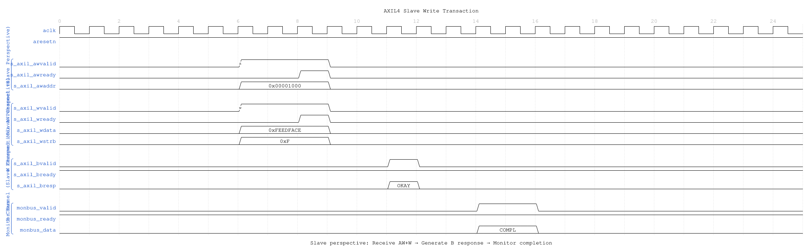
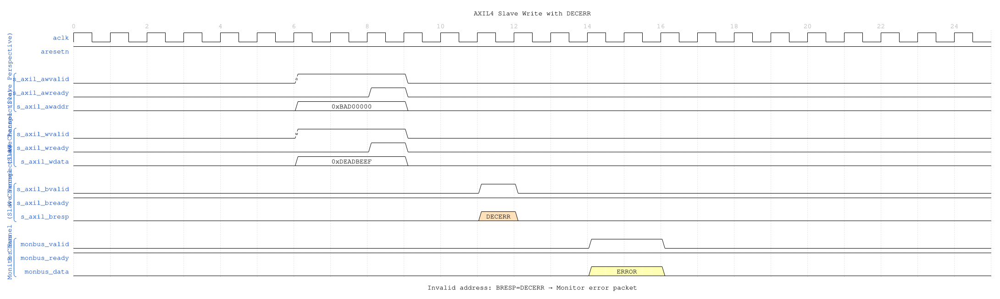
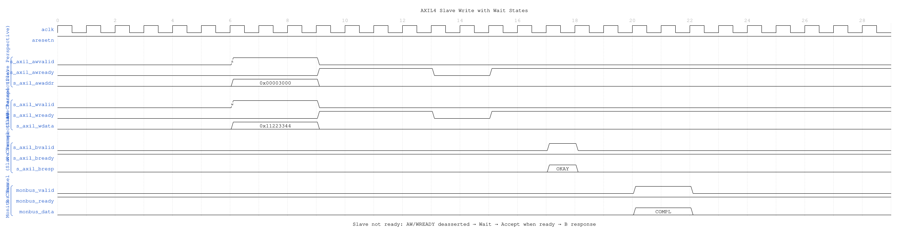

# AXIL4 Slave Write with Monitoring

**Module:** `axil4_slave_wr_mon.sv`
**Location:** `rtl/amba/axil4/`
**Status:** ✅ Production Ready

---

## Overview

Combines **[axil4_slave_wr](axil4_slave_wr.md)** with **axi_monitor_filtered** for slave-side write monitoring.

### Key Features

- ✅ All features of **axil4_slave_wr**
- ✅ Slave-side write monitoring (AW, W, B channels)
- ✅ Backend write latency tracking
- ✅ 3-level filtering and error detection

---

## Additional Parameters

- `UNIT_ID = 2` (slaves)
- `AGENT_ID = 21` (slave write agent)
- Others same as master monitors

---

## Additional Ports

Same as **[axil4_master_rd_mon](axil4_master_rd_mon.md)**

---

## Usage

```systemverilog
axil4_slave_wr_mon #(
    .AXIL_ADDR_WIDTH(32),
    .AXIL_DATA_WIDTH(32),
    .UNIT_ID(2),
    .AGENT_ID(21),
    .MAX_TRANSACTIONS(8)
) u_axil_slave_wr_mon (
    // Slave AXIL write interfaces
    // Monitor configuration and bus
);
```

---

## Timing Diagrams

### Scenario 1: Slave Write Transaction



**WaveJSON:** [slave_write_basic_001.json](../../assets/WAVES/axil4_slave_wr_mon/slave_write_basic_001.json)

**Key Observations:**
- Slave perspective: Receive AW+W simultaneously
- Slave commits write to backend storage
- Slave generates B response with BRESP=OKAY
- Monitor tracks backend write latency

### Scenario 2: Slave Write Error (DECERR)



**WaveJSON:** [slave_write_decerr_001.json](../../assets/WAVES/axil4_slave_wr_mon/slave_write_decerr_001.json)

**Key Observations:**
- Invalid address detected by slave
- Write data received but not committed
- Slave returns BRESP=DECERR
- Monitor generates ERROR packet

### Scenario 3: Slave Write with Wait States



**WaveJSON:** [slave_write_wait_001.json](../../assets/WAVES/axil4_slave_wr_mon/slave_write_wait_001.json)

**Key Observations:**
- Slave not ready: AWREADY/WREADY deasserted
- Master holds AW+W until slave accepts
- Backend write processing delay
- Monitor tracks full write latency including wait states

---

## Related Modules

- **[axil4_slave_wr](axil4_slave_wr.md)** - Base functional module
- **[axil4_slave_rd_mon](axil4_slave_rd_mon.md)** - Read monitor counterpart
- **[AXI4 Slave Write Mon](../axi4/axi4_slave_wr_mon.md)** - Full AXI4 reference

---

**Last Updated:** 2025-10-24
