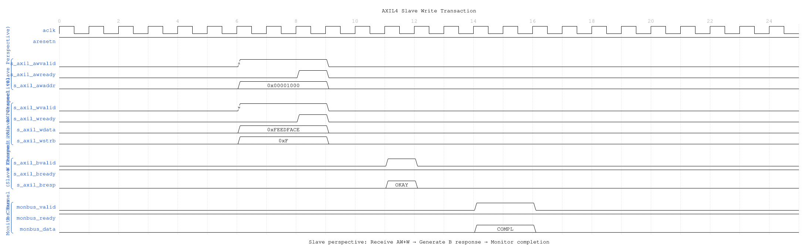
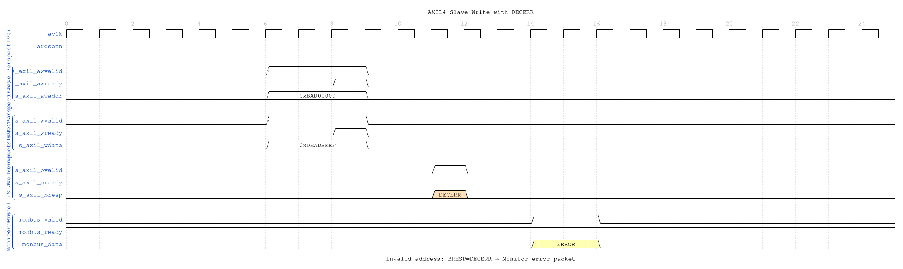
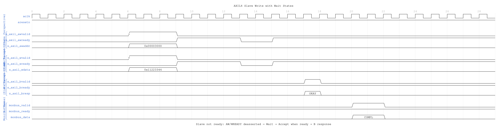

<!-- RTL Design Sherpa Documentation Header -->
<table>
<tr>
<td width="80">
  <a href="https://github.com/sean-galloway/RTLDesignSherpa">
    
  </a>
</td>
<td>
  <strong>RTL Design Sherpa</strong> · <em>Learning Hardware Design Through Practice</em><br>
  <sub>
    <a href="https://github.com/sean-galloway/RTLDesignSherpa">GitHub</a> ·
    <a href="https://github.com/sean-galloway/RTLDesignSherpa/blob/main/docs/DOCUMENTATION_INDEX.md">Documentation Index</a> ·
    <a href="https://github.com/sean-galloway/RTLDesignSherpa/blob/main/LICENSE">MIT License</a>
  </sub>
</td>
</tr>
</table>

---

<!-- End Header -->

# AXIL4 Slave Write with Monitoring

**Module:** `axil4_slave_wr_mon.sv`
**Location:** `rtl/amba/axil4/`
**Status:** ✅ Production Ready

---

## Overview

Combines **[axil4_slave_wr](axil4_slave_wr.md)** with **axi_monitor_filtered** for slave-side write monitoring.

### Key Features

- ✅ All features of **axil4_slave_wr**
- ✅ Slave-side write monitoring (AW, W, B channels)
- ✅ Backend write latency tracking
- ✅ 3-level filtering and error detection

---

## Additional Parameters

- `UNIT_ID = 2` (slaves)
- `AGENT_ID = 21` (slave write agent)
- `USE_MONITOR` (synthesis-time monitor enable)
- Others same as master monitors

---

## Monitor Backpressure (block_ready)

The monitor exposes a `block_ready` signal that goes low when its internal FIFO is saturated and cannot accept a new in-flight transaction. The wrapper ANDs `block_ready` into the upstream-facing `s_axil_awready` so a saturated monitor stalls new transactions on the wire instead of dropping events.

- **Where the stall lands**: the upstream `s_axil_awready` is forced low until the monitor drains.
- **When `USE_MONITOR=0`**: `block_ready` is internally tied high, so the wrapper imposes no stall and runs at full bandwidth.

This replaces a previous bug where `block_ready` was left unconnected and a full monitor FIFO would silently lose events.

---

## Additional Ports

Same as **[axil4_master_rd_mon](axil4_master_rd_mon.md)**

---

## Usage

```systemverilog
axil4_slave_wr_mon #(
    .AXIL_ADDR_WIDTH(32),
    .AXIL_DATA_WIDTH(32),
    .UNIT_ID(2),
    .AGENT_ID(21),
    .MAX_TRANSACTIONS(8)
) u_axil_slave_wr_mon (
    // Slave AXIL write interfaces
    // Monitor configuration and bus
);
```

---

## Timing Diagrams

### Scenario 1: Slave Write Transaction



**WaveJSON:** [slave_write_basic_001.json](../../assets/WAVES/axil4_slave_wr_mon/slave_write_basic_001.json)

**Key Observations:**
- Slave perspective: Receive AW+W simultaneously
- Slave commits write to backend storage
- Slave generates B response with BRESP=OKAY
- Monitor tracks backend write latency

### Scenario 2: Slave Write Error (DECERR)



**WaveJSON:** [slave_write_decerr_001.json](../../assets/WAVES/axil4_slave_wr_mon/slave_write_decerr_001.json)

**Key Observations:**
- Invalid address detected by slave
- Write data received but not committed
- Slave returns BRESP=DECERR
- Monitor generates ERROR packet

### Scenario 3: Slave Write with Wait States



**WaveJSON:** [slave_write_wait_001.json](../../assets/WAVES/axil4_slave_wr_mon/slave_write_wait_001.json)

**Key Observations:**
- Slave not ready: AWREADY/WREADY deasserted
- Master holds AW+W until slave accepts
- Backend write processing delay
- Monitor tracks full write latency including wait states

---

## Related Modules

- **[axil4_slave_wr](axil4_slave_wr.md)** - Base functional module
- **[axil4_slave_rd_mon](axil4_slave_rd_mon.md)** - Read monitor counterpart
- **[AXI4 Slave Write Mon](../axi4/axi4_slave_wr_mon.md)** - Full AXI4 reference

---

**Last Updated:** 2025-10-24
