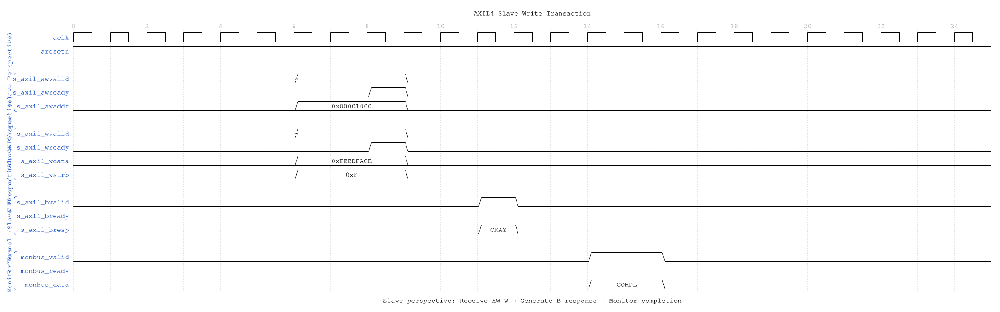
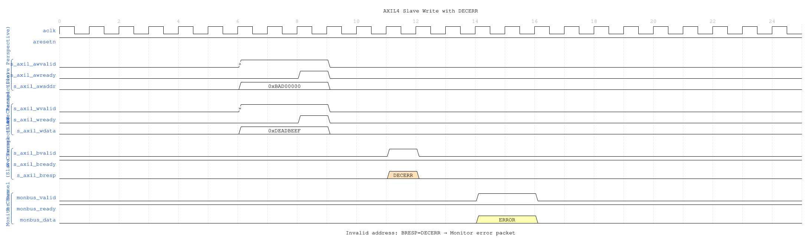
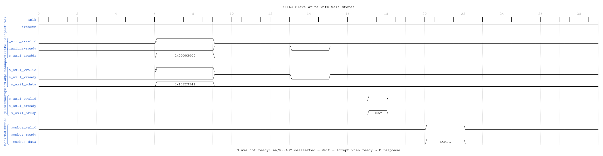

<!-- RTL Design Sherpa Documentation Header -->
<table>
<tr>
<td width="80">
  <a href="https://github.com/sean-galloway/RTLDesignSherpa">
    
  </a>
</td>
<td>
  <strong>RTL Design Sherpa</strong> · <em>Learning Hardware Design Through Practice</em><br>
  <sub>
    <a href="https://github.com/sean-galloway/RTLDesignSherpa">GitHub</a> ·
    <a href="https://github.com/sean-galloway/RTLDesignSherpa/blob/main/docs/DOCUMENTATION_INDEX.md">Documentation Index</a> ·
    <a href="https://github.com/sean-galloway/RTLDesignSherpa/blob/main/LICENSE">MIT License</a>
  </sub>
</td>
</tr>
</table>

---

<!-- End Header -->

# AXIL4 Slave Write with Monitoring

**Module:** `axil4_slave_wr_mon.sv`
**Location:** `rtl/amba/axil4/`
**Status:** ✅ Production Ready

---

## Overview

Combines **[axil4_slave_wr](axil4_slave_wr.md)** with **axi_monitor_filtered** for slave-side write monitoring.

### Key Features

- ✅ All features of **axil4_slave_wr**
- ✅ Slave-side write monitoring (AW, W, B channels)
- ✅ Backend write latency tracking
- ✅ 3-level filtering and error detection

---

## Additional Parameters

- `UNIT_ID = 2` (slaves)
- `AGENT_ID = 21` (slave write agent)
- `USE_MONITOR` (synthesis-time monitor enable)
- `N_ADDR_RANGES` (address-range comparator count)
- Others same as **[axil4_master_rd_mon](axil4_master_rd_mon.md#additional-parameters)**

Also includes the synthesis-cone parameters `ENABLE_ERROR_LOGIC`, `ENABLE_TIMEOUT_LOGIC`, `ENABLE_COMPL_LOGIC`, `ENABLE_THRESHOLD_LOGIC`, `ENABLE_PERF_LOGIC` (all default 1) and `ENABLE_DEBUG_LOGIC` (default 0), each dropping its detection cone when set to 0. `ENABLE_PERF_PACKETS` is tied `1'b1` and `ENABLE_DEBUG_MODULE` `1'b0` internally; the removed `CAM_PIPELINE` / `TRANS_CAM_PIPELINE` parameters no longer exist.

For complete parameter descriptions, see **[axil4_master_rd_mon](axil4_master_rd_mon.md#synthesis-cone-parameters)**.

---

## Performance Monitoring

When performance monitoring is enabled, the wrapper forwards a **measurement-window state machine** plus a bank of W-channel (write-data) utilization counters to `axi_monitor_base`. All counters accumulate **only while a window is open** (`window_active = 1`) and hold their values between windows so the host can read a completed window's totals. The counters advance only while `cfg_perf_enable = 1`; `ENABLE_PERF_LOGIC = 0` drops the whole block at synthesis.

> ⚠️ Never enable completion (`cfg_compl_enable`) and performance (`cfg_perf_enable`) packets simultaneously — see `docs/AXI_Monitor_Configuration_Guide.md`.

### The Measurement Window

A window is opened by a **start event** and closed by an **end event**:

- `cfg_start_event_sel` / `cfg_end_event_sel` (3-bit) select the event source (e.g. `3'b010` selects the `cfg_perf_enable` edge).
- `cfg_start_trigger` / `cfg_end_trigger` pulses fire the window directly from an engine or CSR.
- `cfg_window_force_close` is a software override that closes the window immediately.

While the window is open, `window_active` is high and `window_cycles` [31:0] free-runs, counting every clock elapsed inside the window.

### Utilization Counters (W channel)

Every in-window cycle is classified by the W-channel valid/ready into exactly one of four buckets:

| Output | Width | Condition | Meaning |
|--------|:-----:|-----------|---------|
| `perf_prod_cycles`  | 32 | wvalid && wready   | productive beat transferred |
| `perf_bp_cycles`    | 32 | wvalid && !wready  | back-pressure (data offered, consumer not ready) |
| `perf_starv_cycles` | 32 | !wvalid && wready  | starvation (consumer ready, no valid data) |
| `perf_idle_cycles`  | 32 | !wvalid && !wready | idle |

The four buckets sum to `window_cycles`, so utilization = `perf_prod_cycles / window_cycles`.

### Throughput Counters

| Output | Width | Meaning |
|--------|:-----:|---------|
| `perf_beat_count`  | 32 | data beats transferred (= `perf_prod_cycles`, 1 beat/cycle) |
| `perf_byte_count`  | 64 | bytes transferred = beats × (1 << AxSIZE); AXIL is fixed at `AxSIZE=3'b010` (4 bytes) |
| `perf_burst_count` | 32 | AW (write-address) handshakes |

**AXI4-Lite note:** every transaction is a single data beat (AWLEN is implicitly 0), so `perf_burst_count` counts AW handshakes = transactions and `perf_beat_count` equals the transaction count. Average burst length (`perf_beat_count / perf_burst_count`) is therefore always 1.

The perfmon config/status ports and the `cfg_compl_enable` / `cfg_threshold_enable` / `cfg_debug_enable` control inputs have the same directions/widths and semantics as the **[read-monitor port table](axil4_master_rd_mon.md#performance-monitoring-ports)** (only `perf_burst_count` counts AW handshakes here). As there, `cfg_debug_level`/`cfg_debug_mask`/`cfg_active_trans_threshold` are tied to constants internally and not exposed.

---

## Monitor Backpressure (block_ready)

The monitor exposes a `block_ready` signal that goes low when its internal FIFO is saturated and cannot accept a new in-flight transaction. The wrapper ANDs `block_ready` into the upstream-facing `s_axil_awready` so a saturated monitor stalls new transactions on the wire instead of dropping events.

- **Where the stall lands**: the upstream `s_axil_awready` is forced low until the monitor drains.
- **When `USE_MONITOR=0`**: `block_ready` is internally tied high, so the wrapper imposes no stall and runs at full bandwidth.

This replaces a previous bug where `block_ready` was left unconnected and a full monitor FIFO would silently lose events.

---

## Address-Range Checker

Identical to **[axil4_master_rd_mon](axil4_master_rd_mon.md#address-range-checker)** except the checker watches AW (write address) handshakes. The `cfg_addr_*` configuration inputs and monbus event encoding are the same. See the read monitor's Address-Range Checker section for full details.

---

## Additional Ports

Same as **[axil4_master_rd_mon](axil4_master_rd_mon.md)**, including the `cam_clear` control input (Input, 1) - synchronous clear of the monitor transaction CAM (driven from the harness clear control bit, e.g. CTRL[4]), the `cfg_compl_enable` / `cfg_threshold_enable` / `cfg_debug_enable` control enables, and the performance-monitoring config/status ports (see the [Performance Monitoring](#performance-monitoring) section above).

---

## Usage

```systemverilog
axil4_slave_wr_mon #(
    .AXIL_ADDR_WIDTH(32),
    .AXIL_DATA_WIDTH(32),
    .UNIT_ID(2),
    .AGENT_ID(21),
    .MAX_TRANSACTIONS(8)
) u_axil_slave_wr_mon (
    // Slave AXIL write interfaces
    // Monitor configuration and bus
);
```

---

## Timing Diagrams

### Scenario 1: Slave Write Transaction



**WaveJSON:** [slave_write_basic_001.json](../../assets/WAVES/axil4_slave_wr_mon/slave_write_basic_001.json)

**Key Observations:**
- Slave perspective: Receive AW+W simultaneously
- Slave commits write to backend storage
- Slave generates B response with BRESP=OKAY
- Monitor tracks backend write latency

### Scenario 2: Slave Write Error (DECERR)



**WaveJSON:** [slave_write_decerr_001.json](../../assets/WAVES/axil4_slave_wr_mon/slave_write_decerr_001.json)

**Key Observations:**
- Invalid address detected by slave
- Write data received but not committed
- Slave returns BRESP=DECERR
- Monitor generates ERROR packet

### Scenario 3: Slave Write with Wait States



**WaveJSON:** [slave_write_wait_001.json](../../assets/WAVES/axil4_slave_wr_mon/slave_write_wait_001.json)

**Key Observations:**
- Slave not ready: AWREADY/WREADY deasserted
- Master holds AW+W until slave accepts
- Backend write processing delay
- Monitor tracks full write latency including wait states

---

## Related Modules

- **[axil4_slave_wr](axil4_slave_wr.md)** - Base functional module
- **[axil4_slave_rd_mon](axil4_slave_rd_mon.md)** - Read monitor counterpart
- **[AXI4 Slave Write Mon](../axi4/axi4_slave_wr_mon.md)** - Full AXI4 reference

---

**Last Updated:** 2025-10-24
