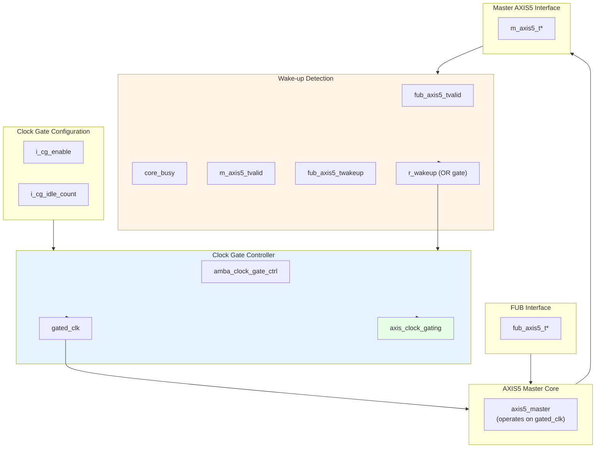

<!-- RTL Design Sherpa Documentation Header -->
<table>
<tr>
<td width="80">
  <a href="https://github.com/sean-galloway/RTLDesignSherpa">
    
  </a>
</td>
<td>
  <strong>RTL Design Sherpa</strong> · <em>Learning Hardware Design Through Practice</em><br>
  <sub>
    <a href="https://github.com/sean-galloway/RTLDesignSherpa">GitHub</a> ·
    <a href="https://github.com/sean-galloway/RTLDesignSherpa/blob/main/docs/DOCUMENTATION_INDEX.md">Documentation Index</a> ·
    <a href="https://github.com/sean-galloway/RTLDesignSherpa/blob/main/LICENSE">MIT License</a>
  </sub>
</td>
</tr>
</table>

---

<!-- End Header -->

# AXIS5 Master with Clock Gating

**Module:** `axis5_master_cg.sv`
**Location:** `rtl/amba/axis5/`
**Status:** Production Ready

---

## Overview

The AXIS5 Master CG (Clock Gated) module implements an AXI5-Stream master interface with integrated clock gating for power savings. It wraps the standard AXIS5 master with the AMBA clock gate controller, automatically gating the clock during idle periods while preserving full AXIS5 functionality including wake-up signaling and optional parity.

### Key Features

- Full AXI5-Stream protocol compliance with AMBA5 extensions
- Automatic clock gating during idle periods for power savings
- TWAKEUP: Wake-up signaling integration with clock gate control
- TPARITY: Optional parity protection (1 bit per byte)
- Configurable idle count threshold for gating activation
- Internal skid buffer for backpressure handling
- Parity error detection and reporting
- Clock gating status output

### Power Management Features

| Feature | Implementation | Benefit |
|---------|---------------|---------|
| Clock gating | Automatic via idle detection | Reduces dynamic power |
| Wake-up integration | TWAKEUP prevents gating | Preserves responsiveness |
| Configurable threshold | Programmable idle count | Tune power vs. latency |
| Activity detection | Multi-source OR logic | Comprehensive coverage |

---

## Module Architecture



---

## Parameters

| Parameter | Type | Default | Description |
|-----------|------|---------|-------------|
| SKID_DEPTH | int | 4 | Internal skid buffer depth |
| AXIS_DATA_WIDTH | int | 32 | AXIS data bus width (must be multiple of 8) |
| AXIS_ID_WIDTH | int | 8 | AXIS ID signal width (0 to disable) |
| AXIS_DEST_WIDTH | int | 4 | AXIS TDEST signal width (0 to disable) |
| AXIS_USER_WIDTH | int | 1 | AXIS TUSER signal width (0 to disable) |
| ENABLE_WAKEUP | bit | 1 | Enable TWAKEUP signal (1=enabled) |
| ENABLE_PARITY | bit | 0 | Enable TPARITY signal (1=enabled) |
| CG_IDLE_COUNT_WIDTH | int | 4 | Clock gate idle counter width |
| DW | int | AXIS_DATA_WIDTH | Data width short name (calculated) |
| IW | int | AXIS_ID_WIDTH | ID width short name (calculated) |
| DESTW | int | AXIS_DEST_WIDTH | DEST width short name (calculated) |
| UW | int | AXIS_USER_WIDTH | USER width short name (calculated) |
| SW | int | DW/8 | Strobe width in bytes (calculated) |
| PW | int | SW | Parity width - 1 bit per byte (calculated) |
| ICW | int | CG_IDLE_COUNT_WIDTH | Idle count width short name (calculated) |

---

## Ports

### Clock and Reset

| Port | Width | Direction | Description |
|------|-------|-----------|-------------|
| aclk | 1 | Input | AXIS ungated clock (always running) |
| aresetn | 1 | Input | AXIS active-low asynchronous reset |

### Clock Gating Configuration

| Port | Width | Direction | Description |
|------|-------|-----------|-------------|
| i_cg_enable | 1 | Input | Clock gating enable (1=allow gating, 0=force always on) |
| i_cg_idle_count | ICW | Input | Idle clock cycles before gating activates |

### FUB AXIS5 Interface (Input Side)

| Port | Width | Direction | Description |
|------|-------|-----------|-------------|
| fub_axis5_tdata | DW | Input | Transfer data |
| fub_axis5_tstrb | SW | Input | Transfer byte strobes |
| fub_axis5_tlast | 1 | Input | Last transfer in packet |
| fub_axis5_tid | IW_WIDTH | Input | Transfer ID (optional) |
| fub_axis5_tdest | DESTW_WIDTH | Input | Transfer destination (optional) |
| fub_axis5_tuser | UW_WIDTH | Input | Transfer user-defined signals (optional) |
| fub_axis5_tvalid | 1 | Input | Transfer valid |
| fub_axis5_tready | 1 | Output | Transfer ready (skid buffer not full) |
| fub_axis5_twakeup | 1 | Input | Wake-up signal (prevents clock gating) |
| fub_axis5_tparity | PW_WIDTH | Input | Data parity per byte (AXIS5 extension) |

### Master AXIS5 Interface (Output Side)

| Port | Width | Direction | Description |
|------|-------|-----------|-------------|
| m_axis5_tdata | DW | Output | Transfer data |
| m_axis5_tstrb | SW | Output | Transfer byte strobes |
| m_axis5_tlast | 1 | Output | Last transfer in packet |
| m_axis5_tid | IW_WIDTH | Output | Transfer ID (optional) |
| m_axis5_tdest | DESTW_WIDTH | Output | Transfer destination (optional) |
| m_axis5_tuser | UW_WIDTH | Output | Transfer user-defined signals (optional) |
| m_axis5_tvalid | 1 | Output | Transfer valid |
| m_axis5_tready | 1 | Input | Transfer ready from downstream |
| m_axis5_twakeup | 1 | Output | Wake-up signal |
| m_axis5_tparity | PW_WIDTH | Output | Data parity per byte (AXIS5 extension) |

### Status Outputs

| Port | Width | Direction | Description |
|------|-------|-----------|-------------|
| busy | 1 | Output | Module busy (data in buffer or input valid) |
| parity_error | 1 | Output | Parity error detected (sticky flag) |
| axis_clock_gating | 1 | Output | Clock gating active status (1=gated, 0=running) |

---

## Functionality

### Clock Gating Control

**Wake-up detection logic:**
```systemverilog
r_wakeup <= fub_axis5_tvalid ||  // Input has data
            core_busy ||          // Core processing
            m_axis5_tvalid ||     // Output has data
            fub_axis5_twakeup;    // Explicit wake-up
```

The clock gate controller:
1. Monitors `r_wakeup` for activity
2. If idle (r_wakeup=0) for `i_cg_idle_count` cycles, gates clock
3. On activity (r_wakeup=1), immediately ungates clock
4. Respects `i_cg_enable` (forced on if disabled)

### Power Saving Mechanism

**Clock gating states:**

| Condition | r_wakeup | Clock State | Power State |
|-----------|----------|-------------|-------------|
| Active transfer | 1 | Running | Full power |
| Buffer has data | 1 | Running | Full power |
| Wake-up asserted | 1 | Running | Full power |
| Idle < threshold | 0 | Running | Full power |
| Idle ≥ threshold | 0 | Gated | Low power |

**Benefits:**
- Reduces dynamic power during idle periods
- Zero latency wake-up on new transfers
- No protocol impact (transparent to upstream/downstream)

### Integration with AXIS5 Extensions

**Wake-up signal dual purpose:**
1. **Protocol:** Power management hint to downstream
2. **Clock gating:** Prevents local clock gating

This ensures wake-up events are never missed due to clock gating.

### Idle Count Configuration

**Typical values for `i_cg_idle_count`:**
- **Aggressive power saving:** 2-4 cycles
  - Quick gating, may have frequent gate/ungate transitions
  - Best for bursty traffic with long idle periods
- **Balanced:** 8-16 cycles
  - Reduces gate/ungate overhead
  - Good for moderate traffic patterns
- **Conservative:** 32-64 cycles
  - Only gates during extended idle
  - Minimal gate/ungate overhead

**Trade-off:** Lower count = more power savings but more gate transitions (dynamic overhead)

---

## Timing Diagrams

### Clock Gating Activation

<!-- TODO: Add wavedrom timing diagram for clock gating activation -->
```
TODO: Wavedrom timing diagram showing:
- aclk (always running)
- r_wakeup (activity detection)
- i_cg_idle_count (threshold)
- gated_clk (starts gating after threshold)
- axis_clock_gating (status)
- fub_axis5_tvalid (new transfer wakes up)
```

### Wake-up Signal Preventing Gating

<!-- TODO: Add wavedrom timing diagram for wake-up preventing gating -->
```
TODO: Wavedrom timing diagram showing:
- aclk
- fub_axis5_twakeup (asserted)
- r_wakeup (stays high)
- gated_clk (remains running)
- axis_clock_gating (stays 0)
```

### Transfer During Idle Period

<!-- TODO: Add wavedrom timing diagram for transfer arrival during idle -->
```
TODO: Wavedrom timing diagram showing:
- aclk
- gated_clk (gated, then ungates on transfer)
- fub_axis5_tvalid (new transfer)
- r_wakeup (0 → 1 transition)
- axis_clock_gating (1 → 0)
- m_axis5_tvalid (output after ungate)
```

---

## Usage Example

### Basic Clock-Gated Configuration

```systemverilog
axis5_master_cg #(
    .SKID_DEPTH             (4),
    .AXIS_DATA_WIDTH        (64),
    .AXIS_ID_WIDTH          (8),
    .AXIS_DEST_WIDTH        (4),
    .AXIS_USER_WIDTH        (1),
    .ENABLE_WAKEUP          (1),
    .ENABLE_PARITY          (0),
    .CG_IDLE_COUNT_WIDTH    (4)
) u_axis5_master_cg (
    .aclk                   (axis_clk),
    .aresetn                (axis_rst_n),

    // Clock gating configuration
    .i_cg_enable            (1'b1),        // Enable clock gating
    .i_cg_idle_count        (4'd8),        // Gate after 8 idle cycles

    // FUB interface (from upstream)
    .fub_axis5_tdata        (fub_tdata),
    .fub_axis5_tstrb        (fub_tstrb),
    .fub_axis5_tlast        (fub_tlast),
    .fub_axis5_tid          (fub_tid),
    .fub_axis5_tdest        (fub_tdest),
    .fub_axis5_tuser        (fub_tuser),
    .fub_axis5_tvalid       (fub_tvalid),
    .fub_axis5_tready       (fub_tready),
    .fub_axis5_twakeup      (fub_twakeup),
    .fub_axis5_tparity      (8'h00),

    // Master AXIS5 interface (to downstream)
    .m_axis5_tdata          (m_axis_tdata),
    .m_axis5_tstrb          (m_axis_tstrb),
    .m_axis5_tlast          (m_axis_tlast),
    .m_axis5_tid            (m_axis_tid),
    .m_axis5_tdest          (m_axis_tdest),
    .m_axis5_tuser          (m_axis_tuser),
    .m_axis5_tvalid         (m_axis_tvalid),
    .m_axis5_tready         (m_axis_tready),
    .m_axis5_twakeup        (m_axis_twakeup),
    .m_axis5_tparity        (),

    // Status
    .busy                   (axis_busy),
    .parity_error           (),
    .axis_clock_gating      (axis_clk_gated)  // Monitor gating status
);
```

### Dynamic Clock Gating Control

```systemverilog
// Runtime control of clock gating
logic cg_enable;
logic [3:0] cg_idle_count;

axis5_master_cg #(
    .AXIS_DATA_WIDTH        (32),
    .ENABLE_WAKEUP          (1),
    .ENABLE_PARITY          (1),
    .CG_IDLE_COUNT_WIDTH    (4)
) u_axis5_master_cg (
    .aclk                   (sys_clk),
    .aresetn                (sys_rst_n),

    // Dynamic configuration via registers
    .i_cg_enable            (cg_enable),
    .i_cg_idle_count        (cg_idle_count),

    // ... ports ...

    .busy                   (axis_busy),
    .parity_error           (parity_err),
    .axis_clock_gating      (clk_gated_status)
);

// Configuration register interface
always_ff @(posedge cfg_clk or negedge cfg_rst_n) begin
    if (!cfg_rst_n) begin
        cg_enable <= 1'b1;      // Default: gating enabled
        cg_idle_count <= 4'd16; // Default: 16 cycle threshold
    end else if (cfg_write) begin
        case (cfg_addr)
            ADDR_CG_CTRL: cg_enable <= cfg_wdata[0];
            ADDR_CG_IDLE: cg_idle_count <= cfg_wdata[3:0];
        endcase
    end
end

// Monitor power savings
always_ff @(posedge sys_clk or negedge sys_rst_n) begin
    if (!sys_rst_n)
        gated_cycle_count <= '0;
    else if (clk_gated_status)
        gated_cycle_count <= gated_cycle_count + 1;
end
```

### Power Profiling Example

```systemverilog
// Instantiate both gated and non-gated versions for comparison
axis5_master_cg #(
    .AXIS_DATA_WIDTH    (64),
    .CG_IDLE_COUNT_WIDTH(4)
) u_gated (
    .aclk               (clk),
    .aresetn            (rst_n),
    .i_cg_enable        (1'b1),
    .i_cg_idle_count    (4'd8),
    // ... ports ...
    .axis_clock_gating  (gated_status)
);

// Track gating statistics
always_ff @(posedge clk or negedge rst_n) begin
    if (!rst_n) begin
        total_cycles <= '0;
        gated_cycles <= '0;
    end else begin
        total_cycles <= total_cycles + 1;
        if (gated_status)
            gated_cycles <= gated_cycles + 1;
    end
end

// Calculate power savings percentage
assign power_savings_pct = (gated_cycles * 100) / total_cycles;
```

---

## Design Notes

### Clock Gating vs. Non-Gated Variant

| Aspect | axis5_master | axis5_master_cg |
|--------|-------------|-----------------|
| Area | Smaller | +5-10% (clock gate logic) |
| Dynamic power | Higher | Lower (gating reduces) |
| Static power | Same | Same |
| Latency | Lower | Same (zero-cycle wake-up) |
| Complexity | Lower | Higher (gating control) |
| Use case | Always-on systems | Power-sensitive designs |

**When to use clock-gated variant:**
- Battery-powered devices
- Bursty traffic patterns with idle periods
- Power budget constraints
- SoC integration with power domains

### Wake-up Integration Benefits

TWAKEUP integration with clock gating provides:
1. **Event preservation:** Wake-up events prevent clock gating
2. **Zero latency:** Immediate clock activation
3. **Protocol compliance:** Wake-up propagated correctly
4. **Power efficiency:** Only wake when necessary

### Gate Transition Overhead

Each clock gate transition has overhead:
- **Gate activation:** 1-2 cycles to fully gate
- **Ungate activation:** 0-1 cycles to restore clock
- **Dynamic power:** Gate/ungate switching consumes power

**Recommendation:** Set `i_cg_idle_count` high enough to amortize transition overhead.

### Clock Domain Considerations

- **Input signals:** Must be on `aclk` domain (always running)
- **Core logic:** Operates on `gated_clk` domain
- **Output signals:** Driven by `gated_clk` domain
- **Status outputs:** `axis_clock_gating` on `aclk` domain

No explicit CDC (clock domain crossing) needed - gated_clk is derived from aclk.

---

## Related Documentation

- **[AXIS5 Master](axis5_master.md)** - Base AXIS5 master without clock gating
- **[AXIS5 Slave CG](axis5_slave_cg.md)** - Clock-gated slave variant
- **[AXIS5 Slave](axis5_slave.md)** - Base AXIS5 slave
- **[AMBA Clock Gate Controller](../shared/amba_clock_gate_ctrl.md)** - Clock gating controller
- **[AMBA5 Power Management](../overview.md#power-management)** - AMBA5 power features

---

## Navigation

- **[← Back to AXIS5 Index](README.md)**
- **[← Back to RTLAmba Index](../index.md)**
- **[← Back to Main Documentation Index](../../index.md)**
