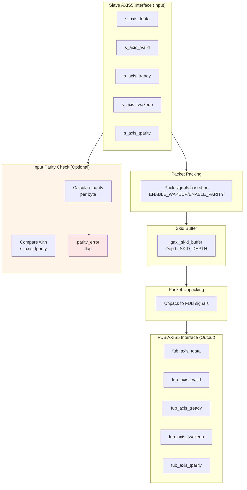

<!-- RTL Design Sherpa Documentation Header -->
<table>
<tr>
<td width="80">
  <a href="https://github.com/sean-galloway/RTLDesignSherpa">
    
  </a>
</td>
<td>
  <strong>RTL Design Sherpa</strong> · <em>Learning Hardware Design Through Practice</em><br>
  <sub>
    <a href="https://github.com/sean-galloway/RTLDesignSherpa">GitHub</a> ·
    <a href="https://github.com/sean-galloway/RTLDesignSherpa/blob/main/docs/DOCUMENTATION_INDEX.md">Documentation Index</a> ·
    <a href="https://github.com/sean-galloway/RTLDesignSherpa/blob/main/LICENSE">MIT License</a>
  </sub>
</td>
</tr>
</table>

---

<!-- End Header -->

# AXIS5 Slave

**Module:** `axis5_slave.sv`
**Location:** `rtl/amba/axis5/`
**Status:** Production Ready

---

## Overview

The AXIS5 Slave module implements an AXI5-Stream slave interface with AMBA5 extensions including wake-up signaling for power management and optional parity for data integrity. It accepts incoming stream data and provides buffering through an internal skid buffer for improved system performance.

### Key Features

- Full AXI5-Stream protocol compliance
- TWAKEUP: Wake-up signaling for power management
- TPARITY: Optional parity protection (1 bit per byte)
- Internal skid buffer for backpressure handling
- Configurable data, ID, destination, and user signal widths
- Parity error detection and reporting
- Busy status indication

### AXIS5 Extensions Over AXIS4

| Feature | AXIS4 | AXIS5 |
|---------|-------|-------|
| Wake-up signal | None | TWAKEUP (configurable) |
| Data parity | None | TPARITY (1 bit per byte, configurable) |
| Parity error detection | None | Built-in error flag |

---

## Module Architecture



---

## Parameters

| Parameter | Type | Default | Description |
|-----------|------|---------|-------------|
| SKID_DEPTH | int | 4 | Internal skid buffer depth |
| AXIS_DATA_WIDTH | int | 32 | AXIS data bus width (must be multiple of 8) |
| AXIS_ID_WIDTH | int | 8 | AXIS ID signal width (0 to disable) |
| AXIS_DEST_WIDTH | int | 4 | AXIS TDEST signal width (0 to disable) |
| AXIS_USER_WIDTH | int | 1 | AXIS TUSER signal width (0 to disable) |
| ENABLE_WAKEUP | bit | 1 | Enable TWAKEUP signal (1=enabled) |
| ENABLE_PARITY | bit | 0 | Enable TPARITY signal (1=enabled) |
| DW | int | AXIS_DATA_WIDTH | Data width short name (calculated) |
| IW | int | AXIS_ID_WIDTH | ID width short name (calculated) |
| DESTW | int | AXIS_DEST_WIDTH | DEST width short name (calculated) |
| UW | int | AXIS_USER_WIDTH | USER width short name (calculated) |
| SW | int | DW/8 | Strobe width in bytes (calculated) |
| PW | int | SW | Parity width - 1 bit per byte (calculated) |

---

## Ports

### Clock and Reset

| Port | Width | Direction | Description |
|------|-------|-----------|-------------|
| aclk | 1 | Input | AXIS clock |
| aresetn | 1 | Input | AXIS active-low asynchronous reset |

### Slave AXIS5 Interface (Input Side)

| Port | Width | Direction | Description |
|------|-------|-----------|-------------|
| s_axis_tdata | DW | Input | Transfer data from upstream |
| s_axis_tstrb | SW | Input | Transfer byte strobes |
| s_axis_tlast | 1 | Input | Last transfer in packet |
| s_axis_tid | IW_WIDTH | Input | Transfer ID (optional) |
| s_axis_tdest | DESTW_WIDTH | Input | Transfer destination (optional) |
| s_axis_tuser | UW_WIDTH | Input | Transfer user-defined signals (optional) |
| s_axis_tvalid | 1 | Input | Transfer valid from upstream |
| s_axis_tready | 1 | Output | Transfer ready (skid buffer not full) |
| s_axis_twakeup | 1 | Input | Wake-up signal (AXIS5 extension) |
| s_axis_tparity | PW_WIDTH | Input | Data parity per byte (AXIS5 extension) |

### FUB AXIS5 Interface (Output Side to Backend)

| Port | Width | Direction | Description |
|------|-------|-----------|-------------|
| fub_axis_tdata | DW | Output | Transfer data to backend |
| fub_axis_tstrb | SW | Output | Transfer byte strobes |
| fub_axis_tlast | 1 | Output | Last transfer in packet |
| fub_axis_tid | IW_WIDTH | Output | Transfer ID (optional) |
| fub_axis_tdest | DESTW_WIDTH | Output | Transfer destination (optional) |
| fub_axis_tuser | UW_WIDTH | Output | Transfer user-defined signals (optional) |
| fub_axis_tvalid | 1 | Output | Transfer valid to backend |
| fub_axis_tready | 1 | Input | Transfer ready from backend |
| fub_axis_twakeup | 1 | Output | Wake-up signal (AXIS5 extension) |
| fub_axis_tparity | PW_WIDTH | Output | Data parity per byte (AXIS5 extension) |

### Status Outputs

| Port | Width | Direction | Description |
|------|-------|-----------|-------------|
| busy | 1 | Output | Module busy (data in buffer or input valid) |
| parity_error | 1 | Output | Parity error detected on input (sticky flag) |

---

## Functionality

### Skid Buffer Operation

The module uses an internal `gaxi_skid_buffer` to:
- Accept incoming transfers even when backend is not ready
- Prevent backpressure to upstream
- Provide registered outputs for timing closure
- Track buffer occupancy via `busy` signal

### Packet Packing/Unpacking

**Conditional packing based on configuration:**

```systemverilog
// Full feature set (ENABLE_WAKEUP=1, ENABLE_PARITY=1)
{tdata, tstrb, tlast, tid, tdest, tuser, twakeup, tparity}

// Wake-up only (ENABLE_WAKEUP=1, ENABLE_PARITY=0)
{tdata, tstrb, tlast, tid, tdest, tuser, twakeup}

// Parity only (ENABLE_WAKEUP=0, ENABLE_PARITY=1)
{tdata, tstrb, tlast, tid, tdest, tuser, tparity}

// Base AXIS4 (ENABLE_WAKEUP=0, ENABLE_PARITY=0)
{tdata, tstrb, tlast, tid, tdest, tuser}
```

### Parity Checking (Optional)

When `ENABLE_PARITY=1`:
1. Calculate odd parity for each input data byte: `parity[i] = ^s_axis_tdata[i*8 +: 8]`
2. Compare calculated parity with received `s_axis_tparity`
3. Set `parity_error` flag on mismatch (sticky, cleared by reset)
4. Parity check occurs on valid input transfers (`s_axis_tvalid && s_axis_tready`)

**Note:** Parity checking is performed on the **input side** to detect errors as early as possible.

### Busy Signal

The `busy` output indicates:
- Input side has valid data (`s_axis_tvalid`)
- Skid buffer contains data (`int_t_count > 0`)

---

## Timing Diagrams

### Basic Receive with Wake-up

<!-- TODO: Add wavedrom timing diagram for AXIS5 receive with wake-up -->
```
TODO: Wavedrom timing diagram showing:
- aclk
- s_axis_tvalid/tready
- s_axis_tdata
- s_axis_tlast
- s_axis_twakeup (AXIS5 extension)
- fub_axis_tvalid/tready
- fub_axis_tdata
- fub_axis_twakeup
- busy
```

### Receive with Parity Error

<!-- TODO: Add wavedrom timing diagram for parity error detection -->
```
TODO: Wavedrom timing diagram showing:
- aclk
- s_axis_tdata
- s_axis_tparity (received)
- calculated_parity
- parity_mismatch
- parity_error (sticky flag set)
```

### Skid Buffer Backpressure from Backend

<!-- TODO: Add wavedrom timing diagram for backend backpressure -->
```
TODO: Wavedrom timing diagram showing:
- aclk
- s_axis_tvalid/tready
- fub_axis_tvalid/tready (backend blocked)
- int_t_count (buffer fill level)
- busy
```

---

## Usage Example

### Basic Configuration

```systemverilog
axis5_slave #(
    .SKID_DEPTH       (4),
    .AXIS_DATA_WIDTH  (64),
    .AXIS_ID_WIDTH    (8),
    .AXIS_DEST_WIDTH  (4),
    .AXIS_USER_WIDTH  (1),
    .ENABLE_WAKEUP    (1),
    .ENABLE_PARITY    (0)
) u_axis5_slave (
    .aclk                (axis_clk),
    .aresetn             (axis_rst_n),

    // Slave interface (from upstream)
    .s_axis_tdata        (s_axis_tdata),
    .s_axis_tstrb        (s_axis_tstrb),
    .s_axis_tlast        (s_axis_tlast),
    .s_axis_tid          (s_axis_tid),
    .s_axis_tdest        (s_axis_tdest),
    .s_axis_tuser        (s_axis_tuser),
    .s_axis_tvalid       (s_axis_tvalid),
    .s_axis_tready       (s_axis_tready),
    .s_axis_twakeup      (s_axis_twakeup),
    .s_axis_tparity      (8'h00),  // Not used when ENABLE_PARITY=0

    // FUB interface (to backend)
    .fub_axis_tdata      (fub_tdata),
    .fub_axis_tstrb      (fub_tstrb),
    .fub_axis_tlast      (fub_tlast),
    .fub_axis_tid        (fub_tid),
    .fub_axis_tdest      (fub_tdest),
    .fub_axis_tuser      (fub_tuser),
    .fub_axis_tvalid     (fub_tvalid),
    .fub_axis_tready     (fub_tready),
    .fub_axis_twakeup    (fub_twakeup),
    .fub_axis_tparity    (),  // Not used when ENABLE_PARITY=0

    // Status
    .busy                (axis_busy),
    .parity_error        ()  // Not used when ENABLE_PARITY=0
);
```

### With Parity Protection and Error Handling

```systemverilog
axis5_slave #(
    .AXIS_DATA_WIDTH  (32),
    .ENABLE_WAKEUP    (1),
    .ENABLE_PARITY    (1)  // Enable parity checking on input
) u_axis5_slave_parity (
    .aclk                (axis_clk),
    .aresetn             (axis_rst_n),

    // Slave interface with parity
    .s_axis_tdata        (s_axis_tdata),
    .s_axis_tstrb        (s_axis_tstrb),
    .s_axis_tlast        (s_axis_tlast),
    .s_axis_tid          (s_axis_tid),
    .s_axis_tdest        (s_axis_tdest),
    .s_axis_tuser        (s_axis_tuser),
    .s_axis_tvalid       (s_axis_tvalid),
    .s_axis_tready       (s_axis_tready),
    .s_axis_twakeup      (s_axis_twakeup),
    .s_axis_tparity      (s_axis_tparity),  // 4 bits for 32-bit data

    // FUB interface
    .fub_axis_tdata      (fub_tdata),
    .fub_axis_tstrb      (fub_tstrb),
    .fub_axis_tlast      (fub_tlast),
    .fub_axis_tid        (fub_tid),
    .fub_axis_tdest      (fub_tdest),
    .fub_axis_tuser      (fub_tuser),
    .fub_axis_tvalid     (fub_tvalid),
    .fub_axis_tready     (fub_tready),
    .fub_axis_twakeup    (fub_twakeup),
    .fub_axis_tparity    (fub_tparity),

    // Status - monitor parity errors
    .busy                (axis_busy),
    .parity_error        (axis_parity_err)  // Sticky error flag
);

// Error handling and logging
always_ff @(posedge axis_clk or negedge axis_rst_n) begin
    if (!axis_rst_n) begin
        error_count <= '0;
        prev_parity_err <= 1'b0;
    end else begin
        prev_parity_err <= axis_parity_err;
        // Count rising edges (new errors)
        if (axis_parity_err && !prev_parity_err) begin
            error_count <= error_count + 1;
            // Log error or trigger interrupt
            $error("AXIS5 Slave: Parity error detected at time %t", $time);
        end
    end
end
```

### Integration with Processing Pipeline

```systemverilog
// AXIS5 slave receives data from network/upstream
axis5_slave #(
    .AXIS_DATA_WIDTH  (512),  // Wide data path
    .AXIS_ID_WIDTH    (4),
    .ENABLE_WAKEUP    (1),
    .ENABLE_PARITY    (1)
) u_rx_slave (
    .aclk              (sys_clk),
    .aresetn           (sys_rst_n),
    .s_axis_tdata      (rx_tdata),
    .s_axis_tstrb      (rx_tstrb),
    .s_axis_tlast      (rx_tlast),
    .s_axis_tid        (rx_tid),
    .s_axis_tdest      (rx_tdest),
    .s_axis_tuser      (rx_tuser),
    .s_axis_tvalid     (rx_tvalid),
    .s_axis_tready     (rx_tready),
    .s_axis_twakeup    (rx_twakeup),
    .s_axis_tparity    (rx_tparity),
    // To processing pipeline
    .fub_axis_tdata    (proc_tdata),
    .fub_axis_tstrb    (proc_tstrb),
    .fub_axis_tlast    (proc_tlast),
    .fub_axis_tid      (proc_tid),
    .fub_axis_tdest    (proc_tdest),
    .fub_axis_tuser    (proc_tuser),
    .fub_axis_tvalid   (proc_tvalid),
    .fub_axis_tready   (proc_tready),
    .fub_axis_twakeup  (proc_twakeup),
    .fub_axis_tparity  (proc_tparity),
    .busy              (rx_busy),
    .parity_error      (rx_parity_err)
);

// Connect to processing module
my_data_processor u_processor (
    .clk         (sys_clk),
    .rst_n       (sys_rst_n),
    .in_tdata    (proc_tdata),
    .in_tvalid   (proc_tvalid),
    .in_tready   (proc_tready),
    // ... other signals
);
```

---

## Design Notes

### AXIS5 vs AXIS4 Differences

| Feature | AXIS4 | AXIS5 |
|---------|-------|-------|
| Wake-up signal | Not supported | TWAKEUP (optional) |
| Data parity | Not supported | TPARITY per byte (optional) |
| Power management | Limited | Enhanced via TWAKEUP |
| Data integrity | CRC/checksum in TUSER | Built-in parity option |

### Parity Check Location

**Key difference from AXIS5 Master:**
- **Slave:** Parity checked on **input** (`s_axis_tdata` vs `s_axis_tparity`)
- **Master:** Parity checked on **output** (`m_axis_tdata` vs `m_axis_tparity`)

This allows early detection of transmission errors at the receiving side.

### Skid Buffer Sizing

- **Typical depth:** 4-8 entries
- Deeper buffers:
  - Absorb longer backend stalls
  - Increase area and latency
- Shallower buffers:
  - Lower latency
  - May cause upstream backpressure

**Recommendation:** Use depth 4 for most applications, increase if backend frequently stalls.

### Parity Implementation

When `ENABLE_PARITY=1`:
- **Overhead:** 1 bit per data byte (12.5% for 8-bit bytes)
- **Detection:** Single-bit errors only (odd parity)
- **Correction:** None - error flag only
- **Use case:** Low-cost error detection in reliable environments

For stronger protection, use:
- CRC in TUSER field
- ECC (external module)
- End-to-end checksums at packet level

### Error Handling Strategy

The `parity_error` flag is **sticky** (latches high until reset):
- Simplifies error detection (level-sensitive interrupt)
- Software must clear by resetting module
- For edge-sensitive interrupts, external logic must detect rising edge

**Alternative:** Modify module to add `parity_error_clear` input if needed.

---

## Related Documentation

- **[AXIS5 Master](axis5_master.md)** - AXIS5 master interface (transmit side)
- **[AXIS5 Slave CG](axis5_slave_cg.md)** - Clock-gated variant with power management
- **[AXIS5 Master CG](axis5_master_cg.md)** - Clock-gated master variant
- **[AXIS4 Slave](../fabric/axis_slave.md)** - AXIS4 version for comparison
- **[AMBA5 Overview](../overview.md)** - AMBA5 specifications and extensions

---

## Navigation

- **[← Back to AXIS5 Index](README.md)**
- **[← Back to RTLAmba Index](../index.md)**
- **[← Back to Main Documentation Index](../../index.md)**
