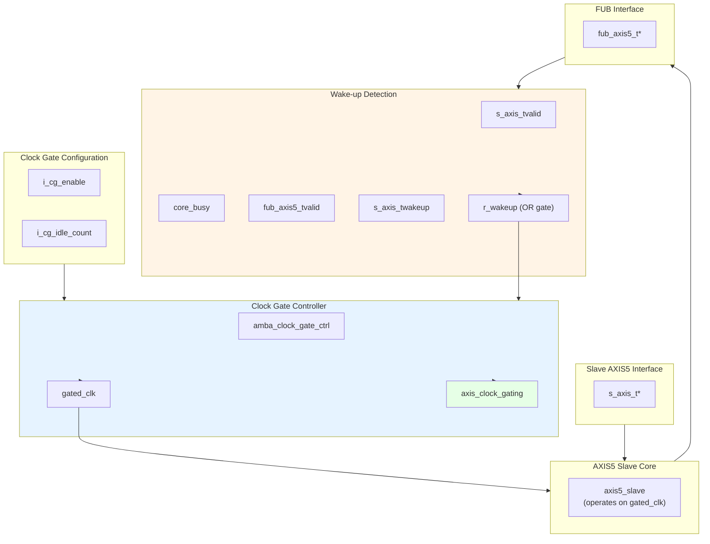

<!-- RTL Design Sherpa Documentation Header -->
<table>
<tr>
<td width="80">
  <a href="https://github.com/sean-galloway/RTLDesignSherpa">
    
  </a>
</td>
<td>
  <strong>RTL Design Sherpa</strong> · <em>Learning Hardware Design Through Practice</em><br>
  <sub>
    <a href="https://github.com/sean-galloway/RTLDesignSherpa">GitHub</a> ·
    <a href="https://github.com/sean-galloway/RTLDesignSherpa/blob/main/docs/DOCUMENTATION_INDEX.md">Documentation Index</a> ·
    <a href="https://github.com/sean-galloway/RTLDesignSherpa/blob/main/LICENSE">MIT License</a>
  </sub>
</td>
</tr>
</table>

---

<!-- End Header -->

# AXIS5 Slave with Clock Gating

**Module:** `axis5_slave_cg.sv`
**Location:** `rtl/amba/axis5/`
**Status:** Production Ready

---

## Overview

The AXIS5 Slave CG (Clock Gated) module implements an AXI5-Stream slave interface with integrated clock gating for power savings. It wraps the standard AXIS5 slave with the AMBA clock gate controller, automatically gating the clock during idle periods while preserving full AXIS5 functionality including wake-up signaling and optional parity.

### Key Features

- Full AXI5-Stream protocol compliance with AMBA5 extensions
- Automatic clock gating during idle periods for power savings
- TWAKEUP: Wake-up signaling integration with clock gate control
- TPARITY: Optional parity protection (1 bit per byte) with error detection
- Configurable idle count threshold for gating activation
- Internal skid buffer for backpressure handling
- Parity error detection on input side
- Clock gating status output

### Power Management Features

| Feature | Implementation | Benefit |
|---------|---------------|---------|
| Clock gating | Automatic via idle detection | Reduces dynamic power |
| Wake-up integration | TWAKEUP prevents gating | Preserves responsiveness |
| Configurable threshold | Programmable idle count | Tune power vs. latency |
| Activity detection | Multi-source OR logic | Comprehensive coverage |

---

## Module Architecture



---

## Parameters

| Parameter | Type | Default | Description |
|-----------|------|---------|-------------|
| SKID_DEPTH | int | 4 | Internal skid buffer depth |
| AXIS_DATA_WIDTH | int | 32 | AXIS data bus width (must be multiple of 8) |
| AXIS_ID_WIDTH | int | 8 | AXIS ID signal width (0 to disable) |
| AXIS_DEST_WIDTH | int | 4 | AXIS TDEST signal width (0 to disable) |
| AXIS_USER_WIDTH | int | 1 | AXIS TUSER signal width (0 to disable) |
| ENABLE_WAKEUP | bit | 1 | Enable TWAKEUP signal (1=enabled) |
| ENABLE_PARITY | bit | 0 | Enable TPARITY signal (1=enabled) |
| CG_IDLE_COUNT_WIDTH | int | 4 | Clock gate idle counter width |
| DW | int | AXIS_DATA_WIDTH | Data width short name (calculated) |
| IW | int | AXIS_ID_WIDTH | ID width short name (calculated) |
| DESTW | int | AXIS_DEST_WIDTH | DEST width short name (calculated) |
| UW | int | AXIS_USER_WIDTH | USER width short name (calculated) |
| SW | int | DW/8 | Strobe width in bytes (calculated) |
| PW | int | SW | Parity width - 1 bit per byte (calculated) |
| ICW | int | CG_IDLE_COUNT_WIDTH | Idle count width short name (calculated) |

---

## Ports

### Clock and Reset

| Port | Width | Direction | Description |
|------|-------|-----------|-------------|
| aclk | 1 | Input | AXIS ungated clock (always running) |
| aresetn | 1 | Input | AXIS active-low asynchronous reset |

### Clock Gating Configuration

| Port | Width | Direction | Description |
|------|-------|-----------|-------------|
| i_cg_enable | 1 | Input | Clock gating enable (1=allow gating, 0=force always on) |
| i_cg_idle_count | ICW | Input | Idle clock cycles before gating activates |

### Slave AXIS5 Interface (Input Side)

| Port | Width | Direction | Description |
|------|-------|-----------|-------------|
| s_axis_tdata | DW | Input | Transfer data from upstream |
| s_axis_tstrb | SW | Input | Transfer byte strobes |
| s_axis_tlast | 1 | Input | Last transfer in packet |
| s_axis_tid | IW_WIDTH | Input | Transfer ID (optional) |
| s_axis_tdest | DESTW_WIDTH | Input | Transfer destination (optional) |
| s_axis_tuser | UW_WIDTH | Input | Transfer user-defined signals (optional) |
| s_axis_tvalid | 1 | Input | Transfer valid from upstream |
| s_axis_tready | 1 | Output | Transfer ready (skid buffer not full) |
| s_axis_twakeup | 1 | Input | Wake-up signal (prevents clock gating) |
| s_axis_tparity | PW_WIDTH | Input | Data parity per byte (AXIS5 extension) |

### FUB AXIS5 Interface (Output Side to Backend)

| Port | Width | Direction | Description |
|------|-------|-----------|-------------|
| fub_axis5_tdata | DW | Output | Transfer data to backend |
| fub_axis5_tstrb | SW | Output | Transfer byte strobes |
| fub_axis5_tlast | 1 | Output | Last transfer in packet |
| fub_axis5_tid | IW_WIDTH | Output | Transfer ID (optional) |
| fub_axis5_tdest | DESTW_WIDTH | Output | Transfer destination (optional) |
| fub_axis5_tuser | UW_WIDTH | Output | Transfer user-defined signals (optional) |
| fub_axis5_tvalid | 1 | Output | Transfer valid to backend |
| fub_axis5_tready | 1 | Input | Transfer ready from backend |
| fub_axis5_twakeup | 1 | Output | Wake-up signal |
| fub_axis5_tparity | PW_WIDTH | Output | Data parity per byte (AXIS5 extension) |

### Status Outputs

| Port | Width | Direction | Description |
|------|-------|-----------|-------------|
| busy | 1 | Output | Module busy (data in buffer or input valid) |
| parity_error | 1 | Output | Parity error detected on input (sticky flag) |
| axis_clock_gating | 1 | Output | Clock gating active status (1=gated, 0=running) |

---

## Functionality

### Clock Gating Control

**Wake-up detection logic:**
```systemverilog
r_wakeup <= s_axis_tvalid ||    // Input has data
            core_busy ||         // Core processing
            fub_axis5_tvalid ||  // Backend has data
            s_axis_twakeup;      // Explicit wake-up
```

The clock gate controller:
1. Monitors `r_wakeup` for activity
2. If idle (r_wakeup=0) for `i_cg_idle_count` cycles, gates clock
3. On activity (r_wakeup=1), immediately ungates clock
4. Respects `i_cg_enable` (forced on if disabled)

### Power Saving Mechanism

**Clock gating states:**

| Condition | r_wakeup | Clock State | Power State |
|-----------|----------|-------------|-------------|
| Receiving data | 1 | Running | Full power |
| Buffer has data | 1 | Running | Full power |
| Backend processing | 1 | Running | Full power |
| Wake-up asserted | 1 | Running | Full power |
| Idle < threshold | 0 | Running | Full power |
| Idle ≥ threshold | 0 | Gated | Low power |

**Benefits:**
- Reduces dynamic power during idle periods
- Zero latency wake-up on new transfers
- No protocol impact (transparent to upstream/backend)

### Parity Error Detection

When `ENABLE_PARITY=1`:
- Parity checked on **input side** (`s_axis_tdata` vs `s_axis_tparity`)
- Early error detection at receive interface
- `parity_error` flag is sticky (latches until reset)
- Error checking continues even during clock gating transitions

### Idle Count Configuration

**Typical values for `i_cg_idle_count`:**
- **Aggressive power saving:** 2-4 cycles
  - Quick gating, may have frequent gate/ungate transitions
  - Best for bursty traffic with long idle periods
- **Balanced:** 8-16 cycles
  - Reduces gate/ungate overhead
  - Good for moderate traffic patterns
- **Conservative:** 32-64 cycles
  - Only gates during extended idle
  - Minimal gate/ungate overhead

**Trade-off:** Lower count = more power savings but more gate transitions (dynamic overhead)

---

## Timing Diagrams

### Clock Gating Activation on Slave

<!-- TODO: Add wavedrom timing diagram for slave clock gating -->
```
TODO: Wavedrom timing diagram showing:
- aclk (always running)
- s_axis_tvalid (input activity)
- r_wakeup (activity detection)
- i_cg_idle_count (threshold)
- gated_clk (starts gating after threshold)
- axis_clock_gating (status)
- New s_axis_tvalid arrival ungates clock
```

### Wake-up Preventing Gating During Receive

<!-- TODO: Add wavedrom timing diagram for wake-up during receive -->
```
TODO: Wavedrom timing diagram showing:
- aclk
- s_axis_twakeup (asserted during transfer)
- s_axis_tvalid
- r_wakeup (stays high)
- gated_clk (remains running)
- axis_clock_gating (stays 0)
- fub_axis5_tvalid (output forwarded)
```

### Backend Backpressure with Clock Gating

<!-- TODO: Add wavedrom timing diagram for backpressure scenario -->
```
TODO: Wavedrom timing diagram showing:
- aclk
- s_axis_tvalid (upstream sending)
- fub_axis5_tready (backend blocked)
- core_busy (stays high)
- r_wakeup (stays high)
- gated_clk (remains running due to busy)
- axis_clock_gating (stays 0 during backpressure)
```

---

## Usage Example

### Basic Clock-Gated Slave

```systemverilog
axis5_slave_cg #(
    .SKID_DEPTH             (4),
    .AXIS_DATA_WIDTH        (64),
    .AXIS_ID_WIDTH          (8),
    .AXIS_DEST_WIDTH        (4),
    .AXIS_USER_WIDTH        (1),
    .ENABLE_WAKEUP          (1),
    .ENABLE_PARITY          (0),
    .CG_IDLE_COUNT_WIDTH    (4)
) u_axis5_slave_cg (
    .aclk                   (axis_clk),
    .aresetn                (axis_rst_n),

    // Clock gating configuration
    .i_cg_enable            (1'b1),        // Enable clock gating
    .i_cg_idle_count        (4'd8),        // Gate after 8 idle cycles

    // Slave interface (from upstream)
    .s_axis_tdata           (s_axis_tdata),
    .s_axis_tstrb           (s_axis_tstrb),
    .s_axis_tlast           (s_axis_tlast),
    .s_axis_tid             (s_axis_tid),
    .s_axis_tdest           (s_axis_tdest),
    .s_axis_tuser           (s_axis_tuser),
    .s_axis_tvalid          (s_axis_tvalid),
    .s_axis_tready          (s_axis_tready),
    .s_axis_twakeup         (s_axis_twakeup),
    .s_axis_tparity         (8'h00),

    // FUB interface (to backend)
    .fub_axis5_tdata        (fub_tdata),
    .fub_axis5_tstrb        (fub_tstrb),
    .fub_axis5_tlast        (fub_tlast),
    .fub_axis5_tid          (fub_tid),
    .fub_axis5_tdest        (fub_tdest),
    .fub_axis5_tuser        (fub_tuser),
    .fub_axis5_tvalid       (fub_tvalid),
    .fub_axis5_tready       (fub_tready),
    .fub_axis5_twakeup      (fub_twakeup),
    .fub_axis5_tparity      (),

    // Status
    .busy                   (axis_busy),
    .parity_error           (),
    .axis_clock_gating      (axis_clk_gated)  // Monitor gating status
);
```

### With Parity Protection and Power Monitoring

```systemverilog
// Clock-gated slave with parity and comprehensive monitoring
axis5_slave_cg #(
    .AXIS_DATA_WIDTH        (32),
    .ENABLE_WAKEUP          (1),
    .ENABLE_PARITY          (1),  // Enable parity checking
    .CG_IDLE_COUNT_WIDTH    (4)
) u_rx_slave_cg (
    .aclk                   (sys_clk),
    .aresetn                (sys_rst_n),

    // Dynamic clock gating control
    .i_cg_enable            (cfg_cg_enable),
    .i_cg_idle_count        (cfg_cg_threshold),

    // Slave interface with parity
    .s_axis_tdata           (rx_tdata),
    .s_axis_tstrb           (rx_tstrb),
    .s_axis_tlast           (rx_tlast),
    .s_axis_tid             (rx_tid),
    .s_axis_tdest           (rx_tdest),
    .s_axis_tuser           (rx_tuser),
    .s_axis_tvalid          (rx_tvalid),
    .s_axis_tready          (rx_tready),
    .s_axis_twakeup         (rx_twakeup),
    .s_axis_tparity         (rx_tparity),  // 4 bits for 32-bit data

    // FUB interface
    .fub_axis5_tdata        (proc_tdata),
    .fub_axis5_tstrb        (proc_tstrb),
    .fub_axis5_tlast        (proc_tlast),
    .fub_axis5_tid          (proc_tid),
    .fub_axis5_tdest        (proc_tdest),
    .fub_axis5_tuser        (proc_tuser),
    .fub_axis5_tvalid       (proc_tvalid),
    .fub_axis5_tready       (proc_tready),
    .fub_axis5_twakeup      (proc_twakeup),
    .fub_axis5_tparity      (proc_tparity),

    // Status monitoring
    .busy                   (rx_busy),
    .parity_error           (rx_parity_err),
    .axis_clock_gating      (rx_clk_gated)
);

// Error and power monitoring
always_ff @(posedge sys_clk or negedge sys_rst_n) begin
    if (!sys_rst_n) begin
        parity_error_count <= '0;
        total_cycles <= '0;
        gated_cycles <= '0;
    end else begin
        // Count cycles
        total_cycles <= total_cycles + 1;
        if (rx_clk_gated)
            gated_cycles <= gated_cycles + 1;

        // Count parity errors
        if (rx_parity_err && !prev_parity_err)
            parity_error_count <= parity_error_count + 1;
        prev_parity_err <= rx_parity_err;
    end
end

// Calculate power savings
assign power_savings_pct = (gated_cycles * 100) / total_cycles;
```

### Receive Pipeline with Power Management

```systemverilog
// Network receive path with clock gating
axis5_slave_cg #(
    .AXIS_DATA_WIDTH        (512),  // Wide data path
    .AXIS_ID_WIDTH          (4),
    .ENABLE_WAKEUP          (1),
    .ENABLE_PARITY          (1),
    .CG_IDLE_COUNT_WIDTH    (6)     // Wider counter for longer idle
) u_rx_interface (
    .aclk                   (net_clk),
    .aresetn                (net_rst_n),

    // Aggressive clock gating for power
    .i_cg_enable            (1'b1),
    .i_cg_idle_count        (6'd4),  // Gate quickly after 4 idle cycles

    // From network PHY
    .s_axis_tdata           (phy_rx_tdata),
    .s_axis_tstrb           (phy_rx_tstrb),
    .s_axis_tlast           (phy_rx_tlast),
    .s_axis_tid             (phy_rx_tid),
    .s_axis_tdest           (phy_rx_tdest),
    .s_axis_tuser           (phy_rx_tuser),
    .s_axis_tvalid          (phy_rx_tvalid),
    .s_axis_tready          (phy_rx_tready),
    .s_axis_twakeup         (phy_rx_twakeup),
    .s_axis_tparity         (phy_rx_tparity),

    // To packet processor
    .fub_axis5_tdata        (pkt_proc_tdata),
    .fub_axis5_tstrb        (pkt_proc_tstrb),
    .fub_axis5_tlast        (pkt_proc_tlast),
    .fub_axis5_tid          (pkt_proc_tid),
    .fub_axis5_tdest        (pkt_proc_tdest),
    .fub_axis5_tuser        (pkt_proc_tuser),
    .fub_axis5_tvalid       (pkt_proc_tvalid),
    .fub_axis5_tready       (pkt_proc_tready),
    .fub_axis5_twakeup      (pkt_proc_twakeup),
    .fub_axis5_tparity      (pkt_proc_tparity),

    // Status for system monitoring
    .busy                   (rx_busy),
    .parity_error           (rx_parity_err),
    .axis_clock_gating      (rx_clk_gated)
);

// Interrupt on parity error
assign parity_err_irq = rx_parity_err && !prev_rx_parity_err;
```

---

## Design Notes

### Clock Gating vs. Non-Gated Variant

| Aspect | axis5_slave | axis5_slave_cg |
|--------|------------|----------------|
| Area | Smaller | +5-10% (clock gate logic) |
| Dynamic power | Higher | Lower (gating reduces) |
| Static power | Same | Same |
| Latency | Lower | Same (zero-cycle wake-up) |
| Complexity | Lower | Higher (gating control) |
| Use case | Always-on systems | Power-sensitive designs |

**When to use clock-gated variant:**
- Battery-powered devices
- Receive paths with bursty traffic
- Power budget constraints
- SoC integration with power domains

### Slave-Specific Gating Considerations

**Differences from master variant:**
1. **Wake-up source:** Upstream signal (`s_axis_twakeup`)
2. **Activity detection:** Input valid (`s_axis_tvalid`)
3. **Backpressure:** Backend ready affects gating

**Receive path characteristics:**
- Often idle waiting for upstream data
- Good candidate for aggressive clock gating
- Wake-up from upstream provides early notification

### Gate Transition Overhead

Each clock gate transition has overhead:
- **Gate activation:** 1-2 cycles to fully gate
- **Ungate activation:** 0-1 cycles to restore clock
- **Dynamic power:** Gate/ungate switching consumes power

**Recommendation:** Set `i_cg_idle_count` high enough to amortize transition overhead, especially for high-frequency gating scenarios.

### Parity Error Handling with Clock Gating

Parity errors detected on input side:
- Check occurs before data enters skid buffer
- Error flag persists regardless of clock gating state
- Sticky flag ensures errors not lost during gating

**Important:** `parity_error` flag requires reset to clear - plan for error recovery.

---

## Related Documentation

- **[AXIS5 Slave](axis5_slave.md)** - Base AXIS5 slave without clock gating
- **[AXIS5 Master CG](axis5_master_cg.md)** - Clock-gated master variant
- **[AXIS5 Master](axis5_master.md)** - Base AXIS5 master
- **[AMBA Clock Gate Controller](../shared/amba_clock_gate_ctrl.md)** - Clock gating controller
- **[AMBA5 Power Management](../overview.md#power-management)** - AMBA5 power features

---

## Navigation

- **[← Back to AXIS5 Index](README.md)**
- **[← Back to RTLAmba Index](../index.md)**
- **[← Back to Main Documentation Index](../../index.md)**
