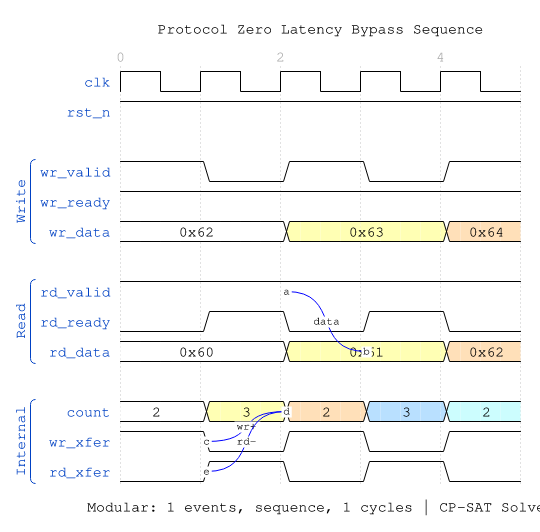
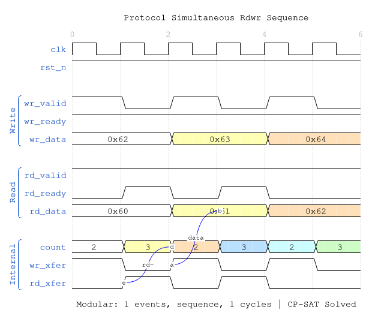
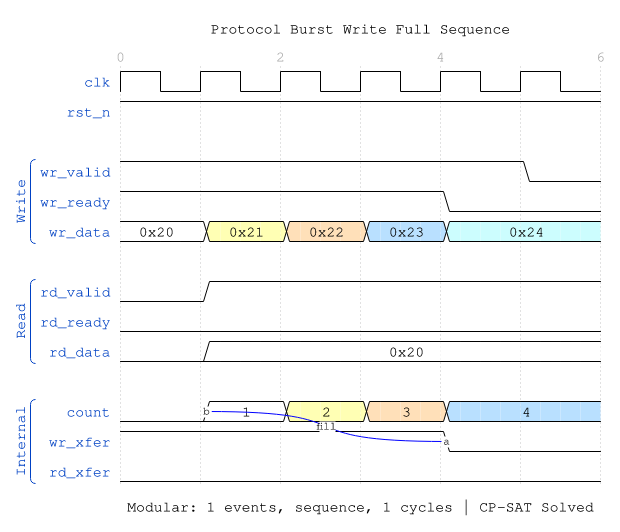
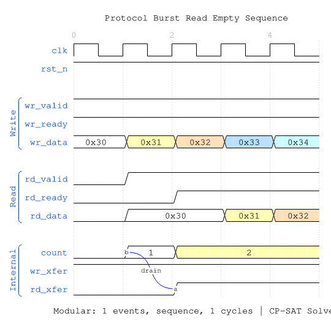
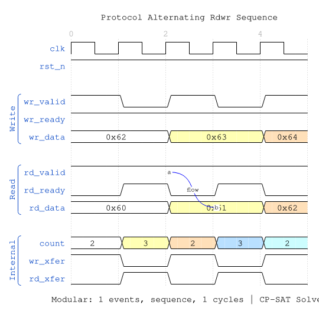

<!-- RTL Design Sherpa Documentation Header -->
<table>
<tr>
<td width="80">
  <a href="https://github.com/sean-galloway/RTLDesignSherpa">
    
  </a>
</td>
<td>
  <strong>RTL Design Sherpa</strong> · <em>Learning Hardware Design Through Practice</em><br>
  <sub>
    <a href="https://github.com/sean-galloway/RTLDesignSherpa">GitHub</a> ·
    <a href="https://github.com/sean-galloway/RTLDesignSherpa/blob/main/docs/DOCUMENTATION_INDEX.md">Documentation Index</a> ·
    <a href="https://github.com/sean-galloway/RTLDesignSherpa/blob/main/LICENSE">MIT License</a>
  </sub>
</td>
</tr>
</table>

---

<!-- End Header -->

# GAXI Skid Buffer

**Module:** `gaxi_skid_buffer.sv`
**Location:** `rtl/amba/gaxi/`
**Status:** ✅ Production Ready

---

## Overview

The GAXI skid buffer is an elastic buffer that provides **zero-latency bypass** when empty while offering elastic buffering to prevent pipeline stalls. It combines the best of both worlds: low latency for the common case (empty) and elastic storage for handling backpressure.

### Key Features

- ✅ **Zero-Latency Bypass:** When empty, data appears at output immediately (0 cycles)
- ✅ **Elastic Buffering:** Depth 2-8 entries prevent pipeline stalls
- ✅ **Single Clock Domain:** Synchronous design for simplicity
- ✅ **Parameterized:** Configurable data width and depth
- ✅ **Efficient:** Shift register implementation, minimal logic

---

## Module Interface

```systemverilog
module gaxi_skid_buffer #(
    parameter int DATA_WIDTH = 32,
    parameter int DEPTH = 2,        // Must be one of {2, 4, 6, 8}
    parameter     INSTANCE_NAME = "DEADF1F0",
    parameter int DW = DATA_WIDTH,
    parameter int BUF_WIDTH = DATA_WIDTH * DEPTH,
    parameter int BW = BUF_WIDTH
) (
    // Global Clock and Reset
    input  logic          axi_aclk,
    input  logic          axi_aresetn,

    // Write Interface (Input Side)
    input  logic          wr_valid,
    output logic          wr_ready,
    input  logic [DW-1:0] wr_data,

    // Read Interface (Output Side)
    output logic          rd_valid,
    input  logic          rd_ready,
    output logic [DW-1:0] rd_data,

    // Status/Monitoring
    output logic [3:0]    count,     // Current buffer occupancy
    output logic [3:0]    rd_count   // Same as count (for compatibility)
);
```

---

## Parameters

| Parameter | Type | Default | Description |
|-----------|------|---------|-------------|
| `DATA_WIDTH` | int | 32 | Data bus width in bits |
| `DEPTH` | int | 2 | Buffer depth (must be 2, 4, 6, or 8) |
| `INSTANCE_NAME` | string | "DEADF1F0" | Instance name for debug messages |

**Derived Parameters:**
- `DW` = DATA_WIDTH
- `BUF_WIDTH` = DATA_WIDTH × DEPTH (total buffer storage)
- `BW` = BUF_WIDTH

---

## Ports

### Clock and Reset

| Port | Direction | Width | Description |
|------|-----------|-------|-------------|
| `axi_aclk` | input | 1 | Clock |
| `axi_aresetn` | input | 1 | Active-low asynchronous reset |

### Write Interface

| Port | Direction | Width | Description |
|------|-----------|-------|-------------|
| `wr_valid` | input | 1 | Write data valid |
| `wr_ready` | output | 1 | Ready to accept write |
| `wr_data` | input | DATA_WIDTH | Write data |

### Read Interface

| Port | Direction | Width | Description |
|------|-----------|-------|-------------|
| `rd_valid` | output | 1 | Read data valid |
| `rd_ready` | input | 1 | Ready to accept read |
| `rd_data` | output | DATA_WIDTH | Read data |

### Status

| Port | Direction | Width | Description |
|------|-----------|-------|-------------|
| `count` | output | 4 | Current buffer occupancy (0 to DEPTH) |
| `rd_count` | output | 4 | Same as count (for compatibility) |

---

## Functional Description

### Operation Modes

The skid buffer operates in different modes based on occupancy:

#### 1. Empty Mode (count = 0)

**Zero-Latency Bypass:**
- `wr_data` → `rd_data` **immediately** (combinatorial path)
- `rd_valid` asserts same cycle as `wr_valid`
- No buffering delay



**WaveJSON:** [zero_latency_bypass_001.json](../../assets/WAVES/gaxi_skid_buffer/zero_latency_bypass_001.json)

**Key Observations:**
- Write at cycle N → Read valid at cycle N
- Data flows through with 0-cycle latency
- `count` increments when write occurs without simultaneous read

#### 2. Partially Full Mode (0 < count < DEPTH)

**Elastic Storage:**
- Data buffered in shift register
- Both write and read can occur simultaneously
- `count` tracks occupancy



**WaveJSON:** [simultaneous_rdwr_001.json](../../assets/WAVES/gaxi_skid_buffer/simultaneous_rdwr_001.json)

**Key Observations:**
- Simultaneous operations: count stays constant
- Write-only: count increments
- Read-only: count decrements

#### 3. Nearly Full Mode (count = DEPTH - 1)

**Smart Backpressure:**
- `wr_ready` stays high if read occurring
- Prevents false stalls

#### 4. Full Mode (count = DEPTH)

**Backpressure Applied:**
- `wr_ready` = 0 (cannot accept more writes)
- Must read to make space



**WaveJSON:** [burst_write_full_001.json](../../assets/WAVES/gaxi_skid_buffer/burst_write_full_001.json)

**Key Observations:**
- `wr_ready` deasserts when buffer full
- Subsequent writes blocked until space available
- Reading creates space, `wr_ready` reasserts

### Internal State Machine

The module implements a shift register for data storage:

```systemverilog
// Data storage: shift register
logic [BUF_WIDTH-1:0] r_data;       // [DEPTH * DATA_WIDTH - 1 : 0]
logic [3:0]           r_data_count;  // Current occupancy

// Transfer detection
logic w_wr_xfer = wr_valid & wr_ready;
logic w_rd_xfer = rd_valid & rd_ready;
```

**State Transitions:**

| Condition | wr_xfer | rd_xfer | Action | count Change |
|-----------|---------|---------|--------|--------------|
| Write only | 1 | 0 | Shift data in | +1 |
| Read only | 0 | 1 | Shift data out | -1 |
| Simultaneous | 1 | 1 | Shift data in/out | 0 |
| Idle | 0 | 0 | No change | 0 |

### Ready/Valid Logic

```systemverilog
// Write ready conditions
wr_ready <= (count <= DEPTH-2) ||
            (count == DEPTH-1 && (~wr_xfer || rd_xfer)) ||
            (count == DEPTH && rd_xfer);

// Read valid conditions
rd_valid <= (count >= 2) ||
            (count == 1 && (~rd_xfer || wr_xfer)) ||
            (count == 0 && wr_xfer);
```

---

## Timing Characteristics

### Latency

| Condition | Latency | Cycles |
|-----------|---------|--------|
| Empty → Read | 0 | Immediate (combinatorial) |
| Write → Read (buffered) | 1 | One clock cycle |
| Backpressure response | 1 | One clock after full |

### Throughput

- **Maximum:** 1 transfer per clock cycle
- **Sustained:** 1 transfer per clock (with proper flow control)

### Critical Paths

- **Write → Read (empty):** Combinatorial path (may need timing closure in deep pipelines)
- **Ready/Valid Logic:** Single-cycle registered

---

## Comprehensive Timing Examples

### Scenario 1: Zero-Latency Bypass

Write to empty buffer shows immediate `rd_valid`:


**WaveJSON:** [zero_latency_bypass_001.json](../../assets/WAVES/gaxi_skid_buffer/zero_latency_bypass_001.json)

### Scenario 2: Burst Write Until Full

Demonstrates backpressure behavior:


**WaveJSON:** [burst_write_full_001.json](../../assets/WAVES/gaxi_skid_buffer/burst_write_full_001.json)

### Scenario 3: Simultaneous Read/Write

Pass-through operation with constant occupancy:


**WaveJSON:** [simultaneous_rdwr_001.json](../../assets/WAVES/gaxi_skid_buffer/simultaneous_rdwr_001.json)

### Scenario 4: Burst Read Until Empty

Draining the buffer:



**WaveJSON:** [burst_read_empty_001.json](../../assets/WAVES/gaxi_skid_buffer/burst_read_empty_001.json)

### Scenario 5: Fill Then Drain Pattern

Complete fill phase followed by drain:


**WaveJSON:** [fill_then_drain_001.json](../../assets/WAVES/gaxi_skid_buffer/fill_then_drain_001.json)

### Scenario 6: Alternating Read/Write

Continuous interleaved operations:



**WaveJSON:** [alternating_rdwr_001.json](../../assets/WAVES/gaxi_skid_buffer/alternating_rdwr_001.json)

---

## Usage Examples

### Example 1: Basic Pipeline Stage

```systemverilog
// Break long combinatorial path
gaxi_skid_buffer #(
    .DATA_WIDTH(64),
    .DEPTH(4)
) u_pipeline_stage (
    .axi_aclk    (clk),
    .axi_aresetn (rst_n),
    .wr_valid    (stage1_valid),
    .wr_ready    (stage1_ready),
    .wr_data     (stage1_data),
    .rd_valid    (stage2_valid),
    .rd_ready    (stage2_ready),
    .rd_data     (stage2_data),
    .count       (stage_occupancy),
    .rd_count    ()
);
```

### Example 2: Backpressure Absorption

```systemverilog
// Absorb temporary backpressure from downstream
gaxi_skid_buffer #(
    .DATA_WIDTH(128),
    .DEPTH(8),              // Larger depth for more buffering
    .INSTANCE_NAME("BP_ABSORB")
) u_backpressure_buffer (
    .axi_aclk    (clk),
    .axi_aresetn (rst_n),
    .wr_valid    (continuous_valid),  // Always producing
    .wr_ready    (continuous_ready),
    .wr_data     (continuous_data),
    .rd_valid    (bursty_valid),      // Intermittent consumer
    .rd_ready    (bursty_ready),
    .rd_data     (bursty_data),
    .count       (buffer_level),
    .rd_count    ()
);

// Monitor buffer level for flow control
assign almost_full = (buffer_level >= 6);  // Threshold
```

### Example 3: Monitoring Occupancy

```systemverilog
gaxi_skid_buffer #(
    .DATA_WIDTH(32),
    .DEPTH(4)
) u_monitored (
    .axi_aclk    (clk),
    .axi_aresetn (rst_n),
    .wr_valid    (wr_valid),
    .wr_ready    (wr_ready),
    .wr_data     (wr_data),
    .rd_valid    (rd_valid),
    .rd_ready    (rd_ready),
    .rd_data     (rd_data),
    .count       (fifo_count),
    .rd_count    ()
);

// Performance monitoring
always_ff @(posedge clk) begin
    if (fifo_count > max_count_seen)
        max_count_seen <= fifo_count;

    if (fifo_count == 4'h0 && wr_valid && wr_ready)
        bypass_events <= bypass_events + 1;  // Track bypass usage
end
```

---

## Design Considerations

### Depth Selection

| DEPTH | Use Case | Latency | Buffering |
|-------|----------|---------|-----------|
| 2 | Minimal buffering, tight timing | 0-1 cycles | Limited backpressure tolerance |
| 4 | Standard pipeline stage | 0-1 cycles | Moderate backpressure tolerance |
| 6 | Heavier buffering needs | 0-1 cycles | Good backpressure tolerance |
| 8 | Maximum buffering | 0-1 cycles | Excellent backpressure tolerance |

**Recommendation:** Use DEPTH=4 for most cases - good balance of buffering and resource usage.

### Timing Closure

If zero-latency bypass creates timing violations:

**Option 1:** Add pipeline stage after skid buffer
```systemverilog
// Skid buffer (combinatorial read)
gaxi_skid_buffer #(.DATA_WIDTH(32), .DEPTH(4)) u_skid (...);

// Additional register stage
always_ff @(posedge clk) begin
    if (skid_rd_valid && skid_rd_ready) begin
        final_data <= skid_rd_data;
        final_valid <= 1'b1;
    end else if (final_ready) begin
        final_valid <= 1'b0;
    end
end
```

**Option 2:** Use FIFO with REGISTERED=1 instead (see [gaxi_fifo_sync](gaxi_fifo_sync.md))

### Area vs. Performance Trade-offs

| Metric | DEPTH=2 | DEPTH=4 | DEPTH=8 |
|--------|---------|---------|---------|
| Flops | 2×DW | 4×DW | 8×DW |
| LUTs | ~40 | ~50 | ~70 |
| Bypass Latency | 0 cycles | 0 cycles | 0 cycles |
| Backpressure Tolerance | Low | Moderate | High |

---

## Error Checking

The module includes assertion checks (simulation only):

```systemverilog
// synopsys translate_off
always @(posedge axi_aclk) begin
    if ((wr_valid && !wr_ready) && (wr_xfer)) begin
        $display("Error: %s write while buffer full, %t", INSTANCE_NAME, $time);
    end
end

always @(posedge axi_aclk) begin
    if ((rd_ready && !rd_valid) && (rd_xfer)) begin
        $display("Error: %s read while buffer empty, %t", INSTANCE_NAME, $time);
    end
end
// synopsys translate_on
```

**These checks help catch:**
- Protocol violations (writes when not ready)
- Invalid reads (reading when empty)

---

## Testing

### Test File

**Location:** `val/amba/test_gaxi_buffer_sync.py`

**Test Modes:**
- `mode='skid'` → Tests this module specifically
- `mode='fifo_mux'` → Tests gaxi_fifo_sync with REGISTERED=0
- `mode='fifo_flop'` → Tests gaxi_fifo_sync with REGISTERED=1

### WaveDrom Test

**Location:** `val/amba/test_gaxi_wavedrom_example.py`

Generates comprehensive timing diagrams showing all 6 scenarios.

### Running Tests

```bash
# Functional test (skid buffer mode)
pytest val/amba/test_gaxi_buffer_sync.py -k "skid" -v

# Generate waveforms
pytest val/amba/test_gaxi_wavedrom_example.py -v
cd val/amba && bash wd_cmd.sh
```

---

## Common Issues

### Issue 1: Timing Violation on Bypass Path

**Symptom:** Setup time violation from `wr_data` to `rd_data`

**Solution:**
```systemverilog
// Add register stage after skid buffer
gaxi_skid_buffer #(...) u_skid (...);

always_ff @(posedge clk) begin
    registered_data <= skid_rd_data;
    registered_valid <= skid_rd_valid;
end
```

### Issue 2: Buffer Overflow

**Symptom:** Data loss, `count` exceeds DEPTH

**Debug:**
1. Check write logic respects `wr_ready`
2. Verify DEPTH parameter is sufficient
3. Monitor `count` signal - should never exceed DEPTH

### Issue 3: Unexpected Latency

**Symptom:** Data takes multiple cycles to appear at output

**Debug:**
1. Check buffer was empty when write occurred
2. Verify `rd_ready` is asserted (prevents data from appearing)
3. Look at `count` - if non-zero, data is buffered

---

## Related Modules

- [gaxi_fifo_sync](gaxi_fifo_sync.md) - Larger depth, optional registered output
- [gaxi_fifo_async](gaxi_fifo_async.md) - Clock domain crossing
- [gaxi_skid_buffer_async](gaxi_skid_buffer_async.md) - Async version

---

## References

- **Tutorial:** [GAXI WaveDrom Tutorial](../../TestTutorial/wavedrom_gaxi_example.md)
- **Overview:** [GAXI Index](index.md)
- **Source:** `rtl/amba/gaxi/gaxi_skid_buffer.sv`
- **Tests:** `val/amba/test_gaxi_buffer_sync.py`, `val/amba/test_gaxi_wavedrom_example.py`

---

**Version:** 1.0
**Last Updated:** 2025-10-06
**Maintained By:** RTL Design Sherpa Project
