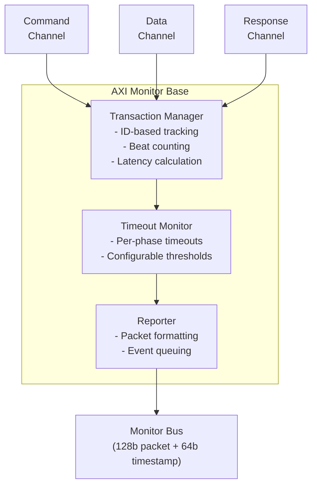

<!-- RTL Design Sherpa Documentation Header -->
<table>
<tr>
<td width="80">
  <a href="https://github.com/sean-galloway/RTLDesignSherpa">
    
  </a>
</td>
<td>
  <strong>RTL Design Sherpa</strong> · <em>Learning Hardware Design Through Practice</em><br>
  <sub>
    <a href="https://github.com/sean-galloway/RTLDesignSherpa">GitHub</a> ·
    <a href="https://github.com/sean-galloway/RTLDesignSherpa/blob/main/docs/DOCUMENTATION_INDEX.md">Documentation Index</a> ·
    <a href="https://github.com/sean-galloway/RTLDesignSherpa/blob/main/LICENSE">MIT License</a>
  </sub>
</td>
</tr>
</table>

---

<!-- End Header -->

# AXI Monitor Base

**Module:** `axi_monitor_base.sv`
**Location:** `rtl/amba/shared/`
**Category:** Core Infrastructure
**Status:** ✅ Production Ready

---

## Overview

The `axi_monitor_base` module provides Core transaction tracking and event reporting for AXI/AXIL monitors.

This is a **shared infrastructure module** used internally by AXI/AXIL monitors. It is not typically instantiated directly by users but is critical for understanding the monitor architecture.

---

## Key Features

- ✅ **Transaction-based tracking for AXI and AXI-Lite protocols:** Transaction-based tracking for AXI and AXI-Lite protocols
- ✅ **Out-of-order transaction handling with ID-based tracking:** Out-of-order transaction handling with ID-based tracking
- ✅ **Data-before-address support (slave-side scenarios):** Data-before-address support (slave-side scenarios)
- ✅ **128-bit standardized monitor bus packet output + 64-bit side-band timestamp**
- ✅ **Configurable performance metrics tracking:** Configurable performance metrics tracking
- ✅ **Timeout detection and threshold monitoring:** Timeout detection and threshold monitoring
- ✅ **Debug trace support with verbosity levels:** Debug trace support with verbosity levels

---

## Module Purpose

The `axi_monitor_base` module is the core building block for:

1. **Transaction Tracking:** Maintains state for all outstanding AXI/AXIL transactions
2. **Event Detection:** Identifies protocol errors, timeouts, threshold violations
3. **Packet Generation:** Creates standardized 128-bit `monitor_packet_t` records paired with a 64-bit side-band timestamp
4. **Flow Control:** Manages backpressure and transaction table exhaustion
5. **Performance Metrics:** Optional latency and throughput tracking

---

## Parameters

### Identity and Sizing

| Parameter | Type | Default | Description |
|-----------|------|---------|-------------|
| `UNIT_ID` | logic [7:0] | 8'h09 | 8-bit unit identifier in monitor packets |
| `AGENT_ID` | logic [15:0] | 16'h0063 | 16-bit agent identifier in monitor packets |
| `MAX_TRANSACTIONS` | int | 16 | Maximum outstanding transactions in the CAM |
| `ADDR_WIDTH` | int | 32 | Address bus width |
| `ID_WIDTH` | int | 8 | Transaction ID width (0 for AXIL) |
| `ADDR_BITS_IN_PKT` | int | 38 | Number of address LSBs carried in an error/event packet (clamped to `ADDR_WIDTH`) |
| `IS_READ` | bit | 1 | 1=read monitor (R data channel, AR bursts), 0=write monitor (W data channel, AW bursts) |
| `IS_AXI` | bit | 1 | 1=AXI protocol, 0=AXI-Lite |
| `INTR_FIFO_DEPTH` | int | 8 | Depth of the reporter's outgoing interrupt/event FIFO |
| `DEBUG_FIFO_DEPTH` | int | 8 | Depth of the debug-trace FIFO (used when the debug module is enabled) |
| `N_ADDR_RANGES` | int | 0 | Number of address-range comparators. `0` removes the `axi_monitor_addr_check` block entirely (zero area) |

### Master Switches

| Parameter | Type | Default | Description |
|-----------|------|---------|-------------|
| `ENABLE_PERF_PACKETS` | bit | 0 | Master switch for performance tracking. Setting it also defaults `ENABLE_PERF_LOGIC` on, instantiating the measurement window + counters (see [Performance Monitoring](#performance-monitoring)) |
| `ENABLE_DEBUG_MODULE` | bit | 0 | Master switch for the debug-trace reporter sub-module |

### Synthesis-Cone Enables (`ENABLE_*_LOGIC`)

Each detection cone can be compiled out to save area. These gate the **logic**, not just packet emission — a disabled cone synthesizes away entirely. Defaults keep the classic cones on and perf/debug off.

| Parameter | Type | Default | Effect when 0 |
|-----------|------|---------|---------------|
| `ENABLE_ERROR_LOGIC` | bit | 1 | Drop the error-detection cone (orphans, response errors) |
| `ENABLE_TIMEOUT_LOGIC` | bit | 1 | Drop the timeout cone **and** the `axi_monitor_timeout` instance |
| `ENABLE_COMPL_LOGIC` | bit | 1 | Drop the completion cone |
| `ENABLE_THRESHOLD_LOGIC` | bit | 1 | Drop the threshold cone (latency / active-count thresholds) |
| `ENABLE_PERF_LOGIC` | bit | = `ENABLE_PERF_PACKETS` | Drop the perfmon measurement window + counters |
| `ENABLE_DEBUG_LOGIC` | bit | 0 | Drop the debug cone |

> **Removed:** the former `CAM_PIPELINE` / `TRANS_CAM_PIPELINE` parameters no longer
> exist. The transaction CAM is now **always pipelined** (one extra cycle of
> `active_count` latency), and `block_ready` carries a `MAX-3` margin so the
> monitor never accepts past `MAX_TRANSACTIONS` despite the pipeline delay.

---

## Port Groups

### Command Phase Interface (AW/AR)

| Port | Direction | Width | Description |
|------|-----------|-------|-------------|
| `cmd_addr` | Input | ADDR_WIDTH | Command address value |
| `cmd_id` | Input | ID_WIDTH | Transaction ID |
| `cmd_len` | Input | 8 | Burst length (AXI only) |
| `cmd_size` | Input | 3 | Burst size (AXI only) |
| `cmd_burst` | Input | 2 | Burst type (AXI only) |
| `cmd_valid` | Input | 1 | Command valid |
| `cmd_ready` | Input | 1 | Command ready |

### Data Channel Interface (R/W)

| Port | Direction | Width | Description |
|------|-----------|-------|-------------|
| `data_id` | Input | ID_WIDTH | Data transaction ID |
| `data_last` | Input | 1 | Last data beat indicator |
| `data_resp` | Input | 2 | Response code (OKAY/EXOKAY/SLVERR/DECERR) |
| `data_valid` | Input | 1 | Data valid |
| `data_ready` | Input | 1 | Data ready |

### Response Channel Interface (B)

| Port | Direction | Width | Description |
|------|-----------|-------|-------------|
| `resp_id` | Input | ID_WIDTH | Response transaction ID |
| `resp_code` | Input | 2 | Response code |
| `resp_valid` | Input | 1 | Response valid |
| `resp_ready` | Input | 1 | Response ready |

### Configuration Interface

| Port | Direction | Width | Description |
|------|-----------|-------|-------------|
| `clear` | Input | 1 | **Synchronous clear** — passes through to `axi_monitor_trans_mgr` to empty the transaction CAM and zero the active-count pipeline atomically, without a full `aresetn`. Pulse one cycle while the monitor is idle. |
| `cfg_freq_sel` | Input | 4 | Frequency selection for timeout scaling |
| `cfg_addr_cnt` | Input | 4 | Address phase timeout count |
| `cfg_data_cnt` | Input | 4 | Data phase timeout count |
| `cfg_resp_cnt` | Input | 4 | Response phase timeout count |
| `cfg_error_enable` | Input | 1 | Enable error event packets |
| `cfg_compl_enable` | Input | 1 | Enable completion packets |
| `cfg_threshold_enable` | Input | 1 | Enable threshold packets |
| `cfg_timeout_enable` | Input | 1 | Enable timeout packets |
| `cfg_perf_enable` | Input | 1 | Enable performance metric packets |
| `cfg_debug_enable` | Input | 1 | Enable debug/trace packets (feeds the debug reporter sub-block) |
| `cfg_active_trans_threshold` | Input | 16 | Active-transaction count that triggers a threshold packet |
| `cfg_latency_threshold` | Input | 32 | Latency value that triggers a threshold packet |
| `cfg_debug_level` | Input | 4 | Debug verbosity level (only used when `ENABLE_DEBUG_MODULE=1`) |
| `cfg_debug_mask` | Input | 16 | Debug event-type mask (only used when `ENABLE_DEBUG_MODULE=1`) |

### Address-Range Checker Interface

Active only when `N_ADDR_RANGES > 0`; otherwise these inputs are ignored and the
`axi_monitor_addr_check` block is not synthesized. Address-range violation packets
are the lowest-priority source on the monitor bus (reporter > debug > addr_check).

| Port | Direction | Width | Description |
|------|-----------|-------|-------------|
| `cfg_addr_check_enable` | Input | 1 | Master enable for the address-range checker |
| `cfg_addr_range_enable` | Input | N_ADDR_RANGES | Per-range enable bit vector |
| `cfg_addr_range_low` | Input | N_ADDR_RANGES × ADDR_WIDTH | Per-range low (inclusive) address bounds |
| `cfg_addr_range_high` | Input | N_ADDR_RANGES × ADDR_WIDTH | Per-range high (inclusive) address bounds |

### Side-Band Timestamp Input

| Port | Direction | Width | Description |
|------|-----------|-------|-------------|
| `i_mon_time` | Input | 64 | Free-running counter from the `monbus_group` family (any wrapper), sampled at packet emission |

### Monitor Bus Output

| Port | Direction | Width | Description |
|------|-----------|-------|-------------|
| `monbus_valid` | Output | 1 | Monitor packet valid |
| `monbus_ready` | Input | 1 | Monitor packet ready (from downstream) |
| `monbus_packet` | Output | 128 | Standardized `monitor_packet_t` |
| `monbus_timestamp` | Output | 64 | `monbus_timestamp_t` paired atomically with `monbus_packet` |
| `block_ready` | Output | 1 | Flow control signal |
| `busy` | Output | 1 | Monitor is busy indicator |
| `active_count` | Output | 8 | Number of active transactions |

The base module multiplexes three internal sources onto the monbus output —
reporter packets (highest priority), debug packets, and addr_check error
packets — driving `monbus_timestamp` from the source's sampled timestamp
(`i_mon_time` for reporter/debug; `addr_pkt_timestamp` from the addr_check
submodule).

### Performance-Window Control Inputs

These configure the measurement-window state machine. Tie the selectors to a
reserved code (e.g. `3'b111`) and the pulses/force-close low at instances that
don't use perfmon. See [Performance Monitoring](#performance-monitoring).

| Port | Direction | Width | Description |
|------|-----------|-------|-------------|
| `cfg_start_event_sel` | Input | 3 | Window **start** event source select |
| `cfg_end_event_sel` | Input | 3 | Window **end** event source select |
| `cfg_start_trigger` | Input | 1 | Software/engine pulse: open the measurement window |
| `cfg_end_trigger` | Input | 1 | Software/engine pulse: close the measurement window |
| `cfg_window_force_close` | Input | 1 | Software override: force the window closed immediately |

### Performance-Window Status and Counter Outputs

All counters accumulate only while `window_active=1`, reset at window-start, and
hold their values through `WIN_CLOSING`/`WIN_IDLE` so the integrating block can
sample a completed window's totals after `window_active` deasserts.

| Port | Direction | Width | Description |
|------|-----------|-------|-------------|
| `window_active` | Output | 1 | High while a measurement window is open |
| `window_cycles` | Output | 32 | Cycles elapsed inside the current window |
| `perf_prod_cycles` | Output | 32 | `data_valid && data_ready` cycles (productive beats) |
| `perf_bp_cycles` | Output | 32 | `data_valid && !data_ready` cycles (back-pressure) |
| `perf_starv_cycles` | Output | 32 | `!data_valid && data_ready` cycles (starvation) |
| `perf_idle_cycles` | Output | 32 | `!data_valid && !data_ready` cycles (idle) |
| `perf_beat_count` | Output | 32 | Data beats transferred (= `perf_prod_cycles`, 1 beat/cycle) |
| `perf_byte_count` | Output | 64 | Bytes transferred = beats × (1 << latched AXSIZE) |
| `perf_burst_count` | Output | 32 | Address-phase handshakes inside the window (AR for reads, AW for writes) |

---

## Architecture



The module coordinates four sub-components:
1. **Transaction Manager:** Tracks transactions, manages table
2. **Timeout Monitor:** Detects stuck transactions
3. **Performance Tracker:** Optional latency/throughput metrics
4. **Reporter:** Generates standardized packets

---

## Performance Monitoring

`axi_monitor_base` is the **canonical home** of the monitor's performance subsystem.
Every AXI/AXIL wrapper (`axi4_*_mon`, `axil4_*_mon`, and the `axi_monitor_filtered`
wrapper) forwards these ports straight through to this core. Because the base is
generic, the data channel it measures is chosen by `IS_READ`: the **R** channel and
**AR** bursts for read monitors, the **W** channel and **AW** bursts for write
monitors.

The perfmon logic is instantiated when `ENABLE_PERF_LOGIC=1` (which defaults from the
`ENABLE_PERF_PACKETS` master switch). It consists of a **measurement-window state
machine** plus a bank of data-channel utilization and throughput counters. All
counters accumulate **only while a window is open** and hold their values between
windows so the host can read a completed window's totals.

### The Measurement Window

A window is opened by a **start event** and closed by an **end event**. Event
sources are chosen by the 3-bit `cfg_start_event_sel` / `cfg_end_event_sel`
selectors:

| Code | Start event | End event |
|------|-------------|-----------|
| `3'b000` | `cfg_start_trigger` pulse (software/CSR) | `cfg_end_trigger` pulse |
| `3'b001` | first command handshake (`cmd_valid && cmd_ready`) | last data (reads: `data_last` beat; writes: response handshake) |
| `3'b010` | `cfg_perf_enable` rising edge | `window_cycles` saturation |
| `3'b011` | first data handshake (`data_valid && data_ready`) | `cfg_perf_enable` falling edge |
| `3'b100` | `cfg_start_trigger` pulse (external-trigger convention) | `cfg_end_trigger` pulse |
| others | never fires (reserved) | never fires (reserved) |

`cfg_window_force_close` is a software override that closes an open window
immediately regardless of the end-event selector.

The state machine has three states:

- **WIN_IDLE** — waiting for a start event; `window_active=0`.
- **WIN_ACTIVE** — window open; `window_active=1`; `window_cycles` free-runs
  (starting at 1 so the total is inclusive of the first cycle). All counters
  accumulate.
- **WIN_CLOSING** — one-cycle hold before re-arming; counters are frozen and
  stable for sampling.

### Utilization Buckets (data channel)

Every cycle inside the window is classified by the data channel's `valid`/`ready`
into exactly one of four mutually-exclusive buckets. The four buckets sum to
`window_cycles` by construction, so utilization = `perf_prod_cycles / window_cycles`.

| Counter | Condition | Meaning |
|---------|-----------|---------|
| `perf_prod_cycles`  | `valid && ready`   | productive beat transferred |
| `perf_bp_cycles`    | `valid && !ready`  | back-pressure (data offered, sink not ready) |
| `perf_starv_cycles` | `!valid && ready`  | starvation (sink ready, no data) |
| `perf_idle_cycles`  | `!valid && !ready` | idle |

### Throughput Counters

| Counter | Width | Meaning |
|---------|:-----:|---------|
| `perf_beat_count`  | 32 | data beats transferred (= `perf_prod_cycles`, 1 beat/cycle) |
| `perf_byte_count`  | 64 | bytes transferred = beats × (1 << latched AXSIZE). AXSIZE is captured (`cmd_size`) at the most recent address-phase handshake and assumed constant within a burst per the AXI4 mandate. 64-bit width prevents wrap on long windows at wide buses |
| `perf_burst_count` | 32 | address-phase handshakes inside the window (AR for read monitors, AW for write monitors) |

The integrator computes average burst length as `perf_beat_count / perf_burst_count`.

> **Note:** the perfmon counters are exposed on the module interface for the
> integrating block to sample; the reporter's `PerfWin` packet emission is staged
> separately (RFC Stage B+). The four-bucket model follows
> `DMA_UTILIZATION_MEASUREMENT.md` Section 3.

---

## Usage in Monitor System

This module is used by:

- **axi4_master_rd_mon**
- **axi4_master_wr_mon**
- **axi4_slave_rd_mon**
- **axi4_slave_wr_mon**
- **axil4_master_rd_mon**
- **axil4_master_wr_mon**
- **axil4_slave_rd_mon**
- **axil4_slave_wr_mon**

### Integration Example

**Not typically instantiated directly by users.** Instead, use high-level monitors:

```systemverilog
// User instantiates this:
axi4_master_rd_mon #(...) u_mon (...);

// Which internally uses:
// - axi4_master_rd (frontend)
// - axi_monitor_base (this module)
// - axi_monitor_filtered
```

---

## Configuration Guidelines

### Transaction Table Sizing

| Design Scenario | MAX_TRANSACTIONS | Rationale |
|----------------|------------------|-----------|
| AXI4 Master (Burst) | 16-32 | Support multiple outstanding bursts |
| AXI4 Slave (Burst) | 16-32 | Handle out-of-order responses |
| AXI4-Lite Master | 4-8 | Single-beat, limited concurrency |
| AXI4-Lite Slave | 4-8 | Simple protocol, fewer outstanding |

### Timeout Configuration

- **`cfg_addr_cnt`**: Command phase timeout (AR/AW)
- **`cfg_data_cnt`**: Data phase timeout (R/W)
- **`cfg_resp_cnt`**: Response phase timeout (B)

**Typical values:**
- Burst traffic: `cfg_*_cnt = 4-8` (aggressive timeout)
- Memory controllers: `cfg_*_cnt = 10-15` (allow latency)
- External interfaces: `cfg_*_cnt = 15` (max tolerance)

---

## Performance Characteristics

| Metric | Value | Notes |
|--------|-------|-------|
| Latency | 2-3 cycles | Event detection to packet output |
| Throughput | 1 packet/cycle | Maximum packet generation rate |
| Table Lookup | 1 cycle | ID-based transaction lookup |
| Resource Usage | ~500 LUTs | Depends on MAX_TRANSACTIONS |

---

## Verification Considerations

### Key Test Scenarios

1. **Transaction Table Management:**
   - Fill table to MAX_TRANSACTIONS
   - Verify table exhaustion handling
   - Test ID reuse after completion

2. **Out-of-Order Transactions:**
   - Issue multiple transactions with different IDs
   - Complete in random order
   - Verify correct ID matching

3. **Timeout Detection:**
   - Initiate transaction without completion
   - Verify timeout event at configured threshold
   - Check timeout packet contains correct ID

4. **Performance Metrics:**
   - Enable `ENABLE_PERF_PACKETS`
   - Verify latency calculations
   - Check throughput tracking

---

## Related Modules

- **[axi_monitor_filtered](./axi_monitor_filtered.md)**
- **[axi_monitor_trans_mgr](./axi_monitor_trans_mgr.md)**
- **[axi_monitor_reporter](./axi_monitor_reporter.md)**
- **[axi_monitor_timeout](./axi_monitor_timeout.md)**

---

## See Also

- **Monitor Architecture:** `docs/markdown/RTLAmba/overview.md`
- **Monitor Configuration Guide:** [Monitor Base Configuration](./axi_monitor_base.md)
- **Packet Format Specification:** `docs/markdown/RTLAmba/includes/monitor_package_spec.md`

---

## Navigation

- **[← Back to Shared Infrastructure Index](./README.md)**
- **[← Back to RTLAmba Index](../index.md)**
- **[← Back to Main Documentation Index](../../index.md)**
