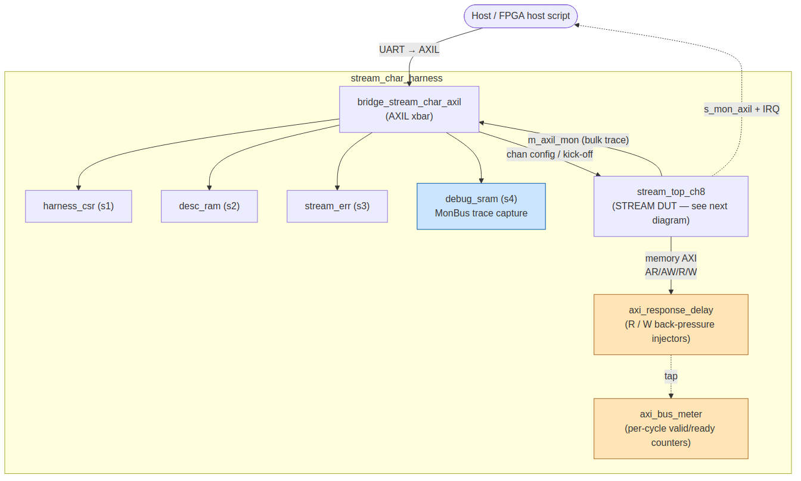
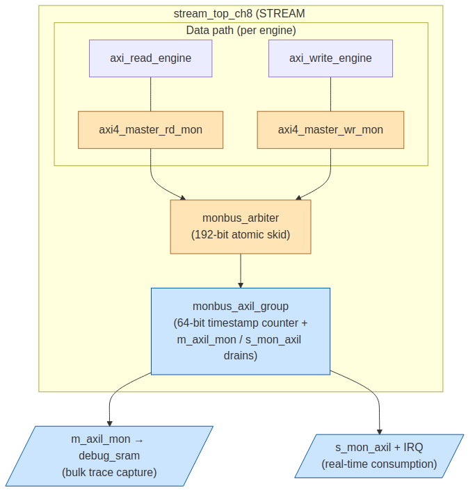

<!-- RTL Design Sherpa Documentation Header -->

<table>
<tr>
<td width="80">
  <a href="https://github.com/sean-galloway/RTLDesignSherpa">
    
  </a>
</td>
<td>
  <strong>RTL Design Sherpa</strong> · <em>Learning Hardware Design Through Practice</em><br>
  <sub>
    <a href="https://github.com/sean-galloway/RTLDesignSherpa">GitHub</a> ·
    <a href="https://github.com/sean-galloway/RTLDesignSherpa/blob/main/docs/DOCUMENTATION_INDEX.md">Documentation Index</a> ·
    <a href="https://github.com/sean-galloway/RTLDesignSherpa/blob/main/LICENSE">MIT License</a>
  </sub>
</td>
</tr>
</table>

---

# Monitor System Whitepaper

**Audience:** SoC integrators who want to deploy the AMBA monitor system in a
new design and need to know which knobs they own and how to spend them.

**Repository:** <https://github.com/sean-galloway/RTLDesignSherpa>

This paper is not a status snapshot of the current implementation — for that,
see the per-module docs under `docs/markdown/RTLAmba/shared/`
(`monbus_axil_group`, `arbiter_monbus_common`, `axi_monitor_base`, etc.) and
the integration patterns in `projects/components/bridge/` and
`projects/components/stream/`.

What this paper *does* is frame the monitor system as a *design surface*: a
fixed spine (packet format, transport, drain paths) with several explicitly
parameterizable axes that an integrator chooses per deployment. Each section
below names one such axis, describes the *current default* (what the RTL ships
with today), and sketches the *tweaks* a designer might make to fit their
tracking needs.

---

## Where the pieces live in the repo

There are too many wrapper variants to enumerate (8 × axi4, 8 × axi5,
8 × axil4, 2 × apb, ×2 with `_cg` clock-gated siblings), but at the
directory level the monitor system has a small fixed set of homes:

**`rtl/amba/includes/`**
:   The four packages — `monitor_common_pkg`, `monitor_amba4_pkg`,
    `monitor_amba5_pkg`, `monitor_arbiter_pkg` — plus the legacy
    `monitor_pkg` wrapper. Single source of truth for packet/timestamp
    widths and all event-code enums.

**`rtl/amba/shared/`**
:   Core monitor infrastructure: `axi_monitor_base`,
    `axi_monitor_reporter`, `axi_monitor_trans_mgr`,
    `axi_monitor_timeout`, `axi_monitor_addr_check`,
    `axi_monitor_filtered`, `monbus_arbiter`, `monbus_axil_group`,
    `arbiter_monbus_common`, `arbiter_{rr,wrr}_pwm_monbus`,
    `apb_monitor_addr_check`. Everything below is just per-protocol
    packaging of these.

**`rtl/amba/axi4/`, `axi5/`, `axil4/`**
:   Per-protocol monitor wrappers
    (`{master,slave}_{rd,wr}_mon{,_cg}.sv`). Each wraps the shared
    core plus a functional AXI master/slave behind one module.

**`rtl/amba/apb/`, `apb5/`**
:   `apb_monitor.sv` / `apb5_monitor.sv` — the APB equivalent. APB
    only needs one wrapper per package since a single monitor sees
    both reads and writes.

**`bin/TBClasses/monbus/`**
:   Python decoder (`parse`, `parse_stream`, `TimestampedPacket`,
    event factories). Used by every project-side TB; never inline the
    bit-shifts.

**`formal/amba/`**
:   SymbiYosys harnesses for the per-protocol monitor wrappers
    (e.g. `axi4_master_rd_mon`). Properties cover transaction
    tracking, timeout detection, addr-range, and packet-format
    invariants.

**`docs/markdown/RTLAmba/includes/`**
:   Reference docs for the four packages (this directory).

**`docs/markdown/RTLAmba/shared/`**
:   Per-module specs for the core infrastructure under
    `rtl/amba/shared/`.

### Where the system shows up in real designs

- **`projects/components/stream/`** — the STREAM DMA engine instantiates per-channel monitors on its descriptor / read / write AXI engines and aggregates everything onto a single `monbus_axil_group` that exposes both a slave-AXIL drain (for CPU/IRQ consumption) and a master-AXIL drain (for bulk-trace writes into a SoC-side capture region).
- **`projects/NexysA7/stream_characterization/`** — wraps STREAM (`stream_top_ch8`) plus an `axi_response_delay` injector and per-engine `axi_bus_meter` instances inside a harness whose `m_axil_mon` drain lands in a `debug_sram` BRAM. This is the SoC built into the Nexys A7 image used for monitor-system characterization on real hardware. See the diagram in §2.
- **`projects/components/bridge/`** — the bridge generator emits a tree of monitor wrappers at every external port and aggregates them through `monbus_arbiter` instances into a per-bridge `monbus_axil_group`. The bridge is the most heavily exercised consumer today; integration tests there are what catch most monitor-system regressions.

---

## Identity space allocation

A single monbus record is two paired wires: a 128-bit packet
(`monbus_packet`) plus a 64-bit side-band timestamp (`monbus_timestamp`),
carried atomically through every level of the transport. 192 bits total.

**`monbus_packet` field layout** (128 bits):

| Bits      | Field         | Owner        | Notes                              |
| --------- | ------------- | ------------ | ---------------------------------- |
| [127:124] | `packet_type` | enum         | Error / Completion / Threshold / Timeout / Perf / AddrMatch / APB / Debug |
| [123:109] | reserved      | —            | Emitted as zero (forward-compat slack) |
| [108:105] | `protocol`    | enum         | `PROTOCOL_AXI`, `_AXIS`, `_APB`, `_ARB`, `_CORE` |
| [104:97]  | `event_code`  | enum         | Protocol-specific event/error code |
| [96:88]   | `channel_id`  | **designer** | AXI ID or channel index — see below |
| [87:72]   | `agent_id`    | **designer** | See below                          |
| [71:64]   | `unit_id`     | **designer** | See below                          |
| [63:0]    | `event_data`  | payload      | Layout depends on (packet_type, event_code) — see below |

**`monbus_timestamp`** (64-bit side-band): free-running counter from
`monbus_axil_group`, sampled at packet emission. Treated as an opaque
ordering key by consumers.

**event_data payload examples** (most common shapes):

| packet_type      | event_code                   | event_data layout                                         | Producer                 |
| ---------------- | ---------------------------- | --------------------------------------------------------- | ------------------------ |
| Error            | `AXI_ERR_ADDR_RANGE` (8'h0D) | `[63:60]` = range_index, `[59:0]` = full matched address  | `axi_monitor_addr_check` |
| Error            | `APB_ERR_ADDR_RANGE` (8'h0D) | `[63:60]` = range_index, `[59]` = is_read, `[58:0]` = addr | `apb_monitor_addr_check` |
| Error/Timeout/Cmpl | various                    | 64-bit address or zero-extended counter / latency value   | `axi_monitor_reporter`   |
| Perf             | `AXI_PERF_*`                 | Zero-extended counter (completed/error counts, latencies) | `axi_monitor_reporter`   |

PROTOCOL / PKT_TYPE / EVENT_CODE are enums and largely fixed by the RTL
type system. **UNIT_ID, AGENT_ID, and CHANNEL_ID are the designer's to
allocate** — the three subsections below cover the conventions today and
the tweaks an integrator can apply.

### UNIT_ID

- **Current use:** simple two-value scheme inside the bridge generator --
  UNIT_ID=2 for master-side wrappers (axi4_slave_*_mon), UNIT_ID=1 for
  slave-side wrappers (axi4_master_*_mon).
- **Tweak: drop one level.** Instead of allocating UNIT_ID at the interface
  boundary, allocate it inside the unit -- each unit then gets up to 16
  internal sub-busses / sub-blocks it can independently identify, e.g. a
  scheduler with multiple internal pipelines, or an engine with separate
  source / sink / completion paths. The cost is that "which interface did
  this come from" now has to be encoded in AGENT_ID instead.
- **Tweak: hierarchical.** Top bits encode subsystem (bridge/stream/rapids),
  bottom bits encode position within that subsystem. Works when the on-chip
  monbus is aggregated at multiple levels.

### AGENT_ID

- **Current use:** `(port_idx << 4) | chan_bit` inside the bridge generator,
  where chan_bit selects write (1) vs. read (0). The bridge consumes 5 of
  the 16 bits — up to 16 ports x 2 channels — leaving the upper 11 bits
  free.
- **Tweak: per-port subagents.** When a port hosts multiple logical agents
  (e.g. a master that splits into descr / sink / source streams), use the
  upper bits for port_idx and the lower bits for subagent. Today the bridge
  generator only consumes the lower 5 bits; the upper 11 are free for
  designer use.

### CHANNEL_ID

- **Current use:** mostly 0 -- not yet exploited.
- **Tweak:** carry per-burst metadata that's useful for offline analysis,
  e.g. ARID/AWID echo for OOO debug, or a virtual-channel id for QoS work.

---

## Where to insert monitoring

- **Current default:** per-port wrappers at every bridge-top boundary. Catches
  protocol-level errors (SLVERR / DECERR / orphan / timeout) and aggregates
  on the monbus_arbiter inside the bridge.
- **Tweak: mid-fabric.** Add monitor wrappers on internal converter
  boundaries when you need to localize where a violation entered the
  fabric -- the bridge generator already supports the necessary axi4_*_mon
  variants; it just doesn't auto-instantiate them on internal boundaries.
- **Tweak: root of tree.** Skip per-port monitors entirely and place a
  single monitor at the SoC's NoC root if the integrator cares only about
  aggregate behavior. Trades resolution for area.
- **Tweak: instrumented arbiter.** The generic `arbiter_round_robin`
  module (and its weighted sibling `arbiter_round_robin_weighted`) is the
  same arbiter that's used inside the stream, bridge, and monbus paths --
  one general-purpose RR/WRR core that grants a winner from any request
  vector. With `WAIT_GNT_ACK = 0` it is a pure combinational grant
  (one-shot grant per cycle); with `WAIT_GNT_ACK = 1` it holds the
  grant asserted until the consumer drives `grant_ack`, so it composes
  cleanly with any AMBA-style valid/ready handshake. Either mode has a
  PWM-monbus instrumented variant (`arbiter_rr_pwm_monbus`,
  `arbiter_wrr_pwm_monbus`) that emits per-client occupancy / fairness /
  starvation packets on the same monbus the AXI monitors use -- so if the
  arbiter is the suspected bottleneck (head-of-line blocking, weighted
  scheduler not converging, one client starving), you get visibility
  without bolting on a separate counter block. The instrumented variants
  carry the same `USE_MONITOR` switch as the AXI wrappers below.
- **Tweak: internal-bus monitor.** Every per-protocol wrapper
  (`axi4_*_mon`, `axil4_*_mon`, `apb_monitor`, `axis_*_mon`) is the same
  module that drops onto an external port -- nothing in them depends on
  the port being SoC-visible. To monitor an internal bus (engine-to-arbiter,
  pipeline stage, internal converter output, etc.) you instantiate the
  wrapper inline on that bus and route its `monbus_packet` /
  `monbus_timestamp` into the same `monbus_arbiter` tree as everything
  else. The trans-mgr / addr-check / reporter logic doesn't care whether
  the bus it watches is "internal" or "external"; it just reports what
  it sees.
- **Important Note:** Every interface wrapper and every instrumented
  arbiter carries a `USE_MONITOR` parameter. With `USE_MONITOR = 1'b0`
  the monitor logic is eliminated at elaboration and only tie-off
  signals remain, so an integrator can pull observability out of an
  individual instance (or the whole design) by parameter alone, with no
  RTL edit.

### Worked example: `stream_char` on Nexys A7

The `stream_characterization` harness shows the "current default" topology
in a real deployment — STREAM as the DUT, an APB-controlled harness around
it, and a single `monbus_axil_group` that bulk-captures every emission into
a debug SRAM so the host can pull it back out for offline analysis. Two
diagrams: the system wiring first, then the monbus path inside the DUT.

#### System wiring



<sub>Source: [`assets/mermaid/stream_char_system.mmd`](assets/mermaid/stream_char_system.mmd) — regenerate with `mmdc -i stream_char_system.mmd -o stream_char_system.png -w 2400`.</sub>

- The **host** drives APB via UART/AXIL into the bridge xbar, which
  fans out to four memory-mapped slaves: `harness_csr` (configuration
  registers), `desc_ram` (descriptor storage the DUT reads from),
  `stream_err` (error-injection plumbing), and `debug_sram` (the
  destination for bulk MonBus trace capture).
- The xbar also masters the DUT's APB config port, which is how
  channels get kicked off.
- The DUT's **memory-side AXI** runs through `axi_response_delay`
  (deliberately injects AR/AW/R/W back-pressure for characterization)
  and is tapped by `axi_bus_meter` for per-cycle valid/ready counters.
  Neither participates in the monbus — they're side-band observers.
- The DUT's `m_axil_mon` master port writes its bulk trace records
  back into the xbar, which routes them to `debug_sram`. The
  `s_mon_axil` slave port (with IRQ) is wired in parallel for
  real-time consumption, but the smoke tests primarily exercise the
  bulk path.

#### Monbus path inside the DUT



<sub>Source: [`assets/mermaid/stream_char_dut.mmd`](assets/mermaid/stream_char_dut.mmd) — regenerate with `mmdc -i stream_char_dut.mmd -o stream_char_dut.png -w 2400`.</sub>

- **Per-engine wrappers (orange):** Each AXI engine inside the DUT is
  wrapped by a per-direction monitor (`axi4_master_rd_mon` /
  `axi4_master_wr_mon`). These watch the actual memory-facing AXI
  bus, not the internal datapath — that's where SLVERR / DECERR /
  timeout events would surface.
- **Internal arbiter (orange):** A `monbus_arbiter` inside the DUT
  collapses all per-channel monitor streams into a single channel
  for the group. Packet + timestamp travel atomically through its
  192-bit skid.
- **Group + drains (blue):** `monbus_axil_group` runs the
  free-running 64-bit timestamp counter and stamps each arrival.
  It exposes both the `m_axil_mon` master drain (bulk trace into
  `debug_sram`) and the `s_mon_axil` slave drain with IRQ
  (real-time consumption by the host).

This is the topology assumed by §2's "current default" bullet. The two
tweaks below it (mid-fabric monitors, root-of-tree only) correspond to
moving the orange boxes earlier or later in the data path.

---

## Timestamp policy

- **Current default:** monbus_axil_group runs a free-running 64-bit
  counter clocked off the **local clock domain** — so the timestamp is
  effectively a cycle count, dense at the bottom (one tick per local
  edge) and meaningless across clock domains. At today's 100 MHz that's
  ~5.8 years before wrap, which is fine for any single capture window;
  the limitation is that two captures from different domains can't be
  correlated without re-syncing. Records are 3 beats with the
  tag-bearing timestamp beat first:
  `[{tag[3:0], ts[59:0]}, pkt[127:64], pkt[63:0]]`. `tag = 4'h0` means
  "raw, no compression" (current behavior); non-zero tags are reserved
  for a future compression encoder that drops in upstream of the bulk
  writer without changing the wire framing. The endpoints (parser,
  host scripts) treat the timestamp as an opaque ordering key.
- **Tweak: global μsec upper bits.** The counter is contained entirely
  inside `monbus_axil_group`; swapping its source is a localized RTL
  change with no impact on the packet format, the arbiter, or the
  consumer-side decoder. The most common upgrade path is to feed an
  externally-provided microsecond counter into the top of the field and
  keep the local cycle counter at the bottom, e.g.
  `ts = {global_us[47:0], local_cyc[15:0]}`. Crossing the boundary needs
  a one-time CDC synchronizer at the input of the group; once latched
  there, the rest of the system stays unchanged. The split point is
  configurable per deployment — `{usec[39:0], cyc[23:0]}` is a common
  alternative when the local clock is slow enough that 24 bits of cycle
  resolution covers an interesting window.
- **Tweak: full external time source.** Some deployments want PTP /
  IEEE-1588 time end-to-end. Replace the group's internal counter
  entirely with a synchronizer onto the external time bus. Same drop-in
  point as the hybrid case; record layout stays 3 beats.
- **Tweak: hybrid global + local, formalized.** A natural extension of
  the μsec-upper-bits direction is to distribute that global counter
  to every monitor wrapper (not just the group) and have each wrapper
  attach the global time at emission rather than at drain. This gains
  cross-subsystem correlation precision (no jitter from arbiter delay)
  at the cost of broadcasting a wide bus to every wrapper. The transport
  layer still doesn't change.

---

## Drain path selection

- **Current default:** monbus_axil_group exposes two drain paths --
  - `s_mon_axil_*` (slave AXIL): IRQ-driven, slice-counter read, intended
    for CPU consumption.
  - `m_mon_axil_*` (master AXIL): bulk-trace writes to a memory region,
    intended for post-mortem capture (e.g. stream_char's debug_sram).
    Per-packet-type routing is controlled by `cfg_*_err_select`.
- **Tweak: hybrid.** Route PktTypeError + PktTypeTimeout to the IRQ path
  (mix, not flood), everything else to the bulk path. This is what
  stream_char's smoke tests already exercise.
- **Tweak: drop one path.** A deployment that only wants forensic capture
  can tie off `s_mon_axil_*` and let everything flow through the
  bulk-trace path; conversely a deployment that only cares about
  real-time alerts can tie off `m_mon_axil_*`. The group's filter logic
  cleanly handles either configuration.

---

## Packet-type filtering

- **Current default:** all per-port and group masks default to 0 (= no
  drop, no mask). Integrators selectively raise bits to suppress noise.
- **Pitfall:** enabling completion + performance packet types
  simultaneously overwhelms the bus. See
  `docs/AXI_Monitor_Configuration_Guide.md`.
- **Tweak:** profile-driven masks -- expose `pkt_mask` / `err_select` as
  CSRs on a control APB, let firmware reconfigure at runtime depending
  on whether the system is in functional-verify mode, perf-tuning mode,
  or production-quiet mode.

---

## Aggregation topology

- **Current default:** a tree of `monbus_arbiter` instances merges
  per-wrapper streams into the bridge-level monbus_axil_group input.
  Arbiter policy is round-robin with grant locking on the multi-beat
  packets.
- **Tweak: weighted.** Replace the standard arbiter with the WRR
  variant (`arbiter_wrr_pwm_monbus`) when one wrapper is known to be
  much higher-volume than others (e.g. a 512b sink path vs. a 32b
  config-CPU read path) and the integrator wants to bound starvation
  on the low-volume side.
- **Tweak: protocol partitioning.** Use separate monbus_axil_group
  instances per protocol family (one for AXI, one for AXIS) when the
  group's filter masks aren't enough -- e.g. when each protocol has its
  own consumer FIFO budget. The bridge generator already supports the
  monbus_axis_group sibling.

---

## Test, characterization, and verification

The monitor system is exercised at four distinct levels, each catching a
different class of bug. Integrators rolling out a new deployment should be
aware of all four — the first three are required to ship; the fourth is
where real-world numbers come from.

### Unit-level cocotb tests

**Where:** `val/amba/test_axi4_*_mon.py`, `val/amba/test_apb_monitor.py`,
`projects/components/{stream,bridge,rapids}/dv/tests/`.

Each per-protocol wrapper has a directed cocotb test that drives the
functional bus, injects faults (SLVERR / DECERR / orphan / range
violation / starve-the-handshake), and asserts that the expected packets
arrive on `monbus_packet` / `monbus_timestamp` with the right
`(packet_type, event_code, agent_id)`. The Python decoder in
`bin/TBClasses/monbus/` (`from TBClasses.monbus import parse,
parse_stream`) is the canonical reader — never inline the bit-shifts in
a TB, since the packet layout has been migrated once already and the
decoder is the single point of update.

Run pattern (always source `env_python` first, which sets
`SIM=verilator`):

```
source env_python
cd val/amba
pytest -v test_axi4_master_rd_mon.py
```

### Error-injection integration tests

**Where:** `projects/components/bridge/dv/tests/test_bridge_*_monitor_error_inject*.py`.

These wire up a real bridge instance with multiple monitor wrappers, drive
a randomized traffic mix from the AXI master BFM, and have the slave BFM
return SLVERR / DECERR responses on selected transactions. The assertion
is that **every injected fault produces exactly one matching monbus
packet at the right agent_id** — orphan packets, double-counting, or
silently-dropped errors all fail the test. This is the level where most
monitor-system regressions actually get caught, because it exercises the
arbiter, the group, and the drain path under realistic backpressure.

The pattern works equally well for STREAM and RAPIDS — the SLVERR
injection harness in `bridge/dv/` is the canonical example.

### Formal proofs

**Where:** `formal/amba/{axi4,axi5,axil4}_{master,slave}_{rd,wr}_mon/`.

SymbiYosys harnesses prove the per-wrapper invariants: transaction
tracking never loses an ID, timeout counters bound the response window,
addr_check emits exactly one packet per range hit, the packet format
satisfies its bit-allocation constraints. These are cheap to re-run on
every RTL change and catch the class of bug where simulation didn't
happen to hit the right interleaving:

```
source env_python
cd formal/amba/axi4_master_rd_mon
sby -f formal_axi4_master_rd_mon.sby
```

### Hardware characterization

**Where:** `projects/NexysA7/stream_characterization/`.

The simulation tests prove correctness; characterization on the FPGA
proves the monitor system survives realistic timing closure, sustained
throughput, and burst patterns the simulators don't reach. The
`stream_char` harness diagrammed in §2 captures every monbus emission
into `debug_sram` during a deterministic workload, the host pulls the
trace back, and the offline parser (`bin/TBClasses/monbus`) reconstructs
the timing profile. Useful when you want to answer:

- **How fast can the bulk drain absorb?** Packets/sec on `m_axil_mon`
  before the group's ingress skid back-pressures.
- **What's the IRQ rate under a realistic error budget?** Records/sec
  on `s_mon_axil` with a representative fault-injection profile.
- **Does the timestamp counter actually run at the expected cycle
  rate?** Cross-check the delta between successive timestamps against
  the known workload spacing.

This is also where post-route SDC checks for the monbus paths live —
the `axi_response_delay` and `axi_bus_meter` blocks are deliberately
placed to stress the timing on both the AXI data path and the monitor
output paths simultaneously.

### Validation checklist for new deployments

A new integration that touches the monitor system should not ship until:

- [ ] Per-wrapper cocotb tests pass with the deployment's parameter set
  
      (especially `N_ADDR_RANGES`, `MAX_TRANSACTIONS`, `USE_MONITOR`).
- [ ] One error-injection integration test exists at the
  
      bridge/subsystem level that confirms a SLVERR / DECERR / timeout
      actually round-trips end-to-end through the deployment-specific
      monbus tree.
- [ ] The formal proofs for the wrappers in use still pass after any
  
      parameter change.
- [ ] If a hardware target exists (FPGA / ASIC), a characterization
  
      run on representative workload has been captured at least once
      so the team has baseline numbers to compare against later.

---

## TODO (writing-up checklist)

- [ ] Pull representative numbers from a real `stream_char` deployment
  
      on Nexys A7 for §7.4 — packets/sec on bulk path, IRQ rate on err
      path, timestamp-delta vs expected workload spacing.
- [ ] Add an "after tweak" diagram next to §2's "current default"
  
      example, showing what mid-fabric or root-of-tree placement looks
      like for the same workload.
- [ ] Cross-link each section to the relevant per-module spec under
  
      `docs/markdown/RTLAmba/shared/` (most are linked already; sweep
      for stragglers).
- [ ] Expand §3 into its own appendix once a hybrid-global timestamp
  
      scheme has been prototyped on real silicon — pin down which clock
      domain the global counter actually lives on, and the CDC
      synchronizer choice.

---

**Maintained By:** RTL Design Sherpa Project
**Review Frequency:** As architectural decisions evolve
