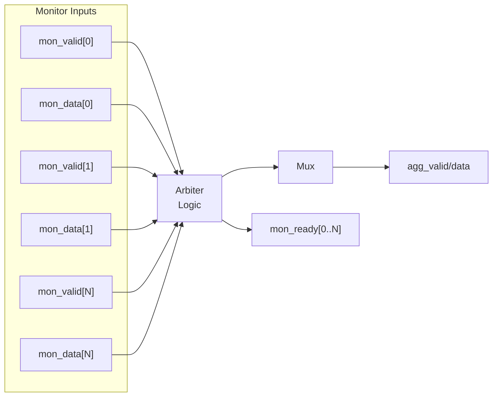

<!-- RTL Design Sherpa Documentation Header -->
<table>
<tr>
<td width="80">
  
</td>
<td>
  <strong>RTL Design Sherpa</strong> · <em>Learning Hardware Design Through Practice</em> 
  
    <a href="https://github.com/sean-galloway/RTLDesignSherpa">GitHub</a> ·
    <a href="https://github.com/sean-galloway/RTLDesignSherpa/blob/main/docs/DOCUMENTATION_INDEX.md">Documentation Index</a> ·
    <a href="https://github.com/sean-galloway/RTLDesignSherpa/blob/main/LICENSE">MIT License</a>
  
</td>
</tr>
</table>

---

<!-- End Header -->

# Monitor Bus Arbiter Common

**Module:** `arbiter_monbus_common.sv`
**Location:** `rtl/amba/shared/`
**Category:** Core Infrastructure
**Status:** ✅ Production Ready

---

## Overview

The `arbiter_monbus_common` module provides Base infrastructure for monitor bus arbitration.

This is a **shared infrastructure module** used internally by AXI/AXIL monitors. It is not typically instantiated directly by users but is critical for understanding the monitor architecture.

---

## Key Features

- ✅ **Shared arbitration logic for multiple monitor sources:** Shared arbitration logic for multiple monitor sources
- ✅ **Fair access to monitor bus bandwidth:** Fair access to monitor bus bandwidth
- ✅ **Packet multiplexing with source identification:** Packet multiplexing with source identification
- ✅ **Backpressure handling and flow control:** Backpressure handling and flow control
- ✅ **Configurable arbitration policy support:** Configurable arbitration policy support
- ✅ **Grant tracking and fairness enforcement:** Grant tracking and fairness enforcement

---

## Module Purpose

The `arbiter_monbus_common` module is the core building block for:

1. **Fair Arbitration:** Prevents starvation with round-robin or weighted policies
2. **Source Multiplexing:** Combines multiple monitor streams
3. **Backpressure Management:** Handles flow control from downstream
4. **Grant Tracking:** Maintains fairness across arbitration cycles
5. **Scalable Design:** Supports configurable number of sources

---

## Parameters

| Parameter | Type | Default | Description |
|-----------|------|---------|-------------|
| `N` | int | 4 | Number of monitor sources to arbitrate |
| `DATA_WIDTH` | int | 64 | Monitor packet width |

---

## Port Groups

**See RTL source:** `rtl/amba/shared/arbiter_monbus_common.sv` for complete port listing.

Key interface groups:
- Clock and reset
- Input signals from monitored interface
- Configuration signals
- Output signals to downstream logic

---

## Architecture

Arbitration policies supported:
- Round-robin (fair)
- Weighted round-robin (QoS)
- Priority-based (critical first)

---

## Usage in Monitor System

This module is used by:

- **arbiter_rr_pwm_monbus**
- **arbiter_wrr_pwm_monbus**

### Internal Integration

This module is instantiated automatically within higher-level monitor modules. Users configure behavior through top-level monitor parameters.

---

## Configuration Guidelines

**See individual monitor documentation for configuration examples.**

Configuration is typically handled at the top-level monitor instantiation.

---

## Performance Characteristics

| Metric | Value | Notes |
|--------|-------|-------|
| Latency | 1-2 cycles | Typical processing delay |
| Throughput | 1 operation/cycle | Maximum rate |
| Resource Usage | Varies | Depends on configuration |

---

## Verification Considerations

### Test Coverage

- Functional correctness of core logic
- Boundary conditions (min/max values)
- Error handling and recovery
- Interface protocol compliance

**See:** `val/amba/test_arbiter_monbus_common.py` for verification tests

---

## Related Modules

- **[axi_monitor_reporter](./axi_monitor_reporter.md)**

---

## See Also

- **Monitor Architecture:** `docs/markdown/RTLAmba/overview.md`
- **Monitor Configuration Guide:** `docs/AXI_Monitor_Configuration_Guide.md`
- **Packet Format Specification:** `docs/markdown/RTLAmba/includes/monitor_package_spec.md`

---

## Navigation

- **[← Back to Shared Infrastructure Index](./README.md)**
- **[← Back to RTLAmba Index](../index.md)**
- **[← Back to Main Documentation Index](../../index.md)**
