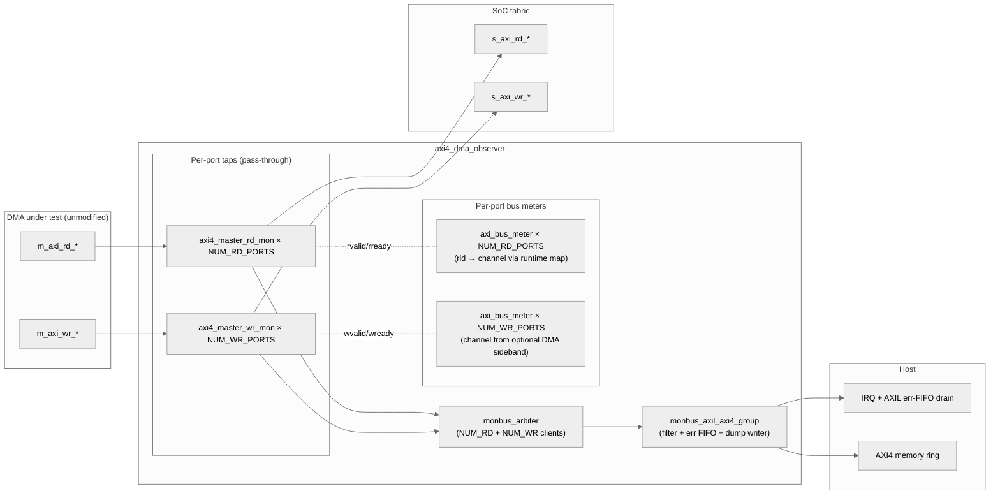

<!-- RTL Design Sherpa Documentation Header -->
<table>
<tr>
<td width="80">
  <a href="https://github.com/sean-galloway/RTLDesignSherpa">
    
  </a>
</td>
<td>
  <strong>RTL Design Sherpa</strong> · <em>Learning Hardware Design Through Practice</em><br>
  <sub>
    <a href="https://github.com/sean-galloway/RTLDesignSherpa">GitHub</a> ·
    <a href="https://github.com/sean-galloway/RTLDesignSherpa/blob/main/docs/DOCUMENTATION_INDEX.md">Documentation Index</a> ·
    <a href="https://github.com/sean-galloway/RTLDesignSherpa/blob/main/LICENSE">MIT License</a>
  </sub>
</td>
</tr>
</table>

---

<!-- End Header -->

# AXI4 DMA Observer

**Modules:**
- `axi4_dma_observer.sv` — standalone, DMA-agnostic observability wrapper
- `axi_bus_meter.sv` — per-cycle valid/ready bucket counter (used inside the observer; also instantiable standalone)

**Location:** `rtl/amba/shared/`
**Category:** Observability / Characterization
**Status:** Production Ready

---

## Overview

`axi4_dma_observer` is a **drop-in, DMA-agnostic** observability harness
that snaps onto any AXI4-master DMA's external pins and produces:

- an **error / interrupt FIFO** drained over an AXI-Lite slave-read port
- a **bulk-trace memory dump** over an AXI4-burst master-write port
  (raw or compressed via `monbus_compressor`)
- per-port **valid/ready bucket counters** (productive / backpressure /
  starvation / idle) via `axi_bus_meter`, with optional per-channel
  attribution

The DMA under test is **not modified**. The observer sits inline
between the DMA's AXI master pins and the fabric; from the DMA's
perspective it's a transparent skid stage. From the fabric's
perspective it's the DMA's master port, one register stage later.

This is the **external / non-intrusive** counterpart to the
`axi_monitor_*` family — those wrap a specific DMA's interfaces from
inside the DMA. The observer wraps from outside, so the same shape
works for STREAM, RAPIDS, third-party DMAs, or anything else with an
AXI4 master port.

---

## Architecture



Pass-through latency = the existing `_mon` wrapper's skid stage. The
observer adds **no new combinational depth** in the AXI path.

---

## What's inside

| Sub-module | Role |
|---|---|
| `axi4_master_rd_mon` × `NUM_RD_PORTS` | Read-side tap: pass-through skid + transaction monitor that emits a monbus packet on each event |
| `axi4_master_wr_mon` × `NUM_WR_PORTS` | Write-side tap (same pattern) |
| `monbus_arbiter` (CLIENTS = NUM_RD + NUM_WR) | Merges the per-port monbus streams into one |
| `monbus_axil_axi4_group` | Central filter + err FIFO (AXIL slave-read) + bulk-trace dump (AXI4 burst master-write) — see [`monbus_group.md`](monbus_group.md) |
| `axi_bus_meter` × `NUM_RD_PORTS + NUM_WR_PORTS` | Per-cycle valid/ready bucket counters (productive / backpressure / starvation / idle) — gated by `ENABLE_BUS_METER` |

---

## Parameters

| Parameter | Default | Notes |
|---|---|---|
| `NUM_RD_PORTS` | 1 | Number of AXI4 read master ports to tap |
| `NUM_WR_PORTS` | 1 | Number of AXI4 write master ports to tap |
| `ADDR_WIDTH` | 32 | Address width on all tap ports + the observer's own dump port |
| `DATA_WIDTH` | 128 | DMA data-bus width |
| `AXI_ID_WIDTH` | 8 | DMA AXI ID width |
| `AXI_USER_WIDTH` | 1 | DMA AXI USER width |
| `OBS_AXI_ID_WIDTH` | 4 | Observer's own dump-port (m_axi_*) AXI ID width |
| `MAX_BURST_BEATS` | 64 | Maximum beats per dump-port AW (AXI4 max is 256) |
| `FIFO_DEPTH_ERR` | 64 | Err FIFO depth (records) |
| `FIFO_DEPTH_WRITE` | 96 | Write FIFO depth (beats) |
| `FLUSH_TIMEOUT_CYCLES` | 1024 | Cycles before timeout-driven flush |
| `USE_COMPRESSION` | 0 | 0 omits the compressor; 1 elaborates it for runtime selection via `cfg_compress_en` |
| `MAX_TRANSACTIONS` | 16 | Per-tap monitor transaction-table depth |
| `UNIT_ID` | `8'h10` | UNIT_ID stamped into emitted monbus packets |
| `ENABLE_BUS_METER` | 1 | 0 ties all bus-meter outputs to 0 |
| `NUM_CHANNELS` | 1 | 1 = aggregate-only buckets; > 1 = per-channel attribution |

---

## Port surface

The observer's port list splits into four groups:

1. **Per-port read taps** (`dma_rd_*` from DMA, `fab_rd_*` to fabric).
   Sized `[NUM_RD_PORTS-1:0]` on every signal so a single instance can
   tap multiple AXI4 read masters.
2. **Per-port write taps** (`dma_wr_*` / `fab_wr_*`), shape mirrored.
3. **Observer outputs** (`s_axil_*` for the IRQ-drain port, `m_axi_*`
   for the bulk-dump port, `irq_out`).
4. **Configuration** (address window, flush watermark, per-protocol
   filter masks — see [`monbus_group.md`](monbus_group.md) for the full
   filter description).
5. **Bus-meter controls and outputs** (clear/freeze inputs, rid →
   channel map, per-port bucket counter outputs).

The leaf-level `cfg_axi_*_mask` inputs on each `axi4_master_*_mon`
are tied to 0 inside the observer — leaves do not pre-filter; all
filtering happens centrally in `monbus_axil_axi4_group`. The 25
`cfg_<proto>_*` inputs at the observer top are the single point of
control.

---

## `axi_bus_meter` integration

Each tapped port instantiates an `axi_bus_meter` that classifies each
cycle on the data channel (R for reads, W for writes) into one of
four buckets:

| valid | ready | bucket | meaning |
|---|---|---|---|
| 1 | 1 | productive | beat delivered |
| 1 | 0 | backpressure | master wants to send, slave stalls |
| 0 | 1 | starvation | slave ready, master not producing |
| 0 | 0 | idle | both quiet |

Counters: 32-bit aggregate per port (4 buckets), plus 16-bit
per-channel × NUM_CHANNELS × 4 buckets, with per-channel overflow
stickies.

### Read-side channel attribution: runtime `rid` → channel map

AXI4 R beats carry `rid`. For each rd port, the observer takes a
runtime signal-list mapping:

```systemverilog
input cfg_rd_rid_per_channel       [NUM_RD_PORTS][NUM_CHANNELS]  // AXI_ID_WIDTH each
input cfg_rd_rid_per_channel_valid [NUM_RD_PORTS][NUM_CHANNELS]  // 1 bit each
```

For channel index `N` on port `P`, the user writes the expected `rid`
into `cfg_rd_rid_per_channel[P][N]` and asserts the matching
`_valid[P][N]`. When an R beat arrives with `rvalid=1`, the observer
priority-encodes the lookup (first match wins) and feeds the result
to the bus_meter as `i_channel_id` + `i_channel_valid`. No match →
the cycle still counts in aggregate but not in any per-channel
bucket.

### Write-side channel attribution: optional sideband

AXI4 W beats **carry no AXI ID**. Per-channel attribution requires a
sideband from the DMA's W-phase FSM. The observer takes optional
inputs:

```systemverilog
input dma_wr_active_ch_id    [NUM_WR_PORTS][CW]  // channel index
input dma_wr_active_ch_valid [NUM_WR_PORTS]      // sideband valid
```

DMAs that expose this (e.g. STREAM's `axi_write_engine` drives
`o_active_channel_id` / `o_active_channel_valid` from its W-phase FSM)
wire directly. DMAs without it: tie both to 0; only the aggregate
counters tick.

### Outputs

Per port (rd or wr):
- `*_meter_agg_productive / backpressure / starvation / idle` — 32-bit aggregate counters
- `*_meter_ch_productive / backpressure / starvation / idle` — 16-bit per-channel arrays of size NUM_CHANNELS
- `*_meter_ch_overflow` — NUM_CHANNELS × 4 sticky bits (any per-channel counter wrapped)

The caller exposes these to software either by direct probe or via a
custom register block — the observer doesn't include its own
register-map decoder.

---

## Pass-through correctness

For each tapped port pair, the observer's job on the AXI path is to
forward every channel signal end-to-end with one register stage of
skid latency. The test
[`val/amba/test_axi4_dma_observer.py`](../../../../val/amba/test_axi4_dma_observer.py)
covers this directly in Phases 1 and 2:

- Phase 1 issues a fixed sequence of single-beat reads from the DMA
  side; the fabric-side responder captures every AR and the DMA-side
  receiver captures every R. Addresses, IDs, and data round-trip
  byte-exact.
- Phase 2 mirrors the check for the write path: AW + W (data + strb +
  last) + B all match end-to-end.

Phase 3 then asserts that monbus dump beats actually appear on the
observer's own `m_axi_w*` port after real DMA traffic has been
observed (i.e. the filter + arbiter + group + writer chain is
actually plumbed correctly).

Phase 4 asserts the bus-meter aggregate counters are non-zero after
the smoke-test traffic.

---

## Test

```bash
pytest val/amba/test_axi4_dma_observer.py -v
```

Default smoke-test parameters: `NUM_RD_PORTS=1`, `NUM_WR_PORTS=1`,
`AXI_ID_WIDTH=4`, `NUM_CHANNELS=8`, `MAX_BURST_BEATS=64`,
`USE_COMPRESSION=0`. Bus-meter inputs are exercised
(`cfg_rd_rid_per_channel` set up as identity for the first 8 channels;
write-side sideband tied to 0 — aggregate-only on the W side).

Multi-port and protocol-variant coverage is future work.

---

## Related Modules

| Module | Role |
|---|---|
| [`axi_monitor_base`](axi_monitor_base.md) | Per-transaction monitor used inside each `axi4_master_*_mon` tap |
| [`axi_monitor_reporter`](axi_monitor_reporter.md) | The dispatcher + 6 packet-type sub-blocks that emit monbus packets |
| [`monbus_arbiter`](monbus_arbiter.md) | Merges per-tap monbus streams |
| [`monbus_group` family](monbus_group.md) | Central filter + dump writer (this observer uses the AXIL/AXI4 variant) |
| [`monbus_compressor`](monbus_compressor.md) | Bulk-trace encoder (instantiated when `USE_COMPRESSION=1`) |
| `axi4_master_rd_mon` / `axi4_master_wr_mon` | The per-port skid + monitor wrappers the observer instantiates |
