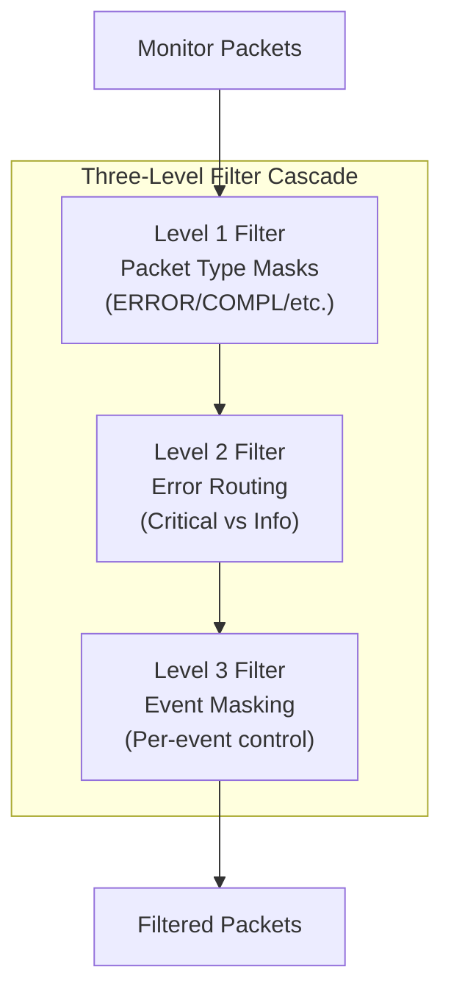

<!-- RTL Design Sherpa Documentation Header -->
<table>
<tr>
<td width="80">
  <a href="https://github.com/sean-galloway/RTLDesignSherpa">
    
  </a>
</td>
<td>
  <strong>RTL Design Sherpa</strong> · <em>Learning Hardware Design Through Practice</em><br>
  <sub>
    <a href="https://github.com/sean-galloway/RTLDesignSherpa">GitHub</a> ·
    <a href="https://github.com/sean-galloway/RTLDesignSherpa/blob/main/docs/DOCUMENTATION_INDEX.md">Documentation Index</a> ·
    <a href="https://github.com/sean-galloway/RTLDesignSherpa/blob/main/LICENSE">MIT License</a>
  </sub>
</td>
</tr>
</table>

---

<!-- End Header -->

# AXI Monitor Filtered

**Module:** `axi_monitor_filtered.sv`
**Location:** `rtl/amba/shared/`
**Category:** Core Infrastructure
**Status:** ✅ Production Ready

---

## Overview

The `axi_monitor_filtered` module provides 3-level packet filtering for monitor bus traffic management.

This is a **shared infrastructure module** used internally by AXI/AXIL monitors. It is not typically instantiated directly by users but is critical for understanding the monitor architecture.

---

## Key Features

- ✅ **Level 1:** Packet type masks (error/completion/timeout/perf/debug)
- ✅ **Level 2:** Error routing priorities (critical vs informational)
- ✅ **Level 3:** Individual event masking (per-event granularity)
- ✅ **Configuration conflict detection and warnings:** Configuration conflict detection and warnings
- ✅ **Packet statistics and drop counters:** Packet statistics and drop counters
- ✅ **Bypass mode for full pass-through:** Bypass mode for full pass-through

---

## Module Purpose

The `axi_monitor_filtered` module is the core building block for:

1. **Traffic Management:** Reduces monitor bus congestion through intelligent filtering
2. **Prioritization:** Routes critical errors while filtering informational events
3. **Configuration Validation:** Detects conflicting filter settings
4. **Flexibility:** Supports per-packet-type and per-event granular control

---

## Parameters

| Parameter | Type | Default | Description |
|-----------|------|---------|-------------|
| `ENABLE_FILTERING` | bit | 1 | Master enable for filtering |
| `ADD_PIPELINE_STAGE` | bit | 0 | Add register stage for timing |

---

## Port Groups

### Monitor Bus Input

| Port | Direction | Width | Description |
|------|-----------|-------|-------------|
| `i_monbus_valid` | Input | 1 | Input packet valid |
| `i_monbus_ready` | Output | 1 | Input packet ready |
| `i_monbus_packet` | Input | 64 | Input monitor packet |

### Monitor Bus Output

| Port | Direction | Width | Description |
|------|-----------|-------|-------------|
| `o_monbus_valid` | Output | 1 | Output packet valid |
| `o_monbus_ready` | Input | 1 | Output packet ready |
| `o_monbus_packet` | Output | 64 | Filtered monitor packet |

### Filter Configuration

| Port | Direction | Width | Description |
|------|-----------|-------|-------------|
| `cfg_pkt_type_mask` | Input | 6 | Packet type enable mask (ERROR/COMPL/TIMEOUT/THRESH/PERF/DEBUG) |
| `cfg_error_routing` | Input | 4 | Error priority routing configuration |
| `cfg_event_mask` | Input | 16 | Individual event enable mask |

---

## Architecture



Three-level filtering cascade provides maximum flexibility while minimizing resource usage.

---

## Usage in Monitor System

This module is used by:

- **axi4_master_rd_mon**
- **axi4_master_wr_mon**
- **axi4_slave_rd_mon**
- **axi4_slave_wr_mon**

### Internal Integration

This module is instantiated automatically within higher-level monitor modules. Users configure behavior through top-level monitor parameters.

---

## Configuration Guidelines

### Filter Strategy

**Functional Verification (Default):**
```systemverilog
.cfg_pkt_type_mask(6'b000111)  // ERROR + COMPL + TIMEOUT only
```

**Performance Analysis:**
```systemverilog
.cfg_pkt_type_mask(6'b010001)  // ERROR + PERF only
```

**Debug Mode:**
```systemverilog
.cfg_pkt_type_mask(6'b111111)  // All packet types
```

**Critical Errors Only:**
```systemverilog
.cfg_pkt_type_mask(6'b000001)  // ERROR packets only
.cfg_error_routing(4'b0001)     // Critical errors only
```

---

## Performance Characteristics

| Metric | Value | Notes |
|--------|-------|-------|
| Filtering Latency | 0-1 cycles | Combinatorial (0) or registered (1) |
| Throughput | 1 packet/cycle | No backpressure introduced |
| Resource Usage | ~100 LUTs | Minimal overhead |

---

## Verification Considerations

### Key Test Scenarios

1. **Filter Masking:**
   - Send all packet types
   - Configure masks to allow/block each type
   - Verify correct filtering behavior

2. **Configuration Conflicts:**
   - Set conflicting enables (e.g., `cfg_compl_enable=1` but type mask blocks completions)
   - Verify warning/error detection

3. **Packet Integrity:**
   - Verify filtered packets are not modified (only dropped or passed)
   - Check backpressure handling

---

## Related Modules

- **[axi_monitor_base](./axi_monitor_base.md)**

---

## See Also

- **Monitor Architecture:** `docs/markdown/RTLAmba/overview.md`
- **Monitor Configuration Guide:** `docs/AXI_Monitor_Configuration_Guide.md`
- **Packet Format Specification:** `docs/markdown/RTLAmba/includes/monitor_package_spec.md`

---

## Navigation

- **[← Back to Shared Infrastructure Index](./README.md)**
- **[← Back to RTLAmba Index](../index.md)**
- **[← Back to Main Documentation Index](../../index.md)**
