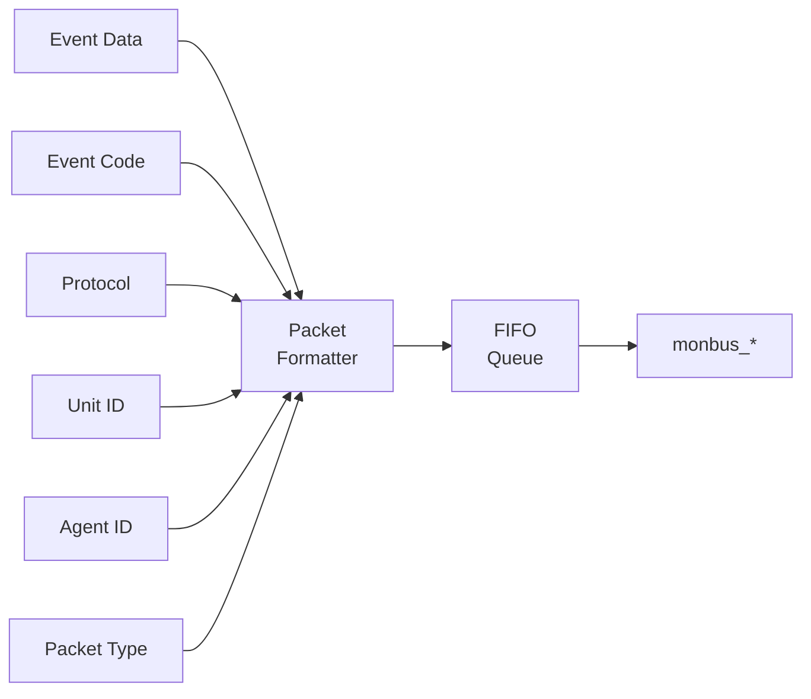

<!-- RTL Design Sherpa Documentation Header -->
<table>
<tr>
<td width="80">
  
</td>
<td>
  <strong>RTL Design Sherpa</strong> · <em>Learning Hardware Design Through Practice</em> 
  
    <a href="https://github.com/sean-galloway/RTLDesignSherpa">GitHub</a> ·
    <a href="https://github.com/sean-galloway/RTLDesignSherpa/blob/main/docs/DOCUMENTATION_INDEX.md">Documentation Index</a> ·
    <a href="https://github.com/sean-galloway/RTLDesignSherpa/blob/main/LICENSE">MIT License</a>
  
</td>
</tr>
</table>

---

<!-- End Header -->

# AXI Monitor Reporter

**Module:** `axi_monitor_reporter.sv`
**Location:** `rtl/amba/shared/`
**Category:** Core Infrastructure
**Status:** ✅ Production Ready

---

## Overview

The `axi_monitor_reporter` module provides Monitor bus packet formatting and generation.

This is a **shared infrastructure module** used internally by AXI/AXIL monitors. It is not typically instantiated directly by users but is critical for understanding the monitor architecture.

---

## Key Features

- ✅ **128-bit standardized `monitor_packet_t` formatting**
- ✅ **Packet type encoding (ERROR/COMPL/TIMEOUT/PERF/DEBUG):** Packet type encoding (ERROR/COMPL/TIMEOUT/PERF/DEBUG)
- ✅ **Protocol identification (AXI/APB/AXIS):** Protocol identification (AXI/APB/AXIS)
- ✅ **Event code and data field population:** Event code and data field population
- ✅ **Unit ID and Agent ID insertion:** Unit ID and Agent ID insertion
- ✅ **Packet valid/ready handshaking:** Packet valid/ready handshaking
- ✅ **Internal FIFO for packet queuing:** Internal FIFO for packet queuing

---

## Module Purpose

The `axi_monitor_reporter` module is the core building block for:

1. **Packet Formatting:** Encodes events into 128-bit `monitor_packet_t` format
2. **Protocol Identification:** Tags packets with AXI/APB/AXIS protocol info
3. **Routing Information:** Inserts Unit ID and Agent ID for downstream routing
4. **Queuing:** Buffers packets when downstream is not ready
5. **Handshaking:** Manages valid/ready flow control

---

## Parameters

| Parameter | Type | Default | Description |
|-----------|------|---------|-------------|
| `UNIT_ID` | logic [7:0] | 8'h01 | 8-bit unit identifier |
| `AGENT_ID` | logic [15:0] | 16'h000A | 16-bit agent identifier |
| `FIFO_DEPTH` | int | 8 | Reporter packet FIFO depth |

---

## Port Groups

**See RTL source:** `rtl/amba/shared/axi_monitor_reporter.sv` for complete port listing.

Key interface groups:
- Clock and reset
- Input signals from monitored interface
- Configuration signals
- Output signals to downstream logic

---

## Architecture

**Packet Format (128-bit `monitor_packet_t`):**
| Bits | Width | Field |
|------|-------|-------|
| [127:124] | 4   | Packet Type (error / completion / timeout / perf / etc.) |
| [123:109] | 15  | Reserved (forward-compat slack) |
| [108:105] | 4   | Protocol (AXI / AXIS / APB / ARB / CORE) |
| [104:97]  | 8   | Event Code (protocol-specific) |
| [96:88]   | 9   | Channel ID (AXI ID or channel index) |
| [87:72]   | 16  | Agent ID |
| [71:64]   | 8   | Unit ID |
| [63:0]    | 64  | Event Data (full address, latency, counter value, etc.) |

The reporter drives `monbus_packet` (128b) and `monbus_timestamp` (64b)
together so the side-band timestamp travels paired with each packet through
the arbiter and into `monbus_axil_group`.

---

## Usage in Monitor System

This module is used by:

- **axi_monitor_base**

### Internal Integration

This module is instantiated automatically within higher-level monitor modules. Users configure behavior through top-level monitor parameters.

---

## Configuration Guidelines

**See individual monitor documentation for configuration examples.**

Configuration is typically handled at the top-level monitor instantiation.

---

## Performance Characteristics

| Metric | Value | Notes |
|--------|-------|-------|
| Latency | 1-2 cycles | Typical processing delay |
| Throughput | 1 operation/cycle | Maximum rate |
| Resource Usage | Varies | Depends on configuration |

---

## Verification Considerations

### Test Coverage

- Functional correctness of core logic
- Boundary conditions (min/max values)
- Error handling and recovery
- Interface protocol compliance

**See:** `val/amba/test_axi_monitor_reporter.py` for verification tests

---

## Related Modules

- **[axi_monitor_base](./axi_monitor_base.md)**
- **[arbiter_monbus_common](./arbiter_monbus_common.md)**

---

## See Also

- **Monitor Architecture:** `docs/markdown/RTLAmba/overview.md`
- **Monitor Configuration Guide:** [Monitor Base Configuration](./axi_monitor_base.md)
- **Packet Format Specification:** `docs/markdown/RTLAmba/includes/monitor_package_spec.md`

---

## Navigation

- **[← Back to Shared Infrastructure Index](./README.md)**
- **[← Back to RTLAmba Index](../index.md)**
- **[← Back to Main Documentation Index](../../index.md)**
