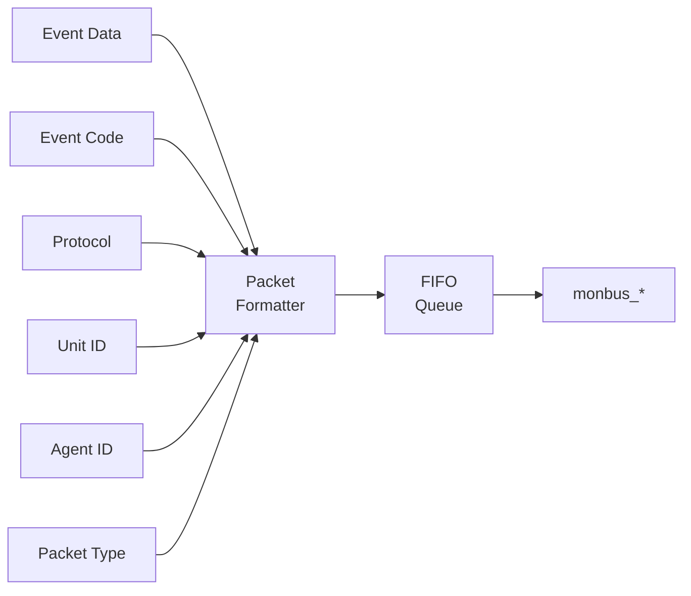

<!-- RTL Design Sherpa Documentation Header -->
<table>
<tr>
<td width="80">
  
</td>
<td>
  <strong>RTL Design Sherpa</strong> · <em>Learning Hardware Design Through Practice</em> 
  
    <a href="https://github.com/sean-galloway/RTLDesignSherpa">GitHub</a> ·
    <a href="https://github.com/sean-galloway/RTLDesignSherpa/blob/main/docs/DOCUMENTATION_INDEX.md">Documentation Index</a> ·
    <a href="https://github.com/sean-galloway/RTLDesignSherpa/blob/main/LICENSE">MIT License</a>
  
</td>
</tr>
</table>

---

<!-- End Header -->

# AXI Monitor Reporter (Dispatcher + 6 Sub-blocks)

**Modules:**
- `axi_monitor_reporter.sv` — thin top-level dispatcher
- `axi_monitor_reporter_error.sv` — error-packet detection (combinational)
- `axi_monitor_reporter_timeout.sv` — timeout-packet detection (combinational)
- `axi_monitor_reporter_compl.sv` — completion-packet detection (combinational)
- `axi_monitor_reporter_threshold.sv` — threshold-packet detection (16 latency flops + edge flags)
- `axi_monitor_reporter_perf.sv` — performance-packet generation (counters + 5-state FSM)
- `axi_monitor_reporter_debug.sv` — debug-packet generation

**Location:** `rtl/amba/shared/`
**Category:** Core Infrastructure
**Status:** Production Ready (refactored to sub-blocks 2026-06-06)

---

## Overview

The `axi_monitor_reporter` family generates Monitor-bus packets. The
top-level `axi_monitor_reporter.sv` is a **thin dispatcher** that
multiplexes one packet stream out of (up to) six packet-type-specific
sub-blocks into the shared monbus FIFO and 128-bit output register. It
also reports each emitted event back to `axi_monitor_trans_mgr` so the
transaction table can release entries.

Per-packet-type detection lives in the six sub-blocks. The dispatcher
gates each sub-block via an `ENABLE_*_LOGIC` parameter, so integrators
can drop any combination at elaboration time and pay zero LUT/FF cost
for the unused detection cones.

> The bridge case (`ENABLE_ERROR_LOGIC=1`, all others `0`) drops
> roughly 70% of the reporter's LUT/FF.

---

## Key Features

- 128-bit standardized `monitor_packet_t` formatting (via package helpers)
- Packet type multiplexing across six sub-blocks (error / timeout /
  compl / threshold / perf / debug) with per-type elaboration gates
- Protocol identification (AXI4, AXI5, APB, AXIS, CORE)
- Event code and data field population from the active sub-block
- Unit ID and Agent ID insertion (caller-configured constants)
- Packet valid/ready handshaking
- Internal monbus FIFO for packet queuing
- Event-reported feedback to `axi_monitor_trans_mgr` (closes the
  transaction-table loop documented in FIX-001)

---

## Sub-blocks

| Sub-block | Gate parameter | Generates `pkt_type` | Logic shape |
|---|---|---|---|
| `axi_monitor_reporter_error` | `ENABLE_ERROR_LOGIC` | `PktTypeError` | combinational |
| `axi_monitor_reporter_timeout` | `ENABLE_TIMEOUT_LOGIC` | `PktTypeTimeout` | combinational |
| `axi_monitor_reporter_compl` | `ENABLE_COMPL_LOGIC` | `PktTypeCompletion` | combinational |
| `axi_monitor_reporter_threshold` | `ENABLE_THRESHOLD_LOGIC` | `PktTypeThreshold` | 16 latency flops + edge detect |
| `axi_monitor_reporter_perf` | `ENABLE_PERF_LOGIC` (alias `ENABLE_PERF_PACKETS`) | `PktTypePerf` | window counters + 5-state FSM |
| `axi_monitor_reporter_debug` | `ENABLE_DEBUG_LOGIC` (default `0`) | `PktTypeDebug` | event-encoded debug points |

Each sub-block presents the same "raise a request with packet payload"
contract to the dispatcher, which arbitrates and pipes the winner into
the FIFO. None of them are intended to be instantiated directly by
integrators — they are private to the reporter family.

---

## Module Purpose

The reporter dispatcher provides:

1. **Per-type detection gating** — only the enabled sub-blocks consume
   LUT/FF, so a single-purpose deployment (e.g. error-only on the
   bridge) is lean.
2. **Packet formatting** — pulls type / protocol / event code / event
   data / channel id from the active sub-block and packs into the
   128-bit `monitor_packet_t`.
3. **Routing IDs** — inserts the static `UNIT_ID` / `AGENT_ID` so the
   downstream arbiter and the host can route packets back to their
   source.
4. **Queuing** — buffers up to `INTR_FIFO_DEPTH` packets when the
   downstream monbus is back-pressured.
5. **Event acknowledge** — drives `event_reported_*` back to
   `axi_monitor_trans_mgr` so the transaction table can release its
   entry once the packet is in the FIFO.

---

## Parameters

| Parameter | Type | Default | Description |
|-----------|------|---------|-------------|
| `MAX_TRANSACTIONS` | int | 16 | Transaction-table size shared with `axi_monitor_trans_mgr` |
| `ADDR_WIDTH` | int | 32 | Address width carried in event_data |
| `UNIT_ID` | logic [7:0] | `8'h09` | 8-bit unit identifier (static) |
| `AGENT_ID` | logic [15:0] | `16'h0063` | 16-bit agent identifier (static) |
| `IS_READ` | bit | 1 | 1 = read-channel monitor, 0 = write-channel |
| `INTR_FIFO_DEPTH` | int | 8 | Reporter packet FIFO depth |
| `ENABLE_ERROR_LOGIC` | bit | 1 | Instantiate the error detection sub-block |
| `ENABLE_TIMEOUT_LOGIC` | bit | 1 | Instantiate the timeout detection sub-block |
| `ENABLE_COMPL_LOGIC` | bit | 1 | Instantiate the completion detection sub-block |
| `ENABLE_THRESHOLD_LOGIC` | bit | 1 | Instantiate the threshold detection sub-block |
| `ENABLE_PERF_LOGIC` | bit | (alias) | Instantiate the perf sub-block; defaults to `ENABLE_PERF_PACKETS` for legacy compat |
| `ENABLE_DEBUG_LOGIC` | bit | 0 | Instantiate the debug sub-block |

---

## Port Groups

**See RTL source:** `rtl/amba/shared/axi_monitor_reporter.sv` for complete port listing.

Key interface groups:
- Clock and reset
- Input signals from monitored interface
- Configuration signals
- Output signals to downstream logic

---

## Architecture

**Packet Format (128-bit `monitor_packet_t`):**
| Bits | Width | Field |
|------|-------|-------|
| [127:124] | 4   | Packet Type (error / completion / timeout / perf / etc.) |
| [123:109] | 15  | Reserved (forward-compat slack) |
| [108:105] | 4   | Protocol (AXI / AXIS / APB / ARB / CORE) |
| [104:97]  | 8   | Event Code (protocol-specific) |
| [96:88]   | 9   | Channel ID (AXI ID or channel index) |
| [87:72]   | 16  | Agent ID |
| [71:64]   | 8   | Unit ID |
| [63:0]    | 64  | Event Data (full address, latency, counter value, etc.) |

The reporter drives `monbus_packet` (128b) and `monbus_timestamp` (64b)
together so the side-band timestamp travels paired with each packet through
the arbiter and into the [`monbus_group` family](monbus_group.md).

---

## Usage in Monitor System

This module is used by:

- **axi_monitor_base**

### Internal Integration

This module is instantiated automatically within higher-level monitor modules. Users configure behavior through top-level monitor parameters.

---

## Configuration Guidelines

**See individual monitor documentation for configuration examples.**

Configuration is typically handled at the top-level monitor instantiation.

---

## Performance Characteristics

| Metric | Value | Notes |
|--------|-------|-------|
| Latency | 1-2 cycles | Typical processing delay |
| Throughput | 1 operation/cycle | Maximum rate |
| Resource Usage | Varies | Depends on configuration |

---

## Verification Considerations

### Test Coverage

- Functional correctness of core logic
- Boundary conditions (min/max values)
- Error handling and recovery
- Interface protocol compliance

**See:** `val/amba/test_axi_monitor_reporter.py` for verification tests

---

## Related Modules

- **[axi_monitor_base](./axi_monitor_base.md)**
- **[arbiter_monbus_common](./arbiter_monbus_common.md)**

---

## See Also

- **Monitor Architecture:** `docs/markdown/RTLAmba/overview.md`
- **Monitor Configuration Guide:** [Monitor Base Configuration](./axi_monitor_base.md)
- **Packet Format Specification:** `docs/markdown/RTLAmba/includes/monitor_package_spec.md`

---

## Navigation

- **[← Back to Shared Infrastructure Index](./README.md)**
- **[← Back to RTLAmba Index](../index.md)**
- **[← Back to Main Documentation Index](../../index.md)**
