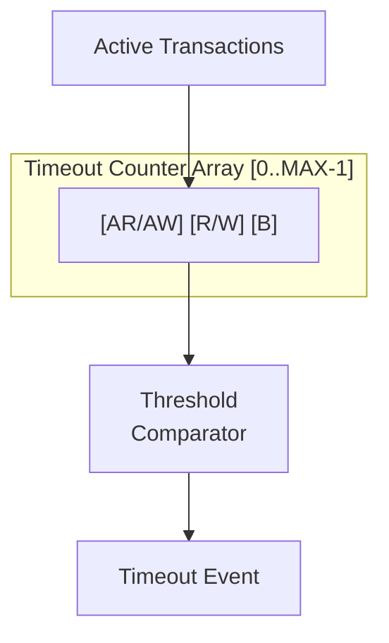

<!-- RTL Design Sherpa Documentation Header -->
<table>
<tr>
<td width="80">
  
</td>
<td>
  <strong>RTL Design Sherpa</strong> · <em>Learning Hardware Design Through Practice</em> 
  
    <a href="https://github.com/sean-galloway/RTLDesignSherpa">GitHub</a> ·
    <a href="https://github.com/sean-galloway/RTLDesignSherpa/blob/main/docs/DOCUMENTATION_INDEX.md">Documentation Index</a> ·
    <a href="https://github.com/sean-galloway/RTLDesignSherpa/blob/main/LICENSE">MIT License</a>
  
</td>
</tr>
</table>

---

<!-- End Header -->

# AXI Monitor Timeout

**Module:** `axi_monitor_timeout.sv`
**Location:** `rtl/amba/shared/`
**Category:** Core Infrastructure
**Status:** ✅ Production Ready

---

## Overview

The `axi_monitor_timeout` module provides Configurable timeout detection for stuck transactions.

This is a **shared infrastructure module** used internally by AXI/AXIL monitors. It is not typically instantiated directly by users but is critical for understanding the monitor architecture.

---

## Key Features

- ✅ **Per-phase timeout detection (AR/AW, R/W, B):** Per-phase timeout detection (AR/AW, R/W, B)
- ✅ **Configurable timeout thresholds:** Configurable timeout thresholds
- ✅ **Frequency scaling for timeout counts:** Frequency scaling for timeout counts
- ✅ **Timeout event reporting with transaction ID:** Timeout event reporting with transaction ID
- ✅ **Active transaction tracking:** Active transaction tracking
- ✅ **Timeout clear on transaction completion:** Timeout clear on transaction completion

---

## Module Purpose

The `axi_monitor_timeout` module is the core building block for:

1. **Per-Phase Monitoring:** Separate timeouts for AR/AW, R/W, B channels
2. **Configurable Thresholds:** Adjustable timeout values per phase
3. **Event Reporting:** Generates timeout packets with transaction details
4. **Active Tracking:** Monitors all outstanding transactions
5. **Frequency Scaling:** Adapts timeout counts to system clock frequency

---

## Parameters

| Parameter | Type | Default | Description |
|-----------|------|---------|-------------|
| `MAX_TRANSACTIONS` | int | 16 | Number of transactions to monitor |
| `ID_WIDTH` | int | 8 | Transaction ID width |
| `ADDR_WIDTH` | int | 32 | Address width for reporting |

---

## Port Groups

**See RTL source:** `rtl/amba/shared/axi_monitor_timeout.sv` for complete port listing.

Key interface groups:
- Clock and reset
- Input signals from monitored interface
- Configuration signals
- Output signals to downstream logic

---

## Architecture

Each transaction has 3 independent timeout counters for different phases.

---

## Usage in Monitor System

This module is used by:

- **axi_monitor_base**

### Internal Integration

This module is instantiated automatically within higher-level monitor modules. Users configure behavior through top-level monitor parameters.

---

## Configuration Guidelines

**See individual monitor documentation for configuration examples.**

Configuration is typically handled at the top-level monitor instantiation.

---

## Performance Characteristics

| Metric | Value | Notes |
|--------|-------|-------|
| Latency | 1-2 cycles | Typical processing delay |
| Throughput | 1 operation/cycle | Maximum rate |
| Resource Usage | Varies | Depends on configuration |

---

## Verification Considerations

### Test Coverage

- Functional correctness of core logic
- Boundary conditions (min/max values)
- Error handling and recovery
- Interface protocol compliance

**See:** `val/amba/test_axi_monitor_timeout.py` for verification tests

---

## Related Modules

- **[axi_monitor_base](./axi_monitor_base.md)**

---

## See Also

- **Monitor Architecture:** `docs/markdown/RTLAmba/overview.md`
- **Monitor Configuration Guide:** `docs/AXI_Monitor_Configuration_Guide.md`
- **Packet Format Specification:** `docs/markdown/RTLAmba/includes/monitor_package_spec.md`

---

## Navigation

- **[← Back to Shared Infrastructure Index](./README.md)**
- **[← Back to RTLAmba Index](../index.md)**
- **[← Back to Main Documentation Index](../../index.md)**
