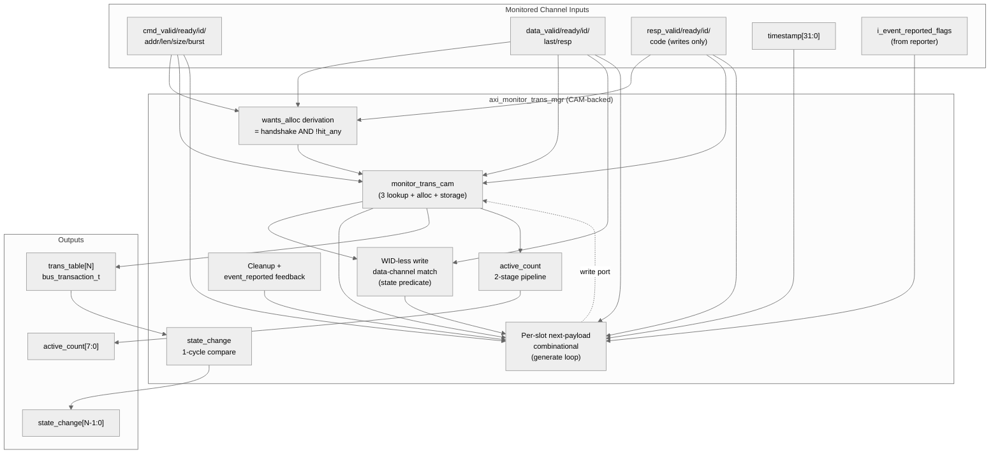

<!-- RTL Design Sherpa Documentation Header -->
<table>
<tr>
<td width="80">
  <a href="https://github.com/sean-galloway/RTLDesignSherpa">
    
  </a>
</td>
<td>
  <strong>RTL Design Sherpa</strong> · <em>Learning Hardware Design Through Practice</em><br>
  <sub>
    <a href="https://github.com/sean-galloway/RTLDesignSherpa">GitHub</a> ·
    <a href="https://github.com/sean-galloway/RTLDesignSherpa/blob/main/docs/DOCUMENTATION_INDEX.md">Documentation Index</a> ·
    <a href="https://github.com/sean-galloway/RTLDesignSherpa/blob/main/LICENSE">MIT License</a>
  </sub>
</td>
</tr>
</table>

---

<!-- End Header -->

# AXI Monitor Transaction Manager

**Module:** `axi_monitor_trans_mgr.sv`
**Location:** `rtl/amba/shared/`
**Category:** Core Infrastructure
**Status:** Production Ready (CAM-backed revision, 2026-06-08)

---

## Overview

`axi_monitor_trans_mgr` tracks outstanding AXI transactions through their
addr → data → resp lifecycle. It exposes a registered table of in-flight
transactions (`trans_table[N]`) for downstream consumers (reporter, debug,
timeout) and feeds the monitor bus with state-change events.

This is a **shared infrastructure module** used internally by every AXI4 /
AXI5 / AXI-Lite monitor. Users don't instantiate it directly; they
configure behaviour through the top-level monitor wrapper.

The current revision delegates per-transaction keying + storage to the
shared [`monitor_trans_cam`](monitor_trans_cam.md) module. A previous
in-place revision (2026-04-23) is parked at
`rtl/amba/shared/mon_temp/axi_monitor_trans_mgr.sv` and remains available
for rollback or timing comparison.

---

## Key Features

- Tracks up to `MAX_TRANSACTIONS` outstanding (default 16)
- 3 independent ID lookups per cycle (addr / data / resp) via CAM
- Out-of-order transaction support
- Burst beat counting
- Per-phase timestamps for latency reporting
- Orphan-data / orphan-resp detection (per AXI4 / AXI-Lite rules)
- State-change events for downstream packet generation
- Active-transaction counter
- Cleanup-when-event-reported handshake with the reporter
- AXI4 / AXI4-Lite / read / write variants via parameters

---

## Architecture



Source: [`axi_monitor_trans_mgr.mmd`](../../assets/RTLAmba/axi_monitor_trans_mgr.mmd)



The trans_mgr owns:
- The **WID-less write data-channel match** (state predicate over the
  payload, not an id match — the CAM only sees ids).
- The per-slot **next-payload computation** (the per-phase if/else chain
  that says "what should slot i's bus_transaction_t look like next cycle").
- The **wants_alloc** derivation (= input handshake AND not-hit-any).
- Cleanup eligibility, event_reported feedback, active_count pipeline,
  state_change detection.

The CAM owns:
- Per-slot `(valid, id, payload)` storage.
- The 3 parallel ID lookups (`addr_match_oh`, `data_match_oh`, `resp_match_oh`).
- The free-slot vector and 3-way priority-encoded alloc one-hots.

This split makes the parallel-match shape that closes 100 MHz on the
xc7a100t-1 (`(* keep = "true" *)` per-bit match vectors, per-slot
generate-loop storage) explicit and reusable.

---

## Parameters

| Parameter | Type | Default | Description |
|---|---|---|---|
| `MAX_TRANSACTIONS` | int | 16 | Transaction table depth |
| `ADDR_WIDTH` | int | 32 | Width of address bus tracked |
| `ID_WIDTH` | int | 8 | Width of AXI ID |
| `IS_READ` | bit | 1 | 1 for read monitors, 0 for write |
| `IS_AXI` | bit | 1 | 1 for AXI4, 0 for AXI-Lite |
| `ENABLE_PERF_PACKETS` | bit | 0 | Reserved — perf packet generation hook |

The `AW` and `IW` short-alias parameters are retained for API stability with
prior revisions; they default to `ADDR_WIDTH` and `ID_WIDTH`.

---

## Module Interface

The module exports a registered `trans_table` of `bus_transaction_t`
entries (see `monitor_amba4_pkg.sv`) plus aggregate status:

```systemverilog
module axi_monitor_trans_mgr
    import monitor_common_pkg::*;
    import monitor_amba4_pkg::*;
#(
    parameter int MAX_TRANSACTIONS = 16,
    parameter int ADDR_WIDTH       = 32,
    parameter int ID_WIDTH         = 8,
    parameter bit IS_READ          = 1'b1,
    parameter bit IS_AXI           = 1'b1,
    ...
) (
    input  logic                          aclk,
    input  logic                          aresetn,

    // Synchronous clear: empty the transaction CAM and zero the
    // active-count pipeline on the next edge (no full reset needed).
    // Pulse one cycle while idle.
    input  logic                          clear,

    // Address channel
    input  logic                          cmd_valid,
    input  logic                          cmd_ready,
    input  logic [IW-1:0]                 cmd_id,
    input  logic [AW-1:0]                 cmd_addr,
    input  logic [7:0]                    cmd_len,
    input  logic [2:0]                    cmd_size,
    input  logic [1:0]                    cmd_burst,

    // Data channel
    input  logic                          data_valid,
    input  logic                          data_ready,
    input  logic [IW-1:0]                 data_id,
    input  logic                          data_last,
    input  logic [1:0]                    data_resp,

    // Response channel (write only)
    input  logic                          resp_valid,
    input  logic                          resp_ready,
    input  logic [IW-1:0]                 resp_id,
    input  logic [1:0]                    resp_code,

    input  logic [31:0]                   timestamp,
    input  logic [MAX_TRANSACTIONS-1:0]   i_event_reported_flags,

    output bus_transaction_t              trans_table[MAX_TRANSACTIONS],
    output logic [7:0]                    active_count,
    output logic [MAX_TRANSACTIONS-1:0]   state_change
);
```

The `bus_transaction_t` struct (defined in `monitor_amba4_pkg.sv`) contains:
- State flags: `valid`, `cmd_received`, `data_started`, `data_completed`,
  `resp_received`, `event_reported`, `eos_seen`
- FSM state: `state` (TRANS_IDLE / ADDR_PHASE / DATA_PHASE / COMPLETE /
  ERROR / ORPHANED)
- Captured fields: `addr`, `id`, `len`, `size`, `burst`, `channel`
- Timers and timestamps: `addr_timer`, `data_timer`, `resp_timer`,
  `addr_timestamp`, `data_timestamp`, `resp_timestamp`
- Beat tracking: `expected_beats`, `data_beat_count`
- `event_code` union (axi_error / axi_timeout / etc.)

Total: 285 bits per entry. With `MAX_TRANSACTIONS=16`, the trans_table is
~4.5 Kb of registered state.

---

## Transaction Lifecycle

A typical AXI4 read transaction:

```
                              addr_alloc fires (free CAM slot picked)
                              valid       = 1
                              state       = TRANS_ADDR_PHASE
   cmd_valid handshake ─►     id          = cmd_id
   (cmd_id, cmd_addr, ...)    cmd_received= cmd_ready
                              expected_beats = cmd_len + 1
                              addr_timestamp = timestamp

                              addr_update fires (slot already exists)
   cmd_handshake ─────►       cmd_received <= 1
   on same id again           addr_timer  <= 0
                              addr_timestamp <= timestamp

                              data_update fires (id match)
   data_valid handshake ─►    data_started <= 1
   (data_id == cmd_id,        data_beat_count++
    data_last, data_resp)     state        <= TRANS_DATA_PHASE
                              if data_last:
                                data_completed <= 1
                                state        <= TRANS_COMPLETE
                              if data_resp[1]:  # RESP error
                                state        <= TRANS_ERROR
                                event_code   <= EVT_RESP_*

                              (later, reporter handles the event)
                              cleanup fires
   event_reported flag ─►     valid <= 0       # slot returned to free pool
   from reporter              # CAM sees the entry as free on next cycle
```

For AXI4 writes the data phase uses a state predicate match (not id),
since AXI4 W has no WID. For AXI-Lite writes, the data channel CAN
allocate an orphan slot if data arrives before the AW handshake.

---

## Synthesis Notes

The CAM-backed revision preserves the 2026-04-23 WNS fix:

| Construct | Rationale |
|---|---|
| Per-slot `always_comb` for next-payload (in a generate loop) | N independent small cones; synth cannot fuse them across slots |
| Per-slot CAM storage via `monitor_trans_cam` (generate-loop `always_ff`) | Same property at the registered storage layer |
| `(* keep = "true" *)` on CAM match vectors | Prevents Vivado from fusing match-result usage into the update cones, which would re-introduce the 12-LUT-level WNS issue |
| Registered alloc/cleanup one-hot vectors (`q_addr_alloc_oh`, `q_data_alloc_oh`, `q_resp_alloc_oh`, `q_cleanup_vec`) feeding the `active_count` popcount tree | The popcount-from-OR-of-three-onehots adder is now one cycle behind the events that drove it. Both alloc *and* cleanup are registered by the **same** amount, so the accounting balances — it just lags 1 cycle. Status-counter consumers don't care about the lag, and the match → alloc → popcount → flop critical path drops to within budget at 100 MHz (`bee67f51`, `f909f01f`). |
| Pipelined `state_change` (1 cycle of `r_trans_table_prev`) | Cheap comparison against last cycle's table; output lag is 1 cycle |
| Synchronous `clear` clears the active-count pipeline alongside the CAM | Without this, asserting `clear` would invalidate the CAM but leave stale `r_alloc_cnt` / `r_cleanup_cnt`, briefly publishing a nonzero `active_count` against an empty table. The clear handling zeroes both pipeline stages atomically. |

The combined effect is that no signal in the trans_mgr has more than ~6
LUT levels between flops at typical configurations — closes 100 MHz on
xc7a100t-1 with margin.

---

## Equivalence Reference

Bit-exact equivalence between the CAM-backed version and the legacy
in-place revision is proven by
`val/amba/test_axi_monitor_trans_mgr_equiv.py`:

- 500 cycles of deterministic random stimulus (fixed seed=42)
- Cycle-by-cycle capture of `trans_table[N]`, `active_count`, `state_change`
- Bit-exact comparison across the 285-bit `bus_transaction_t` × N slots,
  plus the two aggregate outputs

FULL parameter sweep: 6 configs covering AXI4 / AXI-Lite × read / write ×
small / large MAX_TRANSACTIONS — 12 tests (6 configs × prod + stage).
All 12 pass.

If you make changes to either trans_mgr (production at `rtl/amba/shared/`
or legacy at `rtl/amba/shared/mon_temp/`), running the equiv test
quickly catches any introduced divergence.

---

## TRANS_MGR_VARIANT Knob

The full `*_mon` regression in `test_axi4_master_rd_mon.py` accepts a
`TRANS_MGR_VARIANT` env var:

```bash
# Default — current production (CAM-backed)
pytest val/amba/test_axi4_master_rd_mon.py -v

# Roll back to the pre-CAM in-place revision (parked in mon_temp/)
TRANS_MGR_VARIANT=legacy pytest val/amba/test_axi4_master_rd_mon.py -v
```

Useful for timing comparisons on real silicon, or as a hot-swap path if
a regression sneaks past the equiv test.

---

## Performance Characteristics

| Metric | Value | Notes |
|---|---|---|
| Throughput | 1 transaction-event/cycle | Per-phase handshake; up to 3 phases (alloc / update / cleanup) can fire per cycle |
| `trans_table` latency | 1 cycle | Output is registered |
| `active_count` latency | 2 cycles | Pipelined adder |
| `state_change` latency | 1 cycle | Compared against prev cycle |
| Resource | ~5 Kb storage | 16 × 285-bit struct, in the CAM |

---

## Verification

| Test | Coverage |
|---|---|
| `val/amba/test_axi_monitor_trans_mgr_equiv.py` | Bit-exact CAM-backed vs legacy equivalence, 500 cycles × 6 param configs |
| `val/amba/test_monitor_trans_cam.py` | The CAM sub-module in isolation |
| `val/amba/test_axi4_master_rd_mon.py` and all `*_mon*` tests | End-to-end through the full monitor stack |

Run the equivalence test to validate trans_mgr changes:

```bash
pytest val/amba/test_axi_monitor_trans_mgr_equiv.py -v
```

---

## Related Modules

| Module | Role |
|---|---|
| [`monitor_trans_cam`](monitor_trans_cam.md) | Per-slot keying + storage with 3 lookup ports and alloc priority encoder |
| [`axi_monitor_base`](axi_monitor_base.md) | Top-level monitor wrapper that instantiates trans_mgr + timer + reporter |
| [`axi_monitor_reporter`](axi_monitor_reporter.md) | Consumes `trans_table` + `state_change` to generate monbus packets |
| [`axi_monitor_timeout`](axi_monitor_timeout.md) | Watches the per-phase timers in `trans_table` for timeout events |

---

## See Also

- **Monitor Architecture:** [`docs/markdown/RTLAmba/overview.md`](../overview.md)
- **Monitor Configuration Guide:** [`axi_monitor_base.md`](./axi_monitor_base.md)
- **Packet Format Specification:** [`monitor_package_spec.md`](../includes/monitor_package_spec.md)
- **Legacy parking area:** `rtl/amba/shared/mon_temp/` (pre-CAM in-place revision)

---

## Navigation

- **[← Back to Shared Infrastructure Index](./README.md)**
- **[← Back to RTLAmba Index](../README.md)**
