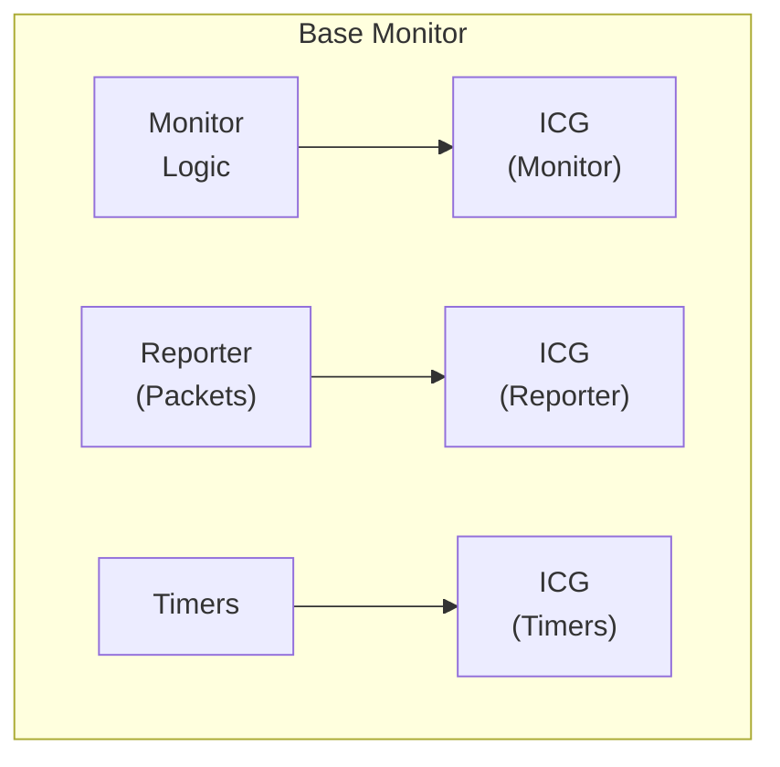
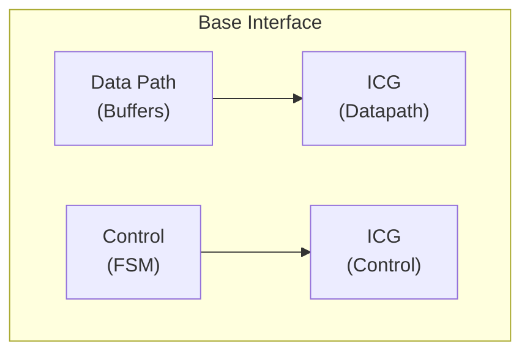
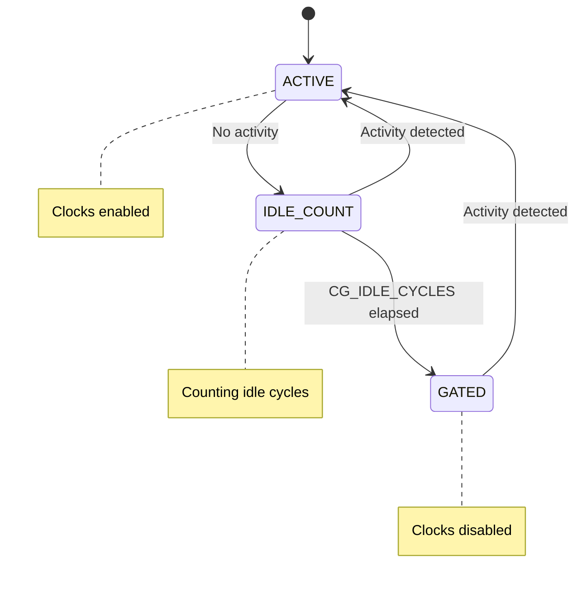

<!-- RTL Design Sherpa Documentation Header -->
<table>
<tr>
<td width="80">
  <a href="https://github.com/sean-galloway/RTLDesignSherpa">
    
  </a>
</td>
<td>
  <strong>RTL Design Sherpa</strong> · <em>Learning Hardware Design Through Practice</em><br>
  <sub>
    <a href="https://github.com/sean-galloway/RTLDesignSherpa">GitHub</a> ·
    <a href="https://github.com/sean-galloway/RTLDesignSherpa/blob/main/docs/DOCUMENTATION_INDEX.md">Documentation Index</a> ·
    <a href="https://github.com/sean-galloway/RTLDesignSherpa/blob/main/LICENSE">MIT License</a>
  </sub>
</td>
</tr>
</table>

---

<!-- End Header -->

# Clock-Gated Variants Guide

**Category:** Infrastructure Documentation
**Location:** `rtl/amba/shared/`
**Applies To:** All AMBA protocol modules with `_cg` suffix

---

## Overview

All AMBA protocol modules have clock-gated (CG) variants that add comprehensive power optimization capabilities through activity-based clock gating. This guide covers the common patterns, parameters, and usage for all CG variants.

**Naming Convention:** `{base_module}_cg.sv`

**Examples:**
- `axi4_master_rd_mon.sv` → `axi4_master_rd_mon_cg.sv`
- `apb_slave.sv` → `apb_slave_cg.sv`
- `axil4_master_wr_mon.sv` → `axil4_master_wr_mon_cg.sv`

---

## Key Principle

**Clock-gated variants maintain 100% functional equivalence with base modules while adding power optimization.**

```
Base Module Functionality + Clock Gating Control = CG Variant
```

All parameters, ports, and behavior of the base module are preserved. Only clock gating configuration is added.

---

## Common Clock Gating Parameters

All CG variants add these parameters to their base module parameters:

| Parameter | Type | Default | Description |
|-----------|------|---------|-------------|
| `ENABLE_CLOCK_GATING` | bit | 1 | Master enable for clock gating (0=disable all gating) |
| `CG_IDLE_CYCLES` | int | 8 | Number of idle cycles before asserting clock gate |
| `CG_GATE_MONITOR` | bit | 1 | Enable clock gating for monitor logic (monitors only) |
| `CG_GATE_REPORTER` | bit | 1 | Enable clock gating for packet reporter (monitors only) |
| `CG_GATE_TIMERS` | bit | 1 | Enable clock gating for timeout timers (monitors only) |
| `CG_GATE_DATAPATH` | bit | 1 | Enable clock gating for data path logic (interfaces only) |
| `CG_GATE_CONTROL` | bit | 1 | Enable clock gating for control path logic (interfaces only) |

**Note:** Monitor modules have monitor/reporter/timer gating. Interface modules have datapath/control gating.

---

## Architecture

### Clock Gating Domains

**For Monitor Modules (e.g., `axi4_master_rd_mon_cg`):**



**For Interface Modules (e.g., `axi4_master_rd_cg`, `apb_slave_cg`):**



### Gating State Machine



---

## Usage Patterns

### Pattern 1: Maximum Power Savings

**Use Case:** Battery-operated systems, burst traffic patterns

```systemverilog
{module}_cg #(
    // Base module parameters (same as non-CG variant)
    .AXI_ID_WIDTH(8),
    .AXI_ADDR_WIDTH(32),
    .AXI_DATA_WIDTH(64),

    // Clock gating - aggressive
    .ENABLE_CLOCK_GATING(1),
    .CG_IDLE_CYCLES(4),      // Gate quickly after 4 idle cycles
    .CG_GATE_MONITOR(1),     // Gate all subsystems
    .CG_GATE_REPORTER(1),
    .CG_GATE_TIMERS(1)
) u_cg_aggressive (
    .aclk(clk),
    .aresetn(rst_n),
    // ... all other ports same as base module
);
```

**Power Savings:** 60-70% for 10% utilization traffic

### Pattern 2: Balanced Performance and Power

**Use Case:** Production systems with moderate power constraints

```systemverilog
{module}_cg #(
    // Base module parameters
    .AXI_ID_WIDTH(8),
    .AXI_ADDR_WIDTH(32),
    .AXI_DATA_WIDTH(64),

    // Clock gating - balanced
    .ENABLE_CLOCK_GATING(1),
    .CG_IDLE_CYCLES(16),     // Wait longer before gating
    .CG_GATE_MONITOR(1),
    .CG_GATE_REPORTER(0),    // Keep reporter active
    .CG_GATE_TIMERS(1)
) u_cg_balanced (
    .aclk(clk),
    .aresetn(rst_n),
    // ... all other ports same as base module
);
```

**Power Savings:** 45-55% for 25% utilization traffic

### Pattern 3: Clock Gating Disabled

**Use Case:** Functional verification, continuous high-activity traffic

```systemverilog
{module}_cg #(
    // Base module parameters
    .AXI_ID_WIDTH(8),
    .AXI_ADDR_WIDTH(32),
    .AXI_DATA_WIDTH(64),

    // Clock gating - DISABLED
    .ENABLE_CLOCK_GATING(0)  // Disable all gating
) u_cg_disabled (
    .aclk(clk),
    .aresetn(rst_n),
    // ... all other ports same as base module
);
```

**Result:** Functionally identical to base module, no power savings.

---

## When to Use Clock-Gated Variants

### Use CG Variant When:
- ✅ Power consumption is critical concern
- ✅ Design has periods of inactivity (burst traffic)
- ✅ FPGA/ASIC has integrated clock gating support
- ✅ Meeting power budgets for battery-operated systems
- ✅ Idle periods >= CG_IDLE_CYCLES (worth gating)

### Use Base Module When:
- ✅ Maximum performance with no power constraints
- ✅ Continuous high-activity traffic (90%+ utilization)
- ✅ Simpler design with fewer configuration parameters
- ✅ Minimizing gate count is priority
- ✅ Clock gating infrastructure not available

---

## Power Savings Analysis

### Typical Power Reduction by Utilization

| Traffic Utilization | CG_IDLE_CYCLES=4 (Aggressive) | CG_IDLE_CYCLES=16 (Conservative) |
|---------------------|------------------------------|----------------------------------|
| 10% (Burst traffic) | 60-70% savings | 50-60% savings |
| 25% (Moderate) | 45-55% savings | 35-45% savings |
| 50% (Active) | 25-35% savings | 20-30% savings |
| 90% (Continuous) | 5-10% savings | 5-10% savings |

**Note:** Actual savings depend on FPGA/ASIC technology, tool implementation, and traffic patterns.

### Wake-Up Latency vs Power Savings

| CG_IDLE_CYCLES | Wake-Up Time | Power Savings | Use Case |
|----------------|--------------|---------------|----------|
| 2-4 | 2-4 cycles | High (aggressive) | Low-latency burst traffic |
| 8-16 | 8-16 cycles | Medium (balanced) | General purpose |
| 32-64 | 32-64 cycles | Lower (conservative) | Infrequent traffic, power critical |

**Recommendation:** Start with `CG_IDLE_CYCLES=8` (balanced), adjust based on profiling.

---

## Synthesis Considerations

### FPGA Implementations

**Xilinx:**
```systemverilog
// Use ENABLE_CLOCK_GATING=1 with BUFGCE primitives
// Tool will infer clock enables automatically
// Verify with post-synthesis power analysis
```

**Intel (Altera):**
```systemverilog
// Use ENABLE_CLOCK_GATING=1 with ALTCLKCTRL
// May need vendor-specific clock gating primitives
// Check power reports for gating effectiveness
```

**Lattice:**
```systemverilog
// Basic clock gating supported
// May require manual instantiation of clock enables
// Verify functionality in timing simulation
```

### ASIC Implementations

- Work with foundry to select appropriate clock gating cells
- Integrated Clock Gating (ICG) cells provide best results
- Consider hold-time implications of clock gating
- Verify power intent with UPF (Unified Power Format)

**Example UPF Power Domain:**
```tcl
create_power_domain PD_MONITOR
add_port_state PD_MONITOR -state {ON 1.0} -state {OFF 0.0}
set_domain_supply_net PD_MONITOR -primary_power_net VDD
```

---

## Verification Considerations

### Functional Verification

**Recommendation:** Disable clock gating during functional verification:

```systemverilog
`ifdef FUNCTIONAL_VERIFICATION
    localparam ENABLE_CG = 0;  // Disable for faster simulation
`else
    localparam ENABLE_CG = 1;  // Enable for power analysis
`endif

{module}_cg #(.ENABLE_CLOCK_GATING(ENABLE_CG)) dut (...);
```

**Rationale:**
- Simpler waveforms (no clock gating events)
- Faster simulation (no gating overhead)
- Easier debug (no timing dependencies)

### Power Verification

For power-specific verification:

1. **Enable clock gating** with realistic parameters
2. **Monitor gating signals** (`cg_*_gated`) to verify behavior
3. **Vary traffic patterns** to test gating effectiveness
4. **Check wake-up timing** meets system requirements
5. **Measure power** with tools (Vivado Power Analyzer, PrimeTime PX)

---

## Available Clock-Gated Variants

### AXI4 Protocol (8 modules)

| Base Module | CG Variant | Documentation |
|-------------|------------|---------------|
| `axi4_master_rd_mon.sv` | `axi4_master_rd_mon_cg.sv` | [Example](../axi4/axi4_master_rd_mon_cg.md) |
| `axi4_master_wr_mon.sv` | `axi4_master_wr_mon_cg.sv` | See CG guide (this doc) |
| `axi4_slave_rd_mon.sv` | `axi4_slave_rd_mon_cg.sv` | See CG guide (this doc) |
| `axi4_slave_wr_mon.sv` | `axi4_slave_wr_mon_cg.sv` | See CG guide (this doc) |
| `axi4_master_rd.sv` | `axi4_master_rd_cg.sv` | See CG guide (this doc) |
| `axi4_master_wr.sv` | `axi4_master_wr_cg.sv` | See CG guide (this doc) |
| `axi4_slave_rd.sv` | `axi4_slave_rd_cg.sv` | See CG guide (this doc) |
| `axi4_slave_wr.sv` | `axi4_slave_wr_cg.sv` | See CG guide (this doc) |

### AXI4-Lite Protocol (8 modules)

| Base Module | CG Variant | Documentation |
|-------------|------------|---------------|
| `axil4_master_rd_mon.sv` | `axil4_master_rd_mon_cg.sv` | [Example](../axil4/axil4_master_rd_mon_cg.md) |
| `axil4_master_wr_mon.sv` | `axil4_master_wr_mon_cg.sv` | See CG guide (this doc) |
| `axil4_slave_rd_mon.sv` | `axil4_slave_rd_mon_cg.sv` | See CG guide (this doc) |
| `axil4_slave_wr_mon.sv` | `axil4_slave_wr_mon_cg.sv` | See CG guide (this doc) |
| `axil4_master_rd.sv` | `axil4_master_rd_cg.sv` | See CG guide (this doc) |
| `axil4_master_wr.sv` | `axil4_master_wr_cg.sv` | See CG guide (this doc) |
| `axil4_slave_rd.sv` | `axil4_slave_rd_cg.sv` | See CG guide (this doc) |
| `axil4_slave_wr.sv` | `axil4_slave_wr_cg.sv` | See CG guide (this doc) |

### APB Protocol (3 modules)

| Base Module | CG Variant | Documentation |
|-------------|------------|---------------|
| `apb_master.sv` | `apb_master_cg.sv` | See CG guide (this doc) |
| `apb_slave.sv` | `apb_slave_cg.sv` | [Example](../apb/apb_slave_cg.md) |
| `apb_slave_cdc.sv` | `apb_slave_cdc_cg.sv` | See CG guide (this doc) |

### AXIS Protocol (2 modules)

| Base Module | CG Variant | Documentation |
|-------------|------------|---------------|
| `axis_master.sv` | `axis_master_cg.sv` | See CG guide (this doc) |
| `axis_slave.sv` | `axis_slave_cg.sv` | See CG guide (this doc) |

**Total:** 21 clock-gated variants across all AMBA protocols

---

## Detailed Examples

For detailed implementation examples with complete parameter lists, port connections, and usage scenarios, see:

- **AXI4 Monitor Example:** [axi4_master_rd_mon_cg.md](../axi4/axi4_master_rd_mon_cg.md)
- **AXIL4 Monitor Example:** [axil4_master_rd_mon_cg.md](../axil4/axil4_master_rd_mon_cg.md)
- **APB Interface Example:** [apb_slave_cg.md](../apb/apb_slave_cg.md)

These examples provide complete instantiation templates, synthesis scripts, and verification strategies specific to each protocol variant.

---

## Configuration Guidelines

### Step 1: Choose Base Configuration

Start with base module parameters (address width, data width, etc.).

### Step 2: Enable/Disable Clock Gating

```systemverilog
.ENABLE_CLOCK_GATING(1)  // 1=enable, 0=disable (default to base module)
```

### Step 3: Set Idle Threshold

```systemverilog
.CG_IDLE_CYCLES(8)  // Cycles before gating (balance: 8-16)
```

### Step 4: Configure Gating Domains

**For Monitors:**
```systemverilog
.CG_GATE_MONITOR(1),   // Gate transaction tracking
.CG_GATE_REPORTER(1),  // Gate packet generation
.CG_GATE_TIMERS(1)     // Gate timeout detection
```

**For Interfaces:**
```systemverilog
.CG_GATE_DATAPATH(1),  // Gate data buffering
.CG_GATE_CONTROL(1)    // Gate control FSM
```

### Step 5: Connect Ports

All ports identical to base module - no additional connections needed.

---

## Performance Impact

| Aspect | Impact | Notes |
|--------|--------|-------|
| Latency | +0-2 cycles | Wake-up from gated state |
| Throughput | No impact | When active, same as base module |
| Area | +5-10% | Clock gating control logic |
| Power | -25% to -70% | Depends on utilization |
| Frequency | No impact | Same critical path as base |

---

## Related Documentation

- **Base Module Documentation:** See individual protocol directories (axi4/, axil4/, apb/, axis4/)
- **Power Optimization:** `docs/POWER_OPTIMIZATION_GUIDE.md`
- **Clock Gating Best Practices:** `docs/CLOCK_GATING_GUIDE.md`
- **AMBA Overview:** [overview.md](../overview.md)

---

## Navigation

- **[← Back to Shared Infrastructure Index](./README.md)**
- **[← Back to RTLAmba Index](../index.md)**
- **[← Back to Main Documentation Index](../../index.md)**
