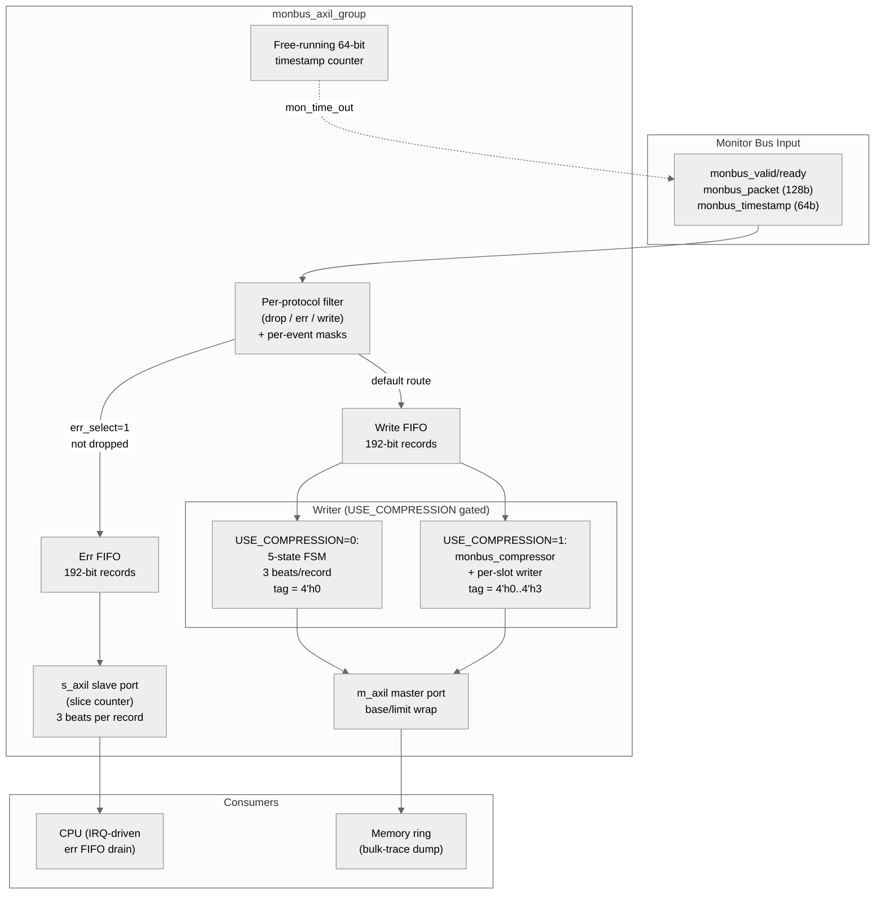

<!-- RTL Design Sherpa Documentation Header -->
<table>
<tr>
<td width="80">
  <a href="https://github.com/sean-galloway/RTLDesignSherpa">
    
  </a>
</td>
<td>
  <strong>RTL Design Sherpa</strong> · <em>Learning Hardware Design Through Practice</em><br>
  <sub>
    <a href="https://github.com/sean-galloway/RTLDesignSherpa">GitHub</a> ·
    <a href="https://github.com/sean-galloway/RTLDesignSherpa/blob/main/docs/DOCUMENTATION_INDEX.md">Documentation Index</a> ·
    <a href="https://github.com/sean-galloway/RTLDesignSherpa/blob/main/LICENSE">MIT License</a>
  </sub>
</td>
</tr>
</table>

---

<!-- End Header -->

# Monitor Bus AXI-Lite Group

**Module:** `monbus_axil_group.sv`
**Location:** `rtl/amba/shared/`
**Category:** Monitor Bus → AXI-Lite Aggregation
**Status:** Production Ready

---

## Overview

`monbus_axil_group` is the **AXI-Lite delivery layer** for the monitor bus.
It takes a single monbus stream — already arbitrated upstream if multiple
sources need to be merged — and:

1. **Filters** packets per protocol (drop / route-to-err-FIFO / route-to-write-FIFO)
2. **Drains** the error FIFO over an AXI-Lite slave port for CPU IRQ handlers
3. **Streams** the write FIFO over an AXI-Lite master port into a memory ring
4. **Optionally compresses** the write-path traffic before it lands in memory
   (gated by `USE_COMPRESSION=1`)

It is the bridge between the in-flight monitor packets and the host-visible
recording mechanisms — CPU reads (low-rate, error-focused) on the slave port,
DMA writes (bulk-trace, high-rate) on the master port.

---

## Architecture



Source: [`monbus_axil_group.mmd`](../../assets/RTLAmba/monbus_axil_group.mmd)



The module has **no built-in arbitration** — it is a single-input block.
Callers with N upstream sources (e.g., RAPIDS source+sink, the bridge's
per-port monitors) instantiate a separate `monbus_arbiter` to merge their
streams before feeding this group. Keeping arbitration orthogonal to capture
means this module never needs to duplicate the arbiter for each consumer's
input count.

---

## Key Features

- Single monbus input (128-bit packet + 64-bit timestamp side-band)
- Per-protocol packet filtering with three dispositions (drop / err / write)
- Per-event masking (16-bit fine-grain control per event code)
- Configurable error / write FIFO depths
- AXI-Lite slave for CPU error-FIFO drain (with 3-beat record slicing)
- AXI-Lite master for memory-ring writes
- Free-running 60-bit timestamp authority for the whole monitor subsystem
- Optional bulk-trace compressor (`USE_COMPRESSION=1`)

---

## Top-level Interface

```systemverilog
module monbus_axil_group
    import monitor_common_pkg::*;
#(
    parameter int FIFO_DEPTH_ERR     = 64,
    parameter int FIFO_DEPTH_WRITE   = 32,
    parameter int ADDR_WIDTH         = 32,
    parameter int S_AXIL_DATA_WIDTH  = 64,
    parameter int M_AXIL_DATA_WIDTH  = 64,
    parameter int NUM_PROTOCOLS      = 3,
    parameter int USE_COMPRESSION    = 0    // 0 = raw 3-beat writer
                                            // 1 = monbus_compressor + per-slot writer
) (
    // Clock and reset
    input  logic                            axi_aclk,
    input  logic                            axi_aresetn,

    // Single monbus input
    input  logic                            monbus_valid,
    output logic                            monbus_ready,
    input  monitor_packet_t                 monbus_packet,
    input  monbus_timestamp_t               monbus_timestamp,

    // Free-running timestamp counter (broadcast to wrappers)
    output monbus_timestamp_t               mon_time_out,

    // s_axil slave port - CPU drain of err FIFO
    // m_axil master port - memory ring writes
    // ... (see RTL for full port list)

    // Per-protocol filter configuration (AXI, AXIS, CORE)
    // ... 24 cfg_* inputs total

    // Status
    output logic                            err_fifo_full,
    output logic                            write_fifo_full,
    output logic [7:0]                      err_fifo_count,
    output logic [7:0]                      write_fifo_count,

    // Compressor statistics (valid only when USE_COMPRESSION=1; tied to 0 otherwise)
    output logic [31:0]                     mon_compressor_stat_tier1_a,
    output logic [31:0]                     mon_compressor_stat_tier1_b,
    output logic [31:0]                     mon_compressor_stat_tier1_c,
    output logic [31:0]                     mon_compressor_stat_tier0,
    output logic [31:0]                     mon_compressor_stat_cam_miss,
    output logic [31:0]                     mon_compressor_stat_delta_ts_ovf,
    output logic [31:0]                     mon_compressor_stat_event_data_ovf,
    output logic [31:0]                     mon_compressor_stat_ed_delta_ovf
);
```

---

## Timestamping

`monbus_axil_group` is the **single timestamp authority** for the whole
monitor subsystem:

1. A free-running 64-bit counter inside the group increments every
   `axi_aclk` cycle.
2. The counter value is driven OUT on `mon_time_out` to every wrapper's
   `i_mon_time` input.
3. Wrappers sample the counter on the cycle they emit a monitor packet
   and return the sampled value on the `monbus_timestamp` side-band.
4. The timestamp arrives here paired with the packet on a single monbus
   handshake.

This pattern decouples emission timing from arbitration order — even if the
arbiter re-orders packets, each packet's timestamp pins it to the moment the
event happened, not the moment it reached the FIFO.

The wire format stores **60 bits** of timestamp (the upper 4 bits of the
64-bit side-band are repurposed as a compression encoding tag — see
[Wire Format](#wire-format) below). 2⁶⁰ cycles at 100 MHz is ~117 days,
plenty for any capture window.

---

## Per-Protocol Filtering

Each protocol (AXI / AXIS / CORE) has its own filter configuration:

```text
cfg_<proto>_pkt_mask[15:0]      : Drop bit-per-packet-type
cfg_<proto>_err_select[15:0]    : Route to err FIFO bit-per-packet-type
                                  (vs. write FIFO; only matters if not dropped)
cfg_<proto>_<event>_mask[15:0]  : Per-event-code mask within each packet type
                                  (8 such masks per protocol)
```

The disposition is:

```
if cfg_pkt_mask[pkt_type] or event_masked:
    drop
elif cfg_err_select[pkt_type]:
    route to err FIFO  (CPU drain via s_axil)
else:
    route to write FIFO  (memory dump via m_axil)
```

Protocols are NOT contiguous in the enum (`AXI=0, AXIS=1, APB=2, ARB=3,
CORE=4`), so the filter uses a `unique case` on the protocol value rather
than a contiguous lookup. Unsupported protocols (APB, ARB) hit the default
`drop` branch — they don't have config registers in this group's port list.

`NUM_PROTOCOLS` is retained as a parameter for API stability but is
informational only — the case statement is the source of truth.

---

## Wire Format

Both FIFOs store the same **192-bit record**: `{source_ts[63:0], packet[127:0]}`.
The s_axil slave-read drain and the m_axil master-write streamer both emit
the same record over **3 × 64-bit beats** in identical order:

```
beat 0:  [63:60] tag[3:0]     [59:0] source_ts[59:0]
beat 1:  packet[127:64]
beat 2:  packet[63:0]
```

The top 4 bits of beat 0 carry an **encoding tag** that lets a decoder read
one 64-bit word, look at the tag, and immediately know the record length
and format without lookahead:

| Tag | Meaning |
|---|---|
| `0x0` | Raw 3-beat record (`USE_COMPRESSION=0`, plus Tier-0 escape from compressor) |
| `0x1` | Tier-1 Format A — single-beat compressed (compressor only) |
| `0x2` | Tier-1 Format B — single-beat compressed |
| `0x3` | Tier-1 Format C — single-beat compressed |
| `0x4..0xF` | Reserved for future use |

In raw mode (`USE_COMPRESSION=0`), the writer always emits tag `0x0` and
the format is fixed at 3 beats per record. In compressed mode
(`USE_COMPRESSION=1`), the [`monbus_compressor`](monbus_compressor.md)
sits in front of the writer and emits a stream of 64-bit slots where each
slot's tag is set per-record. The writer becomes a per-slot 1-beat AXIL
emitter — same wire-level meaning (the tag tells the decoder how many
beats), but the writer no longer cares about record boundaries.

The 60-bit truncated timestamp wraps at 2⁶⁰ cycles. The host-side decoder
maintains an absolute timestamp anchor and applies wrap-detection if the
capture window exceeds 117 days at 100 MHz (which it won't).

---

## USE_COMPRESSION Parameter

The compression path is gated at **elaboration time** by `USE_COMPRESSION`.
The two builds are mutex inside an `if-generate` block:

### `USE_COMPRESSION = 0` (default — raw 3-beat writer)

A 5-state FSM (`WRITE_IDLE → WRITE_LOAD → WRITE_AW → WRITE_W → WRITE_B`)
drains one record from the write FIFO over 3 AXIL beats:

```
beat 0:  fub_wr_wdata = {WRITE_TAG_RAW (0x0), source_ts[59:0]}
beat 1:  fub_wr_wdata = packet[127:64]
beat 2:  fub_wr_wdata = packet[63:0]
```

Each beat issues its own AW + W + B, with `current_write_addr += 8` per beat.
Mid-record memory-ring wrap is FORBIDDEN — the FSM does a
"next-record-fits" check at `WRITE_LOAD` (does `current_write_addr + 24`
exceed `cfg_limit_addr`?) and rewinds to `cfg_base_addr` BEFORE issuing the
first AW of the record. Partial records would corrupt the host-side parser.

Compressor stat outputs are tied to 0 in raw mode.

### `USE_COMPRESSION = 1` (CAM-backed bulk-trace compressor)

The [`monbus_compressor`](monbus_compressor.md) consumes records from the
write FIFO directly via its own valid/ready handshake. It emits a stream of
64-bit slots; the writer here becomes a simple 4-state FSM that issues
**one AXIL beat per slot**:

```
SLOT_IDLE  → wait for compressor out_valid, latch slot
SLOT_AW    → issue AW with current_write_addr
SLOT_W     → issue W with the slot data
SLOT_B     → wait for B, increment current_write_addr += 8
```

Wrap check happens per-slot (8 bytes), not per-record — Tier-1 hits are
single-slot so the unit of wrap is the slot. Tier-0 RAW escapes are 3 slots
emitted consecutively, but since each slot is independently addressed and
written, the wrap-check-per-slot is the right granularity.

Stats from the compressor are bubbled up via the `mon_compressor_stat_*`
output ports for host visibility.

---

## CPU Drain Path (s_axil slave read)

The error FIFO is drained over an AXI-Lite slave port. Each FIFO entry is
192 bits; the slave port drains it as **3 × 64-bit reads**. An internal
slice counter tracks which 64-bit slice of the head-of-FIFO entry to return
next:

```
slice 0:  {tag=0x0, source_ts[59:0]}
slice 1:  packet[127:64]
slice 2:  packet[63:0]
```

The FIFO is popped only when slice 2 is read — the CPU issues three reads
in a row to drain one entry. Reads can be paused between slices without
losing the in-flight entry.

The s_axil drain ALWAYS emits tag `0x0`. Compressing the err-FIFO path is
not implemented (the err FIFO is for low-rate IRQ-triggered traffic where
the latency-to-CPU matters more than the byte budget; the bulk-trace
compression path is the high-rate one).

`irq_out` asserts whenever the err FIFO is non-empty, so the CPU can
arrange to do the drain on IRQ.

---

## Sub-modules Instantiated

| Sub-module | Role |
|---|---|
| `gaxi_fifo_sync` ×2 | Err FIFO + Write FIFO (192-bit records) |
| `axil4_slave_rd` | s_axil slave port (skid-buffered) |
| `axil4_master_wr` | m_axil master port (skid-buffered) |
| [`monbus_compressor`](monbus_compressor.md) | Bulk-trace encoder (only when `USE_COMPRESSION=1`) |
| [`monbus_cam`](monbus_cam.md) | 32-entry LRU CAM inside the compressor |

The compressor + CAM appear in the synth netlist only when
`USE_COMPRESSION=1`. The `gen_writer_raw` branch of the writer generate
block doesn't instantiate them.

---

## Configuration

| Parameter | Default | Notes |
|---|---|---|
| `FIFO_DEPTH_ERR` | 64 | Err FIFO depth (records, not beats). |
| `FIFO_DEPTH_WRITE` | 32 | Write FIFO depth (records, not slots). The compressor adds its own internal pipelining. |
| `ADDR_WIDTH` | 32 | AXIL address width. |
| `S_AXIL_DATA_WIDTH` | 64 | Locked at 64 — drains a {packet, source_ts} record in 3 beats. |
| `M_AXIL_DATA_WIDTH` | 64 | Master AXIL data width (locked at 64). |
| `NUM_PROTOCOLS` | 3 | Informational. The filter actually keys off the protocol enum. |
| `USE_COMPRESSION` | 0 | 0 = raw 3-beat writer; 1 = CAM-backed compressor + per-slot writer. |

---

## Status / Debug Outputs

| Output | Meaning |
|---|---|
| `err_fifo_full` | Err FIFO at capacity (1 cycle from full → packets get dropped) |
| `write_fifo_full` | Write FIFO at capacity (same) |
| `err_fifo_count[7:0]` | Current err FIFO occupancy |
| `write_fifo_count[7:0]` | Current write FIFO occupancy |
| `irq_out` | Asserts when err FIFO is non-empty |
| `mon_compressor_stat_*` (8 counters) | Compressor stats (`USE_COMPRESSION=1` only; tied to 0 otherwise) |

---

## Test

| Test | Coverage |
|---|---|
| `val/amba/test_monbus_axil_group.py` | Raw-mode integration — packet routing, FIFO drain, master writes, base/limit wrap |
| `val/amba/test_monbus_axil_group_compressed.py` | `USE_COMPRESSION=1` integration — compressor output captured at the AXIL master, compared bit-exact against Python golden |

The compressed integration test exercises three phases:

1. Small synthesized stream (9 slots) with a generous window — no wrap.
2. Same stream with a tight 8-slot window — forces a mid-stream wrap.
   Verifies the slot-N+1 address lands at `cfg_base_addr`.
3. Real-silicon dataset (682 records → 770 slots) — generous window,
   byte-exact match.

```bash
pytest val/amba/test_monbus_axil_group.py \
       val/amba/test_monbus_axil_group_compressed.py -v
```

---

## Stream Integration

The STREAM project instantiates this group via
`projects/components/stream/rtl/top/stream_top_ch8.sv` with a
`USE_MON_COMPRESSION` pass-through parameter:

```systemverilog
monbus_axil_group #(
    .FIFO_DEPTH_ERR   (64),
    .FIFO_DEPTH_WRITE (32),
    .ADDR_WIDTH       (32),
    .S_AXIL_DATA_WIDTH(32),    // CPU-facing slave
    .NUM_PROTOCOLS    (3),
    .USE_COMPRESSION  (USE_MON_COMPRESSION)
) u_monbus_axil_group ( ... );
```

Default at the top is `USE_MON_COMPRESSION=0` so existing STREAM builds
are byte-exact with the prior behaviour. Flipping it to 1 enables the
compressor for the next FPGA characterization run.

---

## Memory-ring backend

The `m_axil_*` master writer drains the write FIFO (or the compressor
output, when `USE_COMPRESSION=1`) into a memory ring. On the FPGA the
ring is typically a BRAM-backed simple-dual-port SRAM. The shared
`sdpram_slave` family provides four protocol-specific wrappers; the
canonical pick for this writer is **`sdpram_slave_axil_axil`** because:

- Both the `monbus_axil_group` master writer port AND the host CPU read
  path are AXIL — neither side needs the AXI4 id/len/size/burst/lock/
  cache/qos/region/user fields.
- The wrapper's port list contains only `s_axil_aw*/w*/b*` + `s_axil_ar*/r*`,
  matching the chosen protocol exactly; no spurious AXI4-only fields
  for the caller to tie off.

A typical pairing on the harness looks like:

```systemverilog
monbus_axil_group #(.USE_COMPRESSION(1)) u_mon ( ... );

sdpram_slave_axil_axil #(
    .ADDR_WIDTH (32),
    .DATA_WIDTH (64),
    .MEM_DEPTH  (DUMP_RING_WORDS)
) u_dump_ring (
    .aclk           (aclk),
    .aresetn        (aresetn),

    // monbus_axil_group's master writer -> SRAM ring's slave write side
    .s_axil_awaddr  (m_axil_mon_awaddr),
    .s_axil_awprot  (m_axil_mon_awprot),
    .s_axil_awvalid (m_axil_mon_awvalid),
    .s_axil_awready (m_axil_mon_awready),
    .s_axil_wdata   (m_axil_mon_wdata),
    .s_axil_wstrb   (m_axil_mon_wstrb),
    .s_axil_wvalid  (m_axil_mon_wvalid),
    .s_axil_wready  (m_axil_mon_wready),
    .s_axil_bresp   (m_axil_mon_bresp),
    .s_axil_bvalid  (m_axil_mon_bvalid),
    .s_axil_bready  (m_axil_mon_bready),

    // CPU read side
    .s_axil_araddr  (cpu_axil_araddr),
    ...
);
```

See [`sdpram_slave.md`](sdpram_slave.md) for the full family.

---

## Related Modules

| Module | Role |
|---|---|
| [`monbus_compressor`](monbus_compressor.md) | The optional compression encoder |
| [`monbus_cam`](monbus_cam.md) | The 32-entry LRU CAM inside the compressor |
| [`monbus_arbiter`](monbus_arbiter.md) | Upstream merge — instantiated by callers with N input streams |
| [`sdpram_slave_axil_axil`](sdpram_slave.md) | Canonical SRAM-ring backend for the `m_axil_*` master writer |
| `axil4_slave_rd` / `axil4_master_wr` | The two AXIL backends inside this module |
| `gaxi_fifo_sync` | The err + write FIFOs |
