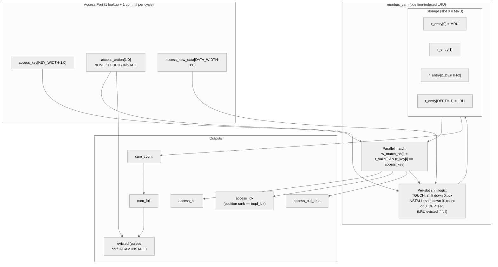

<!-- RTL Design Sherpa Documentation Header -->
<table>
<tr>
<td width="80">
  <a href="https://github.com/sean-galloway/RTLDesignSherpa">
    
  </a>
</td>
<td>
  <strong>RTL Design Sherpa</strong> · <em>Learning Hardware Design Through Practice</em><br>
  <sub>
    <a href="https://github.com/sean-galloway/RTLDesignSherpa">GitHub</a> ·
    <a href="https://github.com/sean-galloway/RTLDesignSherpa/blob/main/docs/DOCUMENTATION_INDEX.md">Documentation Index</a> ·
    <a href="https://github.com/sean-galloway/RTLDesignSherpa/blob/main/LICENSE">MIT License</a>
  </sub>
</td>
</tr>
</table>

---

<!-- End Header -->

# Monitor Bus LRU CAM

**Module:** `monbus_cam.sv`
**Location:** `rtl/amba/shared/`
**Category:** Bulk-Trace Compression Infrastructure
**Status:** Reference design — superseded in-production by [`monbus_cam_pipe`](monbus_cam_pipe.md)

---

> ⚠ **Deprecation note.** `monbus_cam.sv` is the single-cycle reference
> design. The in-production CAM inside `monbus_compressor` is now
> `monbus_cam_pipe.sv`, a 2-cycle pipelined variant that splits the
> 49-bit compare → priority-encode → move-to-front chain into two
> stages so the path closes at 100 MHz on Nexys A7 (`f909f01f` /
> `0d1c0a1a`). The two CAMs are functionally identical (true-LRU, same
> action set, same per-entry storage); the pipelined version adds a
> 1-cycle latency and a credit-gated result skid but holds throughput at
> 1 record/cycle. Both files are kept in tree: this single-cycle module
> serves as the executable spec for the LRU semantics and the
> compressor's CAM behavior, and is what the algorithmic tests
> (`test_monbus_cam.py`) target. New code should instantiate
> [`monbus_cam_pipe`](monbus_cam_pipe.md).

---

## Overview

`monbus_cam` is a **true-LRU caching content-addressable memory** used by the
[`monbus_compressor`](monbus_compressor.md) to assign 5-bit template indices
(`tmpl_idx`) to the 49-bit template keys it extracts from monitor packets.
"True LRU" means the eviction victim is the least recently *accessed* entry
(matched, touched, or installed) — not the least recently *inserted*. This
matters because the bulk-trace compression format relies on both encoder
and decoder maintaining identical CAM state from the slot stream alone; if
the two sides diverge on eviction order, the decoder produces garbage.

The module is a **bit-exact mirror** of the Python `Cam` class in
`bin/TBClasses/monbus/monbus_compressor.py`. Any divergence between the
two implementations is a regression.

---

## Key Features

- 32-entry capacity (locked by the bulk-trace format spec)
- 49-bit key, 64-bit payload (both parameterizable)
- **Per-entry timestamp storage** (`TS_WIDTH=24`) for per-template
  `delta_ts` — see the dedicated section below
- Single combinational access port: lookup + commit in one cycle
- True LRU eviction via **position-indexed storage** — the slot index IS the
  recency rank (slot 0 = MRU, slot `DEPTH-1` = LRU)
- 3 caller-driven actions: `NONE`, `TOUCH`, `INSTALL`
- Eviction pulse output for stats / instrumentation
- Simulation-only protocol assertions on the caller

---

## Architecture



Source: [`monbus_cam.mmd`](../../assets/RTLAmba/monbus_cam.mmd)



---

## Top-level Interface

```systemverilog
module monbus_cam #(
    parameter int KEY_WIDTH  = 49,
    parameter int DATA_WIDTH = 64,
    parameter int TS_WIDTH   = 24,   // per-entry last_ts width (per-template delta_ts)
    parameter int DEPTH      = 32,
    parameter int IDX_WIDTH  = (DEPTH > 1) ? $clog2(DEPTH) : 1,
    parameter int CNT_WIDTH  = $clog2(DEPTH + 1)
) (
    input  logic                  clk,
    input  logic                  rst_n,

    // Access port (one combinational lookup + one commit per cycle)
    input  logic [KEY_WIDTH-1:0]  access_key,
    output logic                  access_hit,
    output logic [IDX_WIDTH-1:0]  access_idx,       // position rank (only valid on hit)
    output logic [DATA_WIDTH-1:0] access_old_data,  // pre-commit payload at access_idx
    output logic [TS_WIDTH-1:0]   access_old_ts,    // pre-commit timestamp at access_idx

    input  logic [1:0]            access_action,
    input  logic [DATA_WIDTH-1:0] access_new_data,
    input  logic [TS_WIDTH-1:0]   access_new_ts,    // timestamp to write on TOUCH / INSTALL

    // Status
    output logic                  cam_full,
    output logic [CNT_WIDTH-1:0]  cam_count,
    output logic                  evicted           // pulses on full-CAM INSTALL
);
```

---

## Storage Model: Position-Indexed LRU

The fundamental design choice is that **the slot index IS the position rank**:

```
r_entry[0]              = most-recently-used (MRU)
r_entry[1] .. r_entry[count-1]  = ordered, newer first
r_entry[count..DEPTH-1] = invalid (empty slots)
```

This means:
- The `access_idx` output on a hit is the entry's current position rank,
  which is exactly what `tmpl_idx` needs to be in the compressed slot stream.
- On `TOUCH` or `INSTALL`, the matched/new entry moves to slot 0 and older
  entries shift down by one position. This is one structural operation that
  updates *both* the storage AND the rank simultaneously.
- The LRU victim is always whoever sits at slot `DEPTH-1`. No tag pointers,
  no doubly-linked list, no per-entry counter — pure structural.

The trade-off: every `TOUCH`/`INSTALL` performs a shift of up to `DEPTH-1`
entries on a single clock edge. For `DEPTH=32` this is well within timing
budget (parallel per-slot updates in a generate loop) but it's the reason
the format spec locks the size at 32 and not 64 or 128.

---

## Actions

The caller drives exactly one action per cycle on the `access_action` port:

| Action | Encoding | Caller protocol | State change on commit |
|---|---|---|---|
| `ACTION_NONE` | `2'b00` | Pure lookup — anytime | None. Just samples hit/idx/old_data. |
| `ACTION_TOUCH` | `2'b01` | Must coincide with a hit | Matched entry moves to slot 0, payload updated with `access_new_data`. |
| `ACTION_INSTALL` | `2'b10` | Must coincide with a miss | New entry installed at slot 0. If `cam_full`, the entry at slot `DEPTH-1` is evicted and `evicted` pulses high that cycle. |
| `2'b11` | reserved | — | Treated as NONE (no state change). |

**Caller protocol enforcement** (simulation-only, via `$error`):
- `TOUCH` without `access_hit` is illegal — the caller saw a miss but is
  claiming to be touching an existing entry.
- `INSTALL` while `access_hit` is illegal — the key is already present and
  reinstalling would create a duplicate.
- The internal match vector must be at most one-hot.

The natural compressor pattern is `TOUCH-on-hit / INSTALL-on-miss`, which
satisfies all three constraints by construction.

---

## Per-Slot Update Mechanics

On every clock edge:

| Action | What happens to slot `i` |
|---|---|
| `NONE` or reserved | Unchanged. |
| `TOUCH` matching slot `P` | Slots `0..P-1` shift down by 1, slot 0 becomes the (matched key, new_data), slot `P` and below are unchanged from their previous positions but written one slot earlier. |
| `INSTALL` when `!cam_full` | Insertion position is `cam_count`. Slots `1..cam_count` shift down from `0..cam_count-1`. Slot 0 becomes the new entry. `cam_count++`. |
| `INSTALL` when `cam_full` | Insertion position is `DEPTH-1` (overwriting the LRU). Slots `1..DEPTH-1` shift down from `0..DEPTH-2`. Slot 0 becomes the new entry. `evicted` pulses high. `cam_count` stays at `DEPTH`. |

A per-slot `generate` loop generates `DEPTH` independent `always_ff` updates,
each gated by `do_shift && (CNT_WIDTH'(i) <= shift_to)`. This compiles to
~one LUT level per slot on the per-bit datapath — Vivado synthesises the
whole shift as `DEPTH` parallel small update cones.

---

## Per-Entry Timestamp Storage

Earlier revisions of the CAM stored only `(key, data)` per entry; the
compressor measured `delta_ts` against a single global `r_last_ts`.
That worked for single-source streams but collapsed compression to
raw whenever multiple sources interleaved templates with non-monotonic
absolute timestamps (the 4-channel STREAM characterization case).

The current CAM adds a **per-entry `r_ts[TS_WIDTH=24]` array** that
shifts in lockstep with the key and data on every `TOUCH` / `INSTALL`:

```
r_key[i], r_data[i], r_ts[i]   shift together when slot i moves
```

`access_old_ts` outputs the *pre-commit* timestamp at the matched slot
(valid only when `access_hit`) — i.e. the timestamp of the previous
record that used this template. The compressor uses it to compute
`delta_ts = src_ts_lo - cam_access_old_ts`, then writes the current
record's `source_ts[23:0]` back into the slot via `access_new_ts` in
the same cycle.

> **TS_WIDTH = 24 bits.** Format-B (the 23-bit-delta Tier-1 format)
> needs 24 bits to *detect* its delta overflow. 16 bits silently
> aliases large gaps to wrong encodes.

The CAM is therefore no longer pure opaque-payload — its caller
needs to drive `access_new_ts` along with `access_new_data` on every
`TOUCH` / `INSTALL`. The compressor wires this directly from the
incoming record's low 24 timestamp bits.

---

## Match Logic

The match vector is a parallel one-hot:

```systemverilog
always_comb begin
    for (int i = 0; i < DEPTH; i++) begin
        w_match_oh[i] = r_valid[i] && (r_key[i] == access_key);
    end
end
```

That's 1 LUT per bit × 32 bits × 49-bit equality. Vivado fuses each
equality into ~3 LUT levels; the whole match is independent of the rest of
the cycle's logic (no chained dependencies on shift/count signals). The
priority encoder feeding `access_idx` is then `DEPTH-1`-input.

---

## Configuration

The default values (`KEY_WIDTH=49`, `DATA_WIDTH=64`, `DEPTH=32`) are what the
compressor instantiates and what the locked format spec mandates. The
parameters exist so the module can be reused in other contexts (e.g. a smaller
on-chip event cache) but `monbus_compressor` itself doesn't override them.

If you change `DEPTH`, the corresponding change in the Python golden's
`DEFAULT_CAM_SIZE` constant must happen in lockstep — otherwise the encoded
slot stream will diverge.

---

## Test

`val/amba/test_monbus_cam.py` runs 10 sub-tests covering:

1. Reset state (all empty, `cam_full=0`, no matches)
2. Install + lookup basic round-trip
3. Fill to `DEPTH-1` (no overflow path exercised)
4. `TOUCH` updates payload, idx becomes 0
5. `cam_full` asserts on the Nth install
6. LRU eviction on `INSTALL` when full
7. `evicted` pulses **only** on full-CAM install (not on lookup, not on touch)
8. Miss on absent key (no state change)
9. `TOUCH` moves the entry to MRU (the LRU-specific invariant)
10. Random stress (~500 ops at FUNC, 5000 at FULL) cross-checked against
    a Python LRU model

The Python model in the test is a bit-exact mirror of the RTL — same
storage semantics, same shift rules. Random stress is constrained to the
caller protocol (no `INSTALL` on hit, no `TOUCH` on miss) so the protocol
assertions never fire spuriously.

```bash
pytest val/amba/test_monbus_cam.py -v
```

REG_LEVEL parameter sweep (`gate` / `func` / `full`):
- **GATE:** 1 config (default 49/64/32)
- **FUNC:** 2 configs (+ small DEPTH=8)
- **FULL:** 6 configs (DEPTH 4/8/16/32, key 16/32/49/64, data 16/32/64)

---

## Related Modules

| Module | Role |
|---|---|
| [`monbus_compressor`](monbus_compressor.md) | Sole consumer in the production design |
| `bin/TBClasses/monbus/monbus_compressor.py` (`Cam` class) | Python golden mirror |
| [`monitor_trans_cam`](monitor_trans_cam.md) | Sister CAM, different use case (AXI ID matching, multi-port, no LRU) |
