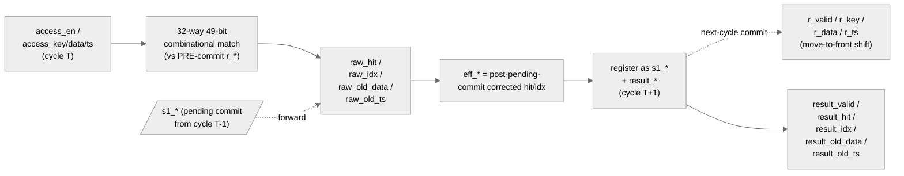

<!-- RTL Design Sherpa Documentation Header -->
<table>
<tr>
<td width="80">
  <a href="https://github.com/sean-galloway/RTLDesignSherpa">
    
  </a>
</td>
<td>
  <strong>RTL Design Sherpa</strong> · <em>Learning Hardware Design Through Practice</em><br>
  <sub>
    <a href="https://github.com/sean-galloway/RTLDesignSherpa">GitHub</a> ·
    <a href="https://github.com/sean-galloway/RTLDesignSherpa/blob/main/docs/DOCUMENTATION_INDEX.md">Documentation Index</a> ·
    <a href="https://github.com/sean-galloway/RTLDesignSherpa/blob/main/LICENSE">MIT License</a>
  </sub>
</td>
</tr>
</table>

---

<!-- End Header -->

# Monitor Bus LRU CAM (Pipelined)

**Module:** `monbus_cam_pipe.sv`
**Location:** `rtl/amba/shared/`
**Category:** Bulk-Trace Compression Infrastructure
**Status:** Production — replaces [`monbus_cam`](monbus_cam.md) inside the compressor

---

## Overview

`monbus_cam_pipe` is a **2-cycle pipelined variant** of
[`monbus_cam`](monbus_cam.md). It implements the same true-LRU CAM
semantics — same key/data/timestamp storage, same MRU-at-slot-0
move-to-front, same hit/idx/old_* result — but splits the
combinational match → priority-encode → commit chain into two registered
stages so the path closes at 100 MHz on Nexys A7.

It is the in-production CAM inside
[`monbus_compressor`](monbus_compressor.md). The single-cycle
`monbus_cam.sv` is retained as a reference design and as the algorithmic
oracle for unit tests.

```
single-cycle monbus_cam :  one cycle: compare → encode → commit + result
pipelined  monbus_cam_pipe : cycle T   : 32-way compare
                              cycle T+1 : priority-encode + commit + result reg
```

The latency cost is **+1 cycle**. Throughput is unchanged: a forwarding
network corrects each new lookup for the in-flight commit, so
back-to-back accesses see bit-exact `(hit, idx, old_data, old_ts)`
sequences identical to `monbus_cam`. Validated by
`val/amba/test_monbus_cam_pipe.py`.

---

## Top-level Interface

```systemverilog
module monbus_cam_pipe #(
    parameter int KEY_WIDTH  = 49,
    parameter int DATA_WIDTH = 64,
    parameter int TS_WIDTH   = 24,
    parameter int DEPTH      = 32
) (
    input  logic                    clk,
    input  logic                    rst_n,

    // Synchronous clear: invalidate all entries and flush the
    // lookup pipeline on the next edge. Lets the host rebase the
    // template table without asserting rst_n. Takes priority over
    // access_en.
    input  logic                    clear,

    // Access presented this cycle (one per cycle when access_en=1).
    input  logic                    access_en,
    input  logic [KEY_WIDTH-1:0]    access_key,
    input  logic [DATA_WIDTH-1:0]   access_new_data,
    input  logic [TS_WIDTH-1:0]     access_new_ts,

    // Result of the access presented LAST cycle.
    output logic                    result_valid,
    output logic                    result_hit,
    output logic [IDX_WIDTH-1:0]    result_idx,
    output logic [DATA_WIDTH-1:0]   result_old_data,
    output logic [TS_WIDTH-1:0]     result_old_ts,

    output logic                    cam_full,
    output logic [CNT_WIDTH-1:0]    cam_count
);
```

Differences from `monbus_cam`:

| Aspect | `monbus_cam` | `monbus_cam_pipe` |
|---|---|---|
| Latency | 0 (combinational lookup + commit) | 1 cycle |
| Throughput | 1 access/cycle | 1 access/cycle |
| Action selection | Caller drives `action[1:0]` | **Self-derived** from forwarded hit (TOUCH on hit, INSTALL on miss) |
| `clear` input | (added in same commit) | yes — sync invalidate + pipe flush |

The self-derived action drop matters: a pipelined caller cannot know
the hit at present-cycle time (exposing a combinational hit would
defeat the pipeline). The compressor always TOUCHes on hit and
INSTALLs on miss, so the CAM derives this internally and removes the
two action bits from its own port surface.

---

## Pipeline Diagram



The two registered stages are:

| Stage | Cycle | Work |
|---|---|---|
| 1 (compare) | T | 32-way 49-bit key compare against the **pre-commit** register array. Combinational priority encode picks the highest-numbered match (LRU side of the array, to keep the encoder ordering identical to the single-cycle module). |
| 2 (commit) | T+1 | Apply the *pending* commit from the previous access (move-to-front shift). Register the **forward-corrected** result of cycle T's access. Capture cycle T+1's access as the next pending commit. |

The cycle T+1 commit and the cycle T+1 result registration both
reference the same `r_*` snapshot, so the result reflects the array
state *after* the in-flight move-to-front.

---

## Forwarding (depth-1)

When access **A** is compared at cycle T+1, the previous access **P**
(captured at cycle T) is committing this same cycle. A's combinational
match sees the *pre-P* array, so the forward-correct adjustment is
needed:

| Case | Effect on A |
|---|---|
| `A.key == P.key` | P just wrote slot 0 with its new data/ts → A hits with `idx=0`, `old_data = P.new_data`, `old_ts = P.new_ts` |
| A matched the LRU entry that P evicted (full-CAM install) | A is now a miss (the evicted key is gone) |
| `A.raw_idx < P.shift_to` | A's entry shifted one slot down → `eff_idx = raw_idx + 1` |
| Otherwise | A's match position is unchanged |

`P.shift_to` and the actual commit shift both read the **same**
pre-commit `r_*` this cycle, so the forwarding and the commit always
agree. Bubbles (`access_en=0`) still let P commit and clear the
pending slot, so a later access sees a fully-committed array and no
forwarding is needed.

The end result: the `(hit, idx, old_data, old_ts)` output sequence
for any access trace is **byte-exact** with the single-cycle
`monbus_cam` for the same input trace (modulo the +1-cycle latency).
This is the property the equivalence test guards.

---

## Self-Derived Action

The two-bit `access_action` port from `monbus_cam` is gone. Instead:

```text
s1_action = eff_hit ? ACTION_TOUCH : ACTION_INSTALL  (registered)
```

On a hit, the matched entry moves to slot 0 with the new data/ts
written through (TOUCH). On a miss, a new entry is installed at slot 0
(INSTALL), evicting the LRU if the CAM is full. The caller cannot
suppress the commit — every `access_en=1` cycle is a commit.

For the compressor this is exactly the desired behavior: every record
TOUCHes on hit and INSTALLs on a CAM miss; the previous CAM's
`ACTION_NONE` lookups were not used in production. If a future caller
needs lookups without commits, it would need a separate input port
gating the commit (not present today).

---

## Synchronous Clear

`clear` is a single-cycle synchronous reset:

- All `r_valid[i]` cleared (so the CAM appears empty next cycle).
- `r_count` zeroed.
- `s1_valid` cleared (any pending commit is dropped).
- `result_valid` cleared (any in-flight result is dropped).
- Storage (`r_key`, `r_data`, `r_ts`) is **not** cleared — it's
  ignored while `r_valid[i]=0` so leaving it stale is harmless.

`clear` takes priority over `access_en`: an access pulse arriving in
the same cycle as a clear is dropped. The host should hold `clear`
high for one cycle while the upstream compression source is idle,
which is the contract for the Stream `CTRL[4]` bit driving this
through the monbus group wrapper.

---

## Verification

```bash
pytest val/amba/test_monbus_cam_pipe.py -v
```

The test drives random access traces through both `monbus_cam` and
`monbus_cam_pipe` in parallel and asserts the `(hit, idx, old_data,
old_ts)` sequence matches cycle-for-cycle (modulo the +1-cycle
latency on the pipelined side). Both modules are fed from the same
random key/data/ts stream so any divergence shows up immediately.

Additional coverage:
- `test_monbus_compressor.py` — uses `monbus_cam_pipe` end-to-end
  inside the compressor and cross-checks the slot stream against the
  Python golden encoder.
- `test_monbus_axil_axil_group_compressed.py` — same coverage at the
  group-wrapper level, including window wrap.

---

## Related Modules

| Module | Role |
|---|---|
| [`monbus_cam`](monbus_cam.md) | Single-cycle reference design — same LRU semantics, used by the unit-test oracle |
| [`monbus_compressor`](monbus_compressor.md) | Production caller of this CAM |
| [`monbus_group` family](monbus_group.md) | Host of the compressor + master writer |
