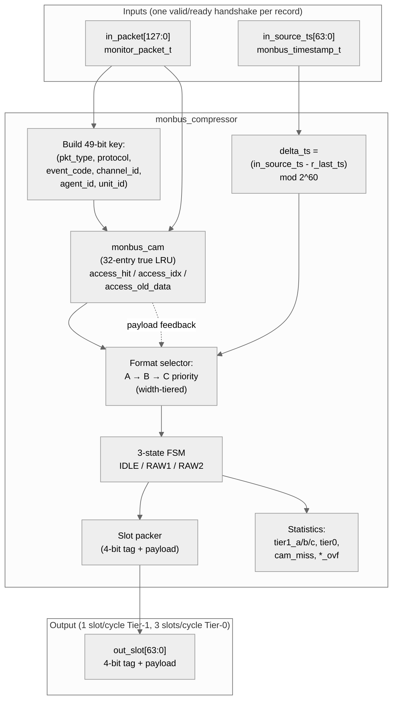

<!-- RTL Design Sherpa Documentation Header -->
<table>
<tr>
<td width="80">
  <a href="https://github.com/sean-galloway/RTLDesignSherpa">
    
  </a>
</td>
<td>
  <strong>RTL Design Sherpa</strong> · <em>Learning Hardware Design Through Practice</em><br>
  <sub>
    <a href="https://github.com/sean-galloway/RTLDesignSherpa">GitHub</a> ·
    <a href="https://github.com/sean-galloway/RTLDesignSherpa/blob/main/docs/DOCUMENTATION_INDEX.md">Documentation Index</a> ·
    <a href="https://github.com/sean-galloway/RTLDesignSherpa/blob/main/LICENSE">MIT License</a>
  </sub>
</td>
</tr>
</table>

---

<!-- End Header -->

# Monitor Bus Compressor

**Module:** `monbus_compressor.sv`
**Location:** `rtl/amba/shared/`
**Category:** Bulk-Trace Compression
**Status:** Production Ready

---

## Overview

`monbus_compressor` is a **hardware bulk-trace encoder** for the monitor bus.
It consumes streamed `(monitor_packet_t, monbus_timestamp_t)` records, exploits the
heavy templating that real workloads exhibit, and emits a 64-bit slot stream that
compresses by roughly **2.6×** with **byte-identical** equivalence to a Python
golden encoder.

The compressor sits in front of the master writer inside the
[`monbus_group` family](monbus_group.md) when a wrapper opts in via the
`USE_COMPRESSION=1` parameter. The slot stream is what eventually lands in the
SRAM dump ring on the FPGA, so smaller slots → longer recording windows
in the same memory budget.

The format was **locked** at commit `5bbb83d1` after a sweep across CAM sizes
and a real-silicon validation run on a Nexys A7. Once locked, the slot stream
is *the* wire format — any RTL change here that diverges from the Python
golden constitutes a regression.

---

## Why Compress Monitor Traces?

A 128-bit monitor packet plus a 64-bit timestamp is 24 bytes per event. At
even modest event rates (a few million events/sec), an AXI4 monitor running
all packet types enabled can saturate a 32-bit AXIL writer's bandwidth and
fill a typical SRAM dump region in milliseconds.

**The key observation behind this compressor:** real workloads are *extremely*
repetitive at the monitor-packet level. In the locked validation dataset
(`desc_axi_16desc_8ch_1MB`, 682 records of descriptor-fetch traffic):

| Metric | Value |
|---|---|
| Distinct `(pkt_type, protocol, event_code, channel_id, agent_id, unit_id)` tuples | **32** (4.7 % unique) |
| Records emitted | 682 |
| Compression ratio | **2.66×** |
| Tier-1 hit rate | **93.5 %** |
| Tier-0 escapes | 6.5 % (44 records) |

The 32 distinct "templates" fit *exactly* in a 32-entry CAM. Going wider buys
zero incremental hits on this workload. That's the design point.

---

## Architecture



Source: [`monbus_compressor.mmd`](../../assets/RTLAmba/monbus_compressor.mmd)



---

## Top-level Interface

```systemverilog
module monbus_compressor
    import monitor_common_pkg::*;
(
    input  logic                  clk,
    input  logic                  rst_n,

    // Records in (one valid/ready handshake)
    input  logic                  in_valid,
    output logic                  in_ready,
    input  monitor_packet_t       in_packet,      // 128 bits
    input  monbus_timestamp_t     in_source_ts,   // 64 bits

    // Slots out (one valid/ready handshake)
    output logic                  out_valid,
    input  logic                  out_ready,
    output logic [63:0]           out_slot,

    // Statistics counters (combinational from registers)
    output logic [31:0]           stat_tier1_a,
    output logic [31:0]           stat_tier1_b,
    output logic [31:0]           stat_tier1_c,
    output logic [31:0]           stat_tier0,
    output logic [31:0]           stat_cam_miss,
    output logic [31:0]           stat_delta_ts_ovf,
    output logic [31:0]           stat_event_data_ovf,
    output logic [31:0]           stat_ed_delta_ovf
);
```

No parameters — every dimension (CAM size, key width, slot format) is locked
to match the Python golden.

---

## Compression Techniques

The compressor combines four ideas, applied in priority order per record:

1. **Template extraction with CAM-backed indexing**
2. **Delta-encoding of the timestamp**
3. **Width-tiered payload encoding** (Tier-1 formats A/B/C)
4. **Differential encoding of the payload** (Tier-1 format C for monotonic
   counters / sequential addresses)
5. **Tier-0 RAW escape** when none of the above apply

Each successful Tier-1 encoding squeezes 24 bytes (raw record) into 8 bytes
(one slot) — that's the 3× upper bound. The 2.66× achieved ratio reflects
the 6.5 % escape rate, plus the framing overhead in Tier-0.

### 1. Template extraction

The 128-bit monitor packet has six "low-entropy" fields that repeat
heavily across events generated by the same logical agent:

| Field | Bits | Description |
|---|---|---|
| `packet_type` | 4 | error / timeout / completion / threshold / perf / debug |
| `protocol` | 4 | AXI / AXIS / APB / CORE |
| `event_code` | 8 | sub-category within packet type |
| `channel_id` | 9 | per-engine channel identifier |
| `agent_id` | 16 | per-IP agent identifier |
| `unit_id` | 8 | sub-unit within an IP |
| **template key total** | **49** | |

Two events from the same agent reporting the same condition share all 49 bits.
The only differences cycle-to-cycle are the 64-bit `event_data` field
(addresses, counters, byte counts) and the timestamp. The compressor identifies
each template once, assigns it a **5-bit `tmpl_idx`** (0..31), and from then on
sends only `(tmpl_idx, event_data, delta_timestamp)` instead of the full
49-bit key.

The mapping `(key) → tmpl_idx` lives in a 32-entry **caching CAM**
([`monbus_cam`](monbus_cam.md)). Both the encoder and the decoder maintain
the same CAM state, driven by identical (action, key, data) sequences derived
from the slot stream. No out-of-band table sync is required — the slot stream
is self-describing.

### 2. Delta-encoded timestamp

Absolute timestamps need 60 bits to cover practical recording windows
(2⁶⁰ cycles ≈ 117 days at 100 MHz). Deltas between consecutive events on the
same monitor bus rarely exceed a few thousand cycles in the steady state, so
the delta requires only 15 to 23 bits.

```
delta_ts = (current_source_ts - r_last_ts) & ((1 << 60) - 1)
```

The 60-bit modulo handles natural wrap. `r_last_ts` is updated on **every**
record encoded (Tier-0 and Tier-1 alike), so the decoder can rebuild the
absolute timestamp from a chain of deltas without losing precision.

### 3. Width-tiered Tier-1 formats

Three Tier-1 slot formats each cover a different `(delta_ts_width,
event_data_width)` trade-off. The encoder picks the **first one that fits**
in this priority order:

| Format | Tag | `tmpl_idx` | `delta_ts` | `event_data` | Notes |
|---|---|---|---|---|---|
| **A** | `0x1` | 5b @ [59:55] | 15b @ [54:40] | 40b @ [39:0] | Common case |
| **B** | `0x2` | 5b @ [59:55] | 23b @ [54:32] | 32b @ [31:0] | Big delta_ts |
| **C** | `0x3` | 5b @ [59:55] | 15b @ [54:40] | 40b @ [39:0] **signed delta** | Monotonic counters |

The choice is governed by:

```text
delta_ts ≤ 2¹⁵−1  AND  event_data ≤ 2⁴⁰−1   → Format A (most common)
delta_ts ≤ 2²³−1  AND  event_data ≤ 2³²−1   → Format B
delta_ts ≤ 2¹⁵−1  AND  ed_delta in [-2³⁹, 2³⁹−1]  → Format C
otherwise                                    → Tier-0 escape
```

**Format A** assumes the agent has been active recently (delta_ts < ~328 µs
@ 100 MHz) and reports an `event_data` value that fits in 40 bits. This
covers most steady-state traffic where the same template keeps firing.

**Format B** handles longer idle periods — up to ~84 ms between events on the
same template. The `event_data` budget shrinks from 40 to 32 bits, which still
covers most addresses on 32-bit address spaces.

**Format C** is the differential payload encoder, described next.

### 4. Differential payload encoding (Format C)

For monotonically increasing counters (transaction counts, accumulated
byte totals, sequential addresses), absolute `event_data` may exceed 40 bits
but the *delta* between consecutive events on the same template fits in 40
signed bits. Format C exploits this:

```text
ed_delta = event_data - CAM[tmpl_idx].last_event_data       # signed
if (-2³⁹) ≤ ed_delta < 2³⁹:
    emit Format C slot containing (tmpl_idx, delta_ts, ed_delta)
    update CAM[tmpl_idx].last_event_data = event_data
```

The encoder records the previous `event_data` per template (stored as
the CAM's **payload** field — 64 bits per slot). The decoder maintains the
same CAM, so when it sees a Format C slot it reconstructs:

```text
event_data = CAM[tmpl_idx].last_event_data + ed_delta
```

The locked validation dataset has 0 Format C hits — descriptor-fetch traffic
isn't monotonic enough. But for stream-data or descriptor-write traces, this
format kicks in heavily.

### 5. Tier-0 RAW escape

If none of the Tier-1 formats fit (CAM miss, or delta_ts > 8M cycles, or
event_data > 2⁴⁰), the compressor falls back to a 3-beat RAW record:

```
beat 0 (tag = 0x0):  [63:60] = 0x0  | [59:0] = source_ts[59:0]
beat 1            :  packet[127:64]
beat 2            :  packet[63:0]
```

On a Tier-0 escape **caused by a CAM miss**, the encoder also **installs**
the new template at the MRU position of the CAM (evicting the LRU if the CAM
is full). The decoder does the identical install on its side, so subsequent
Tier-1 references to the new `tmpl_idx` resolve correctly.

On a Tier-0 escape **caused by an overflow** (delta_ts or event_data too
big), the encoder does NOT re-install — the key was already in the CAM with
the right `tmpl_idx`, and the escape is just a 3-beat fallback for the one
unusually-large record. Statistics counters record which overflow reason
caused each escape, so the host can tell the difference.

---

## Slot Bit Layouts

The 64-bit slot is always self-describing through the 4-bit tag in `[63:60]`:

```
Tag 0x0 — RAW (Tier-0 escape, 3 beats total)
  beat 0:   [63:60] tag=0x0
            [59:0]  source_ts[59:0]
  beat 1:   packet[127:64]
  beat 2:   packet[63:0]

Tag 0x1 — Tier-1 Format A (1 beat)
  beat 0:   [63:60] tag=0x1
            [59:55] tmpl_idx[4:0]
            [54:40] delta_ts[14:0]
            [39:0]  event_data[39:0]

Tag 0x2 — Tier-1 Format B (1 beat)
  beat 0:   [63:60] tag=0x2
            [59:55] tmpl_idx[4:0]
            [54:32] delta_ts[22:0]
            [31:0]  event_data[31:0]

Tag 0x3 — Tier-1 Format C (1 beat)
  beat 0:   [63:60] tag=0x3
            [59:55] tmpl_idx[4:0]
            [54:40] delta_ts[14:0]
            [39:0]  ed_delta[39:0]  (signed)

Tags 0x4-0xF — Reserved (decoder must error on these)
```

The decoder reads one 64-bit slot, inspects bits `[63:60]`, and knows
immediately whether to read 0 more beats (Tier-1) or 2 more beats
(Tier-0 RAW). No lookahead is required.

---

## CAM Design

The 32-entry caching CAM lives in
[`rtl/amba/shared/monbus_cam.sv`](monbus_cam.md). It is a **true LRU** CAM
with position-indexed storage — the position rank IS the `tmpl_idx`. This
matters because both encoder and decoder must agree on the rank assignment
when they install or touch a template, and position-indexed storage makes
the rank update trivially atomic with the storage update.

**Per-entry size:**

| Field | Bits |
|---|---|
| valid | 1 |
| key (concatenated 6-tuple) | 49 |
| last_event_data | 64 |
| position rank | 5 |
| **total per entry** | **119** |

**Total CAM storage:** 32 entries × 119 bits ≈ **3.8 Kb (~480 bytes)**.

The CAM exposes three actions on its single access port:

| Action | Encoding | Effect |
|---|---|---|
| `ACTION_NONE` | `2'b00` | Lookup only, no state change |
| `ACTION_TOUCH` | `2'b01` | Matched entry moves to MRU, `last_event_data` updated |
| `ACTION_INSTALL` | `2'b10` | New entry installed at MRU (evicts LRU if full) |

The compressor's FSM issues `TOUCH` after Tier-1 hits, `INSTALL` after Tier-0
escapes caused by a CAM miss, and `NONE` during the slot 1 / slot 2 of a
Tier-0 RAW expansion.

---

## Encoder Decision Tree

Per input record (one cycle):

```text
1. Build the 49-bit template key from in_packet.
   Compute event_data = in_packet[63:0] (the lower 64 bits).
   Compute delta_ts = (in_source_ts - r_last_ts) & ((1 << 60) - 1).

2. CAM lookup (combinational):
   - MISS  → Tier-0 escape
              Issue ACTION_INSTALL on the CAM (key, event_data).
              FSM enters S_RAW1 → S_RAW2; emits 3 slots over 3 cycles.
              Bump stat_cam_miss + stat_tier0.

   - HIT(idx) → continue to step 3.

3. Try Tier-1 formats A → B → C in order:

   A. if delta_ts < 2¹⁵  AND  event_data < 2⁴⁰:
        emit Format A slot, ACTION_TOUCH with new event_data.
        Bump stat_tier1_a.
        r_last_ts ← in_source_ts. Done.

   B. else if delta_ts < 2²³  AND  event_data < 2³²:
        emit Format B slot, ACTION_TOUCH.
        Bump stat_tier1_b.
        r_last_ts ← in_source_ts. Done.

   C. else if delta_ts < 2¹⁵:
        ed_delta = event_data - CAM[idx].last_event_data    (signed)
        if -2³⁹ ≤ ed_delta < 2³⁹:
            emit Format C slot, ACTION_TOUCH.
            Bump stat_tier1_c.
            r_last_ts ← in_source_ts. Done.

   else:
        Tier-0 escape (CAM hit but record didn't fit any Tier-1).
        Do NOT install (key already in CAM).
        Bump stat_delta_ts_ovf / stat_event_data_ovf / stat_ed_delta_ovf
        depending on which overflow was the trigger, + stat_tier0.
```

The format-selector logic is combinational on cycle 0; the slot emission
and CAM state update happen on the same clock edge.

---

## Pipeline and Timing

The encoder is split into **2 registered stages** (1 in, 1 register
in the middle, 1 out — net latency 2 cycles). Throughput is unchanged
from the original single-cycle design.

| Stage | Logic |
|---|---|
| 1 — lookup / commit | key build → CAM lookup → CAM commit (including per-template `last_ts` update via `access_new_ts`) |
| 2a — encode register (`q_*`) | delta_ts (per-template) / fits / format-select / slot pack — REGISTERED |
| 2b — output | drive the slot(s); RAW (tier-0) 3-beat expansion |

| Path | Latency | Throughput |
|---|---|---|
| Tier-1 record (CAM hit, Tier-1 fits) | 1 record → 1 slot, 2 cycles in flight | 1 record / cycle |
| Tier-0 record (CAM miss, or all Tier-1 overflow) | 1 record → 3 slots, 2 cycles + 2 RAW beats | 1 record / 3 cycles |

There is **no CAM read-after-write hazard**: the commit action depends
only on hit/miss (the stage-1 lookup), not on the stage-2 format. The
next record's lookup one cycle later sees the committed state —
exactly as in the single-cycle design. Bit-exact slot stream against
the Python golden either way.

### Per-template `delta_ts`

Earlier revisions measured `delta_ts` against a single global
`r_last_ts`. With interleaved templates from multiple sources (the
4-channel STREAM characterization case), that global delta could go
apparently-negative between two interleaved templates and escape to
raw — collapsing compression.

The current encoder measures `delta_ts` against **the matched CAM
entry's stored `last_ts`** (`cam_access_old_ts`), and writes back the
current record's `source_ts[23:0]` to that slot via `access_new_ts` in
the same cycle. The CAM's per-entry `r_ts[TS_WIDTH=24]` shifts in
lockstep with the LRU move-to-front. The Python encoder/decoder were
updated in lockstep — 24 / 24 golden + 1 / 1 RTL compressor + 3 / 3
group cosim tests pass, bit-exact.

`TS_STORE_BITS = 24`. Format-B (the 23-bit-delta format) needs 24 to
*detect* its overflow — 16 silently aliases large gaps to wrong
encodes.

### Input skid

A 2-deep `gaxi_skid_buffer` registers the `(source_ts, packet)` feed
into the compressor. The monbus aggregator's output skid sits far
from this compressor's CAM in the Nexys A7 floorplan, and aggregator
→ in_key → 32-way CAM match/commit was the route-dominated 100 MHz
worst path (WNS swung ±0.25 ns on placement alone). The input skid
ends that long hop at a local flop.

### pblock (Nexys A7 build only)

The expanded per-template CAM (32 entries × `TS_STORE_BITS=24`)
crowded the descriptor monitor's column on Nexys A7 and pushed its
internal `trans_mgr/u_cam → r_alloc_cnt` path route-bound. The
characterization build adds a `pblock_monbus` constraint pinning
the monbus group to `CLOCKREGION_X0Y2:X0Y3` (out of column X1), so
the monitor can recompact. The monitor → group crossing is registered
through the input skid above, so the longer inter-region hop is fine.
100 MHz closes (WNS +0.012 ns, 0 failing endpoints).
See `projects/NexysA7/stream_characterization/` for the constraint
file and floorplan details.

---

## Verification Methodology

The acceptance criterion is **byte-identical equivalence** between the RTL
slot stream and the Python golden encoder
(`bin/TBClasses/monbus/monbus_compressor.py`) for the same input record
sequence. There is no other golden — the Python class IS the spec.

Two layers of validation:

### 1. Unit-level (the compressor in isolation)

```bash
pytest val/amba/test_monbus_compressor.py -v
```

Two phases:
- **Phase 1:** small synthesized stream that exercises all 4 slot tags and
  CAM eviction. ~9 slots, easy to debug.
- **Phase 2:** the real-silicon dataset `desc_axi_16desc_8ch_1MB.json`
  (682 records → 770 golden slots). Cross-checks each slot bit-exact, plus
  asserts the per-tier statistics counters match the Python encoder's per-tier
  counts exactly.

```text
$ pytest val/amba/test_monbus_compressor.py -v
...
INFO  records=682, golden_slots=770
INFO  rtl_a=628, rtl_b=10, rtl_c=0, tier0=44
INFO  === Phase 2: PASS ===
INFO  === ALL PHASES PASSED ===
```

### 2. Integration-level (compressor + AXIL writer + base/limit wrap)

```bash
pytest val/amba/test_monbus_axil_axil_group_compressed.py -v
```

Three phases:
- Generous window (no wrap): 9 slots from the synthesized stream
- Tight 8-slot window: forces a mid-stream wrap back to `cfg_base_addr`
- Real-silicon dataset: 770 slots through the full `monbus_axil_axil_group`
  with `USE_COMPRESSION=1`

Both layers run as part of the standard amba regression and must pass before
any compressor change merges.

---

## Statistics Counters

Each output stat is a 32-bit registered counter. They saturate (do not wrap)
at `0xFFFF_FFFF` so a long-running capture never silently rolls back to 0.

| Counter | Increments when |
|---|---|
| `stat_tier1_a` | Format A slot emitted |
| `stat_tier1_b` | Format B slot emitted |
| `stat_tier1_c` | Format C slot emitted |
| `stat_tier0` | Tier-0 RAW escape emitted (3 slots) |
| `stat_cam_miss` | Tier-0 escape caused by CAM miss |
| `stat_delta_ts_ovf` | Tier-0 escape caused by delta_ts > 2²³ |
| `stat_event_data_ovf` | Tier-0 escape caused by event_data > 2⁴⁰ (delta_ts fit) |
| `stat_ed_delta_ovf` | Tier-0 escape caused by ed_delta out of ±2³⁹ |

The host firmware reads these via a configurable register block at the end
of a capture run to characterize compression effectiveness per workload. The
ratio `(stat_tier1_a + stat_tier1_b + stat_tier1_c) / total_records` is the
hit rate; on the validation dataset it's 93.5 %.

---

## Validation Numbers (locked dataset)

Workload: `desc_axi_16desc_8ch_1MB` — 8 channels × 16 descriptors × 1 MB
DMA, descriptor-fetch monitor on a Nexys A7.

| Metric | Value |
|---|---|
| Input records | 682 |
| Output slots | 770 |
| Compression ratio | **2.66×** |
| Tier-1 A hits | 628 (92.1 %) |
| Tier-1 B hits | 10 (1.5 %) |
| Tier-1 C hits | 0 (0 %) |
| Tier-0 escapes | 44 (6.5 %) |
| ┕ caused by CAM miss | 32 |
| ┕ caused by delta_ts overflow | 12 |
| ┕ caused by event_data overflow | 0 |
| ┕ caused by ed_delta overflow | 0 |
| Distinct templates seen | 32 (perfectly fits CAM=32) |

The dataset and acceptance recipe live at
[`projects/NexysA7/stream_characterization/reports/compression_dataset/`](https://github.com/sean-galloway/RTLDesignSherpa/tree/main/projects/NexysA7/stream_characterization/reports/compression_dataset).

---

## Related Modules

| Module | Role |
|---|---|
| [`monbus_cam`](monbus_cam.md) | 32-entry LRU CAM (template index store) |
| [`monbus_group` family](monbus_group.md) | Host of the compressor, plus the master writer that drains slots to memory |
| [`sdpram_slave_axil_axil`](sdpram_slave.md) | Typical SRAM-ring backend for the compressed slot stream |
| `bin/TBClasses/monbus/monbus_compressor.py` | Python golden encoder/decoder — the format spec |

---

## Test

- **Acceptance (byte-identical vs golden):** `val/amba/test_monbus_compressor.py`
- **End-to-end (with AXIL writer + wrap):** `val/amba/test_monbus_axil_axil_group_compressed.py`
- **CAM sub-module:** `val/amba/test_monbus_cam.py`

Run all three:

```bash
pytest val/amba/test_monbus_cam.py \
       val/amba/test_monbus_compressor.py \
       val/amba/test_monbus_axil_axil_group_compressed.py -v
```
