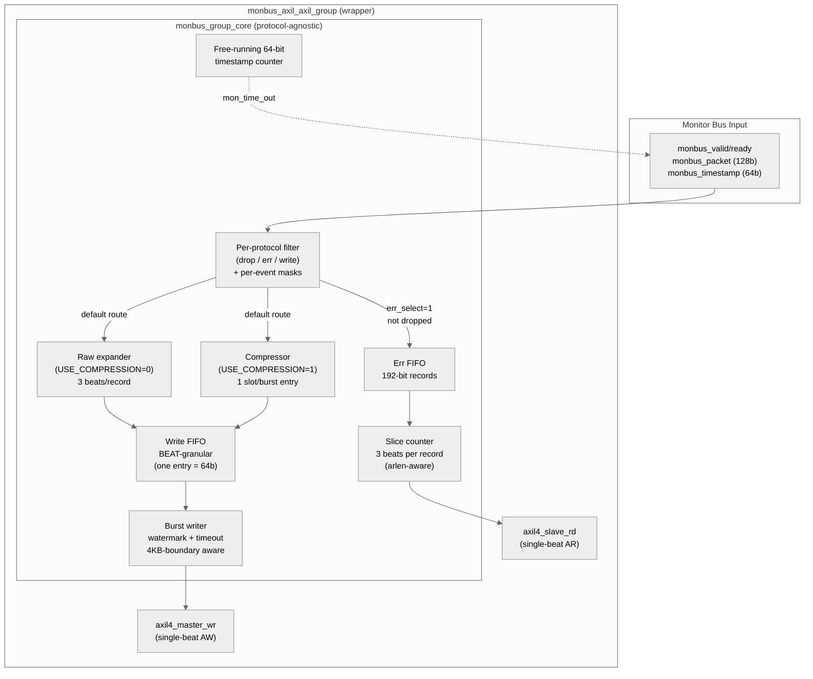

<!-- RTL Design Sherpa Documentation Header -->
<table>
<tr>
<td width="80">
  <a href="https://github.com/sean-galloway/RTLDesignSherpa">
    
  </a>
</td>
<td>
  <strong>RTL Design Sherpa</strong> · <em>Learning Hardware Design Through Practice</em><br>
  <sub>
    <a href="https://github.com/sean-galloway/RTLDesignSherpa">GitHub</a> ·
    <a href="https://github.com/sean-galloway/RTLDesignSherpa/blob/main/docs/DOCUMENTATION_INDEX.md">Documentation Index</a> ·
    <a href="https://github.com/sean-galloway/RTLDesignSherpa/blob/main/LICENSE">MIT License</a>
  </sub>
</td>
</tr>
</table>

---

<!-- End Header -->

# Monitor Bus Group Family

**Modules:**
- `monbus_group_core.sv` — protocol-agnostic backend (filter, FIFOs, watermark/timeout burst writer, slice-counter slave-read drain)
- `monbus_axil_axil_group.sv` — wrapper: AXIL slave-read + AXIL master-write
- `monbus_axil_axi4_group.sv` — wrapper: AXIL slave-read + AXI4-burst master-write
- `monbus_axi4_axil_group.sv` — wrapper: AXI4-burst slave-read + AXIL master-write
- `monbus_axi4_axi4_group.sv` — wrapper: AXI4-burst slave-read + AXI4-burst master-write

**Location:** `rtl/amba/shared/`
**Category:** Monitor Bus → AXI / AXIL Aggregation
**Status:** Production Ready

---

## Overview

The `monbus_group` family is the **delivery layer** for the monitor bus.
It takes a single monbus stream — already arbitrated upstream if multiple
sources need to be merged — and:

1. **Filters** packets per protocol (drop / route-to-err-FIFO / route-to-write-FIFO)
2. **Drains** the error FIFO over a slave-read port for CPU IRQ handlers
3. **Streams** the write FIFO over a master-write port into a memory ring
4. **Optionally compresses** the write-path traffic before it lands in memory
   (gated by `USE_COMPRESSION=1`)

The family replaces the previous single `monbus_axil_group.sv` module. The
new design exposes the same behavior under four protocol-permutation
wrappers, so callers can pick the exact slave/master shape their fabric
demands without tying off "fake AXI4" fields on AXIL sides.

---

## Architecture

The diagram below is for the AXIL/AXIL variant; the other three wrappers
are structurally identical except for the leaf skids and the FUB-to-leaf
bridge (e.g., `axi4_slave_rd` instead of `axil4_slave_rd`).



The module has **no built-in arbitration** — it is a single-input block.
Callers with N upstream sources (e.g., RAPIDS source+sink) instantiate a
separate `monbus_arbiter` upstream to merge their streams before feeding
the group. Keeping arbitration orthogonal to capture means the family
never has to duplicate the arbiter for each consumer's input count.

---

## Why one core + four wrappers?

SystemVerilog cannot conditionally include or exclude ports from a
single module's port list. The port list is a static syntactic
construct, fixed at module declaration. So to give each protocol
combination an exact port shape — no spurious AXI4-only fields for the
caller to tie off — the family is split:

- **One common backend** (`monbus_group_core.sv`) carries the filter,
  FIFOs, watermark/timeout burst-writer FSM, slice-counter drain, and
  optional compressor. Its FUBs are AXI4-shaped on both sides (id /
  awlen / awsize / awburst / wlast / arlen / rlast / etc.). AXIL
  wrappers feed single-beat defaults (`len=0`, `size=3`, `burst=INCR`,
  `id=0`) and force `MAX_BURST_BEATS=1`.
- **Four thin wrappers**, each with the right protocol-shaped port
  list, that directly instantiate the matching leaf skids
  (`axi4_slave_rd` / `axil4_slave_rd` and `axi4_master_wr` /
  `axil4_master_wr`) and bridge their FUBs to the core's FUB.

| Wrapper | Slave-read shape | Master-write shape | `MAX_BURST_BEATS` (default) |
|---|---|---|---|
| `monbus_axil_axil_group` | AXIL `s_axil_ar*/r*` | AXIL `m_axil_aw*/w*/b*` | 1 |
| `monbus_axil_axi4_group` | AXIL `s_axil_ar*/r*` | AXI4 `m_axi_aw*/w*/b*` (full) | 64 |
| `monbus_axi4_axil_group` | AXI4 `s_axi_ar*/r*` (full) | AXIL `m_axil_aw*/w*/b*` | 1 |
| `monbus_axi4_axi4_group` | AXI4 `s_axi_ar*/r*` (full) | AXI4 `m_axi_aw*/w*/b*` (full) | 64 |

Callers pick the wrapper module name matching their fabric. The bare
`monbus_group_core` is not intended to be instantiated directly — its
AXI4-shaped FUBs are an internal contract.

---

## Common Parameters

All wrappers expose the same set of behavioral knobs (per-wrapper
parameters like `AXI_ID_WIDTH` / `AXI_USER_WIDTH` are only present
where at least one side is AXI4):

| Parameter | Default | Notes |
|---|---|---|
| `FIFO_DEPTH_ERR` | 64 | Error FIFO depth, in **records** (192-bit entries). |
| `FIFO_DEPTH_WRITE` | 96 | Write FIFO depth, in **beats** (64-bit entries). 96 beats = 32 raw records. |
| `ADDR_WIDTH` | 32 | Address width on both slave and master ports. |
| `FLUSH_TIMEOUT_CYCLES` | 1024 | Cycles since the last accepted W handshake before the writer fires a timeout-driven flush. |
| `MAX_BURST_BEATS` | 1 (AXIL master) / 64 (AXI4 master) | Maximum beats per master-write burst. AXI4 protocol max is 256. |
| `NUM_PROTOCOLS` | 3 | Informational — AXI, AXIS, CORE filter configs are unconditional. |
| `USE_COMPRESSION` | 0 | 0 = raw 3-beat-per-record path; 1 = `monbus_compressor` + per-slot path. |
| `SKID_DEPTH_AR/R/AW/W/B` | 2/4/2/2/2 | Skid buffer depths for each channel. AXI4 wrappers default `SKID_DEPTH_W=4` to absorb burst W bursts. |

---

## Beat Layout

The write-FIFO and slave-read drain are **beat-granular** (one queue
entry = one 64-bit beat). Two emit modes:

### `USE_COMPRESSION = 0` (default — raw 3-beat-per-record writer)

Each accepted monbus record becomes three sequential 64-bit beats in
the write FIFO:

```
beat 0 = {tag[3:0]=4'h0, source_ts[59:0]}
beat 1 = packet[127:64]
beat 2 = packet[63:0]
```

The expander is **atomic per record**: once it commits to driving the
ts beat, it drives beats 1 and 2 before accepting a new record. This
means partial records never appear in the FIFO, and the
master-write burst writer can safely round burst lengths down to a
multiple of 3.

The `tag` nibble in beat 0 is reserved for future on-the-wire format
variants. The current writer hardwires it to `4'h0` (raw).

### `USE_COMPRESSION = 1` (CAM-backed bulk-trace compressor)

`monbus_compressor` consumes `(packet, source_ts)` records via its
in-handshake and emits 64-bit self-tagged slots via its
out-handshake. Each slot becomes one beat directly in the write
FIFO. Slot tags (bits `[63:60]`):

```
4'h0 = raw expansion beat (Tier-0 fallback)
4'h1 = Tier-1 format A
4'h2 = Tier-1 format B
4'h3 = Tier-1 format C
4'h4..4'hF = reserved
```

See [`monbus_compressor.md`](monbus_compressor.md) for the encoder's
internal state and the byte-exact Python golden.

### Slave-read drain (both modes)

The slave-read port returns the same 3-beat layout per err-FIFO
record, sliced by an internal counter. In AXI4 mode, `arlen+1` beats
are emitted across the burst with `rlast` asserting on the final
beat; the slicer advances through records, and the FIFO entry is
popped only when slice 2 (`SLICE_PKT_LO`) fires. In AXIL mode each
AR returns one beat.

---

## Master-Write Behavior

The burst writer fires when **either**:

- `flush_trigger_watermark`: `write_fifo_count >= cfg_flush_watermark`
- `flush_trigger_timeout`: `r_timeout_cnt >= FLUSH_TIMEOUT_CYCLES`

…and at least `BEATS_PER_UNIT` beats are available (3 in raw mode, 1
in compressed mode).

Each flush trigger launches a **drain cycle** that emits a planned
number of beats out of the master port. The drain cycle is sized in
two stages:

```
// Stage 1: drain-cycle plan -- total beats to emit this cycle.
//          MAX_BURST_BEATS is NOT a cap here.
beats = min(write_fifo_count,
            beats_to_limit,   // staying inside cfg_limit_addr
            beats_to_4kb)     // staying inside an AXI4 4KB boundary
beats_planned_units = floor(beats / BEATS_PER_UNIT) * BEATS_PER_UNIT

// Stage 2: per-AW sub-burst size inside the FSM.
//          MAX_BURST_BEATS caps each AW. The drain cycle issues
//          ceil(beats_planned_units / MAX_BURST_BEATS) sub-bursts.
sub_burst_beats = min(remaining_in_cycle, MAX_BURST_BEATS)
awlen = sub_burst_beats - 1
```

The two-stage structure is what makes the family work for both AXIL
(`MAX_BURST_BEATS = 1`) and AXI4 (`MAX_BURST_BEATS` up to 256) masters
in raw mode (`BEATS_PER_UNIT = 3`):

- **AXI4 master, raw mode:** one drain cycle ~= one large sub-burst,
  e.g. 24 beats = 8 records in a single AW + 24 x W + B. Throughput-
  optimal.
- **AXIL master, raw mode:** one drain cycle = N single-beat sub-bursts.
  Each record requires three AW + 1 x W + B handshakes at consecutive
  addresses. The memory image is identical to the AXI4 case; only the
  address-channel handshake count differs.

If `beats_planned_units` would be zero (e.g. `r_wr_addr` is below
`cfg_base_addr` or beyond `cfg_limit_addr`), the writer **rewinds**
`r_wr_addr` to `cfg_base_addr` and re-evaluates. The geometry math is
computed against a pre-rewound `geom_addr` so the first flush after
reset (when `r_wr_addr=0`) doesn't deadlock.

`awsize` is fixed at 3 (8 bytes per beat) and `awburst` at INCR
(`2'b01`). `awlen` is `sub_burst_beats - 1`. `wlast` asserts on the
final beat of each sub-burst.

> **Note (2026-06-11):** The previous design folded `MAX_BURST_BEATS`
> into the drain-cycle plan, which deadlocked the writer for the
> AXIL-master / raw-mode case (`min(1, 3) = 1`, rounded to 3-multiple
> = 0). See the resolved bug for the rationale behind the two-stage
> split — the AXIL master now correctly emits one record as three
> single-beat sub-bursts.

---

## Per-Protocol Filter Configuration

The filter is configured per protocol (AXI, AXIS, CORE). For each
protocol the caller provides:

- `cfg_<proto>_pkt_mask[15:0]` — drop the packet if the bit at
  `pkt_type` is set.
- `cfg_<proto>_err_select[15:0]` — route to the err FIFO if the bit at
  `pkt_type` is set (and not dropped). All other surviving packets go
  to the write FIFO.
- `cfg_<proto>_<event_type>_mask[15:0]` — per-event-code mask. If the
  bit at `event_code[3:0]` is set, the packet is dropped regardless
  of the above. Per-protocol event categories differ:
  - **AXI:** error, timeout, compl, thresh, perf, addr, debug
  - **AXIS:** error, timeout, compl, credit, channel, stream
  - **CORE:** error, timeout, compl, thresh, perf, debug

Per-event masks are 16 bits but only `event_code[3:0]` indexes; codes
≥ 16 are treated as "not in mask range" (no masking applied).
Protocols not in the supported set (APB=2, ARB=3) are always
dropped.

---

## Sub-modules Instantiated

| Sub-module | Role |
|---|---|
| `axi4_slave_rd` / `axil4_slave_rd` | Slave-read skid (one per wrapper) |
| `axi4_master_wr` / `axil4_master_wr` | Master-write skid (one per wrapper) |
| `gaxi_fifo_sync` × 2 | Err FIFO + write FIFO inside the core |
| `monbus_compressor` (conditional) | Compressed-mode encoder; only when `USE_COMPRESSION=1` |

---

## Status / Debug Outputs

Common to all wrappers:

| Output | Width | Meaning |
|---|---|---|
| `irq_out` | 1 | High whenever the err FIFO is non-empty |
| `err_fifo_full` | 1 | Err FIFO write port not ready |
| `write_fifo_full` | 1 | Write FIFO write port not ready |
| `err_fifo_count` | 16 | Err FIFO entry count (records) |
| `write_fifo_count` | 16 | Write FIFO entry count (beats) |
| `mon_time_out` | 64 | Free-running timestamp counter |
| `mon_compressor_stat_*` | 32 each | Compressor statistics, only live when `USE_COMPRESSION=1`; tied to 0 in raw mode |

The compressor stat ports stay in the port list regardless of
elaboration mode so wrapper layers see a consistent port surface;
only their semantics differ.

---

## Test

Verification lives in `val/amba/`:

- `test_monbus_axil_axil_group.py` — basic flow + err-FIFO drain on
  the AXIL/AXIL wrapper (slave-read coverage; master-write side is
  driven into a synthetic sink in this test).
- `test_monbus_axil_axil_group_compressed.py` — byte-exact compressed
  slot stream comparison against the Python `Encoder` golden across
  three phases (small synth stream, real-silicon 682-record dataset,
  wrap-window).
- `test_monbus_axil_axil_group_master_write.py` — raw-mode
  master-write coverage on the AXIL/AXIL wrapper. Three phases:
  watermark-driven flush (asserts `3*N` beats at 8-byte stride
  starting at `cfg_base_addr`), timeout-driven flush, window
  wrap-back. The test that would have caught the AXIL-master raw-mode
  flush deadlock fixed on 2026-06-11.
- `test_monbus_axil_axi4_group.py` — AXI4 burst master-write
  coverage on the AXIL/AXI4 wrapper. Three phases: watermark-driven
  multi-beat burst, timeout-triggered flush, 4KB-boundary respect.
- `test_monbus_axi4_axil_group.py` — dedicated AXI4-slave +
  AXIL-master coverage. Phase 1 covers the master-write raw-mode
  flush; Phase 2 covers the AXI4 burst slave-read drain (asserts
  `rlast` timing across a 6-beat AR with custom `arid`).

```bash
pytest val/amba/test_monbus_axil_axil_group.py \
       val/amba/test_monbus_axil_axil_group_compressed.py \
       val/amba/test_monbus_axil_axil_group_master_write.py \
       val/amba/test_monbus_axil_axi4_group.py \
       val/amba/test_monbus_axi4_axil_group.py -v
```

`monbus_axi4_axi4_group` does not yet have a dedicated test; its
master-write path is covered by `test_monbus_axil_axi4_group.py` (same
master leaf) and its AXI4-burst slave-read drain is covered by
`test_monbus_axi4_axil_group.py` Phase 2 (same slave leaf). Adding a
direct test for the pure-AXI4 wrapper is a future-work item.

---

## Migration from `monbus_axil_group`

The legacy `monbus_axil_group.sv` module is gone. Callers should
migrate to the wrapper matching their fabric. Key port-surface
changes:

1. **`S_AXIL_DATA_WIDTH` / `M_AXIL_DATA_WIDTH` parameters dropped** —
   data width is locked at 64 bits in the family.
2. **`cfg_flush_watermark[15:0]` is a new required input.** Set to 1
   for the legacy "fire immediately" behavior; set higher to batch.
3. **`err_fifo_count` and `write_fifo_count` are now 16 bits** (were 8).
4. **`FIFO_DEPTH_WRITE` is in beats**, not records. 32 records of the
   legacy module = 96 beats in raw mode.

Example (AXIL/AXIL — the closest analog to the legacy module):

```systemverilog
// Old
monbus_axil_group #(
    .FIFO_DEPTH_ERR    (64),
    .FIFO_DEPTH_WRITE  (32),   // records
    .S_AXIL_DATA_WIDTH (64),
    .M_AXIL_DATA_WIDTH (64),
    .USE_COMPRESSION   (0)
) u_group (...);

// New
monbus_axil_axil_group #(
    .FIFO_DEPTH_ERR       (64),
    .FIFO_DEPTH_WRITE     (96),   // beats (3x for raw mode)
    .FLUSH_TIMEOUT_CYCLES (1024),
    .USE_COMPRESSION      (0)
) u_group (
    .cfg_flush_watermark  (16'd24),  // 8 records worth, eager flush
    ...
);
```

For AXI4 burst capture (e.g., when the memory ring lives behind an
AXI4 fabric and you want to bunch records into multi-beat bursts to
amortize address-channel overhead), switch the wrapper to
`monbus_axil_axi4_group` and pick `MAX_BURST_BEATS` to taste.

---

## Related Modules

| Module | Role |
|---|---|
| [`monbus_compressor`](monbus_compressor.md) | Bulk-trace encoder used when `USE_COMPRESSION=1` |
| [`monbus_cam`](monbus_cam.md) | LRU CAM backing the compressor |
| [`monbus_arbiter`](monbus_arbiter.md) | Upstream multi-source merge (instantiate before this family if you have N>1 sources) |
| [`sdpram_slave`](sdpram_slave.md) | Canonical memory-ring backend for the master-write port (AXIL/AXIL variant pairs with `sdpram_slave_axil_axil`) |
| [`axi_monitor_base`](axi_monitor_base.md) | Source of the monitor packets this family captures |
| [`axi_monitor_reporter`](axi_monitor_reporter.md) | Per-protocol packet-emission frontend |
