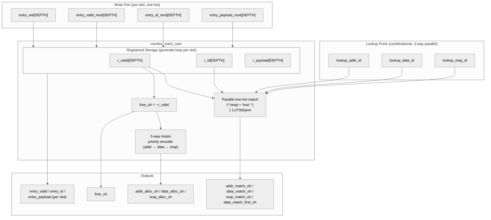

<!-- RTL Design Sherpa Documentation Header -->
<table>
<tr>
<td width="80">
  <a href="https://github.com/sean-galloway/RTLDesignSherpa">
    
  </a>
</td>
<td>
  <strong>RTL Design Sherpa</strong> · <em>Learning Hardware Design Through Practice</em><br>
  <sub>
    <a href="https://github.com/sean-galloway/RTLDesignSherpa">GitHub</a> ·
    <a href="https://github.com/sean-galloway/RTLDesignSherpa/blob/main/docs/DOCUMENTATION_INDEX.md">Documentation Index</a> ·
    <a href="https://github.com/sean-galloway/RTLDesignSherpa/blob/main/LICENSE">MIT License</a>
  </sub>
</td>
</tr>
</table>

---

<!-- End Header -->

# Monitor Transaction CAM

**Module:** `monitor_trans_cam.sv`
**Location:** `rtl/amba/shared/`
**Category:** AXI Monitor Infrastructure
**Status:** Production Ready

---

## Overview

`monitor_trans_cam` is a **multi-port ID CAM with opaque payload storage**
used by the [`axi_monitor_trans_mgr`](axi_monitor_trans_mgr.md) to track
outstanding AXI transactions by ID. It replaces the inline parallel-match
logic that previously lived in `axi_monitor_trans_mgr` (2026-04-23 revision),
moving the keying state and payload storage into a reusable shared module
without changing the synthesis shape that closes 100 MHz on the
xc7a100t-1 Artix-7.

The module is intentionally distinct from [`monbus_cam`](monbus_cam.md):

| Feature | `monbus_cam` | `monitor_trans_cam` |
|---|---|---|
| Use case | Caching (compressor template index) | Associative storage (AXI ID tracking) |
| Eviction | True LRU | None (explicit alloc / free) |
| Ports | 1 lookup | 3 lookups + alloc priority encoder |
| Payload | 64 b | Parameterizable (typically `$bits(bus_transaction_t)`) |
| Default depth | 32 | 16 |
| Match output | hit + idx + old_data | Three one-hot vectors |

---

## Key Features

- 3 independent ID lookup ports per cycle (`addr` / `data` / `resp`)
- One-hot match vectors (`*_match_oh`) plus a lowest-index "first" variant
  for AXI4-write WID-less matching
- Free-slot vector (`free_oh`) and priority-encoded **3-way mutex alloc**
  (`addr_alloc_oh` / `data_alloc_oh` / `resp_alloc_oh`)
- Per-slot write port (one-hot enable, separate next-state inputs per slot)
- Per-slot read port (registered current state) exposed for the caller
- `(* keep = "true" *)` attributes on match/free vectors so synth can't
  fuse them into downstream update cones (preserves the trans_mgr WNS fix)
- Simulation-only protocol assertions on the caller

---

## Architecture



Source: [`monitor_trans_cam.mmd`](../../assets/RTLAmba/monitor_trans_cam.mmd)



---

## Top-level Interface

```systemverilog
module monitor_trans_cam #(
    parameter int DEPTH         = 16,
    parameter int ID_WIDTH      = 8,
    parameter int PAYLOAD_WIDTH = 128
) (
    input  logic                            clk,
    input  logic                            rst_n,

    // ---- Lookup ports (combinational) ----
    input  logic [ID_WIDTH-1:0]             lookup_addr_id,
    input  logic [ID_WIDTH-1:0]             lookup_data_id,
    input  logic [ID_WIDTH-1:0]             lookup_resp_id,
    output logic [DEPTH-1:0]                addr_match_oh,
    output logic [DEPTH-1:0]                data_match_oh,
    output logic [DEPTH-1:0]                resp_match_oh,
    output logic [DEPTH-1:0]                data_match_first_oh,
                                            // lowest-index match for data port

    // ---- Free + 3-way alloc priority encoder ----
    output logic [DEPTH-1:0]                free_oh,
    input  logic                            addr_wants_alloc,
    input  logic                            data_wants_alloc,
    input  logic                            resp_wants_alloc,
    output logic [DEPTH-1:0]                addr_alloc_oh,
    output logic [DEPTH-1:0]                data_alloc_oh,
    output logic [DEPTH-1:0]                resp_alloc_oh,

    // ---- Per-slot write port ----
    input  logic [DEPTH-1:0]                entry_we,
    input  logic [DEPTH-1:0]                entry_valid_next,
    input  logic [ID_WIDTH-1:0]             entry_id_next       [DEPTH],
    input  logic [PAYLOAD_WIDTH-1:0]        entry_payload_next  [DEPTH],

    // ---- Per-slot read port (registered) ----
    output logic [DEPTH-1:0]                entry_valid,
    output logic [ID_WIDTH-1:0]             entry_id            [DEPTH],
    output logic [PAYLOAD_WIDTH-1:0]        entry_payload       [DEPTH]
);
```

---

## Why Three Lookup Ports?

The AXI monitor needs to match an arriving transaction beat against the
outstanding transaction table along three independent channels in the same
cycle:

| Lookup port | Purpose |
|---|---|
| `lookup_addr_id` | Matches an arriving AW/AR beat to an in-flight transaction (or detects "this is a brand-new transaction") |
| `lookup_data_id` | Matches an arriving R beat (read) or detects orphan-data-without-AW (write, AXI-Lite only) |
| `lookup_resp_id` | Matches an arriving B beat (write) to an in-flight transaction |

All three lookups go in parallel. The CAM's internal storage feeds 3 one-hot
match vectors, each a 1-LUT-per-bit `valid && (id == lookup_id)` test. With
DEPTH=16 that's 16 small independent cones per port, no chained dependencies.

The `(* keep = "true" *)` attribute on the match vectors prevents Vivado
from fusing them into the downstream `axi_monitor_trans_mgr` update logic —
without that, the 16 entries' update cones would fold together into one
shared wide function, producing ~12 LUT levels and failing 100 MHz on
the -1 part. With the attribute, each entry's update stays an independent
small cone.

---

## The "First-Match" Variant

For **AXI4 writes**, the data channel has no WID. The trans_mgr matches an
arriving W beat to the first outstanding write transaction by state predicate
(`valid && state ∈ {ADDR_PHASE, DATA_PHASE} && cmd_received && !data_completed`),
NOT by id. That state predicate is computed *outside* the CAM (it requires
fields the CAM doesn't see, like `state` and `cmd_received`).

The CAM still helps by providing `data_match_first_oh`, which is the
lowest-index bit of `data_match_oh` (the id-based match). For AXI4 reads
(WID present, id match works), the trans_mgr uses `data_match_oh` directly;
for AXI4 writes, the trans_mgr computes its own first-match-by-state vector
locally and ignores the CAM's. The two paths share the rest of the CAM
machinery (free, alloc, write port) so the cost is minimal.

---

## 3-Way Mutex Alloc Priority Encoder

When a new transaction arrives that doesn't match an existing entry, the
trans_mgr needs to allocate a free slot for it. Up to three independent
"want to alloc" requests can fire in the same cycle (addr, data, resp), and
each needs a *different* slot — the priority encoder ensures no two phases
ever claim the same free slot.

The encoder is purely combinational:

```
remaining_free = free_oh

if addr_wants_alloc:
    addr_alloc_oh = lowest-set-bit(remaining_free)
    remaining_free &= ~addr_alloc_oh

if data_wants_alloc:
    data_alloc_oh = lowest-set-bit(remaining_free)
    remaining_free &= ~data_alloc_oh

if resp_wants_alloc:
    resp_alloc_oh = lowest-set-bit(remaining_free)
    remaining_free &= ~resp_alloc_oh
```

The three outputs are guaranteed to be disjoint (mutex assertion enforces
this in simulation). If `wants_alloc` is asserted with no free slot, the
corresponding `*_alloc_oh` is `'0` — the caller's wants_alloc signals are
typically gated by free-slot availability anyway, but the CAM doesn't
require that.

Priority order is `addr → data → resp`. AXI4 writes can have all three
firing in the same cycle on a tight pipeline, and the order matches the
phase order so the slot indices in the table grow in a reasonable
chronological order.

---

## Per-Slot Storage and Write Port

The CAM owns the registered storage:

```systemverilog
logic                       r_valid   [DEPTH];
logic [ID_WIDTH-1:0]        r_id      [DEPTH];
logic [PAYLOAD_WIDTH-1:0]   r_payload [DEPTH];
```

The write port is one-hot per slot:

```systemverilog
// Per slot i:  if (entry_we[i]) then on next clock edge,
//                r_valid[i]   <= entry_valid_next[i];
//                r_id[i]      <= entry_id_next[i];
//                r_payload[i] <= entry_payload_next[i];
```

To clear a slot, drive `entry_we[i]=1` with `entry_valid_next[i]=0`. The
payload and id get written too (with whatever the caller drives) but the
valid bit determines whether subsequent lookups see the entry.

The per-slot updates live in a `generate` loop of independent `always_ff`
blocks, one per slot. Each block depends only on local one-hot bits and
shared inputs — synth cannot fuse them across slots. The result is `DEPTH`
parallel small update cones rather than one giant shared one.

---

## Caller Pattern (axi_monitor_trans_mgr)

The trans_mgr uses the CAM's outputs to compute per-slot next-state in a
generate-loop `always_comb`, then drives the write port:

```
For each slot i (combinational):
    next_payload = current_payload  (default: hold)
    next_we      = 0

    if addr_alloc_oh[i]:
        # New transaction starting in addr phase
        next_payload = initialize from cmd_*
        next_we = 1
        next_id = cmd_id

    elif addr_update_oh[i] && cmd_handshake:
        # Existing entry getting addr fields updated
        next_payload.cmd_received = 1
        next_payload.addr_timestamp = timestamp
        next_we = 1

    ... data and resp phases similar ...

    if can_cleanup[i]:
        next_payload.valid = 0
        next_we = 1

    if event_reported_flag[i] && !current_payload.event_reported:
        next_payload.event_reported = 1
        next_we = 1

    Drive entry_we[i], entry_valid_next[i], entry_payload_next[i] for the CAM.
```

The CAM's `entry_valid` output mirrors the payload's `.valid` field — the
trans_mgr writes them in sync atomically. Lookups use `entry_valid` (the
CAM's view) so the match logic stays tight.

---

## Configuration

| Parameter | Default | Notes |
|---|---|---|
| `DEPTH` | 16 | Maximum outstanding transactions. Asserts in TBs require `≥ 4`. |
| `ID_WIDTH` | 8 | AXI ID width. Typically 4–8 for AXI4. |
| `PAYLOAD_WIDTH` | 128 | Caller's opaque payload. trans_mgr uses `$bits(bus_transaction_t)` (~285 bits). |

The trans_mgr instantiates with `PAYLOAD_WIDTH = $bits(bus_transaction_t)`,
storing the full struct (including the redundant `id` field — the CAM's
`entry_id` and `payload.id` are written atomically so they always agree).

---

## Synthesis Notes

Key design choices to preserve the trans_mgr's 2026-04-23 WNS fix:

| Construct | Rationale |
|---|---|
| `(* keep = "true" *)` on `*_match_oh`, `free_oh` | Anchors the match vectors so Vivado doesn't fuse them into downstream update cones |
| Per-slot `generate`-loop `always_ff` | `DEPTH` independent small update cones instead of one shared cone |
| Combinational lookup + commit-in-one-cycle write | Caller can drive lookup → update without an extra pipeline stage |
| Position-IS-rank NOT used | This CAM has no LRU — slots are positionally assigned by the caller; the index has no recency semantic |

The combinational depth from input port to CAM output is:
```
lookup_id  →  match_oh  →  hit_any (one OR-tree)
                       ↘
                        first_oh (priority encoder)
```
That's ~3–4 LUT levels for DEPTH=16 — comfortably under the 100 MHz
budget on the -1 part.

---

## Test

`val/amba/test_monitor_trans_cam.py` runs 17 sub-tests covering:

| # | Sub-test |
|---|---|
| 1 | Reset state — all entries invalid, `free_oh = all-1s` |
| 2 | Single write + lookup — write slot 0 with id=K, lookup hits |
| 3 | Independent writes — each slot writable in isolation |
| 4 | Three-port lookup — distinct addr/data/resp ids resolve independently |
| 5 | `data_match_first_oh` — duplicate ids: lowest-index wins |
| 6 | `free_oh` tracks valid bit per slot |
| 7 | Clear via `we=1 + valid_next=0` |
| 8 | Alloc one phase — `addr_wants_alloc` → lowest-index free slot |
| 9 | Alloc mutex — all three phases want → three distinct slots |
| 10 | Alloc partial wants — only some phases want, others zero |
| 11 | Alloc when full — no free slots → all `*_alloc_oh = 0` |
| 12 | Payload preserved across idle cycles |
| 13 | Concurrent writes — `entry_we` to multiple slots in one cycle |
| 14 | Lookup miss — id absent from CAM → match_oh = 0 |
| 15 | Alloc priority cascade — pre-occupy slots, watch alloc skip them |
| 16 | ID collision tolerance — two valid slots with same id |
| 17 | Random stress — random write/lookup/alloc mix vs Python model |

The Python golden model mirrors the RTL state and combinational outputs
exactly. At FULL `REG_LEVEL` the random stress runs 5000 ops per config,
and every cycle cross-checks all 9 combinational outputs (3 `*_match_oh`,
`first_oh`, `free_oh`, 3 `*_alloc_oh`, `entry_valid`) against the model.

```bash
pytest val/amba/test_monitor_trans_cam.py -v
```

REG_LEVEL parameter sweep:
- **GATE:** 1 config (8/64/16)
- **FUNC:** 2 configs (+ 4/32/8)
- **FULL:** 7 configs (depth 4/8/16/32, id 4/6/8, payload 32/64/128/256)

---

## Related Modules

| Module | Role |
|---|---|
| [`axi_monitor_trans_mgr`](axi_monitor_trans_mgr.md) | Sole consumer — uses the CAM for ID tracking and per-slot storage |
| [`monbus_cam`](monbus_cam.md) | Sister CAM for the bulk-trace compressor (LRU, single port, different design intent) |
| `bin/TBClasses/shared/` | Test framework utilities |
