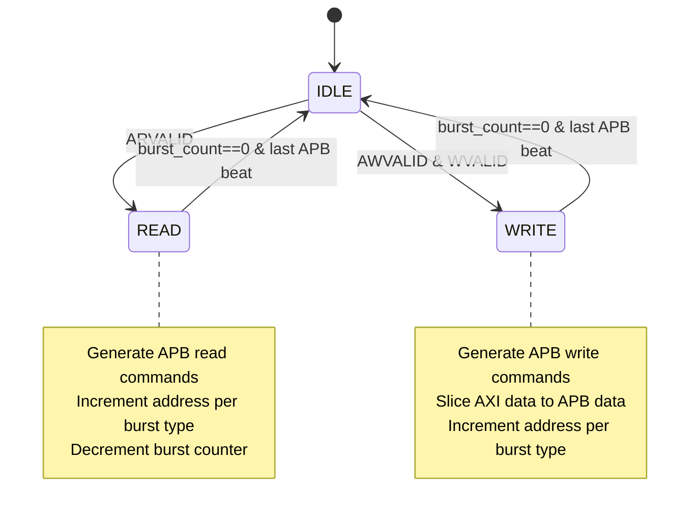
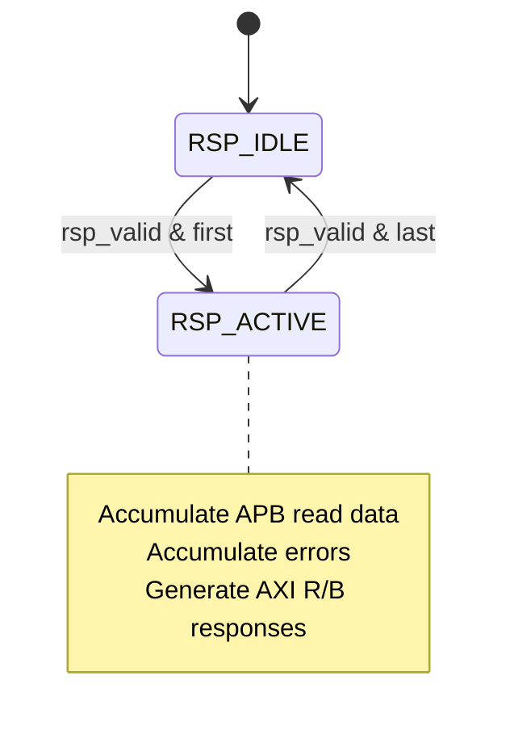

<!-- RTL Design Sherpa Documentation Header -->
<table>
<tr>
<td width="80">
  <a href="https://github.com/sean-galloway/RTLDesignSherpa">
    
  </a>
</td>
<td>
  <strong>RTL Design Sherpa</strong> · <em>Learning Hardware Design Through Practice</em><br>
  <sub>
    <a href="https://github.com/sean-galloway/RTLDesignSherpa">GitHub</a> ·
    <a href="https://github.com/sean-galloway/RTLDesignSherpa/blob/main/docs/DOCUMENTATION_INDEX.md">Documentation Index</a> ·
    <a href="https://github.com/sean-galloway/RTLDesignSherpa/blob/main/LICENSE">MIT License</a>
  </sub>
</td>
</tr>
</table>

---

<!-- End Header -->

# axi4_to_apb_convert

**Module:** `axi4_to_apb_convert.sv`
**Location:** `rtl/amba/shims/`
**Status:** ✅ Production Ready

---

## Overview

Core conversion logic that transforms AXI4 memory-mapped transactions into APB peripheral bus protocol. This module handles burst decomposition, width adaptation, and protocol conversion within a single clock domain. Used internally by **[axi4_to_apb_shim](axi4_to_apb_shim.md)** but can also be instantiated standalone for same-clock bridging.

### Key Features

- ✅ **Burst Decomposition:** AXI bursts (AWLEN/ARLEN) → APB single-beat transfers
- ✅ **Width Adaptation:** Automatic conversion for AXI_DATA_WIDTH > APB_DATA_WIDTH
- ✅ **Address Generation:** Proper address incrementing per AXI burst type (INCR, WRAP)
- ✅ **Transaction Tracking:** Side FIFO maintains ID, LAST, USER across conversion
- ✅ **Error Handling:** Accumulates APB PSLVERR → AXI BRESP/RRESP
- ✅ **Zero Data Loss:** Proper flow control and buffering

---

## Module Declaration

```systemverilog
module axi4_to_apb_convert #(
    parameter int SIDE_DEPTH        = 6,   // Side info FIFO depth
    parameter int AXI_ID_WIDTH      = 8,
    parameter int AXI_ADDR_WIDTH    = 32,
    parameter int AXI_DATA_WIDTH    = 32,
    parameter int AXI_USER_WIDTH    = 1,
    parameter int APB_ADDR_WIDTH    = 32,
    parameter int APB_DATA_WIDTH    = 32,
    parameter int AXI_WSTRB_WIDTH   = AXI_DATA_WIDTH / 8,
    parameter int APB_WSTRB_WIDTH   = APB_DATA_WIDTH / 8
) (
    // Clock and Reset
    input  logic                    aclk,
    input  logic                    aresetn,

    // AXI Slave Interface (packet format from axi4_slave_stub)
    // AW channel
    input  logic [AWSize-1:0]       r_s_axi_aw_pkt,
    input  logic [3:0]              r_s_axi_aw_count,
    input  logic                    r_s_axi_awvalid,
    output logic                    w_s_axi_awready,

    // W channel
    input  logic [WSize-1:0]        r_s_axi_w_pkt,
    input  logic                    r_s_axi_wvalid,
    output logic                    w_s_axi_wready,

    // B channel
    output logic [BSize-1:0]        r_s_axi_b_pkt,
    output logic                    w_s_axi_bvalid,
    input  logic                    r_s_axi_bready,

    // AR channel
    input  logic [ARSize-1:0]       r_s_axi_ar_pkt,
    input  logic [3:0]              r_s_axi_ar_count,
    input  logic                    r_s_axi_arvalid,
    output logic                    w_s_axi_arready,

    // R channel
    output logic [RSize-1:0]        r_s_axi_r_pkt,
    output logic                    w_s_axi_rvalid,
    input  logic                    r_s_axi_rready,

    // APB Master Interface (command/response packets)
    output logic                    w_cmd_valid,
    input  logic                    r_cmd_ready,
    output logic [APBCmdWidth-1:0]  r_cmd_data,

    input  logic                    r_rsp_valid,
    output logic                    w_rsp_ready,
    input  logic [APBRspWidth-1:0]  r_rsp_data
);
```

---

## Parameters

| Parameter | Default | Description |
|-----------|---------|-------------|
| `SIDE_DEPTH` | 6 | Side information FIFO depth (tracks ID, last, user) |
| `AXI_ID_WIDTH` | 8 | AXI transaction ID width |
| `AXI_ADDR_WIDTH` | 32 | AXI address width |
| `AXI_DATA_WIDTH` | 32 | AXI data width (32, 64, 128, 256, 512) |
| `AXI_USER_WIDTH` | 1 | AXI user sideband width |
| `APB_ADDR_WIDTH` | 32 | APB address width (must match AXI) |
| `APB_DATA_WIDTH` | 32 | APB data width (8, 16, 32, 64) |

**Derived Parameters:**
- `AXI2APBRATIO` = `AXI_DATA_WIDTH / APB_DATA_WIDTH` (automatically calculated)
- `APBCmdWidth` = APB command packet width
- `APBRspWidth` = APB response packet width

---

## Architecture

### Component Structure

```
axi4_to_apb_convert
├── Packet Unpacking
│   └── Extract AXI channel signals from packets
│
├── APB FSM (3 states)
│   ├── IDLE: Waiting for AXI transaction
│   ├── READ: Processing read burst
│   └── WRITE: Processing write burst
│
├── Response FSM (2 states)
│   ├── RSP_IDLE: Waiting for APB response
│   └── RSP_ACTIVE: Collecting responses
│
├── Address Generator (axi_gen_addr)
│   └── Increments address per AXI burst type
│
├── Width Adaptation Logic
│   ├── Data shift register (read data accumulation)
│   ├── Pointer tracking (which APB beat in AXI word)
│   └── WSTRB → PSTRB mapping
│
└── Side FIFO (gaxi_fifo_sync)
    └── Tracks ID, LAST, USER for response reconstruction
```

### Data Flow

**Write Path:**
```
AW packet → Unpack → APB WRITE FSM
W packet  → Unpack → Data slicing → APB PWDATA
                   → Width pointer tracking
                   → Burst counter decrement
                   → APB command generation
Side info → {ID, last, user} → Side FIFO
APB response → Error accumulation → B packet
```

**Read Path:**
```
AR packet → Unpack → APB READ FSM
                   → Address generation
                   → Burst counter decrement
                   → APB command generation
Side info → {ID, last, user} → Side FIFO
APB response → Data accumulation → R packet
            → Shift register fill
```

---

## Behavior

### Burst Decomposition

**AXI Burst → APB Beats:**

Single AXI beat may require multiple APB beats when `AXI_DATA_WIDTH > APB_DATA_WIDTH`:

**Example: 64-bit AXI → 32-bit APB (2:1 ratio)**
```
AXI Write Burst (AWLEN=3, 4 beats):
  Beat 0: 64 bits → 2 APB transfers (addr+0, addr+4)
  Beat 1: 64 bits → 2 APB transfers (addr+8, addr+12)
  Beat 2: 64 bits → 2 APB transfers (addr+16, addr+20)
  Beat 3: 64 bits → 2 APB transfers (addr+24, addr+28)
Total: 8 APB transfers for 4 AXI beats
```

**Pointer Tracking:**
- `r_axi_wr_data_pointer`: Tracks which APB slice of current AXI write beat
- `r_axi_rd_data_pointer`: Tracks which APB slice to write for read accumulation
- `r_axi_rsp_data_pointer`: Tracks response data accumulation position

### Address Generation

**Supported Burst Types:**
- **INCR (0x01):** Sequential incrementing (most common)
- **WRAP (0x10):** Wrapping at boundary (less common)
- **FIXED (0x00):** Same address (APB limitation: converted to INCR)

**Address Alignment:**
```systemverilog
// APB addresses are always aligned to APB_DATA_WIDTH
w_alignment_mask = APB_WSTRB_WIDTH - 1;
w_apb_cmd_pkt_paddr = r_apb_paddr & ~w_alignment_mask;
```

### Width Adaptation

**Write Data Slicing (AXI → APB):**
```systemverilog
// For 64b AXI → 32b APB:
// Pointer = 0 → Take bits [31:0]
// Pointer = 1 → Take bits [63:32]
w_apb_cmd_pkt_pwdata = (axi2abpratio == 1) ?
    r_s_axi_wdata[APBDW-1:0] :
    r_s_axi_wdata[r_axi_wr_data_pointer*APBDW +: APBDW];
```

**Read Data Accumulation (APB → AXI):**
```systemverilog
// For 32b APB → 64b AXI:
// Pointer = 0 → Fill bits [31:0]
// Pointer = 1 → Fill bits [63:32], then return complete 64b word
r_axi_data_shift[r_axi_rsp_data_pointer*APBDW +: APBDW] <= r_apb_rsp_pkt_prdata;
```

### Error Handling

**Error Accumulation:**
- Multiple APB PSLVERR errors OR'd together
- Entire AXI transaction marked with error if any APB beat fails
- Read errors: `RRESP = 2'b10` (SLVERR)
- Write errors: `BRESP = 2'b10` (SLVERR)

**Error Propagation:**
```systemverilog
r_pslverr <= r_pslverr | w_pslverr;  // Sticky error
w_resp_rd = (w_pslverr) ? 2'b10 : 2'b00;
w_resp_wr = (w_pslverr | r_pslverr) ? 2'b10 : 2'b00;
```

### Side Information Tracking

**Side FIFO Contents:**
```systemverilog
// For each AXI transaction, track:
{operation,    // 1=write, 0=read
 ID,           // Transaction ID
 last,         // RLAST/BLAST flag
 user}         // User sideband
```

**Purpose:**
- Preserves ID for out-of-order response reconstruction
- Maintains LAST flag for burst completion signaling
- Passes USER sideband through the bridge

---

## Packet Formats

### APB Command Packet

```
APBCmdWidth = APBAW + APBDW + APBSW + 4 bits

[APBCmdWidth-1]         last      (end of AXI burst)
[APBCmdWidth-2]         first     (start of AXI burst)
[APBCmdWidth-3]         pwrite    (1=write, 0=read)
[APBCmdWidth-4:...]     pprot     (3 bits)
[...]                   pstrb     (APBSW bits)
[...]                   paddr     (APBAW bits)
[APBDW-1:0]             pwdata    (APBDW bits)
```

### APB Response Packet

```
APBRspWidth = APBDW + 3 bits

[APBRspWidth-1]    last        (end of sequence)
[APBRspWidth-2]    first       (start of sequence)
[APBRspWidth-3]    pslverr     (error flag)
[APBDW-1:0]        prdata      (read data)
```

---

## Usage Examples

### Example 1: Standalone Conversion (Same Width)

```systemverilog
// 32b AXI → 32b APB conversion (same clock)
axi4_to_apb_convert #(
    .SIDE_DEPTH(4),
    .AXI_ID_WIDTH(4),
    .AXI_ADDR_WIDTH(32),
    .AXI_DATA_WIDTH(32),
    .AXI_USER_WIDTH(1),
    .APB_ADDR_WIDTH(32),
    .APB_DATA_WIDTH(32)
) u_convert (
    .aclk(clk),
    .aresetn(rst_n),

    // From AXI slave stub
    .r_s_axi_aw_pkt(aw_pkt),
    .r_s_axi_awvalid(aw_valid),
    .w_s_axi_awready(aw_ready),
    // ... other AXI channels ...

    // To APB master stub
    .w_cmd_valid(apb_cmd_valid),
    .r_cmd_ready(apb_cmd_ready),
    .r_cmd_data(apb_cmd_data),
    .r_rsp_valid(apb_rsp_valid),
    .w_rsp_ready(apb_rsp_ready),
    .r_rsp_data(apb_rsp_data)
);
```

### Example 2: Width Conversion (64b → 32b)

```systemverilog
// Width adaptation: 64b AXI → 32b APB
axi4_to_apb_convert #(
    .SIDE_DEPTH(8),          // Deeper for burst traffic
    .AXI_ID_WIDTH(8),
    .AXI_ADDR_WIDTH(32),
    .AXI_DATA_WIDTH(64),     // 64-bit AXI
    .AXI_USER_WIDTH(4),
    .APB_ADDR_WIDTH(32),
    .APB_DATA_WIDTH(32)      // 32-bit APB (2:1 ratio)
) u_convert (
    .aclk(clk),
    .aresetn(rst_n),
    // ... connections ...
);
```

---

## State Machines

### APB FSM



### Response FSM



---

## Performance

### Latency (Cycles)

| Operation | Latency | Notes |
|-----------|---------|-------|
| AXI single-beat read (1:1 width) | 4-5 | Unpack + APB + pack |
| AXI single-beat write (1:1 width) | 4-5 | Same |
| AXI burst (AWLEN=15, 1:1 width) | 68-80 | 16 beats × 4-5 cycles |
| Width convert read (2:1) | 8-10 | 2 APB beats per AXI beat |
| Width convert read (4:1) | 16-20 | 4 APB beats per AXI beat |

### Throughput

**Maximum Throughput (same width):**
- 1 APB transfer every 2 cycles (SETUP + ACCESS phases)
- Pipelined: ~0.5 transfers/cycle

**Width Conversion Impact:**
- 2:1 ratio: Throughput halved (2 APB beats per AXI beat)
- 4:1 ratio: Throughput quartered

---

## Testing

```bash
# Core conversion tested via integration test
pytest val/integ_amba/test_axi2apb_shim.py -v

# Test with burst traffic
pytest "val/integ_amba/test_axi2apb_shim.py::test_burst" -v

# Test width conversion
pytest "val/integ_amba/test_axi2apb_shim.py::test_width[64-32]" -v
```

---

## Constraints and Limitations

**Parameter Constraints:**
- `APB_DATA_WIDTH` ≤ `AXI_DATA_WIDTH`
- `AXI_DATA_WIDTH / APB_DATA_WIDTH` must be power of 2 (1, 2, 4, 8)
- `SIDE_DEPTH` must be ≥ maximum AXI burst length (typically 16)

**Protocol Limitations:**
- No support for AXI exclusive access (AWLOCK/ARLOCK ignored)
- No support for AXI cache/QoS hints (AWCACHE/ARCACHE/AWQOS/ARQOS ignored)
- APB protocol is serialized (no concurrent transactions)

**Width Adaptation:**
- Only supports narrowing (AXI → APB), not widening
- APB_DATA_WIDTH must be at least 8 bits

---

## Synthesis Notes

### Resource Usage

| Configuration | LUTs | FFs | Notes |
|--------------|------|-----|-------|
| 32b/32b | ~400 | ~300 | No width conversion |
| 64b/32b | ~600 | ~450 | 2:1 width conversion |
| 128b/32b | ~900 | ~650 | 4:1 width conversion |

**Critical Logic:**
- Address generation (axi_gen_addr instantiation)
- Data shift register (read accumulation)
- FSM next-state logic

---

## Related Modules

- **[axi4_to_apb_shim](axi4_to_apb_shim.md)** - Top-level shim (instantiates this module)
- **[axi4_slave_stub](../axi4/axi4_slave_stub.md)** - Provides input packet format
- **[apb_master_stub](../apb/apb_master_stub.md)** - Consumes output packet format
- **[axi_gen_addr](../shared/axi_gen_addr.md)** - Address generation utility
- **[gaxi_fifo_sync](../gaxi/gaxi_fifo_sync.md)** - Side information FIFO

---

## When to Use

**✅ Use Standalone When:**
- Same clock domain for AXI and APB
- Want minimal latency (no CDC overhead)
- Custom integration with different buffering

**✅ Use via axi4_to_apb_shim When:**
- Different clock domains (need CDC)
- Want complete turnkey solution
- Standard AXI/APB interfaces

---

**Last Updated:** 2025-10-20

---

## Navigation

- **[← Back to Shims Index](README.md)**
- **[← Back to RTLAmba Index](../index.md)**
