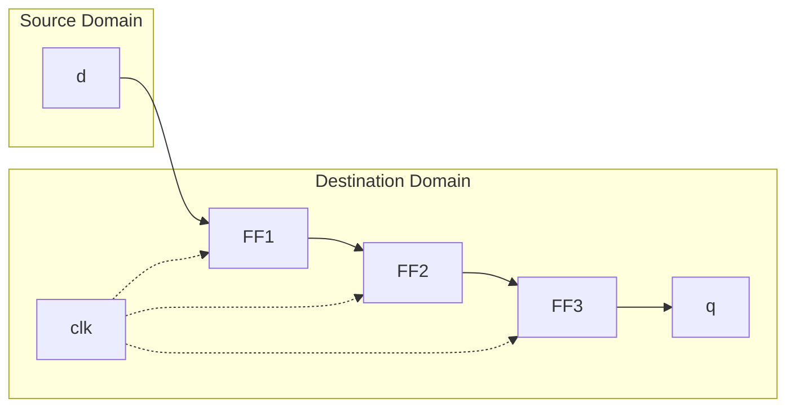

<!-- RTL Design Sherpa Documentation Header -->
<table>
<tr>
<td width="80">
  <a href="https://github.com/sean-galloway/RTLDesignSherpa">
    
  </a>
</td>
<td>
  <strong>RTL Design Sherpa</strong> · <em>Learning Hardware Design Through Practice</em><br>
  <sub>
    <a href="https://github.com/sean-galloway/RTLDesignSherpa">GitHub</a> ·
    <a href="https://github.com/sean-galloway/RTLDesignSherpa/blob/main/docs/DOCUMENTATION_INDEX.md">Documentation Index</a> ·
    <a href="https://github.com/sean-galloway/RTLDesignSherpa/blob/main/LICENSE">MIT License</a>
  </sub>
</td>
</tr>
</table>

---

<!-- End Header -->

# Glitch-Free N-DFF Synchronizer (`glitch_free_n_dff_arn.sv`)

## Purpose
Provides a parameterized multi-stage synchronizer for safe clock domain crossing (CDC). Reduces metastability risk through configurable stages of flip-flops while maintaining data integrity across asynchronous clock domains.

## Ports

### Input Ports
- **`clk`** - Destination domain clock
- **`rst_n`** - Destination domain active-low reset
- **`d[WIDTH-1:0]`** - Input data from source clock domain

### Output Ports
- **`q[WIDTH-1:0]`** - Synchronized output data in destination domain

### Parameters
- **`FLOP_COUNT`** - Number of synchronizer flip-flop stages (default: 3)
- **`WIDTH`** - Data width in bits (default: 4)

## Clock Domain Crossing Theory

### Metastability Problem
When signals cross between asynchronous clock domains:
```
Source Clock     __|‾|__|‾|__|‾|__|‾|__
Data Change      ______|‾‾‾‾‾‾‾‾‾‾‾‾‾‾‾
Dest Clock       ___|‾|__|‾|__|‾|__|‾|_
Setup Violation?      ↑ Potential metastability
```

### Metastability Effects
- **Undefined output**: Neither 0 nor 1, but intermediate voltage
- **Extended resolution**: Takes longer than normal clock period
- **Propagation**: Can corrupt downstream logic
- **System failure**: Can cause entire design malfunction

## Multi-Stage Synchronizer Solution

### Architecture Overview



### Stage-by-Stage Analysis
1. **Stage 1 (FF1)**: Captures source data, may go metastable
2. **Stage 2 (FF2)**: Allows metastability to resolve, low probability of propagation
3. **Stage 3+ (FFN)**: Further reduces MTBF (Mean Time Between Failures)

## Implementation Details

### Packed Array Structure
```systemverilog
logic [FC-1:0][WIDTH-1:0] r_q_array;
```
- **Efficient storage**: Single declaration for all stages
- **Clear indexing**: `r_q_array[0]` is first stage, `r_q_array[FC-1]` is last
- **Synthesis friendly**: Maps well to FPGA/ASIC resources

### Shift Register Behavior
```systemverilog
always_ff @(posedge clk or negedge rst_n) begin
    if (!rst_n) begin
        // Reset all flip-flops to zero
        r_q_array <= {FC{{DW{1'b0}}}};
    end else begin
        // Load new data into first stage
        r_q_array[0] <= d;
        // Shift existing data through remaining stages
        for (int i = 1; i < FC; i++) begin
            r_q_array[i] <= r_q_array[i-1];
        end
    end
end
```

### Reset Behavior
- **Synchronous reset**: Uses destination domain reset
- **Complete reset**: All stages reset to zero
- **Nested replication**: `{FC{{DW{1'b0}}}}` creates FC copies of DW zeros

## MTBF (Mean Time Between Failures) Analysis

### MTBF Calculation
```
MTBF = (e^(t_res/τ)) / (f_clk × f_data × τ)

Where:
- t_res = Resolution time available (clock period - setup - routing)
- τ = Flip-flop metastability time constant (~200ps typical)
- f_clk = Destination clock frequency  
- f_data = Data transition frequency
```

### Stage Count Impact
| Stages | Relative MTBF | Typical MTBF |
|--------|---------------|--------------|
| 1      | 1× (baseline) | Minutes      |
| 2      | ~1000× | Hours        |
| 3      | ~1,000,000× | Years        |
| 4      | ~1,000,000,000× | Millennia    |

### Practical Guidelines
- **2 stages**: Minimum for most applications
- **3 stages**: Recommended for high-reliability systems  
- **4+ stages**: Extreme reliability requirements (aerospace, medical)

## Latency vs. Reliability Trade-off

### Synchronizer Latency
- **Minimum latency**: 2 clock cycles (2-stage synchronizer)
- **General latency**: `FLOP_COUNT` clock cycles
- **Fixed delay**: Independent of data pattern

### Performance Impact
```systemverilog
// 2-stage: 2 cycle latency, good MTBF
glitch_free_n_dff_arn #(.FLOP_COUNT(2)) fast_sync (...);

// 3-stage: 3 cycle latency, excellent MTBF  
glitch_free_n_dff_arn #(.FLOP_COUNT(3)) safe_sync (...);

// 4-stage: 4 cycle latency, extreme MTBF
glitch_free_n_dff_arn #(.FLOP_COUNT(4)) ultra_safe_sync (...);
```

## Usage Guidelines

### Appropriate Use Cases
- **Control signals**: Reset, enable, mode switches
- **Slow status signals**: Error flags, configuration bits
- **Gray code pointers**: FIFO read/write pointers
- **Single-bit signals**: Generally safe for multi-bit if Gray coded

### Inappropriate Use Cases
- **High-speed data buses**: Use proper CDC techniques (handshaking, FIFOs)
- **Binary counters**: Multiple bits can transition simultaneously
- **Address buses**: Binary addresses are not CDC-safe
- **Clock signals**: Never synchronize clocks this way

### Multi-Bit Considerations
```systemverilog
// SAFE: Gray-coded FIFO pointers
glitch_free_n_dff_arn #(.WIDTH(5)) gray_sync (
    .d(gray_pointer),      // Gray code - only 1 bit changes
    .q(sync_gray_pointer)
);

// UNSAFE: Binary counter synchronization
// Don't do this - multiple bits can change simultaneously
glitch_free_n_dff_arn #(.WIDTH(8)) bad_sync (
    .d(binary_counter),    // Binary - multiple bit transitions
    .q(sync_counter)       // May capture inconsistent values
);
```

## Advanced Applications

### Reset Synchronizer Pattern
```systemverilog
// Asynchronous assert, synchronous deassert
logic reset_sync;
glitch_free_n_dff_arn #(.FLOP_COUNT(2), .WIDTH(1)) reset_sync_inst (
    .clk(dest_clk),
    .rst_n(1'b1),          // No reset feedback
    .d(~async_reset),      // Invert for active-low
    .q(reset_sync)
);

assign sync_reset_n = reset_sync & ~async_reset;
```

### Enable Signal Synchronization
```systemverilog
glitch_free_n_dff_arn #(.FLOP_COUNT(3), .WIDTH(1)) enable_sync (
    .clk(fast_clk),
    .rst_n(rst_n),
    .d(slow_enable),
    .q(fast_enable_sync)
);
```

### Status Flag Collection
```systemverilog
// Synchronize multiple independent status signals
glitch_free_n_dff_arn #(.FLOP_COUNT(2), .WIDTH(4)) status_sync (
    .clk(dest_clk),
    .rst_n(rst_n),
    .d({error_flag, done_flag, busy_flag, ready_flag}),
    .q({sync_error, sync_done, sync_busy, sync_ready})
);
```

## Synthesis Considerations

### FPGA Implementation
- **Dedicated resources**: Maps to flip-flop primitives
- **Placement**: Tools may place stages in different locations
- **Timing constraints**: Require proper CDC constraints

### Timing Constraints
```tcl
# Constrain the synchronizer input as asynchronous
set_false_path -to [get_pins sync_inst/r_q_array[0]/D]

# Or set maximum delay if there's some relationship
set_max_delay -to [get_pins sync_inst/r_q_array[0]/D] 2.0
```

### Optimization Prevention
```systemverilog
// Synthesis attributes to prevent optimization
(* ASYNC_REG = "TRUE" *) logic [FC-1:0][WIDTH-1:0] r_q_array;
(* DONT_TOUCH = "TRUE" *) logic [FC-1:0][WIDTH-1:0] r_q_array;
```

## Verification Strategies

### Functional Verification
- **Data integrity**: Verify output eventually matches input
- **Reset behavior**: Check proper reset operation
- **Latency verification**: Confirm expected delay

### Metastability Testing
```systemverilog
// Stress test with rapid data changes
initial begin
    forever begin
        @(posedge source_clk);
        d <= $random();
        #($random() % 100);  // Random timing
    end
end
```

### Formal Verification
- **Eventually properties**: Data will eventually propagate
- **Reset properties**: Reset behavior verification
- **No X propagation**: Ensure no unknown values propagate

## Debug Features

### Waveform Analysis
```systemverilog
// Flatten array for waveform viewing
wire [(DW*FC)-1:0] flat_r_q;
genvar i;
generate
    for (i = 0; i < FC; i++) begin : gen_flatten_memory
        assign flat_r_q[i*DW+:DW] = r_q_array[i];
    end
endgenerate
```

### Simulation Visibility
- **All stages visible**: Can observe data propagation through stages
- **Metastability injection**: Can inject X values for testing
- **Timing analysis**: Observe setup/hold violations

## Related Modules
- **FIFO CDC modules**: Use this for pointer synchronization
- **Reset synchronizers**: Specialized CDC for reset signals
- **Handshake synchronizers**: For complex data CDC
- **Pulse synchronizers**: For single-cycle pulse CDC

## Navigation

- **[← Back to RTLCommon Index](index.md)**
- **[← Back to Main Documentation Index](../../index.md)**
