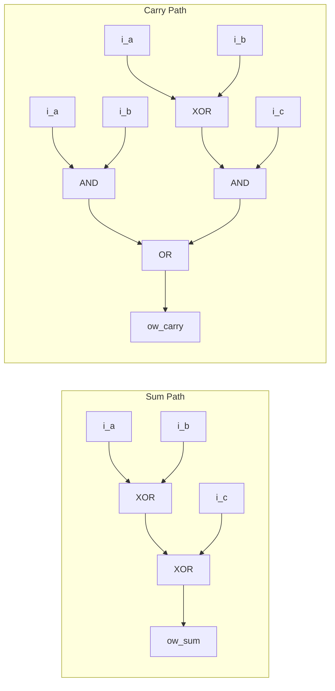
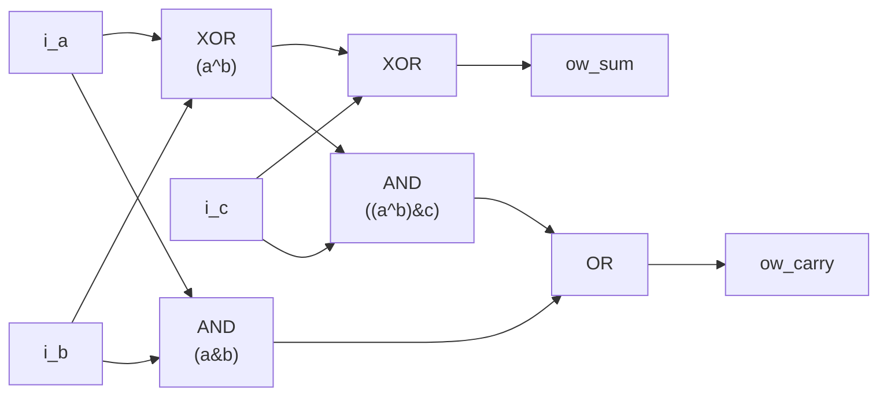

<!-- RTL Design Sherpa Documentation Header -->
<table>
<tr>
<td width="80">
  <a href="https://github.com/sean-galloway/RTLDesignSherpa">
    
  </a>
</td>
<td>
  <strong>RTL Design Sherpa</strong> · <em>Learning Hardware Design Through Practice</em><br>
  <sub>
    <a href="https://github.com/sean-galloway/RTLDesignSherpa">GitHub</a> ·
    <a href="https://github.com/sean-galloway/RTLDesignSherpa/blob/main/docs/DOCUMENTATION_INDEX.md">Documentation Index</a> ·
    <a href="https://github.com/sean-galloway/RTLDesignSherpa/blob/main/LICENSE">MIT License</a>
  </sub>
</td>
</tr>
</table>

---

<!-- End Header -->

# math_adder_full

A single-bit full adder module that performs binary addition of two input bits plus a carry-in, producing a sum and carry-out.

## Overview

The `math_adder_full` module implements the fundamental building block of binary arithmetic - a full adder. It adds three single-bit inputs (two operands and a carry-in) and produces a sum bit and carry-out bit. This module serves as the basis for multi-bit adders and more complex arithmetic units.

## Module Declaration

```systemverilog
module math_adder_full #(parameter int N=1) (
    input  logic i_a,
    input  logic i_b,
    input  logic i_c,
    output logic ow_sum,
    output logic ow_carry
);
```

## Parameters

| Parameter | Type | Default | Description |
|-----------|------|---------|-------------|
| N | int | 1 | Parameter for potential future extensions (currently unused) |

## Ports

### Inputs

| Port | Width | Description |
|------|-------|-------------|
| i_a | 1 | First input operand bit |
| i_b | 1 | Second input operand bit |
| i_c | 1 | Carry input bit |

### Outputs

| Port | Width | Description |
|------|-------|-------------|
| ow_sum | 1 | Sum output bit (i_a ⊕ i_b ⊕ i_c) |
| ow_carry | 1 | Carry output bit |

## Functionality

### Full Adder Logic

The full adder implements the following Boolean functions:

- **Sum Output**: `ow_sum = i_a ⊕ i_b ⊕ i_c`
- **Carry Output**: `ow_carry = (i_a & i_b) | (i_c & (i_a ⊕ i_b))`

### Truth Table

| i_a | i_b | i_c | ow_sum | ow_carry | Decimal |
|-----|-----|-----|--------|----------|---------|
| 0 | 0 | 0 | 0 | 0 | 0 + 0 + 0 = 0 |
| 0 | 0 | 1 | 1 | 0 | 0 + 0 + 1 = 1 |
| 0 | 1 | 0 | 1 | 0 | 0 + 1 + 0 = 1 |
| 0 | 1 | 1 | 0 | 1 | 0 + 1 + 1 = 2 |
| 1 | 0 | 0 | 1 | 0 | 1 + 0 + 0 = 1 |
| 1 | 0 | 1 | 0 | 1 | 1 + 0 + 1 = 2 |
| 1 | 1 | 0 | 0 | 1 | 1 + 1 + 0 = 2 |
| 1 | 1 | 1 | 1 | 1 | 1 + 1 + 1 = 3 |

## Implementation Details

### Sum Generation

The sum output uses a three-input XOR gate:
```systemverilog
assign ow_sum = i_a ^ i_b ^ i_c;
```

This produces 1 when an odd number of inputs are 1, and 0 when an even number are 1.

### Carry Generation

The carry output uses optimized logic:
```systemverilog
assign ow_carry = (i_a & i_b) | (i_c & (i_a ^ i_b));
```

This can be broken down as:
- `(i_a & i_b)`: Carry generated when both primary inputs are 1
- `(i_c & (i_a ^ i_b))`: Carry propagated when exactly one primary input is 1 and carry-in is 1

## Logic Gate Implementation

### Traditional Gate-Level View



### Optimized Implementation

The actual implementation uses shared XOR logic for efficiency:



**Key optimization:** The `a^b` XOR result is shared between sum calculation and carry propagation.

## Timing Characteristics

| Characteristic | Typical Value | Description |
|----------------|---------------|-------------|
| Propagation Delay (Sum) | 2 × t_XOR | Through 2 XOR gates |
| Propagation Delay (Carry) | t_AND + t_OR | Through AND-OR path |
| Setup Time | 0 | Purely combinational |
| Hold Time | 0 | Purely combinational |

## Usage Examples

### Basic Full Adder

```systemverilog
logic a_bit, b_bit, cin;
logic sum_bit, cout;

math_adder_full u_full_adder (
    .i_a      (a_bit),
    .i_b      (b_bit),
    .i_c      (cin),
    .ow_sum   (sum_bit),
    .ow_carry (cout)
);
```

### Building a 4-Bit Ripple Carry Adder

```systemverilog
logic [3:0] a, b, sum;
logic cin, cout;
logic [3:0] carry_chain;

// Bit 0
math_adder_full u_add0 (
    .i_a      (a[0]),
    .i_b      (b[0]),
    .i_c      (cin),
    .ow_sum   (sum[0]),
    .ow_carry (carry_chain[0])
);

// Bit 1
math_adder_full u_add1 (
    .i_a      (a[1]),
    .i_b      (b[1]),
    .i_c      (carry_chain[0]),
    .ow_sum   (sum[1]),
    .ow_carry (carry_chain[1])
);

// Bit 2
math_adder_full u_add2 (
    .i_a      (a[2]),
    .i_b      (b[2]),
    .i_c      (carry_chain[1]),
    .ow_sum   (sum[2]),
    .ow_carry (carry_chain[2])
);

// Bit 3
math_adder_full u_add3 (
    .i_a      (a[3]),
    .i_b      (b[3]),
    .i_c      (carry_chain[2]),
    .ow_sum   (sum[3]),
    .ow_carry (cout)
);
```

### Part of a Carry-Save Adder

```systemverilog
// In a 3:2 carry-save adder stage
math_adder_full u_csa_stage (
    .i_a      (partial_sum1[i]),
    .i_b      (partial_sum2[i]),
    .i_c      (partial_sum3[i]),
    .ow_sum   (sum_vector[i]),
    .ow_carry (carry_vector[i+1])
);
```

## Design Considerations

### Advantages

- **Simplicity**: Minimal gate count and complexity
- **Modularity**: Perfect building block for larger arithmetic units
- **Predictable**: Well-defined timing and behavior
- **Efficient**: Optimized carry generation logic

### Performance Characteristics

- **Area**: 5 logic gates (2 XOR, 2 AND, 1 OR)
- **Power**: Low static power, dynamic power proportional to switching activity
- **Speed**: Limited by XOR gate delays (typically slower than AND/OR)

## Synthesis Considerations

### Technology Mapping

Most synthesis tools will:
- Map XOR gates to efficient library cells
- Optimize the carry logic for the target technology
- May use dedicated adder primitives in some technologies

### Optimization Notes

```systemverilog
// Alternative carry implementation (equivalent but different structure)
assign ow_carry = (i_a & i_b) | (i_a & i_c) | (i_b & i_c);
```

This alternative has higher gate count but may have different timing characteristics.

## Verification Examples

### Testbench Structure

```systemverilog
module tb_math_adder_full;
    logic i_a, i_b, i_c;
    logic ow_sum, ow_carry;
    logic [1:0] expected_result;

    math_adder_full dut (.*);

    initial begin
        // Test all combinations
        for (int i = 0; i < 8; i++) begin
            {i_a, i_b, i_c} = i;
            #1;
            expected_result = i_a + i_b + i_c;

            assert ({ow_carry, ow_sum} == expected_result)
            else $error("Mismatch: %b + %b + %b = %b, expected %b",
                       i_a, i_b, i_c, {ow_carry, ow_sum}, expected_result);
        end
        $display("All tests passed!");
    end
endmodule
```

## Related Modules

- `math_adder_half`: Half adder (2 inputs, no carry-in)
- `math_adder_full_nbit`: N-bit full adder using ripple carry
- `math_adder_ripple_carry`: Multi-bit ripple carry adder
- `math_adder_carry_save`: Carry-save adder for multiple operand addition

## Applications

- **Multi-bit Adders**: Building block for ripple carry adders
- **Carry-Save Adders**: Used in parallel multiplication
- **ALU Design**: Fundamental component in arithmetic logic units
- **Accumulator Circuits**: Used in digital signal processing

The `math_adder_full` module provides the essential functionality for binary addition and serves as a critical building block in digital arithmetic circuits.

## Navigation

- **[← Back to RTLCommon Index](index.md)**
- **[← Back to Main Documentation Index](../index.md)**
