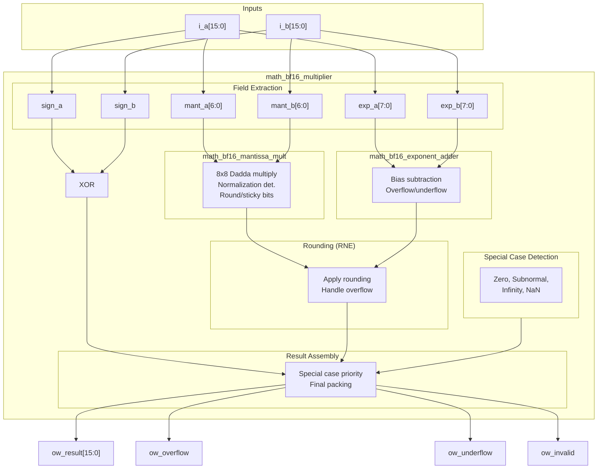

<!-- RTL Design Sherpa Documentation Header -->
<table>
<tr>
<td width="80">
  <a href="https://github.com/sean-galloway/RTLDesignSherpa">
    
  </a>
</td>
<td>
  <strong>RTL Design Sherpa</strong> · <em>Learning Hardware Design Through Practice</em><br>
  <sub>
    <a href="https://github.com/sean-galloway/RTLDesignSherpa">GitHub</a> ·
    <a href="https://github.com/sean-galloway/RTLDesignSherpa/blob/main/docs/DOCUMENTATION_INDEX.md">Documentation Index</a> ·
    <a href="https://github.com/sean-galloway/RTLDesignSherpa/blob/main/LICENSE">MIT License</a>
  </sub>
</td>
</tr>
</table>

---

<!-- End Header -->

# BF16 Multiplier

A complete BF16 (Brain Float 16) multiplier with IEEE 754-compliant special case handling, Round-to-Nearest-Even rounding, and flush-to-zero support for subnormal numbers.

## Overview

The `math_bf16_multiplier` module implements full BF16 multiplication by integrating the mantissa multiplier, exponent adder, and special case handling logic. It follows industry-standard practices used in AI/ML accelerators for efficient 16-bit floating-point operations.

**Key Features:**
- **BF16 format** - Same exponent range as FP32, reduced mantissa precision
- **IEEE 754 special cases** - Zero, infinity, NaN handling
- **RNE rounding** - Round-to-Nearest-Even for unbiased results
- **FTZ mode** - Flush-to-Zero for subnormal inputs and outputs
- **Status flags** - Overflow, underflow, and invalid operation indicators

## Module Declaration

```systemverilog
module math_bf16_multiplier(
    input  logic [15:0] i_a,           // BF16 operand A
    input  logic [15:0] i_b,           // BF16 operand B
    output logic [15:0] ow_result,     // BF16 product
    output logic        ow_overflow,   // Overflow to infinity
    output logic        ow_underflow,  // Underflow to zero
    output logic        ow_invalid     // Invalid operation (0 * inf = NaN)
);
```

## Ports

| Port | Direction | Width | Description |
|------|-----------|-------|-------------|
| i_a | Input | 16 | BF16 multiplicand A |
| i_b | Input | 16 | BF16 multiplier B |
| ow_result | Output | 16 | BF16 product |
| ow_overflow | Output | 1 | 1 if result overflowed to infinity |
| ow_underflow | Output | 1 | 1 if result underflowed to zero |
| ow_invalid | Output | 1 | 1 if operation was invalid (0 * inf) |

## BF16 Format

```
BF16: [15]=sign, [14:7]=exponent (8 bits, bias=127), [6:0]=mantissa (7 bits)

Special values:
  +0:    0x0000 (sign=0, exp=0, mant=0)
  -0:    0x8000 (sign=1, exp=0, mant=0)
  +inf:  0x7F80 (sign=0, exp=255, mant=0)
  -inf:  0xFF80 (sign=1, exp=255, mant=0)
  NaN:   0x7FC0 (exp=255, mant!=0, canonical quiet NaN)
```

## Architecture

### Block Diagram



### Processing Pipeline

1. **Field Extraction** - Parse sign, exponent, mantissa from inputs
2. **Special Case Detection** - Identify zero, subnormal, infinity, NaN
3. **Sign Computation** - XOR of input signs
4. **Mantissa Multiplication** - 8x8 Dadda tree with normalization
5. **Exponent Addition** - Add exponents, subtract bias, adjust for normalization
6. **RNE Rounding** - Apply Round-to-Nearest-Even to mantissa
7. **Result Assembly** - Select output based on special case priority

## Functionality

### Special Case Detection

```systemverilog
// Zero: exp=0, mant=0
wire w_a_is_zero = (w_exp_a == 8'h00) & (w_mant_a == 7'h00);

// Subnormal: exp=0, mant!=0 (treated as zero in FTZ mode)
wire w_a_is_subnormal = (w_exp_a == 8'h00) & (w_mant_a != 7'h00);

// Infinity: exp=FF, mant=0
wire w_a_is_inf = (w_exp_a == 8'hFF) & (w_mant_a == 7'h00);

// NaN: exp=FF, mant!=0
wire w_a_is_nan = (w_exp_a == 8'hFF) & (w_mant_a != 7'h00);

// Effective zero (includes subnormals)
wire w_a_eff_zero = w_a_is_zero | w_a_is_subnormal;

// Normal number (has implied leading 1)
wire w_a_is_normal = ~w_a_eff_zero & ~w_a_is_inf & ~w_a_is_nan;
```

### Round-to-Nearest-Even

```systemverilog
// RNE: Round up if round_bit=1 AND (sticky_bit=1 OR lsb=1)
wire w_lsb = w_mant_mult_out[0];
wire w_round_up = w_round_bit & (w_sticky_bit | w_lsb);

// Apply rounding
wire [7:0] w_mant_rounded = {1'b0, w_mant_mult_out} + {7'b0, w_round_up};

// Handle mantissa overflow from rounding (1.1111111 + 1 = 10.0000000)
wire w_mant_round_overflow = w_mant_rounded[7];
wire [6:0] w_mant_final = w_mant_round_overflow ? 7'h00 : w_mant_rounded[6:0];

// Adjust exponent for rounding overflow
wire [7:0] w_exp_final = w_mant_round_overflow ? (w_exp_sum + 8'd1) : w_exp_sum;
```

### Special Case Priority

```systemverilog
always_comb begin
    // Default: normal result
    ow_result = {w_sign_result, w_exp_final, w_mant_final};
    ow_overflow = 1'b0;
    ow_underflow = 1'b0;
    ow_invalid = 1'b0;

    // Priority order (highest to lowest):
    if (w_any_nan | w_invalid_op) begin
        // 1. NaN: any NaN input, or 0 * inf
        ow_result = {w_sign_result, 8'hFF, 7'h40};  // Canonical qNaN
        ow_invalid = w_invalid_op;
    end else if (w_result_inf | w_final_overflow) begin
        // 2. Infinity: inf input or overflow
        ow_result = {w_sign_result, 8'hFF, 7'h00};
        ow_overflow = w_final_overflow & ~w_result_inf;
    end else if (w_result_zero | w_exp_underflow) begin
        // 3. Zero: zero input or underflow
        ow_result = {w_sign_result, 8'h00, 7'h00};
        ow_underflow = w_exp_underflow & ~w_result_zero;
    end
end
```

## Usage Examples

### Basic Multiplication

```systemverilog
logic [15:0] a, b, product;
logic overflow, underflow, invalid;

math_bf16_multiplier u_mult (
    .i_a(a),
    .i_b(b),
    .ow_result(product),
    .ow_overflow(overflow),
    .ow_underflow(underflow),
    .ow_invalid(invalid)
);

// Example: 2.0 * 3.0 = 6.0
// 2.0 in BF16: 0x4000 (sign=0, exp=128, mant=0)
// 3.0 in BF16: 0x4040 (sign=0, exp=128, mant=0x40)
initial begin
    a = 16'h4000;  // 2.0
    b = 16'h4040;  // 3.0
    #1;
    // product should be ~6.0 (0x40C0)
end
```

### With Status Checking

```systemverilog
always_ff @(posedge clk) begin
    if (overflow)
        $display("Overflow: result is infinity");
    else if (underflow)
        $display("Underflow: result is zero");
    else if (invalid)
        $display("Invalid: 0 * inf or NaN input");
end
```

### In Neural Network Layer

```systemverilog
// Multiply weight by activation
logic [15:0] weight, activation, product;
logic [15:0] accumulator;  // Would typically be FP32 for accuracy

math_bf16_multiplier u_mult (
    .i_a(weight),
    .i_b(activation),
    .ow_result(product),
    .ow_overflow(),
    .ow_underflow(),
    .ow_invalid()
);

// Accumulate (simplified - real implementations use FP32 accumulator)
always_ff @(posedge clk) begin
    if (start)
        accumulator <= product;
    else
        accumulator <= accumulator + product;  // Would need FP adder
end
```

## Timing Characteristics

| Stage | Logic Depth |
|-------|-------------|
| Field extraction | 0 (wiring) |
| Special case detection | 2 gates |
| Mantissa multiply | ~15 gates |
| Exponent add | ~5 gates |
| Rounding | ~3 gates |
| Result MUX | ~2 gates |
| **Total** | ~25-30 gates |

## Performance Characteristics

### Resource Utilization

| Component | LUTs (est.) |
|-----------|-------------|
| Special case detection | ~30 |
| Mantissa multiplier | ~160 |
| Exponent adder | ~40 |
| Rounding logic | ~15 |
| Result MUX | ~25 |
| **Total** | ~270-300 LUTs |

### Design Optimization Priorities

This module is optimized with the following priorities:
1. **Area** - Efficient submodule integration
2. **Wire complexity** - Clean datapath structure
3. **Logic depth** - Parallel special case and normal path computation

## Design Considerations

### Flush-to-Zero (FTZ)

Subnormal numbers are flushed to zero:
- **Input subnormals** - Treated as zero (effective zero)
- **Output subnormals** - Not generated (result goes to zero)

This simplifies hardware and matches AI accelerator conventions.

### NaN Handling

- **Input NaN** - Propagated to output as canonical quiet NaN
- **0 * Infinity** - Produces NaN with invalid flag set
- **Canonical qNaN** - 0x7FC0 (sign=0, exp=FF, mant=0x40)

### Sign of Zero

The sign of zero follows IEEE 754:
- **+0 * +0** = +0
- **+0 * -0** = -0
- **-0 * -0** = +0

### Rounding Mode

Only Round-to-Nearest-Even (RNE) is supported. This is standard for BF16 in AI applications.

## Common Pitfalls

**Anti-Pattern 1:** Ignoring status flags
```systemverilog
// WRONG: Assuming result is always valid
result <= product;  // May be NaN or infinity!

// RIGHT: Check flags
if (!invalid && !overflow)
    result <= product;
else
    handle_exception();
```

**Anti-Pattern 2:** Expecting subnormal results
```systemverilog
// NOTE: Very small results flush to zero, not subnormal
// If you need gradual underflow, use FP32 or a different implementation
```

## Auto-Generated Code

This module is auto-generated by Python scripts:
- **Generator:** `bin/rtl_generators/bf16/bf16_multiplier.py`
- **Regenerate:** `PYTHONPATH=bin:$PYTHONPATH python3 bin/rtl_generators/bf16/generate_all.py rtl/common`

**Do not edit the generated .sv file manually.**

## Related Modules

- **math_bf16_mantissa_mult** - Mantissa multiplication submodule
- **math_bf16_exponent_adder** - Exponent computation submodule
- **math_bf16_fma** - Fused Multiply-Add with FP32 accumulator
- **math_multiplier_dadda_4to2_008** - Underlying 8x8 multiplier

## References

- Google Brain Float (BF16) specification
- IEEE 754-2019 Standard for Floating-Point Arithmetic
- Intel BFloat16 documentation
- NVIDIA TensorFloat documentation

## Navigation

- **[← Back to RTLCommon Index](index.md)**
- **[← Back to Main Documentation Index](../../index.md)**
