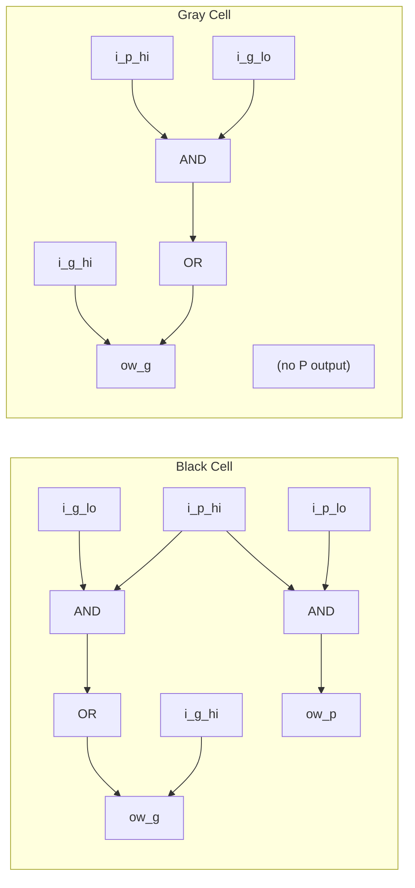

<!-- RTL Design Sherpa Documentation Header -->
<table>
<tr>
<td width="80">
  <a href="https://github.com/sean-galloway/RTLDesignSherpa">
    
  </a>
</td>
<td>
  <strong>RTL Design Sherpa</strong> · <em>Learning Hardware Design Through Practice</em><br>
  <sub>
    <a href="https://github.com/sean-galloway/RTLDesignSherpa">GitHub</a> ·
    <a href="https://github.com/sean-galloway/RTLDesignSherpa/blob/main/docs/DOCUMENTATION_INDEX.md">Documentation Index</a> ·
    <a href="https://github.com/sean-galloway/RTLDesignSherpa/blob/main/LICENSE">MIT License</a>
  </sub>
</td>
</tr>
</table>

---

<!-- End Header -->

# Prefix Cell Gray

An area-optimized parallel prefix network building block that computes only the group generate (G) signal, used in reverse tree stages and final carry computation where the propagate signal is not needed.

## Overview

The `math_prefix_cell_gray` module (also known as a "gray cell") is a reduced-area variant of the prefix cell that outputs only the group generate signal. Since the final carry computation only needs G (not P), gray cells save ~33% area in stages where propagate signals are not required downstream.

**Key Features:**
- **Outputs G only** - Optimized for carry-only computation
- **~33% smaller** than black cells (2 gates vs 3)
- **Same delay** as black cell for G output
- **Used in** reverse tree stages of Brent-Kung and final stage of Han-Carlson

## Module Declaration

```systemverilog
module math_prefix_cell_gray (
    input  logic i_g_hi, i_p_hi,
    input  logic i_g_lo,           // No P needed from lower position
    output logic ow_g              // Only G output (this IS the carry)
);
```

## Ports

| Port | Direction | Width | Description |
|------|-----------|-------|-------------|
| i_g_hi | Input | 1 | Generate signal from higher bit position |
| i_p_hi | Input | 1 | Propagate signal from higher bit position |
| i_g_lo | Input | 1 | Generate signal from lower bit position |
| ow_g | Output | 1 | Combined group generate (the carry into position i+1) |

**Note:** `i_p_lo` is not needed because it's only used to compute the group propagate, which this cell doesn't output.

## Functionality

### Implementation

```systemverilog
assign ow_g = i_g_hi | (i_p_hi & i_g_lo);
```

This computes the group generate signal:
- **G[i:j]** = G[i:k] OR (P[i:k] AND G[k-1:j])

**Interpretation:** A carry is generated for the combined range [i:j] if:
- The high range [i:k] generates a carry, OR
- The high range propagates AND the low range generates

### Why Gray Cells Don't Need P Output

In parallel prefix adders, the final computation is:
- **Sum[i]** = P[i] XOR C[i-1]
- **C[i]** = G[i:-1] (group generate from bit i down to carry-in)

The sum computation uses the **original** single-bit propagate P[i], not the group propagate. Therefore, once we've computed all the carries (group generates), we no longer need the group propagates.

### Visual Comparison



## Timing Characteristics

| Metric | Value | Description |
|--------|-------|-------------|
| Logic Depth | 2 gates | 1 AND + 1 OR |
| Critical Path | AND-OR | i_g_lo -> ow_g |
| Gate Count | 2 | 1 AND + 1 OR |

## Usage Examples

### In Han-Carlson Final Stage

```systemverilog
// Han-Carlson: Final stage fills odd positions using gray cells
// Odd positions get their carry from the even neighbor
generate
    for (i = 0; i < N; i++) begin : gen_final_stage
        if (i % 2 == 1) begin : gen_odd
            // Odd positions: compute G[i:-1] from G[i] and G[i-1:-1]
            math_prefix_cell_gray u_pf_gray (
                .i_g_hi(w_g_prev[i]),   // G[i] (single bit)
                .i_p_hi(w_p_prev[i]),   // P[i] (single bit)
                .i_g_lo(w_g_prev[i-1]), // G[i-1:-1] (group from even neighbor)
                .ow_g(w_g_final[i])     // G[i:-1] (the carry)
            );
        end else begin : gen_even
            // Even positions: already computed, pass through
            assign w_g_final[i] = w_g_prev[i];
        end
    end
endgenerate
```

### In Brent-Kung Reverse Tree

```systemverilog
// Brent-Kung: Reverse tree uses gray cells to fill intermediate positions
// After forward tree, only power-of-2 positions have complete carries
// Reverse tree fills in the gaps using gray cells

// Example: Position 5 gets carry from positions 5 and 4
math_prefix_cell_gray u_bk_gray_5 (
    .i_g_hi(w_g[5]),    // G[5:5] (from forward tree)
    .i_p_hi(w_p[5]),    // P[5:5] (original propagate)
    .i_g_lo(w_g[4]),    // G[4:-1] (computed in forward tree)
    .ow_g(w_g_5_final)  // G[5:-1] (carry into position 6)
);
```

### Computing Final Sum

```systemverilog
// After all carries computed with gray cells:
generate
    for (i = 0; i < N; i++) begin : gen_sum
        if (i == 0) begin
            assign sum[0] = p_original[0] ^ cin;
        end else begin
            // Sum = original P XOR carry from previous position
            assign sum[i] = p_original[i] ^ g_final[i-1];
        end
    end
endgenerate

// Carry out is the final group generate
assign cout = g_final[N-1];
```

## Performance Characteristics

### Resource Utilization

| Metric | Value |
|--------|-------|
| AND gates | 1 |
| OR gates | 1 |
| Total gates | 2 |
| LUTs (FPGA) | 1 |

### Comparison with Black Cell

| Property | Black Cell | Gray Cell |
|----------|------------|-----------|
| Inputs | 4 (Ghi, Phi, Glo, Plo) | 3 (Ghi, Phi, Glo) |
| Outputs | 2 (G, P) | 1 (G) |
| Gate count | 3 | 2 |
| Area savings | - | ~33% |
| G output delay | Same | Same |

### Area Savings in Adder

For an N-bit adder, the number of gray cells vs black cells affects total area:

| Architecture | Black Cells | Gray Cells | Total Cells |
|--------------|-------------|------------|-------------|
| Kogge-Stone N=16 | 64 | 0 | 64 |
| Brent-Kung N=16 | ~30 | ~30 | ~60 |
| Han-Carlson N=16 | ~32 | 8 | ~40 |

Han-Carlson uses gray cells only in the final stage (N/2 cells for N-bit adder).

## Design Considerations

### When to Use Gray Cells

**Use gray cells when:**
- Computing final carries (no further prefix operations needed)
- In reverse tree stages (Brent-Kung)
- Final fill-in stage (Han-Carlson)
- Any position where P is not needed downstream

**Use black cells when:**
- P signal needed for subsequent prefix stages
- Building Kogge-Stone (all stages need both P and G)
- Forward tree stages in hybrid architectures

### Design Optimization Priorities

This module is optimized with the following priorities:
1. **Area** - Minimal 2-gate implementation
2. **Wire complexity** - One fewer input than black cell
3. **Logic depth** - Same 2-gate delay as black cell

### Architectural Trade-offs

| Architecture | Gray Cell Usage | Trade-off |
|--------------|-----------------|-----------|
| Kogge-Stone | None | Maximum speed, maximum area |
| Brent-Kung | Reverse tree (~50%) | Minimum area, 2x depth |
| Han-Carlson | Final stage only (~20%) | Balanced speed/area |

## Related Modules

- **math_prefix_cell** - Black cell variant (outputs both G and P)
- **math_adder_han_carlson_016** - 16-bit Han-Carlson adder using this cell
- **math_adder_han_carlson_048** - 48-bit Han-Carlson adder using this cell
- **math_adder_brent_kung_gray** - Brent-Kung gray cell (equivalent)

## Applications

- **Parallel prefix adders** - Final carry computation stages
- **Area-optimized adders** - Brent-Kung and Han-Carlson architectures
- **Multiplier CPAs** - Final addition where area matters
- **Low-power designs** - Fewer gates = lower dynamic power

## References

- Brent, R.P., Kung, H.T. "A Regular Layout for Parallel Adders." IEEE Trans. Computers, 1982.
- Han, T., Carlson, D.A. "Fast Area-Efficient VLSI Adders." IEEE Symposium on Computer Arithmetic, 1987.
- Harris, D. "A Taxonomy of Parallel Prefix Networks." Asilomar Conference, 2003.

## Navigation

- **[← Back to RTLCommon Index](index.md)**
- **[← Back to Main Documentation Index](../index.md)**
