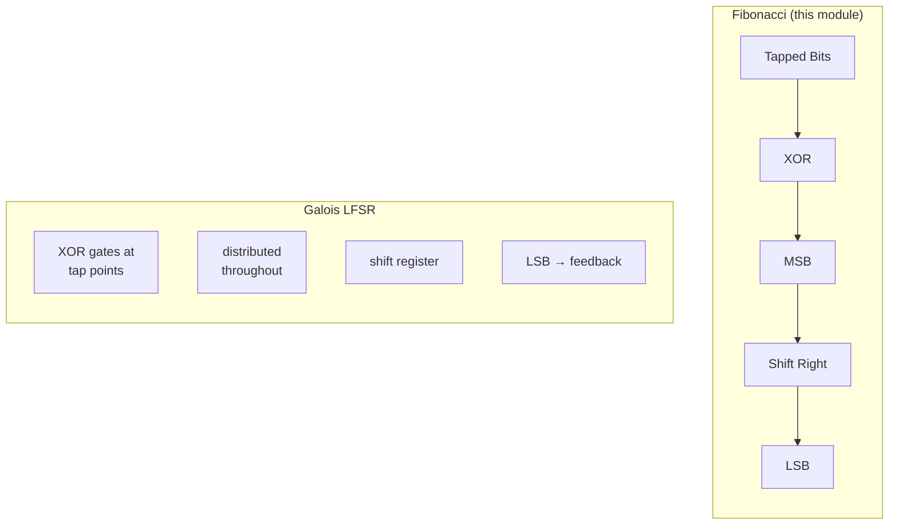

<!-- RTL Design Sherpa Documentation Header -->
<table>
<tr>
<td width="80">
  <a href="https://github.com/sean-galloway/RTLDesignSherpa">
    
  </a>
</td>
<td>
  <strong>RTL Design Sherpa</strong> · <em>Learning Hardware Design Through Practice</em><br>
  <sub>
    <a href="https://github.com/sean-galloway/RTLDesignSherpa">GitHub</a> ·
    <a href="https://github.com/sean-galloway/RTLDesignSherpa/blob/main/docs/DOCUMENTATION_INDEX.md">Documentation Index</a> ·
    <a href="https://github.com/sean-galloway/RTLDesignSherpa/blob/main/LICENSE">MIT License</a>
  </sub>
</td>
</tr>
</table>

---

<!-- End Header -->

# Fibonacci LFSR Module

## Purpose
The `shifter_lfsr_fibonacci` module implements a Fibonacci Linear Feedback Shift Register, which is a specific type of LFSR where the feedback is applied only to the most significant bit position. This design is complementary to Galois LFSRs and offers different implementation trade-offs.

## Key Features
- Fibonacci (external XOR) LFSR architecture
- Configurable tap positions and polynomial
- Right-shift operation with feedback to MSB
- Seed loading and cycle detection
- Non-zero state enforcement
- Parameterizable width and tap configuration

## Port Description

### Parameters
- **WIDTH**: Width of the LFSR register (default: 8)
- **TAP_INDEX_WIDTH**: Width of each tap index (default: 12)
- **TAP_COUNT**: Number of feedback taps (default: 4)
- **TIW**: Shorthand for TAP_INDEX_WIDTH

### Inputs
| Port | Width | Description |
|------|-------|-------------|
| `clk` | 1 | System clock |
| `rst_n` | 1 | Active-low asynchronous reset |
| `enable` | 1 | Enable LFSR operation |
| `seed_load` | 1 | Load seed value into LFSR |
| `seed_data` | WIDTH | Seed value for LFSR initialization |
| `taps` | TAP_COUNT*TIW | Concatenated tap positions |

### Outputs
| Port | Width | Description |
|------|-------|-------------|
| `lfsr_out` | WIDTH | Current LFSR value |
| `lfsr_done` | 1 | High when LFSR returns to seed value |

## Fibonacci vs Galois LFSR Architecture

### Fibonacci LFSR Characteristics
- **Feedback Location**: Single XOR gate feeding MSB
- **Data Path**: Simple right-shift with external feedback
- **XOR Gate Count**: One multi-input XOR gate
- **Critical Path**: Through feedback XOR to MSB

### Implementation Comparison



## Implementation Details

### Tap Processing (Same as Standard LFSR)
```systemverilog
// Split concatenated tap positions
always_comb begin
    for (int i = 0; i < TAP_COUNT; i++) 
        w_tap_positions[i] = taps[i*TIW+:TIW];
end

// Convert to bit mask
always_comb begin
    w_taps = 'b0;
    for (int i = 0; i < TAP_COUNT; i++)
        if (w_tap_positions[i] > 0) 
            w_taps[w_tap_positions[i]-1'b1] = 1'b1;
end
```

### Fibonacci Feedback Calculation
```systemverilog
assign w_feedback = ^(r_lfsr & w_taps);
```
**Key Difference**: Uses XOR (`^`) instead of XNOR (`~^`) compared to the standard LFSR module.

### Right-Shift with MSB Feedback
```systemverilog
always_ff @(posedge clk or negedge rst_n) begin
    if (~rst_n) begin
        r_lfsr <= 'b0;  // initialization to all 0's
    end else begin
        if (enable) begin
            if (seed_load) begin
                r_lfsr <= seed_data;  // Load seed
            end else if (|r_lfsr) begin // Only shift if we have non-zero value
                // Fibonacci LFSR: Shift right, feedback to MSB
                r_lfsr <= {w_feedback, r_lfsr[WIDTH-1:1]};
            end
        end
    end
end
```

## Special Implementation Notes

### 1. XOR vs XNOR Feedback
- **Fibonacci LFSR**: Uses XOR (`^`) for feedback calculation
- **Standard LFSR**: Uses XNOR (`~^`) for feedback calculation
- Both produce maximal-length sequences with appropriate polynomials

### 2. Non-Zero State Protection
```systemverilog
end else if (|r_lfsr) begin // Only shift if we have non-zero value
```
Prevents shifting when LFSR contains all zeros, which would lock the sequence in the zero state permanently.

### 3. Right-Shift Architecture
```systemverilog
r_lfsr <= {w_feedback, r_lfsr[WIDTH-1:1]};
```
- Feedback enters at MSB position
- Data shifts right (towards LSB)
- LSB data is discarded each cycle

### 4. Polynomial Compatibility
The tap positions should correspond to primitive polynomials appropriate for Fibonacci LFSR implementation. The polynomial form is:
```
P(x) = x^n + x^(tap1) + x^(tap2) + ... + x^(tapk) + 1
```

### 5. Reset to All Zeros
Unlike some LFSR implementations that reset to all ones, this module resets to all zeros and relies on seed loading for proper initialization.

## Timing Example (4-bit Fibonacci LFSR)

### Configuration
- WIDTH = 4
- Polynomial: x⁴ + x³ + 1 (taps at positions 4,3)
- Seed: 4'b0001

### Sequence Generation
```
Cycle | LFSR | Tap Bits | Feedback | Next LFSR
------|------|----------|----------|----------
0     | 0001 | 00       | 0        | 0000 (shift right)
1     | 0000 | 00       | 0        | 0000 (locked - need seed)

After seed reload with 4'b1001:
0     | 1001 | 10       | 1^0=1    | 1100
1     | 1100 | 11       | 1^1=0    | 0110  
2     | 0110 | 01       | 0^1=1    | 1011
3     | 1011 | 10       | 1^0=1    | 1101
4     | 1101 | 11       | 1^1=0    | 0110
...
```

## Comparison with Galois LFSR

### Advantages of Fibonacci LFSR
- **Simpler Data Path**: Only one shift register with external feedback
- **Easy to Understand**: Classical LFSR textbook implementation
- **Single XOR Gate**: All feedback logic concentrated in one location

### Disadvantages of Fibonacci LFSR  
- **Fan-out**: Feedback XOR gate may have high fan-out for many taps
- **Critical Path**: All tapped bits must route to single XOR gate
- **Timing**: May be slower than distributed Galois implementation

### When to Use Fibonacci LFSR
- **Educational Purposes**: Easier to understand and debug
- **Few Taps**: When polynomial has only 2-3 taps
- **Area Constraints**: When minimizing XOR gate count is critical
- **Legacy Compatibility**: When interfacing with existing Fibonacci LFSR systems

## Applications
- Pseudo-random sequence generation (identical to Galois LFSR output)
- CRC calculation (with appropriate polynomial)
- Data scrambling and encryption
- Test pattern generation
- Spread spectrum communications
- Error detection and correction

## Polynomial Examples for Fibonacci LFSR

### Common Primitive Polynomials
| Width | Polynomial | Tap Positions | Period |
|-------|------------|---------------|---------|
| 3 | x³+x²+1 | [3,2] | 7 |
| 4 | x⁴+x³+1 | [4,3] | 15 |
| 5 | x⁵+x³+1 | [5,3] | 31 |
| 8 | x⁸+x⁶+x⁵+x⁴+1 | [8,6,5,4] | 255 |
| 16 | x¹⁶+x¹⁵+x¹³+x⁴+1 | [16,15,13,4] | 65535 |

### Usage Note
The same polynomial can be used for both Fibonacci and Galois LFSRs, but they will produce different (but equivalent) pseudo-random sequences.

## Navigation

- **[← Back to RTLCommon Index](index.md)**
- **[← Back to Main Documentation Index](../../index.md)**
