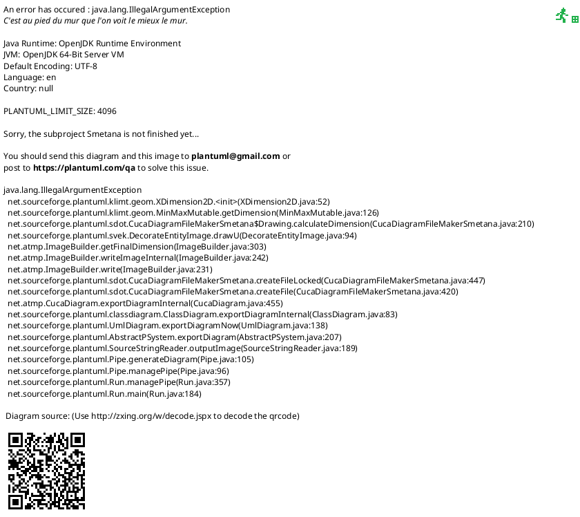

<!-- RTL Design Sherpa Documentation Header -->
<table>
<tr>
<td width="80">
  <a href="https://github.com/sean-galloway/RTLDesignSherpa">
    
  </a>
</td>
<td>
  <strong>RTL Design Sherpa</strong> · <em>Learning Hardware Design Through Practice</em><br>
  <sub>
    <a href="https://github.com/sean-galloway/RTLDesignSherpa">GitHub</a> ·
    <a href="https://github.com/sean-galloway/RTLDesignSherpa/blob/main/docs/DOCUMENTATION_INDEX.md">Documentation Index</a> ·
    <a href="https://github.com/sean-galloway/RTLDesignSherpa/blob/main/LICENSE">MIT License</a>
  </sub>
</td>
</tr>
</table>

---

<!-- End Header -->

**[← Back to Scripts Index](index.md)**

# Generate UML

## Overview

The `generate_uml.py` script is a comprehensive UML class diagram generation tool that creates PlantUML diagrams from Python codebases. It generates diagrams at multiple levels of granularity: entire project, per-package, and per-module (file). Optionally, it can render the PlantUML files to PNG and SVG images.

**Location:** `bin/generate_uml.py`

**Purpose:** Generate PlantUML class diagrams for Python projects using py2puml

**Key Features:**
- Multi-level diagram generation (project, package, module)
- Automatic class and relationship extraction
- Per-file diagram isolation
- PlantUML rendering to PNG/SVG
- Configurable base module naming
- Automatic cleanup of stale outputs

## Dependencies

### Required Python Packages

```bash
pip install py2puml
```

### Optional External Tools

For rendering diagrams to images:

```bash
# Ubuntu/Debian
sudo apt-get install plantuml

# macOS
brew install plantuml

# Or download from: https://plantuml.com/download
```

## Usage

### Command Line Arguments

```bash
python3 bin/generate_uml.py [project_root] [options]
```

### Arguments

| Argument | Short | Description | Default |
|----------|-------|-------------|---------|
| `project_root` | - | Root directory of Python project | `CocoTBFramework` |
| `--base-module` | `-b` | Base Python module name | Derived from directory name |

## Examples

### Example 1: Default Usage (CocoTBFramework)

```bash
cd rtldesignsherpa
python3 bin/generate_uml.py
```

**Output:**
```
CocoTBFramework/
├── puml/                          # PlantUML source files
│   ├── CocoTBFramework.puml              # Full project diagram
│   ├── CocoTBFramework.components.puml   # Components package
│   ├── CocoTBFramework.tbclasses.puml    # TB classes package
│   └── CocoTBFramework.components.axi4.axi_master.__init__.puml  # Per-file
└── puml_img/                      # Rendered images (if PlantUML available)
    ├── CocoTBFramework.png
    ├── CocoTBFramework.svg
    └── ...
```

### Example 2: Custom Project

```bash
python3 bin/generate_uml.py rtl_generators --base-module generators
```

This generates UML for the `rtl_generators` directory with module names like `generators.adders`, `generators.multipliers`, etc.

### Example 3: Verification Framework

```bash
python3 bin/generate_uml.py bin/CocoTBFramework --base-module CocoTBFramework
```

## Generated Diagram Levels

### Level 1: Full Project Diagram

**File:** `{base_module}.puml`

**Content:** High-level overview showing all packages and major classes

**Settings:**
- `hide members` - Simplifies diagram by hiding method/attribute details
- `hide circle` - Removes circle notation for cleaner appearance

**Use Case:** Architecture overview, documentation, presentations

### Level 2: Package Diagrams

**Files:** `{base_module}.{package}.puml`

**Content:** All classes within a top-level package and their relationships

**Example:** `CocoTBFramework.components.puml` shows all AXI, APB, AXIS components

**Use Case:** Package-level documentation, subsystem design review

### Level 3: Module (File) Diagrams

**Files:** `{base_module}.{package}.{module}.puml`

**Content:** Classes defined in a single Python file with intra-file relationships

**Example:** `CocoTBFramework.components.axi4.axi_master.puml`

**Use Case:** Detailed class documentation, code review, API reference

## How It Works

### Processing Flow

```
1. Validate project directory
   ↓
2. Discover Python files and packages
   ↓
3. Generate full project UML
   ├── Extract pragma directives
   └── Add hide directives for overview
   ↓
4. Generate per-package UML
   └── For each top-level package
   ↓
5. Generate per-file UML
   ├── Filter classes for specific module
   ├── Extract relevant relationships
   └── Build isolated diagram
   ↓
6. (Optional) Render with PlantUML
   └── Generate PNG and SVG images
```

### Class and Relationship Filtering

The script uses intelligent filtering to create per-file diagrams:

```python
def filter_lines_for_module(lines, modulename):
    """
    Extract only classes/enums defined in modulename and
    relationships between classes in the same module.
    """
```

**Filtering Rules:**
1. Include class/enum definitions where `module_of_line == modulename`
2. Include relationships where both source and target are in `modulename`
3. Exclude relationships crossing module boundaries
4. Preserve pragma directives and footer

### PlantUML Directive Handling

**Full Project Diagram:**
```plantuml
@startuml CocoTBFramework
!pragma layout smetana
hide members
hide circle
' ... class definitions ...
@enduml
```

**Module Diagram:**


## Output Directory Structure

```
{project_root}/
├── puml/                    # PlantUML source files
│   ├── {base}.puml                    # Full project
│   ├── {base}.{pkg1}.puml             # Package 1
│   ├── {base}.{pkg2}.puml             # Package 2
│   ├── {base}.{pkg1}.{mod1}.puml      # Module 1 in pkg1
│   ├── {base}.{pkg1}.{mod2}.puml      # Module 2 in pkg1
│   └── {base}.{pkg1}.{sub}.__init__.puml  # Package __init__
└── puml_img/                # Rendered images (optional)
    ├── {base}.png
    ├── {base}.svg
    ├── {base}.{pkg1}.png
    └── ...
```

### File Naming Conventions

- **Regular modules:** `{base}.{path}.{module}.puml`
- **Package init files:** `{base}.{path}.__init__.puml`
- **Nested packages:** `{base}.{pkg}.{subpkg}.{module}.puml`

## Integration with Documentation

### Including UML in Markdown

```markdown
## Class Architecture


### AXI4 Components


```

### Embedding in Sphinx/ReadTheDocs

```rst
.. image:: ../puml_img/CocoTBFramework.components.svg
   :width: 100%
   :alt: Component Architecture
```

## Advanced Usage

### Programmatic Usage

```python
from py2puml.py2puml import py2puml

# Generate UML for specific package
uml_lines = list(py2puml("CocoTBFramework/components", "CocoTBFramework.components"))

# Write to file
with open("output.puml", "w") as f:
    f.writelines(uml_lines)
```

### Custom PlantUML Rendering

```bash
# Generate only .puml files (skip rendering)
python3 bin/generate_uml.py CocoTBFramework

# Custom PlantUML rendering with options
cd CocoTBFramework/puml
plantuml -tpng -tsvg -DPLANTUML_LIMIT_SIZE=8192 *.puml
```

### Selective Diagram Generation

To generate diagrams for only a subset:

1. Run the script normally
2. Delete unwanted `.puml` files from `puml/` directory
3. Manually run PlantUML on remaining files

## Use Cases

### 1. API Documentation

Generate class diagrams for documentation:

```bash
python3 bin/generate_uml.py CocoTBFramework
cp CocoTBFramework/puml_img/*.png docs/images/
```

### 2. Code Review

Create diagrams for review sessions:

```bash
# Generate diagrams before review
python3 bin/generate_uml.py

# View specific package
open CocoTBFramework/puml_img/CocoTBFramework.tbclasses.png
```

### 3. Architecture Analysis

Understand code structure:

```bash
# Generate all diagrams
python3 bin/generate_uml.py CocoTBFramework

# Analyze relationships
grep "--|>" CocoTBFramework/puml/*.puml  # Find inheritance
grep "*--" CocoTBFramework/puml/*.puml   # Find composition
```

### 4. Onboarding Documentation

Help new developers understand codebase:

```bash
# Generate comprehensive diagrams
python3 bin/generate_uml.py

# Create index with key diagrams
cat > docs/architecture.md <<EOF
# Framework Architecture

## Overview


## Key Components


EOF
```

## Troubleshooting

### Issue: py2puml not found

**Cause:** py2puml package not installed

**Solution:**
```bash
pip install py2puml
```

### Issue: PlantUML warnings about image generation

**Cause:** PlantUML CLI not found

**Solution:**
- Install PlantUML (see Dependencies section)
- Or ignore warnings and use `.puml` files with online PlantUML viewer

### Issue: Diagrams are too large/complex

**Cause:** Large codebase generates overwhelming diagrams

**Solutions:**
1. Use per-package or per-module diagrams instead of full project
2. Manually edit `.puml` files to remove unwanted classes
3. Use PlantUML `hide` directives to simplify

### Issue: Empty diagrams generated

**Cause:** Python files have no class definitions or only have functions

**Solution:** This is expected. Script only generates diagrams for files with classes/enums.

### Issue: Import errors when running py2puml

**Cause:** Project has circular imports or missing dependencies

**Solution:**
- Fix import structure in source code
- Ensure all dependencies are installed
- Check that project is in PYTHONPATH

## Technical Details

### Ignored Directories

The script automatically ignores:

```python
ignore_dirs = {
    "puml",         # Output directory
    "puml_img",     # Image output
    "__pycache__",  # Python cache
    ".git",         # Version control
    ".hg",          # Mercurial
    ".svn",         # Subversion
    ".idea",        # IDE files
    "venv",         # Virtual environments
    "env"
}
```

### PlantUML Relationship Symbols

The script recognizes:

- `<|--` - Inheritance (extends)
- `*--` - Composition
- `o--` - Aggregation
- `--` - Association

### Performance Considerations

**Large Projects:**
- Project with 100+ files may take 30-60 seconds
- PlantUML rendering adds 5-10 seconds per diagram
- Consider parallel processing for very large codebases

## Limitations

1. **Python Only:** Works exclusively with Python code, not SystemVerilog
2. **Static Analysis:** Doesn't detect runtime class creation
3. **No Call Graphs:** Generates class diagrams, not sequence/call diagrams
4. **Import Sensitivity:** Requires clean imports to analyze successfully

## Related Tools

- **[Verilog Parser](verilog_parser.md)** - SystemVerilog parsing (different domain)
- **[Module](module.md)** - RTL module generation classes
- **[PyTree](pytree.md)** - Directory structure visualization

## Version History

- **Created:** 2025-10-18
- **Author:** sean galloway
- **License:** MIT

---

[Back to Scripts Index](index.md)

---
