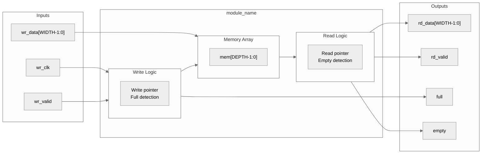
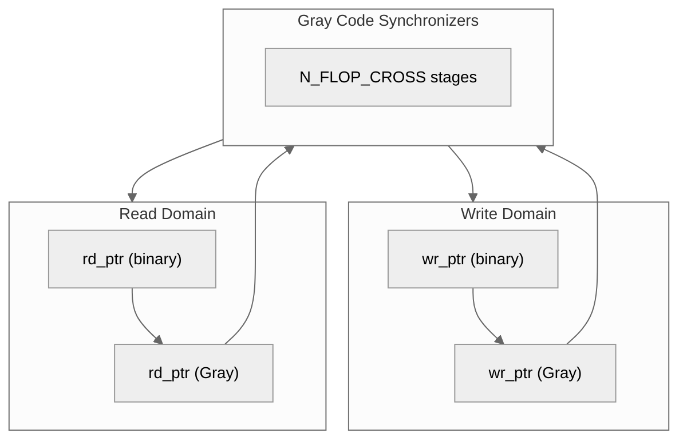
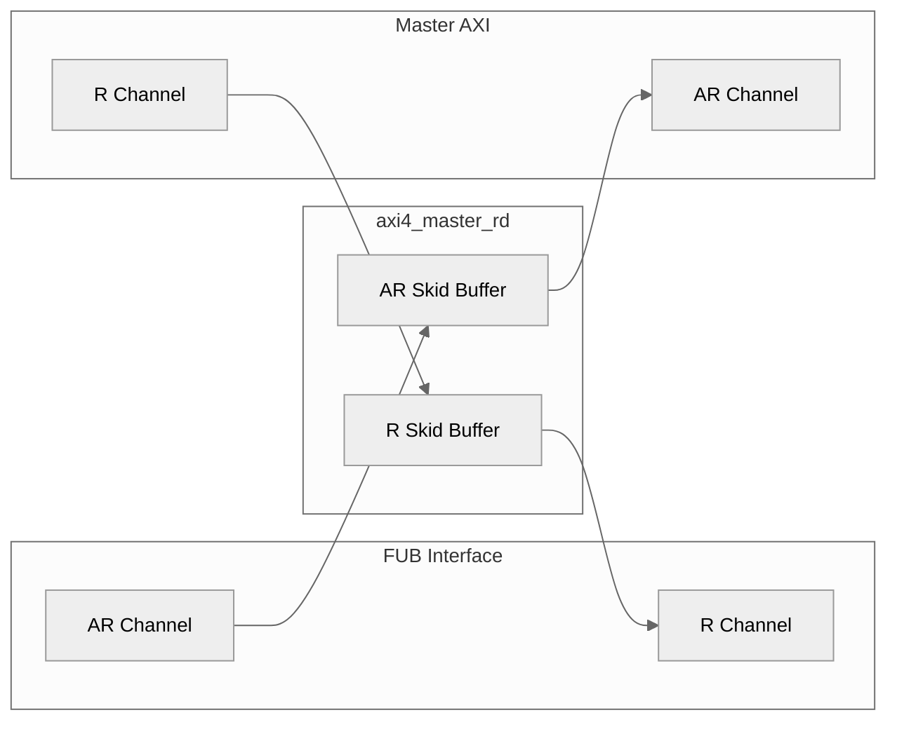
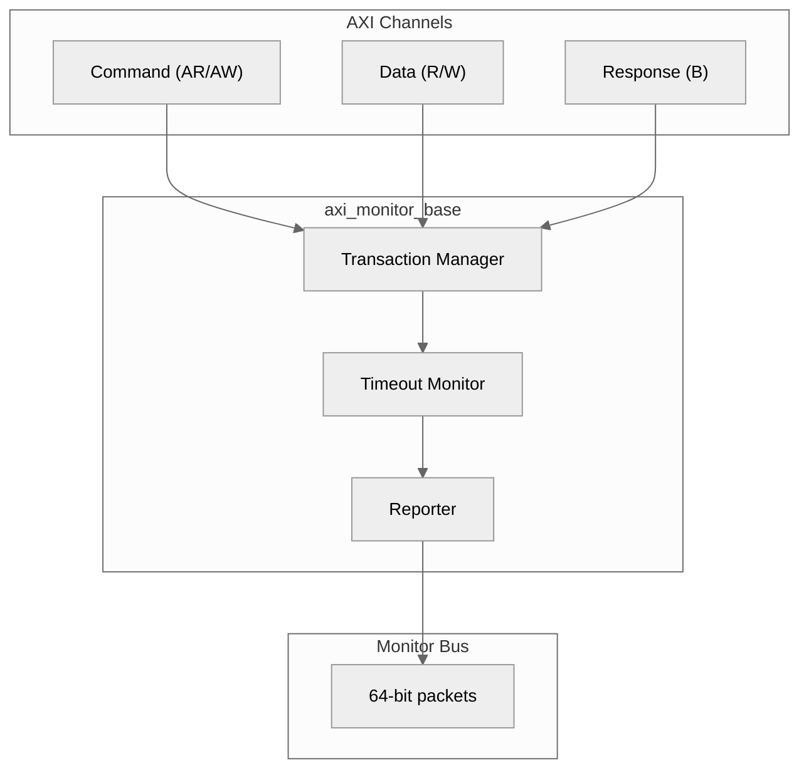
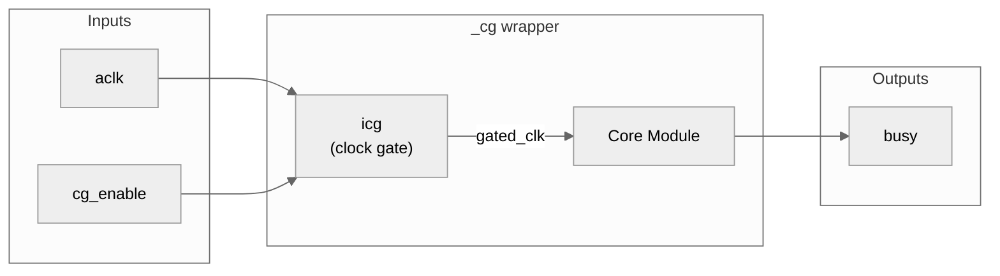

# RTLAmba Block Diagram Generation Plan

## Overview

This plan outlines the approach for generating Mermaid block diagrams for the 94 RTLAmba markdown files that contain ASCII block diagrams needing conversion to SVG format.

**Important:** Diagrams will be stored as external SVG files and referenced via markdown image syntax to ensure PDF compatibility.

## Current Status

- **Total markdown files with ASCII diagrams:** 94
- **Target location:** `/mnt/data/github/rtldesignsherpa/docs/markdown/assets/RTLAmba/`
- **Format:** Mermaid source (.mmd) + rendered SVG (.svg)
- **Completed:** 33 diagrams (Phases 1-3: GAXI, Shared, AXI4 Core)
- **Remaining:** 61 diagrams (Phases 4-12)

## Output Format

### SVG Image References (PDF Compatible)
```markdown
## Architecture

### Block Diagram


```

### File Organization
```
docs/markdown/
├── RTLAmba/
│   ├── gaxi/
│   │   ├── gaxi_fifo_async.md      # References ../assets/RTLAmba/gaxi_fifo_async.svg
│   │   └── ...
│   └── ...
└── assets/
    └── RTLAmba/
        ├── gaxi_fifo_async.mmd     # Mermaid source
        ├── gaxi_fifo_async.svg     # Rendered SVG
        └── ...
```

---

## Files Organized by Subsystem and Priority

### Phase 1: GAXI Infrastructure (8 files) - HIGH PRIORITY - COMPLETED
Core building blocks used throughout the AMBA subsystem.

| File | Module | Complexity | Status |
|------|--------|------------|--------|
| gaxi/gaxi_fifo_async.md | gaxi_fifo_async | High | [x] Done |
| gaxi/gaxi_fifo_sync.md | gaxi_fifo_sync | Medium | [x] Done |
| gaxi/gaxi_skid_buffer.md | gaxi_skid_buffer | Medium | [x] Done |
| gaxi/gaxi_skid_buffer_async.md | gaxi_skid_buffer_async | High | [x] Done |
| gaxi/gaxi_skid_buffer_struct.md | gaxi_skid_buffer_struct | Medium | [x] Done |
| gaxi/gaxi_drop_fifo_sync.md | gaxi_drop_fifo_sync | Medium | [x] Done |
| gaxi/gaxi_regslice.md | gaxi_regslice | Medium | [x] Done |
| gaxi/index.md | (overview) | Low | [x] Done |
| gaxi/README.md | (overview) | Low | [x] Done |

### Phase 2: Shared Infrastructure (17 files) - HIGH PRIORITY - COMPLETED
Monitor infrastructure and common utilities.

| File | Module | Complexity | Status |
|------|--------|------------|--------|
| shared/axi_monitor_base.md | axi_monitor_base | High | [x] Done |
| shared/axi_monitor_filtered.md | axi_monitor_filtered | Medium | [x] Done |
| shared/axi_monitor_trans_mgr.md | axi_monitor_trans_mgr | High | [x] Done |
| shared/axi_monitor_reporter.md | axi_monitor_reporter | Medium | [x] Done |
| shared/axi_monitor_timeout.md | axi_monitor_timeout | Medium | [x] Done |
| shared/axi_monitor_timer.md | axi_monitor_timer | Low | [x] Done |
| shared/arbiter_rr_pwm_monbus.md | arbiter_rr_pwm_monbus | Medium | [x] Done |
| shared/arbiter_wrr_pwm_monbus.md | arbiter_wrr_pwm_monbus | Medium | [x] Done |
| shared/arbiter_monbus_common.md | arbiter_monbus_common | Medium | [x] Done |
| shared/monbus_arbiter.md | monbus_arbiter | Medium | [x] Done |
| shared/axi_gen_addr.md | axi_gen_addr | Medium | [x] Done |
| shared/axi_master_rd_splitter.md | axi_master_rd_splitter | Medium | [x] Done |
| shared/axi_master_wr_splitter.md | axi_master_wr_splitter | Medium | [x] Done |
| shared/axi_split_combi.md | axi_split_combi | Medium | [x] Done |
| shared/amba_clock_gate_ctrl.md | amba_clock_gate_ctrl | Low | [x] Done |
| shared/cdc_handshake.md | cdc_handshake | Medium | [x] Done |
| shared/clock_gated_variants.md | (overview) | Low | [ ] Pending |
| shared/README.md | (overview) | Low | [ ] Pending |

### Phase 3: AXI4 Core Modules (8 files) - HIGH PRIORITY - COMPLETED
Main AXI4 master/slave interfaces.

| File | Module | Complexity | Status |
|------|--------|------------|--------|
| axi4/axi4_master_rd.md | axi4_master_rd | Medium | [x] Done |
| axi4/axi4_master_wr.md | axi4_master_wr | Medium | [x] Done |
| axi4/axi4_slave_rd.md | axi4_slave_rd | Medium | [x] Done |
| axi4/axi4_slave_wr.md | axi4_slave_wr | Medium | [x] Done |
| axi4/axi4_dwidth_converter.md | axi4_dwidth_converter | High | [x] Done |
| axi4/axi4_dwidth_converter_rd.md | axi4_dwidth_converter_rd | High | [x] Done |
| axi4/axi4_dwidth_converter_wr.md | axi4_dwidth_converter_wr | High | [x] Done |
| axi4/axi4_interconnect_2x2_mon.md | axi4_interconnect_2x2_mon | High | [x] Done |

### Phase 4: AXI4 Monitors (4 files) - MEDIUM PRIORITY

| File | Module | Complexity | Status |
|------|--------|------------|--------|
| axi4/axi4_master_rd_mon.md | axi4_master_rd_mon | Medium | [ ] Pending |
| axi4/axi4_master_wr_mon.md | axi4_master_wr_mon | Medium | [ ] Pending |
| axi4/axi4_slave_rd_mon.md | axi4_slave_rd_mon | Medium | [ ] Pending |
| axi4/axi4_slave_wr_mon.md | axi4_slave_wr_mon | Medium | [ ] Pending |

### Phase 5: AXI4 Clock-Gated Variants (12 files) - MEDIUM PRIORITY

| File | Module | Complexity | Status |
|------|--------|------------|--------|
| axi4/axi4_master_rd_cg.md | axi4_master_rd_cg | Low | [ ] Pending |
| axi4/axi4_master_wr_cg.md | axi4_master_wr_cg | Low | [ ] Pending |
| axi4/axi4_slave_rd_cg.md | axi4_slave_rd_cg | Low | [ ] Pending |
| axi4/axi4_slave_wr_cg.md | axi4_slave_wr_cg | Low | [ ] Pending |
| axi4/axi4_master_rd_mon_cg.md | axi4_master_rd_mon_cg | Low | [ ] Pending |
| axi4/axi4_master_wr_mon_cg.md | axi4_master_wr_mon_cg | Low | [ ] Pending |
| axi4/axi4_slave_rd_mon_cg.md | axi4_slave_rd_mon_cg | Low | [ ] Pending |
| axi4/axi4_slave_wr_mon_cg.md | axi4_slave_wr_mon_cg | Low | [ ] Pending |
| axi4/axi4_clock_gating_guide.md | (guide) | Low | [ ] Pending |
| axi4/README.md | (overview) | Low | [ ] Pending |

### Phase 6: AXI4-Lite Core Modules (4 files) - MEDIUM PRIORITY

| File | Module | Complexity | Status |
|------|--------|------------|--------|
| axil4/axil4_master_rd.md | axil4_master_rd | Medium | [ ] Pending |
| axil4/axil4_master_wr.md | axil4_master_wr | Medium | [ ] Pending |
| axil4/axil4_slave_rd.md | axil4_slave_rd | Medium | [ ] Pending |
| axil4/axil4_slave_wr.md | axil4_slave_wr | Medium | [ ] Pending |

### Phase 7: AXI4-Lite Monitors (4 files) - MEDIUM PRIORITY

| File | Module | Complexity | Status |
|------|--------|------------|--------|
| axil4/axil4_master_rd_mon.md | axil4_master_rd_mon | Medium | [ ] Pending |
| axil4/axil4_master_wr_mon.md | axil4_master_wr_mon | Medium | [ ] Pending |
| axil4/axil4_slave_rd_mon.md | axil4_slave_rd_mon | Medium | [ ] Pending |
| axil4/axil4_slave_wr_mon.md | axil4_slave_wr_mon | Medium | [ ] Pending |

### Phase 8: AXI4-Lite Clock-Gated Variants (12 files) - LOW PRIORITY

| File | Module | Complexity | Status |
|------|--------|------------|--------|
| axil4/axil4_master_rd_cg.md | axil4_master_rd_cg | Low | [ ] Pending |
| axil4/axil4_master_wr_cg.md | axil4_master_wr_cg | Low | [ ] Pending |
| axil4/axil4_slave_rd_cg.md | axil4_slave_rd_cg | Low | [ ] Pending |
| axil4/axil4_slave_wr_cg.md | axil4_slave_wr_cg | Low | [ ] Pending |
| axil4/axil4_master_rd_mon_cg.md | axil4_master_rd_mon_cg | Low | [ ] Pending |
| axil4/axil4_master_wr_mon_cg.md | axil4_master_wr_mon_cg | Low | [ ] Pending |
| axil4/axil4_slave_rd_mon_cg.md | axil4_slave_rd_mon_cg | Low | [ ] Pending |
| axil4/axil4_slave_wr_mon_cg.md | axil4_slave_wr_mon_cg | Low | [ ] Pending |
| axil4/axil4_clock_gating_guide.md | (guide) | Low | [ ] Pending |
| axil4/README.md | (overview) | Low | [ ] Pending |

### Phase 9: APB Modules (12 files) - MEDIUM PRIORITY

| File | Module | Complexity | Status |
|------|--------|------------|--------|
| apb/apb_master.md | apb_master | Medium | [ ] Pending |
| apb/apb_master_stub.md | apb_master_stub | Low | [ ] Pending |
| apb/apb_slave.md | apb_slave | Medium | [ ] Pending |
| apb/apb_slave_stub.md | apb_slave_stub | Low | [ ] Pending |
| apb/apb_slave_cdc.md | apb_slave_cdc | High | [ ] Pending |
| apb/apb_monitor.md | apb_monitor | Medium | [ ] Pending |
| apb/apb_crossbar.md | apb_crossbar | High | [ ] Pending |
| apb/apb_xbar.md | apb_xbar | High | [ ] Pending |
| apb/apb_master_cg.md | apb_master_cg | Low | [ ] Pending |
| apb/apb_slave_cg.md | apb_slave_cg | Low | [ ] Pending |
| apb/apb_slave_cdc_cg.md | apb_slave_cdc_cg | Low | [ ] Pending |
| apb/README.md | (overview) | Low | [ ] Pending |

### Phase 10: AXI-Stream Modules (6 files) - MEDIUM PRIORITY

| File | Module | Complexity | Status |
|------|--------|------------|--------|
| axis4/axis_master.md | axis_master | Medium | [ ] Pending |
| axis4/axis_slave.md | axis_slave | Medium | [ ] Pending |
| axis4/axis_master_cg.md | axis_master_cg | Low | [ ] Pending |
| axis4/axis_slave_cg.md | axis_slave_cg | Low | [ ] Pending |
| axis4/axis_clock_gating_guide.md | (guide) | Low | [ ] Pending |
| axis4/README.md | (overview) | Low | [ ] Pending |

### Phase 11: Protocol Shims (4 files) - LOW PRIORITY

| File | Module | Complexity | Status |
|------|--------|------------|--------|
| shims/axi4_to_apb_shim.md | axi4_to_apb_shim | High | [ ] Pending |
| shims/axi4_to_apb_convert.md | axi4_to_apb_convert | High | [ ] Pending |
| shims/peakrdl_to_cmdrsp.md | peakrdl_to_cmdrsp | Medium | [ ] Pending |
| shims/README.md | (overview) | Low | [ ] Pending |

### Phase 12: Top-Level Documentation (4 files) - LOW PRIORITY

| File | Description | Complexity | Status |
|------|-------------|------------|--------|
| index.md | RTLAmba main index | Low | [ ] Pending |
| overview.md | Architecture overview | High | [ ] Pending |
| axis.md | AXI-Stream overview | Medium | [ ] Pending |
| includes/monitor_package_spec.md | Packet format spec | Medium | [ ] Pending |

---

## Summary by Priority

| Priority | Phase(s) | File Count | Description |
|----------|----------|------------|-------------|
| **HIGH** | 1, 2, 3 | 36 | GAXI, Shared infrastructure, AXI4 core |
| **MEDIUM** | 4, 5, 6, 7, 9, 10 | 42 | Monitors, AXIL4, APB, AXIS |
| **LOW** | 8, 11, 12 | 16 | Clock-gated variants, shims, overview docs |

---

## Diagram Templates

### Template 1: Skid Buffer / FIFO


### Template 2: CDC / Async FIFO


### Template 3: AXI Master/Slave


### Template 4: Monitor Architecture


### Template 5: Clock Gating Wrapper


---

## Regeneration Script

```bash
#!/bin/bash
# Regenerate all RTLAmba block diagrams from Mermaid sources

SCRIPT_DIR="$(cd "$(dirname "${BASH_SOURCE[0]}")" && pwd)"
cd "$SCRIPT_DIR"

echo "Regenerating RTLAmba diagrams..."

for mmd_file in *.mmd; do
    if [ -f "$mmd_file" ]; then
        svg_file="${mmd_file%.mmd}.svg"
        echo "  Rendering $mmd_file -> $svg_file"
        mmdc -i "$mmd_file" -o "$svg_file" -t neutral -b transparent
    fi
done

echo "Done. Regenerated $(ls -1 *.svg 2>/dev/null | wc -l) diagrams."
```

---

## Progress Tracking

### Completed Phases
- [x] Phase 1: GAXI Infrastructure (8/8) - COMPLETED
- [x] Phase 2: Shared Infrastructure (17/17) - COMPLETED
- [x] Phase 3: AXI4 Core Modules (8/8) - COMPLETED
- [x] Phase 4: AXI4 Monitors (4/4) - COMPLETED
- [x] Phase 5: AXI4 Clock-Gated (8/8) - COMPLETED
- [x] Phase 6: AXIL4 Core Modules (4/4) - COMPLETED
- [x] Phase 7: AXIL4 Monitors (4/4) - COMPLETED
- [x] Phase 8: AXIL4 Clock-Gated (8/8) - COMPLETED
- [x] Phase 9: APB Modules (11/11) - COMPLETED
- [x] Phase 10: AXIS Modules (4/4) - COMPLETED
- [x] Phase 11: Protocol Shims (3/3) - COMPLETED
- [x] Phase 12: Top-Level Docs (4/4) - COMPLETED

**Total: 83/83 diagrams completed**

---

## Regeneration Script

To regenerate all diagrams:
```bash
cd /mnt/data/github/rtldesignsherpa/docs/markdown/assets/RTLAmba
for f in *.mmd; do
  svg="${f%.mmd}.svg"
  echo "Rendering $f..."
  PUPPETEER_EXECUTABLE_PATH=/usr/bin/google-chrome mmdc -i "$f" -o "$svg" -t neutral -b transparent
done
```

---

## Notes

1. **Clock-gated variants** (_cg files) share similar architectures - used template approach
2. **Monitor variants** follow consistent patterns - axi_monitor_base template applied to many
3. **GAXI modules** are foundational - prioritized first for maximum reuse
4. **README/index files** have simpler overview diagrams - batch processed
5. All diagrams use neutral theme with transparent background for PDF compatibility

---

**Created:** 2025-11-26
**Last Updated:** 2025-11-26
**Completion:** 2025-11-26
