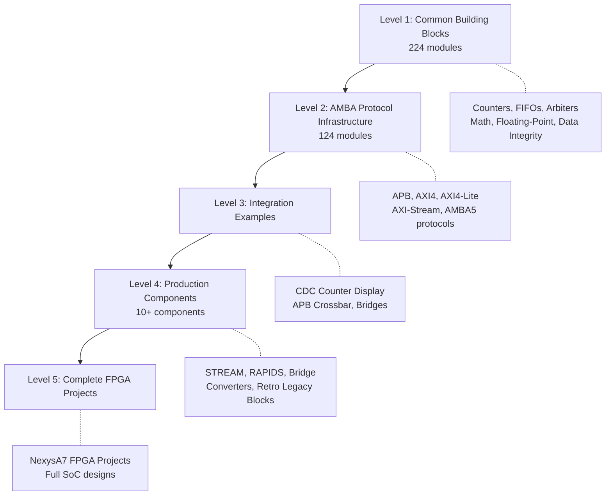

<table>
<tr>
<td width="220">
  
</td>
<td>
  <h1>RTL Design Sherpa</h1>
  <p><em>Learning Hardware Design Through Practice</em></p>
  <p>
    
    
    
  </p>
  <p>
    
    
    
    
  </p>
</td>
</tr>
</table>

*A progressive learning framework for RTL development using open-source tools*

**📚 [Documentation Index](docs/DOCUMENTATION_INDEX.md)** - Complete guide to all documentation, organized by type

---

## Project Mission

**RTL Design Sherpa guides you through digital hardware design with 
hands-on learning from first principles.**

We start with fundamental building blocks (adders, multipliers, FIFOs), 
progress to protocol-specific modules (AXI, DMA engines), and culminate 
in complete FPGA-ready systems. Every module is both educational and 
production-quality - meeting real timing and resource constraints.

**What makes RTL Design Sherpa different:**

- **From scratch**: Python generators → SystemVerilog → synthesis. 
  No black boxes, every design decision explained.

- **Safety net for exploration**: Comprehensive test suites at every 
  level (unit, integration, formal) let you experiment with confidence. 
  Try different optimizations - the tests catch regressions.

- **Performance-driven**: Multiple implementations of key modules, 
  with measured area/speed tradeoffs. SimPy models predict behavior 
  before writing RTL.

- **Industry practices**: Open-source tools (cocotb, Verilator, Yosys) 
  demonstrating verification methodologies used in production.

- **Complete transparency**: Build systems, Makefiles, debugging 
  sessions - all the "hidden knowledge" made visible.

Whether you're learning your first Verilog module or optimizing a 
high-speed interconnect, RTL Design Sherpa provides the detailed 
explanations, working examples, and verification infrastructure to 
build understanding from the ground up.

### Learning Path



---

## Quick Navigation

### 📚 Documentation
- **[Component Projects Index](docs/markdown/projects/index.md)** - All production-ready components
- **[Documentation Index](docs/DOCUMENTATION_INDEX.md)** - Complete documentation guide

### 🏗️ RTL Building Blocks
- **[Common Library](rtl/common/)** (224 modules) - [Documentation](docs/markdown/RTLCommon/index.md) - [AI Guide](rtl/common/CLAUDE.md)
  - Counters, FIFOs, arbiters, integer math, floating-point (BF16/FP16/FP32/FP8), data integrity
- **[AMBA Infrastructure](rtl/amba/)** (124 modules) - [Documentation](docs/markdown/RTLAmba/index.md) - [AI Guide](rtl/amba/CLAUDE.md)
  - APB, AXI4, AXI4-Lite, AXI-Stream, AMBA5 protocols

### 🎯 Component Projects
| Component | Status | Description |
|-----------|--------|-------------|
| **[STREAM](projects/components/stream/)** | ✅ Ready | Tutorial DMA engine with scatter-gather |
| **[RAPIDS](projects/components/rapids/)** | 🟡 In Progress | Advanced DMA with network interfaces |
| **[Bridge](projects/components/bridge/)** | ✅ Ready | AXI protocol bridges and converters |
| **[Converters](projects/components/converters/)** | ✅ Ready | UART-to-AXI4-Lite, protocol conversion |
| **[APB Crossbar](projects/components/apb_xbar/)** | ✅ Ready | M×N APB interconnect |
| **[Retro Legacy](projects/components/retro_legacy_blocks/)** | ✅ Ready | HPET, PIC, PIT, RTC, UART, GPIO, etc. |
| **[Delta](projects/components/delta/)** | 📋 Planned | Network-on-Chip mesh |
| **[HIVE](projects/components/hive/)** | 📋 Planned | Distributed RISC-V control |

### 🧪 Verification
- **[Common Tests](val/common/)** - Unit tests for common modules
- **[AMBA Tests](val/amba/)** - Protocol compliance tests
- **[CocoTB Framework](bin/CocoTBFramework/)** - Reusable testbench infrastructure

### 🛠️ Tools
- **[RTL Generators](bin/rtl_generators/)** - Math circuits, floating-point modules
- **[Documentation Tools](bin/)** - md_to_docx.py, header management

---

## Progressive Learning Approach

### Level 1: Common Building Blocks (Foundation)

**Location:** [`rtl/common/`](rtl/common/) | **Documentation:** [Full Index](docs/markdown/RTLCommon/index.md) | [AI Guide](rtl/common/CLAUDE.md)

Learn fundamental RTL design patterns through **224 reusable modules**:

#### Integer Arithmetic (44+ modules)
- **Counters:** Binary, Gray code, Johnson, Ring, Load/Clear variants
- **Adders:** Han-Carlson prefix adders (16/22/32/44/48/72-bit), Brent-Kung
- **Multipliers:** Dadda 4:2 compressor trees (8/11/24-bit)
- **Math:** Leading zeros, bit reversal, parity, CRC

#### Floating-Point (120+ modules)
- **BF16:** Adder, multiplier, FMA, reciprocal, division, square root
- **FP16 (IEEE 754):** Complete arithmetic suite
- **FP32 (IEEE 754):** Adder, multiplier, FMA
- **FP8 (E4M3/E5M2):** ML-optimized formats
- **Converters:** Cross-format conversion (FP32↔FP16↔BF16↔FP8)

#### Data Structures
- **FIFOs:** Synchronous, asynchronous, dual-clock domain
- **Shift Registers:** LFSR (Fibonacci/Galois), universal shifters
- **Memory:** CAM (Content Addressable Memory), buffers

#### Control Logic
- **Arbiters:** Round-robin (simple, weighted, PWM), priority encoders
- **Encoders/Decoders:** Priority encoding, address decoding
- **Clock Management:** Dividers, gate control, pulse generation
- **Reset:** Synchronizers, CDC utilities

#### Data Integrity
- **CRC Engines:** Generic CRC supporting 300+ standards
- **ECC:** Hamming code (SECDED), parity checkers

**Example Module:** `counter_bin.sv`
```systemverilog
// Simple binary counter - foundation for timers, state machines
module counter_bin #(
    parameter WIDTH = 8
) (
    input  logic             i_clk,
    input  logic             i_rst_n,
    input  logic             i_enable,
    output logic [WIDTH-1:0] o_count
);
```

**Tests:** [`val/common/`](val/common/) - Every module has comprehensive CocoTB tests

---

### Level 2: AMBA Protocol Infrastructure

**Location:** [`rtl/amba/`](rtl/amba/) | **Documentation:** [Full Index](docs/markdown/RTLAmba/index.md) | [AI Guide](rtl/amba/CLAUDE.md)

Apply common building blocks to implement industry-standard protocols (**124 modules**):

#### APB (Advanced Peripheral Bus)
- **[APB Masters](rtl/amba/apb/)** - Command/response interfaces with FIFO buffering
- **[APB Slaves](rtl/amba/apb/)** - Register interfaces with address decoding
- **[APB Interconnect](rtl/integ_amba/)** - Multi-master/multi-slave crossbar
- **[APB Bridges](rtl/amba/apb/)** - Protocol conversion, CDC

**Example:** APB register slave demonstrates parameter-driven design
```systemverilog
apb_slave #(
    .ADDR_WIDTH(12),
    .DATA_WIDTH(32)
) u_apb_slave (
    .pclk, .presetn, .paddr, .psel, .penable, .pwrite,
    .pwdata, .pready, .prdata, .pslverr
);
```

#### AXI4 Full Protocol
- **[AXI4 Masters](rtl/amba/axi4/)** - Read/write with dual skid buffers
- **[AXI4 Slaves](rtl/amba/axi4/)** - Response generation, address decoding
- **[AXI4 Infrastructure](rtl/amba/gaxi/)** - FIFOs, skid buffers, arbiters
- **[Monitoring](rtl/amba/axi4/)** - Protocol compliance checkers

#### AXI4-Lite (Simplified Register Interface)
- **[AXI4-Lite Masters](rtl/amba/axil4/)** - Register-optimized masters
- **[AXI4-Lite Slaves](rtl/amba/axil4/)** - Configuration registers
- **[Protocol Bridges](rtl/amba/adapters/)** - APB ↔ AXI-Lite conversion

#### AXI4-Stream (High-Throughput Data)
- **[Stream Masters/Slaves](rtl/amba/axis/)** - Streaming interfaces
- **[Flow Control](rtl/amba/axis/)** - Backpressure, buffering
- **[Sideband Support](rtl/amba/axis/)** - TID, TDEST, TUSER, TSTRB

#### Shared Infrastructure
- **[GAXI Buffers](rtl/amba/gaxi/)** - Generic skid buffers, FIFOs, CDC
- **[Monitors](rtl/amba/shared/)** - Transaction monitoring, performance analysis
- **[Arbiters](rtl/amba/shared/)** - Advanced arbitration for monitor buses

**Tests:** [`val/amba/`](val/amba/) - Protocol compliance and integration tests

---

### Level 3: Integration Examples

**Locations:** [`rtl/integ_common/`](rtl/integ_common/) | [`rtl/integ_amba/`](rtl/integ_amba/)

Practice integrating multiple modules into working systems:

#### Simple Integrations (`integ_common`)
- **CDC Counter Display** - Cross clock domain counter with display logic
- **Multi-Clock Systems** - Demonstrate CDC techniques

**Example:** CDC Counter Display
```
Clock Domain A (Fast)    Clock Domain B (Slow)
    Counter      →  CDC  →    Display
   @ 100MHz         Sync      @ 10MHz
```

#### Protocol Integrations (`integ_amba`)
- **APB Crossbar** - Multi-master to multi-slave interconnect
  - 1-to-1, 1-to-4, 2-to-1, 2-to-4 configurations
  - Address decoding, weighted arbitration
- **APB Bridges** - Protocol conversion examples
- **AXI Systems** - Multi-component integration

**Tests:** [`val/integ_common/`](val/integ_common/) | [`val/integ_amba/`](val/integ_amba/)

---

### Level 4: Production Components

**Location:** [`projects/components/`](projects/components/) | **Documentation:** [Component Index](docs/markdown/projects/index.md)

Build complete, production-ready peripherals for FPGA deployment (**10+ components**):

#### DMA Engines

| Component | Status | Description |
|-----------|--------|-------------|
| **[STREAM](projects/components/stream/)** | ✅ Ready | Tutorial DMA with 8 channels, scatter-gather, APB config |
| **[RAPIDS](projects/components/rapids/)** | 🟡 In Progress | Advanced DMA with alignment fixup, network TX/RX, credit flow |

#### Interconnect and Bridges

| Component | Status | Description |
|-----------|--------|-------------|
| **[APB Crossbar](projects/components/apb_xbar/)** | ✅ Ready | Parametric M×N APB interconnect with round-robin arbitration |
| **[Bridge](projects/components/bridge/)** | ✅ Ready | AXI4 protocol bridges, width converters, CDC |
| **[Converters](projects/components/converters/)** | ✅ Ready | UART-to-AXI4-Lite, protocol conversion bridges |

#### Retro Legacy Blocks

**Status:** ✅ Production Ready | **Location:** [`projects/components/retro_legacy_blocks/`](projects/components/retro_legacy_blocks/)

Collection of 9 legacy/retro peripherals with full APB interfaces:

| Peripheral | Description |
|------------|-------------|
| **HPET** | High Precision Event Timer (2/3/8 timers, 64-bit) |
| **GPIO** | General Purpose I/O with interrupts |
| **UART 16550** | Full 16550-compatible UART |
| **8259 PIC** | Programmable Interrupt Controller |
| **8254 PIT** | Programmable Interval Timer |
| **RTC** | Real-Time Clock |
| **SMBUS** | System Management Bus controller |
| **PM/ACPI** | Power Management / ACPI support |
| **IOAPIC** | I/O Advanced PIC |

**Documentation:** [Block Status](projects/components/retro_legacy_blocks/BLOCK_STATUS.md) | [PRD](projects/components/retro_legacy_blocks/PRD.md)

#### Future Components

| Component | Status | Description |
|-----------|--------|-------------|
| **[Delta](projects/components/delta/)** | 📋 Planned | 4×4 Network-on-Chip mesh with virtual channels |
| **[HIVE](projects/components/hive/)** | 📋 Planned | Distributed RISC-V control (VexRiscv + 16 SERV monitors) |
| **[BCH](projects/components/bch/)** | 📋 Planned | BCH error correction encoder/decoder |

---

### Level 5: Complete FPGA Projects (Future)

**Planned:** Full SoC designs combining all levels:

- **Simple SoC:** APB HPET + Memory + UART
- **DMA System:** RAPIDS DMA + Multi-bank memory
- **Communication Hub:** Ethernet MAC + DMA + Buffers
- **Processing Subsystem:** Custom accelerators + Interconnect

---

## Verification Methodology

### CocoTB-Based Testing

Every module demonstrates professional verification practices:

**Test Structure:**
```python
# Reusable testbench class (in bin/CocoTBFramework/tbclasses/)
class ModuleTB(TBBase):
    def __init__(self, dut):
        super().__init__(dut)
        self.setup_drivers()
        self.setup_monitors()
        self.setup_scoreboards()

    async def setup_clocks_and_reset(self):
        """Standard clock and reset initialization"""

    async def write_register(self, addr, data):
        """Protocol-specific register write"""

# Test suite (organized by level)
class ModuleBasicTests:
    async def test_register_access(self): ...
    async def run_all_basic_tests(self): ...

class ModuleMediumTests:
    async def test_complex_scenario(self): ...
    async def run_all_medium_tests(self): ...

class ModuleFullTests:
    async def test_stress(self): ...
    async def run_all_full_tests(self): ...
```

**Test Hierarchy:**
1. **Basic Tests** - Register access, reset behavior, simple operations
2. **Medium Tests** - Complex features, multi-component interactions
3. **Full Tests** - Stress testing, CDC, edge cases

**Test Configuration (conftest.py):**
- Auto-creates logs directory
- Registers pytest markers (basic, medium, full)
- Preserves all logs
- Parametrized test fixtures

**Running Tests:**
```bash
# Run all tests for a module
pytest val/common/test_counter_bin.py -v

# Run specific test level
pytest val/amba/ -v -m basic      # Basic tests only
pytest val/amba/ -v -m medium     # Medium tests only
pytest val/amba/ -v -m full       # Full tests only

# Run component tests (example: Retro Legacy Blocks)
pytest projects/components/retro_legacy_blocks/dv/tests/hpet/ -v
```

---

## Technology Stack

### Core Tools (All Open-Source)

#### Simulation and Analysis
- **[Verilator](https://verilator.org/)** - High-performance RTL simulator
  - Supports SystemVerilog
  - VCD/FST waveform generation
  - Fast execution for large designs
- **[GTKWave](http://gtkwave.sourceforge.net/)** - Waveform viewer
  - Pre-configured signal groups
  - Professional visualization
- **[Verible](https://github.com/chipsalliance/verible)** - SystemVerilog tools
  - Linting and style checking
  - Code formatting
  - Parsing and analysis

#### Verification Framework
- **[CocoTB](https://docs.cocotb.org/)** - Python-based testbench framework
  - Intuitive Python test writing
  - Full SystemVerilog integration
  - Extensive protocol libraries
- **[pytest](https://pytest.org/)** - Test runner and framework
  - Test discovery and execution
  - Parametrized testing
  - Rich reporting
- **Custom VIP** - Verification IP for protocols
  - APB, AXI4, AXI4-Lite, AXI-Stream drivers/monitors
  - Scoreboards and coverage collectors

#### Register Generation
- **[PeakRDL](https://peakrdl.readthedocs.io/)** - SystemRDL tools
  - Register file generation from specifications
  - APB4, AXI4-Lite interface generation
  - C header generation
  - Documentation generation

#### Development and Automation
- **Python 3.8+** - Scripting and automation
  - Code generation (math circuits, register files)
  - Analysis tools (dependency, UML)
  - Documentation generation (Wavedrom)
- **Make** - Build automation
- **Git** - Version control with CI/CD integration

---

## Repository Structure

```
rtldesignsherpa/
├── rtl/                          # RTL source code (350+ modules)
│   ├── common/                   # 224 building blocks (counters, math, FP, etc.)
│   ├── amba/                     # 124 AMBA protocol modules
│   │   ├── apb/                 # APB protocol
│   │   ├── axi4/                # AXI4 full protocol
│   │   ├── axil4/               # AXI4-Lite
│   │   ├── axis/                # AXI4-Stream
│   │   ├── axi5/                # AMBA5 components
│   │   ├── apb5/                # APB5 protocol
│   │   ├── gaxi/                # Generic AXI infrastructure
│   │   └── shared/              # Shared utilities (CDC, monitors)
│   ├── integ_common/            # Common integration examples
│   └── integ_amba/              # AMBA integration examples
│
├── projects/                     # Component projects (10+)
│   ├── components/
│   │   ├── stream/              # STREAM DMA engine
│   │   ├── rapids/              # RAPIDS DMA engine
│   │   ├── bridge/              # Protocol bridges
│   │   ├── converters/          # UART-to-AXI4-Lite, etc.
│   │   ├── apb_xbar/            # APB crossbar
│   │   ├── retro_legacy_blocks/ # 9 legacy peripherals
│   │   ├── delta/               # Network-on-Chip (planned)
│   │   ├── hive/                # RISC-V control (planned)
│   │   └── bch/                 # BCH ECC (planned)
│   └── NexysA7/                 # FPGA projects
│
├── val/                          # Validation/Test suites
│   ├── common/                  # Common module tests
│   └── amba/                    # AMBA protocol tests
│
├── bin/                          # Tools and automation
│   ├── CocoTBFramework/         # Testbench infrastructure (200+ files)
│   ├── rtl_generators/          # RTL code generators
│   │   ├── bf16/                # BF16 floating-point generators
│   │   ├── ieee754/             # IEEE 754 FP generators
│   │   └── verilog/             # Generic RTL generators
│   ├── md_to_docx.py            # Documentation generator
│   └── update_doc_headers.py    # Header management
│
├── docs/                         # Documentation
│   ├── markdown/                # Technical documentation
│   │   ├── RTLCommon/           # Common library docs
│   │   ├── RTLAmba/             # AMBA library docs
│   │   ├── CocoTBFramework/     # Framework docs
│   │   └── projects/            # Component docs
│   └── DOCUMENTATION_INDEX.md   # Master doc index
│
├── CLAUDE.md                     # Repository AI guide
└── README.md → docs/markdown/overview.md  # This file (symlink)
```

---

## Getting Started

### Installation

**1. Install Prerequisites:**
```bash
# Ubuntu/Debian
sudo apt update
sudo apt install -y verilator gtkwave python3 python3-pip git make

# Fedora/RHEL
sudo dnf install -y verilator gtkwave python3 python3-pip git make

# macOS (via Homebrew)
brew install verilator gtkwave python3 git make
```

**2. Install Python Dependencies:**
```bash
pip3 install cocotb pytest cocotb-test
pip3 install peakrdl peakrdl-regblock  # For register generation
```

**3. Clone Repository:**
```bash
git clone https://github.com/yourusername/rtldesignsherpa.git
cd rtldesignsherpa
```

### Quick Start Examples

#### Level 1: Test a Simple Counter
```bash
# Run basic counter test
pytest val/common/test_counter_bin.py -v

# View waveforms (after test generates VCD)
gtkwave val/common/local_sim_build/test_counter_bin/dump.vcd
```

#### Level 2: Test APB Slave
```bash
# Run APB slave tests
pytest val/amba/test_apb_slave.py -v

# Run only basic tests
pytest val/amba/test_apb_slave.py -v -m basic
```

#### Level 3: Test APB Crossbar Integration
```bash
# Run 2-to-4 crossbar test
pytest val/integ_amba/test_apb_xbar.py -v -k "2to4"
```

#### Level 4: Test Retro Legacy Block Component
```bash
# Run HPET tests from Retro Legacy Blocks collection
pytest projects/components/retro_legacy_blocks/dv/tests/hpet/ -v

# Run specific test
pytest projects/components/retro_legacy_blocks/dv/tests/hpet/test_apb_hpet.py -v
```

---

## Learning Resources

### Documentation by Level

**Level 1 - Common Modules:**
- [Common Library PRD](rtl/common/PRD.md) - Requirements and specifications
- [Common CLAUDE Guide](rtl/common/CLAUDE.md) - AI-assisted development
- [Common Tests](val/common/) - Example test patterns

**Level 2 - AMBA Protocols:**
- [AMBA Infrastructure PRD](rtl/amba/PRD.md) - Protocol specifications
- [AMBA CLAUDE Guide](rtl/amba/CLAUDE.md) - Implementation patterns
- [AMBA Tests](val/amba/) - Protocol compliance tests

**Level 3 - Integration:**
- [Integration Examples](rtl/integ_amba/) - Working multi-module designs
- [Integration Tests](val/integ_amba/) - System-level verification

**Level 4 - Components:**
- [Component Index](docs/markdown/projects/index.md) - All components
- [Component Overview](docs/markdown/projects/overview.md) - Design patterns
- [Retro Legacy Blocks](projects/components/retro_legacy_blocks/README.md) - Legacy peripheral collection
- [HPET Specification](projects/components/retro_legacy_blocks/docs/hpet_spec/hpet_index.md) - Complete HPET guide

### External References

**Standards:**
- [AMBA Specifications](https://developer.arm.com/architectures/system-architectures/amba) - ARM protocols
- [SystemRDL 2.0](https://www.accellera.org/downloads/standards/systemrdl) - Register specification

**Tools:**
- [CocoTB Documentation](https://docs.cocotb.org/) - Verification framework
- [Verilator Manual](https://verilator.org/guide/latest/) - Simulator guide
- [PeakRDL Docs](https://peakrdl.readthedocs.io/) - Register generation

**Books Referenced:**
- *Advanced FPGA Design* by Steve Kilts
- *Synthesis of Arithmetic Circuits* by Deschamps, Bioul, Sutter

---

## Development Workflow

### Creating a New Module

**1. Design the Module (choose your level):**
```systemverilog
// rtl/common/my_module.sv (Level 1)
// or
// rtl/amba/my_protocol.sv (Level 2)
module my_module #(
    parameter WIDTH = 8
) (
    input  logic             i_clk,
    input  logic             i_rst_n,
    // ... ports
);
```

**2. Create Testbench:**
```python
# bin/CocoTBFramework/tbclasses/{subsystem}/my_module_tb.py
class MyModuleTB(TBBase):
    def __init__(self, dut):
        super().__init__(dut)

    async def setup_clocks_and_reset(self):
        # Clock and reset initialization
        pass

# bin/CocoTBFramework/tbclasses/{subsystem}/my_module_tests_basic.py
class MyModuleBasicTests:
    async def test_basic_functionality(self):
        # Test implementation
        pass
```

**3. Create Test Runner:**
```python
# val/{subsystem}/test_my_module.py
import cocotb
import pytest
from cocotb_test.simulator import run

from CocoTBFramework.tbclasses.{subsystem}.my_module_tb import MyModuleTB
from CocoTBFramework.tbclasses.{subsystem}.my_module_tests_basic import MyModuleBasicTests

@cocotb.test()
async def my_module_test(dut):
    tb = MyModuleTB(dut)
    await tb.setup_clocks_and_reset()
    tests = MyModuleBasicTests(tb)
    result = await tests.run_all_basic_tests()
    assert result

@pytest.mark.parametrize("width", [8, 16, 32])
def test_my_module(request, width):
    run(verilog_sources=[...], parameters={'WIDTH': width}, ...)
```

**4. Run Tests:**
```bash
pytest val/{subsystem}/test_my_module.py -v
```

**5. Document:**
- Add to subsystem PRD.md
- Update CLAUDE.md with patterns
- Create examples in documentation

---

## Performance and Quality

### Test Coverage

**Current Status:**
- **Common Library:** >95% line coverage, >90% branch coverage
- **AMBA Protocols:** >95% line coverage, 100% protocol compliance
- **APB HPET:** 5/6 configurations at 100% (12 tests each)
- **Integration:** Full system-level verification

### Module Counts

- **224 Common Modules** - Counters, FIFOs, arbiters, math, floating-point
- **124 AMBA Modules** - APB, AXI4, AXI4-Lite, AXI-Stream, AMBA5
- **10+ Production Components** - DMA engines, bridges, legacy peripherals
- **350+ Total RTL Modules** - Complete verification infrastructure

### Synthesis Results

Modules have been characterized across FPGA technologies:

| Category | Fmax Range | Use Cases |
|----------|------------|-----------|
| Basic Logic | 100-800 MHz | Counters, registers, control |
| Advanced Math | 200-600 MHz | DSP, arithmetic operations |
| Protocol Masters/Slaves | 200-500 MHz | APB, AXI interfaces |
| Integration Examples | 100-400 MHz | Multi-module systems |
| Production Components | 100-200 MHz | Complete peripherals |

---

## Contributing

We welcome contributions at all levels:

**Level 1-2:** New building blocks or protocol modules
**Level 3:** Integration examples and use cases
**Level 4:** Production components
**Level 5:** Complete FPGA projects

**Guidelines:**
- Follow existing module structure and naming
- Include comprehensive CocoTB tests (3-level hierarchy)
- Document in PRD.md and CLAUDE.md
- Achieve >95% test coverage
- Provide integration examples

---

## Use Cases

### Educational
- **University Courses:** Complete RTL design curriculum
- **Self-Learning:** Progressive path from basics to production
- **Industry Preparation:** Professional verification practices

### Professional
- **IP Development:** Starting point for commercial IP
- **Prototyping:** Rapid hardware proof-of-concept
- **Tool Evaluation:** Open-source vs. commercial comparison

### Startup/Small Teams
- **Cost-Effective Development:** No expensive EDA licenses
- **Team Training:** Standardized practices and workflows
- **IP Portfolio:** Foundation for valuable hardware assets

---

## Roadmap

### Current Focus
- ✅ **STREAM DMA** - Tutorial DMA engine complete
- ✅ **Bridge components** - AXI4 width converters, CDC bridges complete
- ✅ **Retro Legacy Blocks** - 9 peripherals with MAS documentation
- 🟡 **RAPIDS DMA** - Advanced DMA in progress
- 🟡 **Floating-Point** - FP32 FMA, additional converters

### Near-Term
- Delta Network-on-Chip mesh implementation
- HIVE distributed RISC-V control
- BCH error correction codec
- NexysA7 FPGA integration examples

### Long-Term
- Complete SoC reference designs
- PCIe/Ethernet/USB controllers
- Formal verification integration
- ASIC synthesis flow examples

---

## Project Philosophy

**RTL Design Sherpa believes that:**

1. **Learning by Doing** - Best way to learn hardware design is building real circuits
2. **Progressive Complexity** - Start simple, build up systematically
3. **Verification First** - Quality comes from comprehensive testing
4. **Open Source** - Knowledge should be accessible to everyone
5. **Industry Practices** - Teach real-world professional techniques

**The journey from a simple counter to a complete DMA engine teaches not just RTL, but the entire hardware development process.**

---

## License

[Your License Here]

---

## Contact and Support

- **GitHub Issues:** [Report issues or request features]
- **Documentation:** [Link to docs]
- **Community:** [Link to discussions/forum]

---

*RTL Design Sherpa: Guiding you from first principles to production-ready hardware design.*
