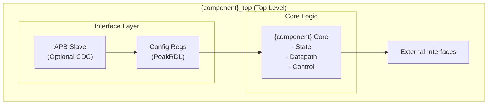

<!-- RTL Design Sherpa Documentation Header -->
<table>
<tr>
<td width="80">
  <a href="https://github.com/sean-galloway/RTLDesignSherpa">
    
  </a>
</td>
<td>
  <strong>RTL Design Sherpa</strong> · <em>Learning Hardware Design Through Practice</em><br>
  <sub>
    <a href="https://github.com/sean-galloway/RTLDesignSherpa">GitHub</a> ·
    <a href="https://github.com/sean-galloway/RTLDesignSherpa/blob/main/docs/DOCUMENTATION_INDEX.md">Documentation Index</a> ·
    <a href="https://github.com/sean-galloway/RTLDesignSherpa/blob/main/LICENSE">MIT License</a>
  </sub>
</td>
</tr>
</table>

---

<!-- End Header -->

**[← Back to Main Index](../index.md)** | **[Projects Index](index.md)**

# RTL Design Sherpa - Component Projects Overview

**Last Updated:** 2025-10-17

---

## Introduction

The RTL Design Sherpa component projects represent production-ready, fully-verified mega-blocks designed for direct SoC integration. Unlike the simpler building blocks in `rtl/common/` and protocol infrastructure in `rtl/amba/`, these components are complete peripherals with comprehensive register interfaces, verification suites, and documentation.

---

## Design Philosophy

### Components vs. Building Blocks

**Building Blocks** (`rtl/common/`, `rtl/amba/`)
- **Purpose:** Reusable primitives for custom logic
- **Complexity:** Low to medium (single function)
- **Examples:** Counters, FIFOs, arbiters, monitors
- **Integration:** Instantiate and configure within larger designs
- **Verification:** Unit tests for individual functionality

**Component Projects** (`projects/components/`)
- **Purpose:** Complete, production-ready peripherals
- **Complexity:** Medium to high (multiple subsystems)
- **Examples:** HPET timer, DMA controller, interrupt controller
- **Integration:** Drop into SoC with minimal configuration
- **Verification:** Comprehensive test suites (basic/medium/full)

### Key Principles

1. **Production Ready**
   - Comprehensive verification (>95% coverage)
   - Multiple configuration options tested
   - Known issues documented
   - Integration examples provided

2. **Standardized Interfaces**
   - AMBA APB, AXI protocols
   - Clock domain crossing support
   - Standard interrupt signaling
   - PeakRDL register generation

3. **Reusable Infrastructure**
   - Testbenches in `bin/CocoTBFramework/`
   - Consistent documentation structure
   - Parametrized test suites
   - Pytest configuration (conftest.py)

4. **Industry Best Practices**
   - SystemRDL for register specifications
   - CocoTB for verification
   - Modular architecture
   - Clear separation of concerns

---

## Component Architecture Patterns

### Standard Component Structure

```
projects/components/{component_name}/
├── rtl/                    # RTL source code
│   ├── {component}_top.sv # Top-level wrapper
│   ├── {component}_core.sv# Core logic
│   ├── {component}_regs.sv# Register file (PeakRDL)
│   └── ...                 # Additional submodules
│
├── dv/                     # Design verification
│   ├── tests/              # Test runners
│   │   ├── conftest.py     # Pytest configuration (MANDATORY)
│   │   └── test_*.py       # Test files
│   ├── tbclasses/          # → bin/CocoTBFramework/tbclasses/
│   ├── components/         # BFMs (if component-specific)
│   └── scoreboards/        # Verification scoreboards
│
├── docs/                   # Implementation documentation
│   ├── IMPLEMENTATION_STATUS.md
│   └── ...
│
├── bin/                    # Scripts and utilities
│   └── ...
│
├── known_issues/           # Issue tracking
│   ├── active/             # Current issues
│   └── resolved/           # Fixed issues
│
├── PRD.md                  # Product Requirements Document
├── CLAUDE.md               # AI assistant guide
├── TASKS.md                # Work tracking
└── README.md               # Quick start
```

### Module Hierarchy Pattern

**APB-Connected Component Example:**



**Key Interfaces:**
1. **APB/AXI Interface** - Register access from CPU
2. **Configuration Registers** - PeakRDL-generated register file
3. **Core Logic** - Component-specific functionality
4. **External Interfaces** - Component-specific I/O

---

## Register Generation with PeakRDL

All component projects use **PeakRDL** for register file generation from SystemRDL specifications.

### Benefits

- **Single Source of Truth:** SystemRDL specification defines registers
- **Automatic Generation:** Register RTL, C headers, documentation
- **Protocol Support:** APB4, AXI4-Lite interfaces
- **Field Features:** RW, RO, W1C, interrupts, counters

### Example Workflow

```bash
# 1. Write SystemRDL specification
cat > {component}_regs.rdl << 'EOF'
addrmap hpet_regs {
    reg {
        field { sw=rw; hw=r; } enable;
    } CONFIG @ 0x000;

    reg {
        field { sw=rw; hw=rw; we; } status[8];
    } STATUS @ 0x004;
};
EOF

# 2. Generate SystemVerilog register file
peakrdl regblock {component}_regs.rdl \
    --cpuif apb4 \
    -o rtl/

# Generated files:
# - rtl/{component}_regs.sv
# - rtl/{component}_regs_pkg.sv

# 3. Instantiate in design
# See component RTL for integration example
```

---

## Verification Strategy

### Test Hierarchy

All components follow a 3-level test hierarchy:

#### Level 1: Basic Tests
**Purpose:** Verify fundamental functionality
**Coverage:** Register access, reset behavior, simple operations
**Duration:** Fast (<10s per test)

**Examples:**
- Register read/write
- Reset behavior
- Enable/disable
- Interrupt generation

#### Level 2: Medium Tests
**Purpose:** Verify complex features and interactions
**Coverage:** Multi-component scenarios, edge cases
**Duration:** Moderate (10-60s per test)

**Examples:**
- Multiple concurrent operations
- 64-bit register access
- Mode switching
- Error conditions

#### Level 3: Full Tests
**Purpose:** Stress testing and production scenarios
**Coverage:** All features, CDC, maximum configurations
**Duration:** Longer (60-180s per test)

**Examples:**
- All resources active simultaneously
- Clock domain crossing
- Maximum load conditions
- Corner cases

### Test Organization

**Testbench Classes** (`bin/CocoTBFramework/tbclasses/`)
```python
# Reusable testbench (shared across all test levels)
class ComponentTB(TBBase):
    """Reusable testbench for component validation"""

    def __init__(self, dut, **kwargs):
        super().__init__(dut)
        # Initialize drivers, monitors

    async def setup_clocks_and_reset(self):
        """Initialize clocks and reset sequence"""

    async def write_register(self, addr, data):
        """APB/AXI register write"""

    async def read_register(self, addr):
        """APB/AXI register read"""

# Test suites by level
class ComponentBasicTests:
    def __init__(self, tb): self.tb = tb
    async def test_register_access(self): ...
    async def run_all_basic_tests(self): ...

class ComponentMediumTests:
    def __init__(self, tb): self.tb = tb
    async def test_complex_scenario(self): ...
    async def run_all_medium_tests(self): ...

class ComponentFullTests:
    def __init__(self, tb): self.tb = tb
    async def test_stress(self): ...
    async def run_all_full_tests(self): ...
```

**Test Runners** (`projects/components/{name}/dv/tests/`)
```python
# Pytest wrapper - handles parameters and invokes CocoTB
@cocotb.test()
async def test_component(dut):
    tb = ComponentTB(dut)
    await tb.setup_clocks_and_reset()

    test_level = os.environ.get('TEST_LEVEL', 'basic')

    if test_level == 'basic':
        tests = ComponentBasicTests(tb)
        passed = await tests.run_all_basic_tests()
    elif test_level == 'medium':
        # Run basic then medium
        ...
    else:  # full
        # Run all levels
        ...

    assert passed, "Test failed"

@pytest.mark.parametrize("param1, param2", generate_params())
def test_component_pytest(request, param1, param2):
    # Setup paths, RTL sources, parameters
    run(verilog_sources=..., module=module, ...)
```

### Pytest Configuration (conftest.py)

**Every test directory MUST have conftest.py:**

```python
"""Component Test Configuration"""
import os
import pytest

def pytest_configure(config):
    """Create logs directory and register markers"""
    log_dir = os.path.join(os.path.dirname(__file__), "logs")
    os.makedirs(log_dir, exist_ok=True)

    # Register markers
    config.addinivalue_line("markers", "basic: Basic tests")
    config.addinivalue_line("markers", "medium: Medium tests")
    config.addinivalue_line("markers", "full: Full tests")

@pytest.hookimpl(trylast=True)
def pytest_sessionfinish(session, exitstatus):
    """Preserve logs regardless of test outcome"""
    pass
```

---

## Documentation Standards

### Required Documentation

1. **PRD.md** - Product Requirements Document
   - Overview and features
   - Architecture details
   - Functional requirements
   - Interface specifications
   - Verification status
   - Integration guide

2. **CLAUDE.md** - AI Assistant Guide
   - Critical rules and patterns
   - Architecture quick reference
   - Common Q&A
   - Anti-patterns to avoid
   - Debugging workflows

3. **TASKS.md** - Work Tracking
   - Current tasks with status
   - Completed work
   - Future enhancements

4. **docs/IMPLEMENTATION_STATUS.md**
   - Test results
   - Coverage metrics
   - Known issues

5. **Component Markdown** (`docs/markdown/projects/{name}.md`)
   - Architecture overview
   - Design details
   - Usage examples
   - Performance characteristics

### Documentation Best Practices

- **Keep PRD.md as single source of truth** for specifications
- **Update CLAUDE.md** when patterns or anti-patterns emerge
- **Track all work in TASKS.md** with clear status
- **Document all issues** in `known_issues/` with reproduction steps
- **Provide integration examples** in multiple languages (SV, C)

---

## Integration Workflow

### Adding a Component to SoC

1. **Review Documentation:**
   ```bash
   cat docs/markdown/projects/{component}.md
   cat projects/components/{component}/PRD.md
   ```

2. **Check Dependencies:**
   ```bash
   # Review RTL dependencies in PRD.md Section 8
   # Ensure all required modules are available
   ```

3. **Add to Filelist:**
   ```tcl
   # Verilog filelist
   # Common dependencies
   ${RTL_ROOT}/common/counter_bin.sv
   ${RTL_ROOT}/amba/apb/apb_slave.sv

   # Component RTL
   ${RTL_ROOT}/projects/components/{component}/rtl/*.sv
   ```

4. **Instantiate in Design:**
   ```systemverilog
   // See PRD.md Section 9 for instantiation example
   {component}_top #(
       .PARAM1(value1),
       .PARAM2(value2)
   ) u_{component} (
       .clk    (clk),
       .rst_n  (rst_n),
       // ... ports
   );
   ```

5. **Initialize in Software:**
   ```c
   // See PRD.md Section 9 for initialization sequence
   ```

6. **Verify Integration:**
   ```bash
   # Run component tests in your testbench
   pytest projects/components/{component}/dv/tests/ -v
   ```

---

## Performance Considerations

### Resource Usage

Components provide estimated resource usage in PRD.md:

- **Logic (LUTs):** Combinational logic resources
- **Registers (FFs):** Sequential storage elements
- **Memory (BRAM):** Block RAM utilization
- **DSP:** DSP block usage (if applicable)

**Example (HPET from Retro Legacy Blocks):**
- 2-timer (no CDC): ~500 LUTs, ~300 FFs
- 3-timer (no CDC): ~650 LUTs, ~400 FFs
- 8-timer (CDC): ~1200 LUTs, ~800 FFs

### Timing Considerations

- **Clock Domain Crossing:** Optional CDC adds latency
  - No CDC: 2 clock cycles
  - With CDC: 4-6 clock cycles (handshake overhead)

- **Critical Paths:** Documented in component architecture
- **Maximum Frequency:** Target frequency in PRD.md

### Power Optimization

- **Clock Gating:** Where applicable
- **Dynamic Power Down:** Unused features can be disabled
- **Static Configuration:** Parameters reduce area/power

---

## Future Components

### Planned Components

1. **AXI Interconnect**
   - Multi-master, multi-slave crossbar
   - QoS support
   - Performance monitoring

2. **APB Crossbar**
   - N-to-M APB interconnect
   - Address decoding
   - Error handling

3. **DMA Controller**
   - Multi-channel DMA
   - Scatter-gather support
   - AXI master interface

4. **Interrupt Controller**
   - Vectored interrupts
   - Priority arbitration
   - Masking and status

5. **Memory Controller**
   - DDR3/DDR4 support
   - ECC support
   - Refresh management

---

## Resources

### Internal Documentation
- [Component Index](index.md) - All components
- [Retro Legacy Blocks](../../../projects/components/retro_legacy_blocks/README.md) - HPET, PIC, PIT, RTC, etc.
- [Master PRD](../../../PRD.md) - Project requirements
- [Repository Guide](../../../CLAUDE.md) - Repository overview

### External Resources
- [AMBA Specifications](https://developer.arm.com/architectures/system-architectures/amba)
- [PeakRDL Documentation](https://peakrdl.readthedocs.io/)
- [CocoTB Documentation](https://docs.cocotb.org/)
- [SystemRDL 2.0 Specification](https://www.accellera.org/downloads/standards/systemrdl)

### Development Tools
- **Verilator** - RTL simulation and linting
- **pytest** - Test runner and framework
- **PeakRDL** - Register generation
- **CocoTB** - Python verification framework

---

## Questions and Support

### Getting Help

1. **Component-Specific:**
   - Review `projects/components/{name}/PRD.md`
   - Check `projects/components/{name}/CLAUDE.md`
   - Search `projects/components/{name}/known_issues/`

2. **General:**
   - Review [Repository Guide](../../../CLAUDE.md)
   - Check [Master PRD](../../../PRD.md)
   - Search existing documentation

3. **Contributing:**
   - Follow component structure pattern
   - Create comprehensive documentation
   - Achieve >95% test coverage
   - Document all known issues

---

**Version:** 1.0
**Last Review:** 2025-10-17
**Maintained By:** RTL Design Sherpa Project
