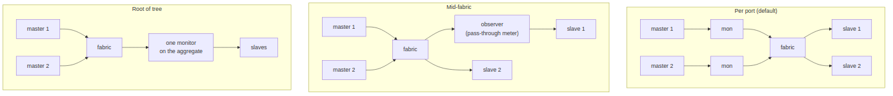

<!-- RTL Design Sherpa Documentation Header -->
<table>
<tr>
<td width="80">
  
</td>
<td>
  <strong>RTL Design Sherpa</strong> · <em>Learning Hardware Design Through Practice</em> 
  
    <a href="https://github.com/sean-galloway/RTLDesignSherpa">GitHub</a> ·
    <a href="https://github.com/sean-galloway/RTLDesignSherpa/blob/main/docs/DOCUMENTATION_INDEX.md">Documentation Index</a> ·
    <a href="https://github.com/sean-galloway/RTLDesignSherpa/blob/main/LICENSE">MIT License</a>
  
</td>
</tr>
</table>

---

<!-- End Header -->

# Where to insert monitoring

| Placement | What it sees | Cost | Use when |
|---|---|---|---|
| **Per port** (the default; the bridge generator puts a lite monitor on every monitored port) | every transaction on that port, attributed by ID, with completion latency | one lite per port: about 1,100 LUTs / 1,030 FFs at defaults, 677 / 831 with the bridge's narrower parameters ([monitor_characterization.md](../../rtl-amba/monitor/monitor_characterization.md), [axi_monitor_lite.md](../../rtl-amba/monitor/axi_monitor_lite.md)) | you need to know WHICH port misbehaved |
| **Mid-fabric** | the traffic crossing one internal link, through a pass-through observer with its own APB configuration (`projects/components/utility-ip/misc/rtl/axi4_intf_master_observer.sv`) | one observer per link | localizing violations the fabric itself introduces (ordering, ID collisions between ports) |
| **Root of tree** | the aggregate of everything below, once | one monitor | area-constrained; you only need "something is wrong", not where |

Per port and root of tree are the ends of one trade: resolution against
area. A three-port read bridge with per-port lite monitors spends about
2,000 LUTs on monitors and about 1,400 on the shared group; the same bridge
monitored once at its root spends 677 and 1,400, and can no longer tell the
ports apart. With the full monitor the same per-port choice would cost about
21,000 LUTs, which is why per-port monitoring was not realistic before the
lite and is the default with it.

