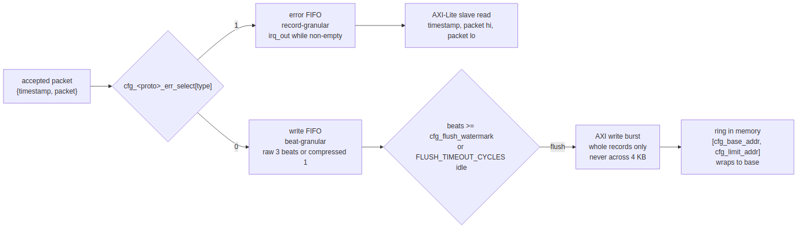

<!-- RTL Design Sherpa Documentation Header -->
<table>
<tr>
<td width="80">
  
</td>
<td>
  <strong>RTL Design Sherpa</strong> · <em>Learning Hardware Design Through Practice</em> 
  
    <a href="https://github.com/sean-galloway/RTLDesignSherpa">GitHub</a> ·
    <a href="https://github.com/sean-galloway/RTLDesignSherpa/blob/main/docs/DOCUMENTATION_INDEX.md">Documentation Index</a> ·
    <a href="https://github.com/sean-galloway/RTLDesignSherpa/blob/main/LICENSE">MIT License</a>
  
</td>
</tr>
</table>

---

<!-- End Header -->

# Drain path selection

The group has two sinks and a per-type steering mask
([monbus_group.md](../../rtl-amba/monitor/monbus_group.md)):

| Sink | Record | Reached by | Best for |
|---|---|---|---|
| **Error FIFO** | 192-bit `{timestamp, packet}`, read back as three 64-bit beats over the AXI-Lite slave; `irq_out` while non-empty | `cfg_<proto>_err_select[type] = 1` | the few packets a handler must act on now: errors, timeouts |
| **Write FIFO** | the same record as three beats (raw) or one beat (compressed), flushed as AXI bursts into the ring `[cfg_base_addr, cfg_limit_addr]` when `cfg_flush_watermark` beats are queued or the flush timeout elapses | everything not dropped and not selected for the error FIFO | bulk trace: completions, latencies, thresholds, for offline analysis |

The choice is per packet type per protocol, at runtime. The common shape is
errors and timeouts to the interrupt path and everything else to the trace
ring; a debug session flips completions over to the error FIFO for a while
and reads them one at a time.

