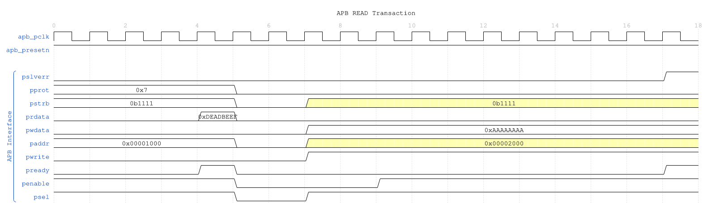
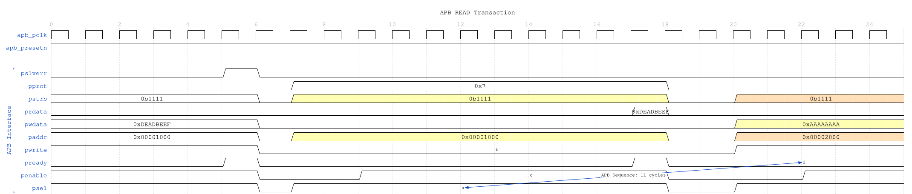
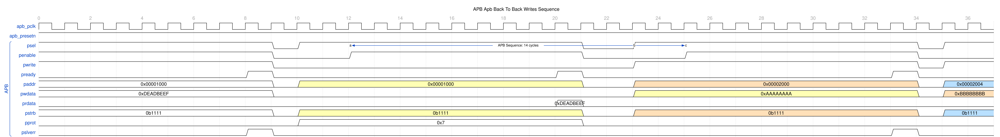
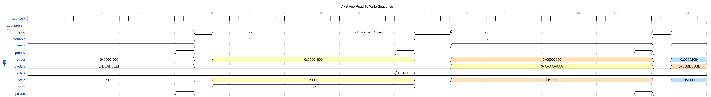
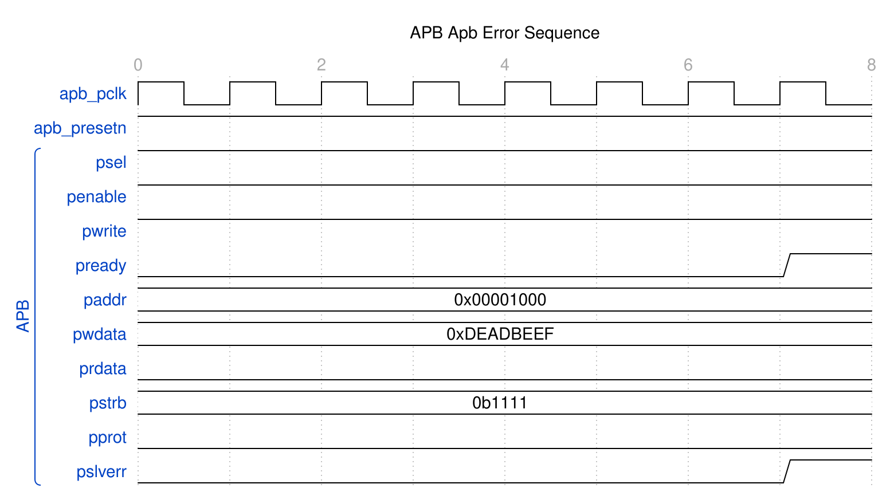

<!-- RTL Design Sherpa Documentation Header -->
<table>
<tr>
<td width="80">
  <a href="https://github.com/sean-galloway/RTLDesignSherpa">
    
  </a>
</td>
<td>
  <strong>RTL Design Sherpa</strong> · <em>Learning Hardware Design Through Practice</em><br>
  <sub>
    <a href="https://github.com/sean-galloway/RTLDesignSherpa">GitHub</a> ·
    <a href="https://github.com/sean-galloway/RTLDesignSherpa/blob/main/docs/DOCUMENTATION_INDEX.md">Documentation Index</a> ·
    <a href="https://github.com/sean-galloway/RTLDesignSherpa/blob/main/LICENSE">MIT License</a>
  </sub>
</td>
</tr>
</table>

---

<!-- End Header -->

# apb_slave

An Advanced Peripheral Bus (APB) slave module that provides a complete AMBA 4 APB (APB4) compliant interface with buffered command/response processing for high-performance peripheral integration.

**Protocol scope:** APB4 only. For `PWAKEUP`, the `P*USER` sidebands, or optional
parity, use `apb5_slave` from `rtl/amba/apb5/` -- see the
[APB5 book](../apb5/apb5_slave.md).

## Overview

The `apb_slave` module implements a full APB slave interface with integrated command and response buffering using GAXI skid buffers. It provides seamless protocol translation between the APB interface and a simple command/response interface, enabling easy integration of custom peripherals and register blocks into APB-based systems.

## Module Declaration

```systemverilog
module apb_slave #(
    parameter int ADDR_WIDTH      = 32,
    parameter int DATA_WIDTH      = 32,
    parameter int STRB_WIDTH      = DATA_WIDTH / 8,
    parameter int PROT_WIDTH      = 3,
    parameter int DEPTH           = 2,
    // Short Parameters
    parameter int AW  = ADDR_WIDTH,
    parameter int DW  = DATA_WIDTH,
    parameter int SW  = STRB_WIDTH,
    parameter int PW  = PROT_WIDTH,
    parameter int CPW = AW + DW + SW + PW + 1,  // Command packet width
    parameter int RPW = DW + 1                  // Response packet width
) (
    // Clock and Reset
    input  logic              pclk,
    input  logic              presetn,

    // APB Slave Interface
    input  logic              s_apb_PSEL,
    input  logic              s_apb_PENABLE,
    output logic              s_apb_PREADY,
    input  logic [AW-1:0]     s_apb_PADDR,
    input  logic              s_apb_PWRITE,
    input  logic [DW-1:0]     s_apb_PWDATA,
    input  logic [SW-1:0]     s_apb_PSTRB,
    input  logic [PW-1:0]     s_apb_PPROT,
    output logic [DW-1:0]     s_apb_PRDATA,
    output logic              s_apb_PSLVERR,

    // Command Interface
    output logic              cmd_valid,
    input  logic              cmd_ready,
    output logic              cmd_pwrite,
    output logic [AW-1:0]     cmd_paddr,
    output logic [DW-1:0]     cmd_pwdata,
    output logic [SW-1:0]     cmd_pstrb,
    output logic [PW-1:0]     cmd_pprot,

    // Response Interface
    input  logic              rsp_valid,
    output logic              rsp_ready,
    input  logic [DW-1:0]     rsp_prdata,
    input  logic              rsp_pslverr
);
```

## Parameters

| Parameter | Type | Default | Description |
|-----------|------|---------|-------------|
| ADDR_WIDTH | int | 32 | APB address bus width |
| DATA_WIDTH | int | 32 | APB data bus width |
| STRB_WIDTH | int | DATA_WIDTH/8 | Write strobe width (calculated) |
| PROT_WIDTH | int | 3 | APB protection signal width |
| DEPTH | int | 2 | Skid buffer depth in **entries** (not a log2 exponent) |

**DEPTH is a literal entry count.** `gaxi_skid_buffer` stores its payload in an
unpacked array of `DEPTH` slots, so `DEPTH=2` gives two entries, not four.
Supported values are `{2, 4, 6, 8}`; the shift-register storage is optimal at 2
and remains cheaper than a packed-vector implementation through 8. Odd values and
values above 8 are not supported.

## Ports

### Clock and Reset

| Port | Width | Direction | Description |
|------|-------|-----------|-------------|
| pclk | 1 | Input | APB clock |
| presetn | 1 | Input | APB active-low reset |

### APB Slave Interface

| Port | Width | Direction | Description |
|------|-------|-----------|-------------|
| s_apb_PSEL | 1 | Input | APB select signal |
| s_apb_PENABLE | 1 | Input | APB enable signal |
| s_apb_PREADY | 1 | Output | APB ready signal |
| s_apb_PADDR | ADDR_WIDTH | Input | APB address |
| s_apb_PWRITE | 1 | Input | APB write/read indicator |
| s_apb_PWDATA | DATA_WIDTH | Input | APB write data |
| s_apb_PSTRB | STRB_WIDTH | Input | APB write strobes |
| s_apb_PPROT | PROT_WIDTH | Input | APB protection attributes |
| s_apb_PRDATA | DATA_WIDTH | Output | APB read data |
| s_apb_PSLVERR | 1 | Output | APB slave error |

### Command Interface

| Port | Width | Direction | Description |
|------|-------|-----------|-------------|
| cmd_valid | 1 | Output | Command valid |
| cmd_ready | 1 | Input | Command ready (from backend) |
| cmd_pwrite | 1 | Output | Command write/read |
| cmd_paddr | ADDR_WIDTH | Output | Command address |
| cmd_pwdata | DATA_WIDTH | Output | Command write data |
| cmd_pstrb | STRB_WIDTH | Output | Command write strobes |
| cmd_pprot | PROT_WIDTH | Output | Command protection attributes |

### Response Interface

| Port | Width | Direction | Description |
|------|-------|-----------|-------------|
| rsp_valid | 1 | Input | Response valid |
| rsp_ready | 1 | Output | Response ready |
| rsp_prdata | DATA_WIDTH | Input | Response read data |
| rsp_pslverr | 1 | Input | Response error status |

## Functionality

### APB Protocol Implementation

The module implements the complete APB slave protocol with a three-state finite
state machine.

**These are internal slave states, not APB bus phases.** The APB SETUP and ACCESS
phases are driven by the *master* (`PSEL` / `PENABLE`); a slave only observes
them. `IDLE`, `BUSY`, and `WAIT` describe where this slave is in servicing the
observed transfer:

1. **IDLE**: No transfer in flight. Waits for the SETUP-to-ACCESS edge (the cycle
   in which `PENABLE` first goes high while `PSEL` is high). Also drops any
   orphan response -- see below.
2. **BUSY**: Command has been pushed to the backend; the bus is in its ACCESS
   phase with `PREADY` low (wait states). Waits for the backend response.
3. **WAIT**: `PREADY`, `PRDATA` and `PSLVERR` are driven for exactly one cycle,
   completing the ACCESS phase. Returns to IDLE unconditionally.

Mapping to the bus phases:

| APB bus phase | Slave state | `PREADY` |
|---------------|-------------|----------|
| IDLE (`PSEL=0`) | IDLE | 0 |
| SETUP (`PSEL=1`, `PENABLE=0`) | IDLE | 0 |
| ACCESS (`PSEL=1`, `PENABLE=1`), wait states | BUSY | 0 |
| ACCESS, final cycle | WAIT | 1 |

### Command/Response Flow

```
APB Master → APB Slave Interface → Command Buffer → Command Interface → Backend
                    ↓                     ↓              ↓
APB Master ← APB Slave Interface ← Response Buffer ← Response Interface ← Backend
```

### Buffering Architecture

The module uses two GAXI skid buffers for decoupling:

- **Command Buffer**: Stores incoming APB transactions
- **Response Buffer**: Stores backend responses for APB return

### Key Features

- **APB4 Compliance**: Full protocol support including PSTRB and PPROT
- **Buffered Operation**: Command and response skid buffers prevent blocking
- **Flow Control**: Proper ready/valid handshaking on all interfaces
- **Error Handling**: PSLVERR propagation from backend to APB
- **Orphan-Response Guard**: Discards responses that arrive with no command outstanding

## State Machine Operation

### State Transitions

```
IDLE → BUSY: s_apb_PSEL && s_apb_PENABLE && !r_penable_prev && r_cmd_ready
BUSY → WAIT: r_rsp_valid (response available)
WAIT → IDLE: Automatic (1 cycle completion)
```

The `!r_penable_prev` term is a **rising-edge detect on `PENABLE`**. The command
is captured on the SETUP-to-ACCESS transition only, so a multi-cycle ACCESS phase
(the normal case, since this slave always inserts wait states) cannot re-issue
the same command.

### Orphan-Response Guard

APB is strictly one-outstanding: a command is issued on the IDLE-to-BUSY edge and
its response is consumed in BUSY. A response sitting in the response skid buffer
while the FSM is in IDLE therefore cannot belong to any command. In IDLE the FSM
pops and discards it (asserting `r_rsp_ready` without accepting the data) and
emits a simulation-only `$display` warning.

This matters because BUSY pairs commands with responses **by position, not by
tag**. Without the guard, one stale entry permanently offsets the response
stream: every subsequent read returns the previous read's data. Two ways this can
happen in practice:

- A backend that emits a duplicate response for a single command.
- An `apb_slave_cdc` whose two clock domains were reset independently. The
  current CDC uses gray-pointer FIFOs specifically so it cannot fabricate a
  transfer this way -- see [apb_slave_cdc.md](apb_slave_cdc.md).

### APB Transaction Timing

| State | APB Signals | Internal Operation |
|-------|-------------|--------------------|
| IDLE | PREADY=0 | Wait for rising edge of PENABLE; drop orphan responses |
| BUSY | PREADY=0 | Command issued, wait for backend response |
| WAIT | PREADY=1, PRDATA/PSLVERR valid | Complete transaction |

## Timing Characteristics

### Transaction Latency

This slave is **not** a zero-wait-state slave. `PREADY` is registered and is
asserted no earlier than two `pclk` cycles after the edge on which `PENABLE` is
first sampled high (one cycle IDLE-to-BUSY, one cycle BUSY-to-WAIT). The ACCESS
phase therefore always contains at least two wait states, and a complete APB
transfer takes at least four `pclk` cycles end to end. Backend response latency
adds to this directly.

| Characteristic | Value | Description |
|----------------|-------|-------------|
| PENABLE rise to PREADY | ≥2 clock cycles | Registered FSM path, best case |
| Minimum ACCESS wait states | 2 | Inherent to the three-state FSM |
| Minimum full transfer | ≥4 clock cycles | SETUP + ACCESS with wait states |
| Response Processing | 1+ clock cycles | Backend processing time, additive |

### Performance Metrics

| Metric | Value | Conditions |
|--------|-------|------------|
| Maximum Frequency | 200-400 MHz | Technology dependent, not characterized in this repository |
| Buffer Depth | 2 entries | With default DEPTH=2 |
| Outstanding Transactions | 1 | APB is non-pipelined; buffers absorb backend latency, they do not add concurrency |

**On throughput:** APB is a non-pipelined protocol. The skid buffers decouple the
APB FSM from backend latency; they do not allow a second APB transfer to start
before the first completes. Peak throughput is therefore
`DATA_WIDTH / (minimum transfer cycles × pclk period)`, not one transfer per
cycle.

## Waveforms

The following timing diagrams show the comprehensive APB slave behavior across 7 scenarios.

**Known diagram defect:** the WaveDrom generator stamps a fixed header string,
`APB READ Transaction`, onto every scenario image regardless of direction. The
signal traces themselves are correct -- read `PWRITE` in the trace, not the
header, to determine transaction direction. This affects the images under
`docs/markdown/assets/WAVES/apb_slave/` and `.../apb_master/`.

### Scenario 1: Basic Write Transaction



**WaveJSON:** [apb_write_sequence_001.json](../../assets/WAVES/apb_slave/apb_write_sequence_001.json)

### Scenario 2: Basic Read Transaction



**WaveJSON:** [apb_read_sequence_001.json](../../assets/WAVES/apb_slave/apb_read_sequence_001.json)

### Scenario 3: Back-to-Back Writes



**WaveJSON:** [apb_back_to_back_writes_001.json](../../assets/WAVES/apb_slave/apb_back_to_back_writes_001.json)

### Scenario 4: Back-to-Back Reads


**WaveJSON:** [apb_back_to_back_reads_001.json](../../assets/WAVES/apb_slave/apb_back_to_back_reads_001.json)

### Scenario 5: Write-to-Read Transition


**WaveJSON:** [apb_write_to_read_001.json](../../assets/WAVES/apb_slave/apb_write_to_read_001.json)

### Scenario 6: Read-to-Write Transition



**WaveJSON:** [apb_read_to_write_001.json](../../assets/WAVES/apb_slave/apb_read_to_write_001.json)

### Scenario 7: Error Response



**WaveJSON:** [apb_error_001.json](../../assets/WAVES/apb_slave/apb_error_001.json)

---

## Usage Examples

### Basic Register Block Interface

```systemverilog
apb_slave #(
    .ADDR_WIDTH(16),     // 64KB address space
    .DATA_WIDTH(32),
    .DEPTH(2)            // 4-entry buffers
) u_reg_slave (
    .pclk         (apb_clk),
    .presetn      (apb_resetn),

    // APB interface from master
    .s_apb_PSEL     (apb_psel),
    .s_apb_PENABLE  (apb_penable),
    .s_apb_PREADY   (apb_pready),
    .s_apb_PADDR    (apb_paddr),
    .s_apb_PWRITE   (apb_pwrite),
    .s_apb_PWDATA   (apb_pwdata),
    .s_apb_PSTRB    (apb_pstrb),
    .s_apb_PPROT    (apb_pprot),
    .s_apb_PRDATA   (apb_prdata),
    .s_apb_PSLVERR  (apb_pslverr),

    // Command interface to register block
    .cmd_valid      (reg_cmd_valid),
    .cmd_ready      (reg_cmd_ready),
    .cmd_pwrite     (reg_write),
    .cmd_paddr      (reg_addr),
    .cmd_pwdata     (reg_wdata),
    .cmd_pstrb      (reg_strb),
    .cmd_pprot      (reg_prot),

    // Response interface from register block
    .rsp_valid      (reg_rsp_valid),
    .rsp_ready      (reg_rsp_ready),
    .rsp_prdata     (reg_rdata),
    .rsp_pslverr    (reg_error)
);
```

### Register Block Backend Implementation

`PADDR` is a **byte** address. The example below holds 32-bit registers, so it
drops the two low byte-lane bits and indexes with `cmd_addr[5:2]` to address 16
words. Adjust the slice if `DATA_WIDTH` is not 32.

```systemverilog
// Simple register block backend
module register_block (
    input  logic        clk,
    input  logic        resetn,

    // Command interface
    input  logic        cmd_valid,
    output logic        cmd_ready,
    input  logic        cmd_write,
    input  logic [15:0] cmd_addr,
    input  logic [31:0] cmd_wdata,
    input  logic [3:0]  cmd_strb,

    // Response interface
    output logic        rsp_valid,
    input  logic        rsp_ready,
    output logic [31:0] rsp_rdata,
    output logic        rsp_error
);

    // Register array
    logic [31:0] registers [16];

    // Command processing
    always_ff @(posedge clk) begin
        if (cmd_valid && cmd_ready) begin
            if (cmd_write) begin
                // Write operation with byte strobes
                for (int i = 0; i < 4; i++) begin
                    if (cmd_strb[i]) begin
                        registers[cmd_addr[5:2]][i*8+:8] <= cmd_wdata[i*8+:8];
                    end
                end
            end
        end
    end

    // Response generation
    always_ff @(posedge clk) begin
        if (!resetn) begin
            rsp_valid <= 1'b0;
            rsp_rdata <= 32'h0;
            rsp_error <= 1'b0;
        end else if (cmd_valid && cmd_ready) begin
            rsp_valid <= 1'b1;
            rsp_rdata <= cmd_write ? 32'h0 : registers[cmd_addr[5:2]];
            rsp_error <= (cmd_addr >= 16*4); // Address range check
        end else if (rsp_ready) begin
            rsp_valid <= 1'b0;
        end
    end

    assign cmd_ready = !rsp_valid || rsp_ready;

endmodule
```

### Memory Interface Example

```systemverilog
// APB slave for memory interface
apb_slave #(
    .ADDR_WIDTH(20),     // 1MB address space
    .DATA_WIDTH(32),
    .DEPTH(3)            // 8-entry buffers for memory latency
) u_mem_slave (
    .pclk         (mem_clk),
    .presetn      (mem_resetn),

    // APB interface
    .s_apb_*(apb_*),

    // Memory command interface
    .cmd_valid    (mem_cmd_valid),
    .cmd_ready    (mem_cmd_ready),
    .cmd_pwrite   (mem_write),
    .cmd_paddr    (mem_addr),
    .cmd_pwdata   (mem_wdata),
    .cmd_pstrb    (mem_strb),
    .cmd_pprot    (mem_prot),

    // Memory response interface
    .rsp_valid    (mem_rsp_valid),
    .rsp_ready    (mem_rsp_ready),
    .rsp_prdata   (mem_rdata),
    .rsp_pslverr  (mem_error)
);

// Memory controller interface
memory_controller u_mem_ctrl (
    .clk          (mem_clk),
    .resetn       (mem_resetn),

    // APB slave interface
    .cmd_*(mem_cmd_*),
    .rsp_*(mem_rsp_*),

    // Physical memory interface
    .mem_*(ddr_*)
);
```

## Advanced Integration Patterns

### Multi-Register Bank System

```systemverilog
module multi_register_system (
    input logic clk, resetn,

    // APB interface
    input  logic        apb_psel,
    input  logic        apb_penable,
    output logic        apb_pready,
    input  logic [31:0] apb_paddr,
    input  logic        apb_pwrite,
    input  logic [31:0] apb_pwdata,
    input  logic [3:0]  apb_pstrb,
    input  logic [2:0]  apb_pprot,
    output logic [31:0] apb_prdata,
    output logic        apb_pslverr
);

    // APB slave with address-based routing
    apb_slave u_apb_slave (
        .pclk(clk),
        .presetn(resetn),
        .s_apb_*(apb_*),
        .cmd_*(cmd_*),
        .rsp_*(rsp_*)
    );

    // Address decoder for multiple register banks
    logic [2:0] bank_select;
    logic [2:0] bank_cmd_valid;
    logic [2:0] bank_rsp_valid;

    assign bank_select = cmd_paddr[31:29]; // Top 3 bits for bank selection

    // Command distribution
    for (genvar i = 0; i < 3; i++) begin : gen_banks
        assign bank_cmd_valid[i] = cmd_valid && (bank_select == i);

        register_bank #(.BANK_ID(i)) u_bank (
            .clk(clk),
            .resetn(resetn),
            .cmd_valid(bank_cmd_valid[i]),
            .cmd_ready(bank_cmd_ready[i]),
            .cmd_*(cmd_*),
            .rsp_valid(bank_rsp_valid[i]),
            .rsp_*(rsp_*)
        );
    end

    // Response arbitration
    assign cmd_ready = |bank_cmd_ready;
    assign rsp_valid = |bank_rsp_valid;

endmodule
```

### Error Handling and Status Reporting

```systemverilog
// Enhanced backend with error handling
module enhanced_register_block (
    input  logic        clk,
    input  logic        resetn,

    // APB slave interface
    input  logic        cmd_valid,
    output logic        cmd_ready,
    input  logic        cmd_write,
    input  logic [15:0] cmd_addr,
    input  logic [31:0] cmd_wdata,
    input  logic [3:0]  cmd_strb,
    input  logic [2:0]  cmd_prot,

    output logic        rsp_valid,
    input  logic        rsp_ready,
    output logic [31:0] rsp_rdata,
    output logic        rsp_error
);

    // Error conditions
    logic addr_error, prot_error, access_error;

    assign addr_error = (cmd_addr >= 16*4);                    // Out of range
    assign prot_error = (cmd_prot[0] == 1'b1);                 // Instruction access
    assign access_error = addr_error || prot_error;

    // Register access with error checking
    always_ff @(posedge clk) begin
        if (cmd_valid && cmd_ready) begin
            if (cmd_write && !access_error) begin
                // Safe register write
                for (int i = 0; i < 4; i++) begin
                    if (cmd_strb[i]) begin
                        registers[cmd_addr[5:2]][i*8+:8] <= cmd_wdata[i*8+:8];
                    end
                end
            end
        end
    end

    // Response with comprehensive error reporting
    always_ff @(posedge clk) begin
        if (!resetn) begin
            rsp_valid <= 1'b0;
            rsp_rdata <= 32'h0;
            rsp_error <= 1'b0;
        end else if (cmd_valid && cmd_ready) begin
            rsp_valid <= 1'b1;
            rsp_error <= access_error;

            if (access_error) begin
                rsp_rdata <= 32'hDEADBEEF;  // Error pattern
            end else begin
                rsp_rdata <= cmd_write ? 32'h0 : registers[cmd_addr[5:2]];
            end
        end else if (rsp_ready) begin
            rsp_valid <= 1'b0;
        end
    end

    assign cmd_ready = !rsp_valid || rsp_ready;

endmodule
```

## Performance Optimization

### Buffer Depth Selection

`DEPTH` is an entry count and must be one of `{2, 4, 6, 8}`. Because APB allows
only one outstanding transfer, extra depth does **not** buy concurrency -- it only
absorbs jitter in a backend that returns responses unevenly. `DEPTH=2` is
correct for almost every backend.

| Backend Type | Recommended DEPTH | Rationale |
|--------------|------------------|-----------|
| Register Block | 2 | Single-cycle response; deeper buffers are pure area |
| SRAM Controller | 2 | Latency is absorbed by wait states, not by buffering |
| External Memory | 4 | Variable response timing; small margin against stalls |
| Shared/arbitrated backend | 4 | Response return can be bursty under contention |

### Clock Domain Optimization

For different clock domains, use `apb_slave_cdc`:

```systemverilog
apb_slave_cdc #(
    .ADDR_WIDTH(32),
    .DATA_WIDTH(32)
) u_cdc_slave (
    // APB clock domain
    .pclk(apb_clk),
    .presetn(apb_resetn),
    .s_apb_*(apb_*),

    // Backend clock domain
    .aclk(backend_clk),
    .aresetn(backend_resetn),
    .cmd_*(backend_cmd_*),
    .rsp_*(backend_rsp_*)
);
```

The CDC clock/reset ports are `pclk`/`presetn` (APB side) and `aclk`/`aresetn`
(backend side) -- there is no `s_`/`m_` prefix on them.

## Synthesis Considerations

### Area Optimization
- Reduce DEPTH for area-constrained designs
- Share skid buffers across multiple slaves when possible
- Use synchronous reset for smaller area

### Timing Optimization
- Register all command/response outputs
- Use appropriate buffer depths to meet timing
- Consider pipeline stages for high-frequency operation

### Power Optimization
- Use clock-gated variant (`apb_slave_cg`) when available
- Implement conditional clock enables for inactive slaves
- Size buffers appropriately to minimize switching activity

## Verification Notes

### Protocol Compliance
- Verify APB setup and access phase timing
- Check PREADY assertion with valid PRDATA/PSLVERR
- Validate proper state machine operation

### Buffer Verification
- Test buffer overflow/underflow conditions
- Verify command/response packet integrity
- Check flow control under various load conditions

### Backend Integration
- Test various backend response latencies
- Verify error propagation and handling
- Check concurrent transaction handling

## Related Modules

- **apb_slave_cg**: Clock-gated version for power optimization
- **apb_slave_cdc**: Clock domain crossing variant
- **apb_master**: Complementary APB master implementation
- **apb5_slave**: APB5 equivalent with `PWAKEUP`, `P*USER` and optional parity
- **gaxi_skid_buffer**: Underlying buffering infrastructure
- **apb_xbar_1to4 / apb_xbar_2to4**: Generated APB crossbars for multi-slave systems

The `apb_slave` module provides a complete, high-performance solution for APB slave functionality with advanced buffering, full protocol compliance, and flexible backend integration capabilities.

---

## Navigation

- **[← Back to rtl-amba Index](../index.md)**
- **[← Back to Main Documentation Index](../../index.md)**