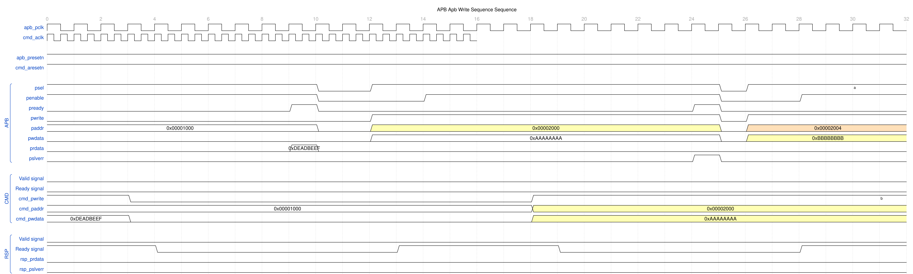
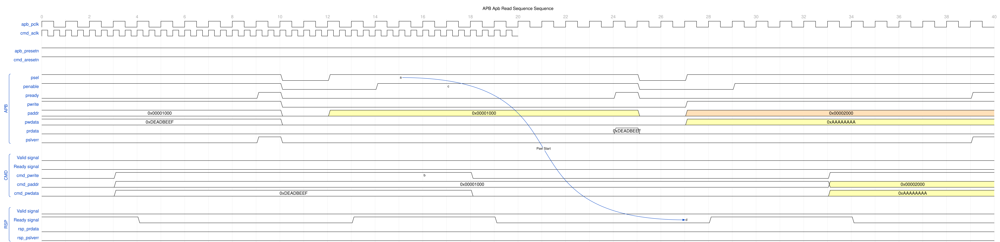
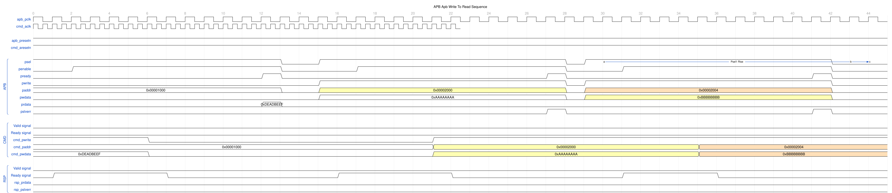
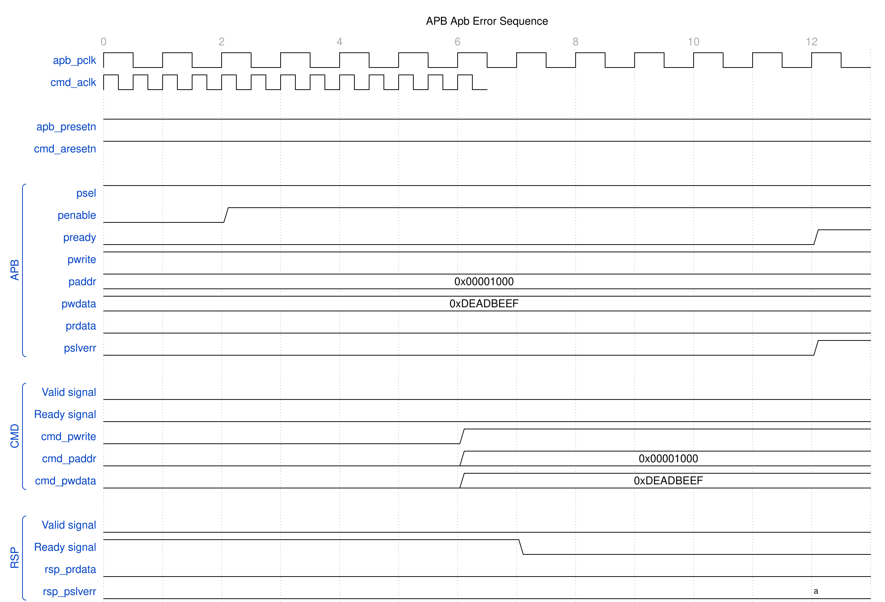

<!-- RTL Design Sherpa Documentation Header -->
<table>
<tr>
<td width="80">
  <a href="https://github.com/sean-galloway/RTLDesignSherpa">
    
  </a>
</td>
<td>
  <strong>RTL Design Sherpa</strong> · <em>Learning Hardware Design Through Practice</em><br>
  <sub>
    <a href="https://github.com/sean-galloway/RTLDesignSherpa">GitHub</a> ·
    <a href="https://github.com/sean-galloway/RTLDesignSherpa/blob/main/docs/DOCUMENTATION_INDEX.md">Documentation Index</a> ·
    <a href="https://github.com/sean-galloway/RTLDesignSherpa/blob/main/LICENSE">MIT License</a>
  </sub>
</td>
</tr>
</table>

---

<!-- End Header -->

# APB Slave CDC

**Module:** `apb4_slave_cdc.sv`
**Location:** `rtl/amba/apb4/`
**Status:** ✅ Production Ready

---

## Overview

The APB Slave CDC (Clock Domain Crossing) module is a complete APB slave interface with the crossing built in: full APB on the `pclk` side, an AXI/GAXI-style backend on the `aclk` side. It's what lets you integrate APB peripherals running at different clock frequencies without metastability becoming your problem.

### Key Features

- ✅ **Safe CDC:** Gray-pointer asynchronous FIFOs, one per direction
- ✅ **Dual Clock Domains:** APB (pclk) and AXI (aclk) operate independently
- ⚠️ **Reset both domains together:** a one-sided reset is NOT safe -- see [Reset Behavior](#reset-behavior)
- ✅ **Full APB4 Support:** Complete AMBA 4 APB protocol compliance
- ✅ **Command/Response Interface:** Clean GAXI-style backend interface
- ✅ **Buffered Operation:** Integrated skid buffers for elastic storage

**Protocol scope:** APB4 only. For APB5 signalling use `apb5_slave_cdc` from
`rtl/amba/apb5/` — see the [APB5 book](../apb5/apb5_slave_cdc.md).

---

## Module Interface

```systemverilog
module apb4_slave_cdc #(
    parameter int ADDR_WIDTH  = 32,
    parameter int DATA_WIDTH  = 32,
    parameter int STRB_WIDTH  = DATA_WIDTH / 8,
    parameter int PROT_WIDTH  = 3,
    parameter int DEPTH       = 2,
    // Async-FIFO pointer encoding: 0 = Gray (power-of-2 derived depth only),
    // 1 = Johnson (any depth, DEPTH-bit pointers). Forwarded to both CDC FIFOs.
    parameter int USE_JOHNSON = 0,
    // DEPRECATED / NO EFFECT -- retained only so existing instantiations
    // still elaborate. See "CDC Implementation" below.
    parameter bit USE_2_PHASE_CDC = 1'b1,
    // Derived width aliases the port list references -- not independent knobs
    parameter int DW  = DATA_WIDTH,
    parameter int AW  = ADDR_WIDTH,
    parameter int SW  = STRB_WIDTH,
    parameter int PW  = PROT_WIDTH
) (
    // Clock and Reset
    input  logic              aclk,
    input  logic              aresetn,
    input  logic              pclk,
    input  logic              presetn,

    // APB Slave Interface (pclk domain)
    input  logic              s_apb_PSEL,
    input  logic              s_apb_PENABLE,
    output logic              s_apb_PREADY,
    input  logic [AW-1:0]     s_apb_PADDR,
    input  logic              s_apb_PWRITE,
    input  logic [DW-1:0]     s_apb_PWDATA,
    input  logic [SW-1:0]     s_apb_PSTRB,
    input  logic [PW-1:0]     s_apb_PPROT,
    output logic [DW-1:0]     s_apb_PRDATA,
    output logic              s_apb_PSLVERR,

    // Command Interface (aclk domain)
    output logic              cmd_valid,
    input  logic              cmd_ready,
    output logic              cmd_pwrite,
    output logic [AW-1:0]     cmd_paddr,
    output logic [DW-1:0]     cmd_pwdata,
    output logic [SW-1:0]     cmd_pstrb,
    output logic [PW-1:0]     cmd_pprot,

    // Response Interface (aclk domain)
    input  logic              rsp_valid,
    output logic              rsp_ready,
    input  logic [DW-1:0]     rsp_prdata,
    input  logic              rsp_pslverr
);
```

---

## Parameters

| Parameter | Type | Default | Description |
|-----------|------|---------|-------------|
| `ADDR_WIDTH` | int | 32 | APB address bus width |
| `DATA_WIDTH` | int | 32 | APB data bus width |
| `STRB_WIDTH` | int | DATA_WIDTH/8 | Write strobe width (calculated) |
| `PROT_WIDTH` | int | 3 | APB protection signal width |
| `DEPTH` | int | 2 | Skid-buffer depth **in entries** inside the wrapped `apb4_slave`; also the floor for the CDC FIFO depth |
| `USE_JOHNSON` | int | 0 (Gray) | CDC-FIFO pointer encoding: `0` Gray (power-of-2 derived depth only), `1` Johnson (any FIFO depth, `DEPTH`-bit pointers; module-level `DEPTH` stays limited to `{2,4,6,8}` by the skid buffers). Gray by default — Johnson is opt-in because its pointers cost `DEPTH` bits in both domains and every synchronizer stage. |
| `USE_2_PHASE_CDC` | bit | 1 | **Deprecated and ignored.** Has no effect on the generated logic |

---

## Clock Domains

### APB Domain (pclk)

- APB slave interface signals
- Typical frequency: 50-200 MHz
- Used by APB master/interconnect

### AXI Domain (aclk)

- Command and response interfaces
- Can be faster or slower than pclk
- Used by backend processing logic

---

## CDC Implementation

### Structure

The module is an `apb4_slave` in the `pclk` domain plus two independent
asynchronous FIFOs:

| FIFO | Direction | Write domain | Read domain | Payload width |
|------|-----------|--------------|-------------|---------------|
| `u_cmd_cdc_fifo` | Command | `pclk` / `presetn` | `aclk` / `aresetn` | `CPW = AW + DW + SW + PW + 1` |
| `u_rsp_cdc_fifo` | Response | `aclk` / `aresetn` | `pclk` / `presetn` | `RPW = DW + 1` |

Both are `gaxi_fifo_async` instances with:

- **Pointer encoding:** absolute read/write pointers, Gray by default
  (`USE_JOHNSON = 0`); pass `USE_JOHNSON = 1` for Johnson
- **Synchronizer depth:** `N_FLOP_CROSS = 2` (two-flop synchronizer per crossed pointer)
- **FIFO depth:** `CDC_FIFO_DEPTH = (DEPTH < 4) ? 4 : DEPTH` — a floor of 4 entries
  regardless of the `DEPTH` used for the internal skid buffers. **Under the
  default `USE_JOHNSON = 0` a power of two is required**, because Gray carries a
  generate-scope elaboration check
  (`(USE_JOHNSON == 0) && ((DEPTH & (DEPTH-1)) != 0)` -> `$error`). The check sees
  the DERIVED depth, so the floor protects the FIFOs from `DEPTH` of 1 or 3 —
  but the same `DEPTH` also reaches the wrapped `apb4_slave`'s two
  `gaxi_skid_buffer` instances UNFLOORED, and their elaboration guard rejects
  everything outside `{2, 4, 6, 8}`. `DEPTH` of 1, 3, 5 or 7 therefore fails
  elaboration at the skid buffers no matter what the FIFOs would accept.

  The Gray power-of-2 constraint belongs to the encoding, and `USE_JOHNSON = 1`
  does lift it for the FIFOs — but the skid-buffer guard still holds, so the
  legal `DEPTH` set for this module is `{2, 4, 6, 8}` regardless of encoding.
  The only depth Johnson buys here is 6 (a legal skid depth that Gray's
  power-of-2 check would reject at the derived FIFO depth of 6). It pays for
  that with `DEPTH`-bit pointers instead of Gray's `$clog2(DEPTH)+1`, in both
  domains and every synchronizer stage; Gray is the default so that cost is
  never paid by accident.

There is no separate metastability-hardening option — two-flop synchronization is
fixed at instantiation.

### Maximum Clock Ratio

There is no maximum ratio between `pclk` and `aclk`. Gray-pointer FIFOs impose no
relationship between the two clocks — either may be arbitrarily faster, slower,
or phase-unrelated, and either may be stopped indefinitely. Stopping `aclk`
simply stalls the command FIFO's read side; the APB side backpressures via
`PREADY` held low and no data is lost.

What the ratio affects is throughput, not correctness. Each transfer pays the
usual two-flop synchronizer latency in each direction (roughly 2-3 destination
clock edges per crossing), so a very slow `aclk` directly lengthens APB wait
states.

### Reset Behavior

`presetn` and `aresetn` are separate reset domains, but they must be asserted
together. **A one-sided reset is not safe. Quiesce the bus first.**

The local reset clears that domain's own pointer, but the crossed copy of the
*remote* pointer is a live synchronizer (`glitch_free_n_dff_arn`, N=2) that keeps
sampling the non-reset domain the moment reset deasserts — it does not hold at
zero. The reset side comes back with its own pointer at zero and the remote
pointer at whatever the other side had reached: not an empty FIFO, a mismatched
one.

Neither consequence is a clean discard:

- **Consumed commands are re-presented.** Pulsing `aresetn` with an
  **already-consumed** command in the cmd FIFO rewinds the read pointer behind
  the write pointer, so the backend sees that command again after reset. It does
  not time out — it re-executes. An *unread* command is not at risk: its read
  pointer is already behind the write pointer, so resetting it to 0 rewinds
  nothing and the entry is delivered exactly once.
- **The response FIFO can fabricate responses.** The same rewind on the response
  path presents entries the APB side never queued, so the APB master can complete
  a transfer the backend never answered.

Pointers being absolute positions rather than toggle parity is what makes the
*steady-state* crossing reliable; it does not make a one-sided reset safe.

### Why Not the Previous 2-Phase Handshake

`USE_2_PHASE_CDC` selected a toggle-based handshake in an earlier revision. It is
now deprecated and ignored; the parameter survives only for source-compatibility
with existing instantiations.

The failure mode is worth understanding, because it's the kind that ships. A
2-phase handshake encodes each transfer as a **toggle**. Reset the two domains
independently and the toggle parity desynchronizes — the link fabricates or
drops exactly one transfer. Permanently, because nothing ever re-syncs it. Pair
that with the `apb4_slave` FSM, which pairs commands and responses by position
rather than by tag, and a single phantom transfer offsets the response stream by
one forever: every read returns the previous read's data.

This was observed on the Nexys A7 `ddr2-char` board on 2026-07-19. Reading a
single CSR eight times returned the previous register's value about three times
before settling, while the non-CDC harness window was stable. The two mitigations
now in place are the gray-pointer FIFOs described above and the orphan-response
guard in `apb4_slave` — see [apb4_slave.md](apb4_slave.md).

### Timing Constraints

The crossed signals are the gray-coded pointers and the FIFO memory read path.
Standard practice applies:

- Declare `pclk` and `aclk` asynchronous to each other
  (`set_clock_groups -asynchronous`).
- Do not over-constrain the pointer synchronizer paths; the gray encoding
  tolerates a one-bit-at-a-time skew by construction.

---

## Usage Example

```systemverilog
apb4_slave_cdc #(
    .ADDR_WIDTH(32),
    .DATA_WIDTH(32),
    .DEPTH(2)
) u_apb_cdc (
    // APB clock domain
    .pclk         (apb_clk),
    .presetn      (apb_resetn),

    // AXI clock domain
    .aclk         (axi_clk),
    .aresetn      (axi_resetn),

    // APB slave interface (pclk domain)
    .s_apb_PSEL     (apb_psel),
    .s_apb_PENABLE  (apb_penable),
    .s_apb_PREADY   (apb_pready),
    .s_apb_PADDR    (apb_paddr),
    .s_apb_PWRITE   (apb_pwrite),
    .s_apb_PWDATA   (apb_pwdata),
    .s_apb_PSTRB    (apb_pstrb),
    .s_apb_PPROT    (apb_pprot),
    .s_apb_PRDATA   (apb_prdata),
    .s_apb_PSLVERR  (apb_pslverr),

    // Command interface (aclk domain)
    .cmd_valid      (cmd_valid),
    .cmd_ready      (cmd_ready),
    .cmd_pwrite     (cmd_pwrite),
    .cmd_paddr      (cmd_paddr),
    .cmd_pwdata     (cmd_pwdata),
    .cmd_pstrb      (cmd_pstrb),
    .cmd_pprot      (cmd_pprot),

    // Response interface (aclk domain)
    .rsp_valid      (rsp_valid),
    .rsp_ready      (rsp_ready),
    .rsp_prdata     (rsp_prdata),
    .rsp_pslverr    (rsp_pslverr)
);
```

---

## Waveforms

The following timing diagrams show CDC behavior with **both clock domains visible**:

**Clock Configuration:**
- `apb_pclk`: 100MHz (10ns period)
- `cmd_aclk`: 500MHz (2ns period), displayed with `period=0.4` for visual compactness

### Scenario 1: Write Transaction with CDC

Shows APB write crossing from pclk domain to aclk domain:



**WaveJSON:** [apb_write_sequence_001.json](../../assets/WAVES/apb4_slave_cdc/apb_write_sequence_001.json)

**Key Observations:**
- APB transaction in pclk domain
- CMD transaction crosses to aclk domain
- Note the CDC latency between domains

### Scenario 2: Read Transaction with CDC

Shows APB read with response crossing back from aclk to pclk domain:



**WaveJSON:** [apb_read_sequence_001.json](../../assets/WAVES/apb4_slave_cdc/apb_read_sequence_001.json)

**Key Observations:**
- APB read request in pclk domain
- CMD crosses to aclk domain
- RSP crosses back to pclk domain
- Complete round-trip CDC visible

### Scenario 3: Back-to-Back Writes with CDC


**WaveJSON:** [apb_back_to_back_writes_001.json](../../assets/WAVES/apb4_slave_cdc/apb_back_to_back_writes_001.json)

### Scenario 4: Back-to-Back Reads with CDC


**WaveJSON:** [apb_back_to_back_reads_001.json](../../assets/WAVES/apb4_slave_cdc/apb_back_to_back_reads_001.json)

### Scenario 5: Write-to-Read Transition with CDC



**WaveJSON:** [apb_write_to_read_001.json](../../assets/WAVES/apb4_slave_cdc/apb_write_to_read_001.json)

### Scenario 6: Read-to-Write Transition with CDC


**WaveJSON:** [apb_read_to_write_001.json](../../assets/WAVES/apb4_slave_cdc/apb_read_to_write_001.json)

### Scenario 7: Error Response with CDC



**WaveJSON:** [apb_error_001.json](../../assets/WAVES/apb4_slave_cdc/apb_error_001.json)

---

## Related Documentation

- **APB Slave:** [apb4_slave.md](apb4_slave.md)
- **Clock-Gated Variant:** [apb4_slave_cdc_cg.md](apb4_slave_cdc_cg.md)
- **APB5 Equivalent:** [apb5_slave_cdc.md](../apb5/apb5_slave_cdc.md)
- **CDC FIFO:** `rtl/cdc/gaxi_fifo_async.sv`

---

## References

- **Source:** `rtl/amba/apb4/apb4_slave_cdc.sv`
- **Tests:** `val/amba/test_apb4_slave_cdc.py`
- **WaveDrom Test:** `val/amba/test_apb4_slave_cdc.py::test_apb4_slave_cdc_wavedrom`

---

**Last Updated:** 2026-07-19

---

## Navigation

- **[← Back to rtl-amba Index](../index.md)**
- **[← Back to Main Documentation Index](../../index.md)**
