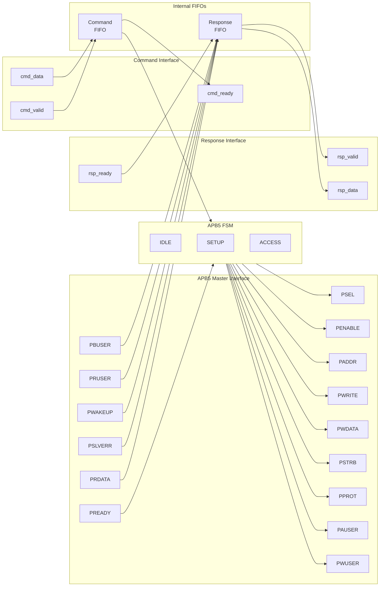

<!-- RTL Design Sherpa Documentation Header -->
<table>
<tr>
<td width="80">
  <a href="https://github.com/sean-galloway/RTLDesignSherpa">
    
  </a>
</td>
<td>
  <strong>RTL Design Sherpa</strong> · <em>Learning Hardware Design Through Practice</em><br>
  <sub>
    <a href="https://github.com/sean-galloway/RTLDesignSherpa">GitHub</a> ·
    <a href="https://github.com/sean-galloway/RTLDesignSherpa/blob/main/docs/DOCUMENTATION_INDEX.md">Documentation Index</a> ·
    <a href="https://github.com/sean-galloway/RTLDesignSherpa/blob/main/LICENSE">MIT License</a>
  </sub>
</td>
</tr>
</table>

---

<!-- End Header -->

# APB5 Master

**Module:** `apb5_master.sv`
**Location:** `rtl/amba/apb5/`
**Status:** Production Ready

---

## Overview

The APB5 Master module implements a complete AMBA APB5 master interface with all APB5 extensions including user-defined signals, wake-up support, and optional parity for data integrity. It provides command/response buffering for improved system performance.

### Key Features

- Full AMBA APB5 protocol compliance
- PAUSER: User-defined request attributes
- PWUSER: User-defined write data attributes
- PRUSER/PBUSER: User-defined response attributes from slave
- PWAKEUP: Wake-up signal handling from slave
- Optional parity support for data integrity
- Command and response FIFO buffering
- Configurable FIFO depths

---

## Module Architecture



---

## Parameters

| Parameter | Type | Default | Description |
|-----------|------|---------|-------------|
| ADDR_WIDTH | int | 32 | APB address bus width |
| DATA_WIDTH | int | 32 | APB data bus width |
| PROT_WIDTH | int | 3 | Protection signal width |
| AUSER_WIDTH | int | 4 | Address/request user signal width |
| WUSER_WIDTH | int | 4 | Write data user signal width |
| RUSER_WIDTH | int | 4 | Read data user signal width |
| BUSER_WIDTH | int | 4 | Response user signal width |
| CMD_DEPTH | int | 6 | Command skid-buffer depth in entries; must be one of {2, 4, 6, 8} |
| RSP_DEPTH | int | 6 | Response skid-buffer depth in entries; must be one of {2, 4, 6, 8} |
| ENABLE_PARITY | bit | 0 | Enable parity generation and checking |
| STRB_WIDTH | int | DATA_WIDTH/8 | Write strobe width (calculated) |

`CMD_DEPTH` and `RSP_DEPTH` are passed straight through to `gaxi_skid_buffer`,
whose `DEPTH` is a literal entry count -- not a log2 exponent. The default of 6
means six buffered entries.

Two further computed parameters are exposed for reference and should not be
overridden:

| Parameter | Formula | Default value |
|-----------|---------|---------------|
| CPW | ADDR_WIDTH + DATA_WIDTH + STRB_WIDTH + PROT_WIDTH + AUSER_WIDTH + WUSER_WIDTH + 1 | 80 |
| RPW | DATA_WIDTH + RUSER_WIDTH + BUSER_WIDTH + 2 | 42 |

---

## Ports

### Clock and Reset

| Port | Width | Direction | Description |
|------|-------|-----------|-------------|
| pclk | 1 | Input | APB clock |
| presetn | 1 | Input | APB active-low reset |

### APB5 Master Interface

| Port | Width | Direction | Description |
|------|-------|-----------|-------------|
| m_apb_PSEL | 1 | Output | APB select signal |
| m_apb_PENABLE | 1 | Output | APB enable signal |
| m_apb_PADDR | ADDR_WIDTH | Output | APB address |
| m_apb_PWRITE | 1 | Output | Write/read indicator (1=write) |
| m_apb_PWDATA | DATA_WIDTH | Output | Write data |
| m_apb_PSTRB | STRB_WIDTH | Output | Write byte strobes |
| m_apb_PPROT | PROT_WIDTH | Output | Protection attributes |
| m_apb_PAUSER | AUSER_WIDTH | Output | User-defined request attributes |
| m_apb_PWUSER | WUSER_WIDTH | Output | User-defined write data attributes |
| m_apb_PRDATA | DATA_WIDTH | Input | Read data from slave |
| m_apb_PSLVERR | 1 | Input | Slave error response |
| m_apb_PREADY | 1 | Input | Slave ready |
| m_apb_PWAKEUP | 1 | Input | Wake-up signal from slave |
| m_apb_PRUSER | RUSER_WIDTH | Input | User-defined read data attributes |
| m_apb_PBUSER | BUSER_WIDTH | Input | User-defined response attributes |

### Parity Signals (Optional)

| Port | Width | Direction | Description |
|------|-------|-----------|-------------|
| m_apb_PWDATAPARITY | STRB_WIDTH | Output | Write data parity (per byte) |
| m_apb_PADDRPARITY | 1 | Output | Address parity |
| m_apb_PCTRLPARITY | 1 | Output | Control signals parity |
| m_apb_PRDATAPARITY | STRB_WIDTH | Input | Read data parity from slave |
| m_apb_PREADYPARITY | 1 | Input | PREADY parity from slave |
| m_apb_PSLVERRPARITY | 1 | Input | PSLVERR parity from slave |

### Command Interface

| Port | Width | Direction | Description |
|------|-------|-----------|-------------|
| cmd_valid | 1 | Input | Command valid |
| cmd_ready | 1 | Output | Command ready (FIFO not full) |
| cmd_pwrite | 1 | Input | Command write/read |
| cmd_paddr | ADDR_WIDTH | Input | Command address |
| cmd_pwdata | DATA_WIDTH | Input | Command write data |
| cmd_pstrb | STRB_WIDTH | Input | Command write strobes |
| cmd_pprot | PROT_WIDTH | Input | Command protection attributes |
| cmd_pauser | AUSER_WIDTH | Input | Command user attributes |
| cmd_pwuser | WUSER_WIDTH | Input | Command write user attributes |

### Response Interface

| Port | Width | Direction | Description |
|------|-------|-----------|-------------|
| rsp_valid | 1 | Output | Response valid |
| rsp_ready | 1 | Input | Response ready |
| rsp_prdata | DATA_WIDTH | Output | Response read data |
| rsp_pslverr | 1 | Output | Response error status |
| rsp_pwakeup | 1 | Output | Response wake-up indicator |
| rsp_pruser | RUSER_WIDTH | Output | Response read user attributes |
| rsp_pbuser | BUSER_WIDTH | Output | Response user attributes |

### Status Outputs

| Port | Width | Direction | Description |
|------|-------|-----------|-------------|
| parity_error_rdata | 1 | Output | Read-data parity mismatch (tied to 0 when ENABLE_PARITY=0) |
| parity_error_ctrl | 1 | Output | PREADY/PSLVERR parity mismatch (tied to 0 when ENABLE_PARITY=0) |
| wakeup_pending | 1 | Output | Sticky flag: PWAKEUP was seen and no transaction has started since |

---

## Functionality

### APB5 Protocol State Machine

```mermaid
stateDiagram-v2
    [*] --> IDLE

    IDLE --> SETUP : cmd_fifo_valid
    SETUP --> ACCESS : always
    ACCESS --> IDLE : PREADY & cmd_fifo_empty
    ACCESS --> SETUP : PREADY & !cmd_fifo_empty

    state IDLE {
        note right of IDLE : PSEL=0, PENABLE=0
    }
    state SETUP {
        note right of SETUP : PSEL=1, PENABLE=0
    }
    state ACCESS {
        note right of ACCESS : PSEL=1, PENABLE=1
    }
```

### APB5 Extensions

**User Signals:**
- **PAUSER**: Carries user-defined attributes with the address/control phase
- **PWUSER**: Carries user-defined attributes with write data
- **PRUSER**: Returns user-defined attributes with read data
- **PBUSER**: Returns user-defined attributes with the response

**Wake-up Support:**
- **PWAKEUP**: Slave can assert to indicate wake-up events
- Captured in response packet (`rsp_pwakeup`) for software handling
- Also latched into `wakeup_pending`, which sets on any PWAKEUP pulse and
  clears once the FSM leaves IDLE to start a transaction

**Parity Protection:**
- Optional parity on data, address, and control signals
- Enables detection of single-bit transmission errors

See [Parity Implementation](#parity-implementation) for the exact coverage of
each parity bit.

---

## Timing Diagrams

### Basic Write Transaction

<!-- TODO: Add wavedrom timing diagram for APB5 write transaction -->
> **Timing diagram pending.** The signals and sequence this scenario
> exercises:
>
> - PCLK
> - PSEL
> - PENABLE
> - PADDR
> - PWRITE (high)
> - PWDATA
> - PSTRB
> - PAUSER
> - PWUSER
> - PREADY
> - PSLVERR


### Basic Read Transaction

<!-- TODO: Add wavedrom timing diagram for APB5 read transaction -->
> **Timing diagram pending.** The signals and sequence this scenario
> exercises:
>
> - PCLK
> - PSEL
> - PENABLE
> - PADDR
> - PWRITE (low)
> - PAUSER
> - PREADY
> - PRDATA
> - PRUSER
> - PSLVERR


### Wake-up Signal Handling

<!-- TODO: Add wavedrom timing diagram for wake-up scenario -->
> **Timing diagram pending.** The signals and sequence this scenario
> exercises:
>
> - PCLK
> - Transaction signals
> - PWAKEUP assertion
> - Response capture


---

## Usage Example

```systemverilog
apb5_master #(
    .ADDR_WIDTH     (32),
    .DATA_WIDTH     (32),
    .AUSER_WIDTH    (4),
    .WUSER_WIDTH    (4),
    .RUSER_WIDTH    (4),
    .BUSER_WIDTH    (4),
    .CMD_DEPTH      (4),
    .RSP_DEPTH      (4),
    .ENABLE_PARITY  (0)
) u_apb5_master (
    .pclk           (apb_clk),
    .presetn        (apb_rst_n),

    // APB5 master interface
    .m_apb_PSEL     (m_apb_psel),
    .m_apb_PENABLE  (m_apb_penable),
    .m_apb_PADDR    (m_apb_paddr),
    .m_apb_PWRITE   (m_apb_pwrite),
    .m_apb_PWDATA   (m_apb_pwdata),
    .m_apb_PSTRB    (m_apb_pstrb),
    .m_apb_PPROT    (m_apb_pprot),
    .m_apb_PAUSER   (m_apb_pauser),
    .m_apb_PWUSER   (m_apb_pwuser),
    .m_apb_PRDATA   (m_apb_prdata),
    .m_apb_PSLVERR  (m_apb_pslverr),
    .m_apb_PREADY   (m_apb_pready),
    .m_apb_PWAKEUP  (m_apb_pwakeup),
    .m_apb_PRUSER   (m_apb_pruser),
    .m_apb_PBUSER   (m_apb_pbuser),

    // Command interface
    .cmd_valid      (cmd_valid),
    .cmd_ready      (cmd_ready),
    .cmd_pwrite     (cmd_write),
    .cmd_paddr      (cmd_addr),
    .cmd_pwdata     (cmd_wdata),
    .cmd_pstrb      (cmd_strb),
    .cmd_pprot      (cmd_prot),
    .cmd_pauser     (cmd_auser),
    .cmd_pwuser     (cmd_wuser),

    // Response interface
    .rsp_valid      (rsp_valid),
    .rsp_ready      (rsp_ready),
    .rsp_prdata     (rsp_rdata),
    .rsp_pslverr    (rsp_error),
    .rsp_pwakeup    (rsp_wakeup),
    .rsp_pruser     (rsp_ruser),
    .rsp_pbuser     (rsp_buser),

    // Parity interface (unused here because ENABLE_PARITY=0)
    .m_apb_PWDATAPARITY  (),
    .m_apb_PADDRPARITY   (),
    .m_apb_PCTRLPARITY   (),
    .m_apb_PRDATAPARITY  ('0),
    .m_apb_PREADYPARITY  (1'b0),
    .m_apb_PSLVERRPARITY (1'b0),
    .parity_error_rdata  (),
    .parity_error_ctrl   (),

    // Status
    .wakeup_pending (apb_wakeup_pending)
);
```

---

## Design Notes

### APB5 vs APB4 Differences

| Feature | APB4 | APB5 | Implemented here |
|---------|------|------|------------------|
| User signals | None | PAUSER, PWUSER, PRUSER, PBUSER | Yes |
| Wake-up | None | PWAKEUP | Yes (slave to master) |
| Parity | None | Optional signal parity | Yes (`ENABLE_PARITY`) |
| Non-secure extension | None | PNSE | No -- no port |
| Exclusive access | None | PEXCL, PEXOKAY | No -- no ports |

### FIFO Sizing

- Command depth should match the expected command burst length
- Response depth should match to prevent backpressure
- `CMD_DEPTH` / `RSP_DEPTH` are entry counts, restricted to {2, 4, 6, 8} by the
  underlying `gaxi_skid_buffer`

### Parity Implementation

When `ENABLE_PARITY=1` the master generates parity on its outgoing signals and
checks parity on the signals returned by the slave. Coverage differs per signal
group, which determines what a single parity bit can detect:

| Parity signal | Covers | Granularity |
|---------------|--------|-------------|
| m_apb_PWDATAPARITY[i] | PWDATA byte lane `i` | One bit per byte (STRB_WIDTH bits total) |
| m_apb_PADDRPARITY | Whole PADDR | One bit for the entire address |
| m_apb_PCTRLPARITY | {PWRITE, PSTRB, PPROT} concatenated | One bit for the whole control group |
| m_apb_PRDATAPARITY[i] | PRDATA byte lane `i` (checked) | One bit per byte |
| m_apb_PREADYPARITY | PREADY (checked) | One bit |
| m_apb_PSLVERRPARITY | PSLVERR (checked) | One bit |

Each parity bit is the XOR reduction of the covered signals, so it is 1 when the
covered field contains an odd number of ones (an even-parity encoding: field plus
parity bit always has an even number of ones). Per-byte data parity detects one
bit error in each byte independently; the single address and control bits detect
only an odd number of errors across the whole group.

Checking is purely combinational and qualified by the bus state:
`parity_error_rdata` and `parity_error_ctrl` are only asserted while
`m_apb_PREADY && m_apb_PSEL && m_apb_PENABLE`, and read 0 otherwise. Downstream
error handling is system-specific -- the master does not itself abort or retry a
transfer on a parity mismatch. Parity adds combinational logic but no pipeline
stages, so it costs no additional latency.

---

## Related Documentation

- **[APB5 Slave](apb5_slave.md)** - APB5 slave interface
- **[APB5 Master CG](apb5_master_cg.md)** - Clock-gated variant
- **[APB5 Monitor](../apb5/apb5_monitor.md)** - Protocol monitor
- **[APB4 Master](../apb/apb4_master.md)** - APB4 version for comparison

---

## Navigation

- **[← Back to APB5 Index](README.md)**
- **[← Back to rtl-amba Index](../index.md)**
- **[← Back to Main Documentation Index](../../index.md)**
