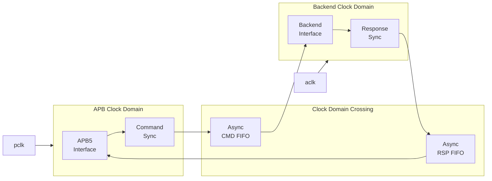
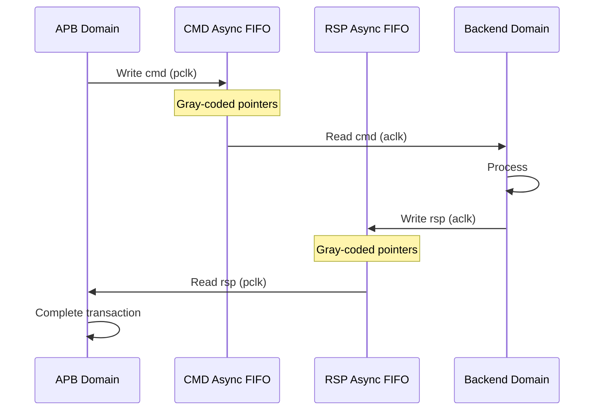

<!-- RTL Design Sherpa Documentation Header -->
<table>
<tr>
<td width="80">
  <a href="https://github.com/sean-galloway/RTLDesignSherpa">
    
  </a>
</td>
<td>
  <strong>RTL Design Sherpa</strong> · <em>Learning Hardware Design Through Practice</em><br>
  <sub>
    <a href="https://github.com/sean-galloway/RTLDesignSherpa">GitHub</a> ·
    <a href="https://github.com/sean-galloway/RTLDesignSherpa/blob/main/docs/DOCUMENTATION_INDEX.md">Documentation Index</a> ·
    <a href="https://github.com/sean-galloway/RTLDesignSherpa/blob/main/LICENSE">MIT License</a>
  </sub>
</td>
</tr>
</table>

---

<!-- End Header -->

# APB5 Slave (Clock Domain Crossing)

**Module:** `apb5_slave_cdc.sv`
**Location:** `rtl/amba/apb5/`
**Status:** Production Ready

---

## Overview

The APB5 Slave CDC module provides clock domain crossing between an APB5 bus clock domain and a backend clock domain, carrying transactions safely across an asynchronous boundary.

### Key Features

- Full APB5 protocol support with CDC
- Asynchronous FIFO-based clock domain crossing (Gray-coded pointers)
- All APB5 user signals (PAUSER, PWUSER, PRUSER, PBUSER)
- Wake-up request crossing via a dedicated level synchronizer
- Single `DEPTH` parameter sizes both directions
- Metastability protection with 2-flop pointer synchronizers

---

## Module Architecture



---

## Parameters

| Parameter | Type | Default | Description |
|-----------|------|---------|-------------|
| ADDR_WIDTH | int | 32 | APB address bus width |
| DATA_WIDTH | int | 32 | APB data bus width |
| STRB_WIDTH | int | DATA_WIDTH/8 | Write strobe width (calculated) |
| PROT_WIDTH | int | 3 | Protection signal width |
| AUSER_WIDTH | int | 4 | Address user signal width |
| WUSER_WIDTH | int | 4 | Write user signal width |
| RUSER_WIDTH | int | 4 | Read user signal width |
| BUSER_WIDTH | int | 4 | Response user signal width |
| DEPTH | int | 2 | Skid-buffer depth of the wrapped `apb5_slave`; one of {2, 4, 6, 8} |
| USE_JOHNSON | int | -1 (auto) | CDC-FIFO pointer encoding: `0` Gray, `1` Johnson, `-1` auto-select. See below. |
| ENABLE_PARITY | bit | 0 | Enable parity generation and checking |
| USE_2_PHASE_CDC | bit | 1 | Deprecated and ignored -- retained for source compatibility |

There is no `CMD_DEPTH`, `RSP_DEPTH` or `SYNC_STAGES` parameter on this module.
The two asynchronous FIFOs are sized internally from `DEPTH`:

```
localparam int CDC_FIFO_DEPTH = (DEPTH < 4) ? 4 : DEPTH;
```

so the CDC FIFOs are never shallower than 4 entries regardless of `DEPTH`. The
synchronizer depth is fixed at 2 flops (`N_FLOP_CROSS(2)` on both
`gaxi_fifo_async` instances) and is not exposed as a parameter. If your design
needs 3-flop synchronization for an extreme clock ratio, you're editing the
instantiation in the RTL.

---

## Ports

### Clock and Reset

| Port | Width | Direction | Description |
|------|-------|-----------|-------------|
| pclk | 1 | Input | APB bus clock |
| presetn | 1 | Input | APB reset (active low) |
| aclk | 1 | Input | Backend/user clock |
| aresetn | 1 | Input | Backend/user reset (active low) |

The backend clock and reset are named `aclk` and `aresetn`, matching the rest of
the AMBA library. There are no `bclk`/`bresetn` ports.

### APB5 Slave Interface

Same as [apb5_slave](apb5_slave.md) - operates in `pclk` domain, including the
optional parity signals.

### CDC FIFO pointer encoding

The wrapper derives `CDC_FIFO_DEPTH = (DEPTH < 4) ? 4 : DEPTH` and hands that to
two `gaxi_fifo_async` instances (command and response). Gray pointers only close
on a power-of-2 depth, so a FIFO depth of 6 cannot use Gray -- `gaxi_fifo_async`
carries an elaboration-time `$error` for exactly that case.

`USE_JOHNSON` selects the encoding, and the default resolves it per depth:

| `USE_JOHNSON` | Encoding | Pointer width | Depth constraint |
|---|---|---|---|
| `0` | Gray | `$clog2(DEPTH)+1` | power of 2 only |
| `1` | Johnson | `DEPTH` bits | any depth |
| `-1` (default) | auto | per depth | none -- Gray when the derived FIFO depth is a power of 2, Johnson otherwise |

All of {2, 4, 6, 8} therefore elaborate. DEPTH 2 and 4 both derive a depth-4
FIFO and 8 derives 8, so those stay on Gray with their pointer cost unchanged.
DEPTH=6 derives a depth-6 FIFO and auto-selects Johnson, which costs 6-bit
pointers per domain instead of Gray's 4 -- the price of a non-power-of-2 depth,
and the only encoding that is correct there.

**`USE_JOHNSON=0` with `DEPTH=6` is still an elaboration error, deliberately.**
Asking for Gray at a non-power-of-2 depth is a real configuration mistake and
should fail the build. The default routes around the constraint; it never
overrides a preference you expressed.

### Backend Interface

Same command/response interface as [apb5_slave](apb5_slave.md) - operates in the
`aclk` domain. `wakeup_request` is also an `aclk`-domain input.

`parity_error_wdata` and `parity_error_ctrl` are **not** `aclk`-domain signals,
despite sitting next to these ports. `apb5_slave` drives them combinationally
from the APB inputs (`s_apb_PSEL && s_apb_PENABLE ? ... : 1'b0`), so they are
`pclk`-domain (gated-`pclk` in the CG variant) pulses valid only during the APB
access phase. They cross no synchronizer. Sample them in `pclk`, or synchronize
them yourself before using them in `aclk`.

---

## Clock Domain Crossing

### CDC Mechanism



### Timing Considerations

<!-- TODO: Add wavedrom timing diagram for CDC -->
> **Timing diagram pending.** The signals and sequence this scenario
> exercises:
>
> - pclk
> - aclk (different frequency)
> - APB transaction signals
> - FIFO write/read pointers
> - Backend transaction signals
> - CDC latency


---

## Usage Example

```systemverilog
apb5_slave_cdc #(
    .ADDR_WIDTH     (32),
    .DATA_WIDTH     (32),
    .AUSER_WIDTH    (4),
    .WUSER_WIDTH    (4),
    .RUSER_WIDTH    (4),
    .BUSER_WIDTH    (4),
    .DEPTH          (2),
    .ENABLE_PARITY  (0)
) u_apb5_slave_cdc (
    // APB clock domain
    .pclk           (apb_clk),
    .presetn        (apb_rst_n),

    // Backend clock domain
    .aclk           (backend_clk),
    .aresetn        (backend_rst_n),

    // APB5 slave interface (pclk domain)
    .s_apb_PSEL     (s_apb_psel),
    .s_apb_PENABLE  (s_apb_penable),
    // ... other APB signals

    // Backend interface (aclk domain)
    .cmd_valid      (backend_cmd_valid),
    .cmd_ready      (backend_cmd_ready),
    // ... other backend signals

    // Wake-up request (aclk domain, synchronized internally to pclk)
    .wakeup_request (backend_wakeup)
);
```

---

## Design Notes

### CDC Mechanism

Both directions cross through `gaxi_fifo_async` instances with Gray-coded
pointers and a fixed 2-flop synchronizer (`N_FLOP_CROSS(2)`) on each pointer
crossing. The command FIFO is written in `pclk` and read in `aclk`; the response
FIFO is written in `aclk` and read in `pclk`.

The `wakeup_request` input is the one signal that does not go through a FIFO: it
crosses from `aclk` into `pclk` through a `cdc_synchronizer` before reaching the
wrapped `apb5_slave`. Because it is a level, not a pulse, this is safe -- but it
means `wakeup_request` must be held asserted long enough to be sampled in the
`pclk` domain (at least two `pclk` periods).

### FIFO Depth Sizing

- `DEPTH` sizes the `apb5_slave` skid buffers; the CDC FIFOs are sized
  separately as `max(DEPTH, 4)`, so the crossing itself is never shallower than
  4 entries even at the default `DEPTH=2`
- Deeper FIFOs buy tolerance for a slow backend or a bursty APB master; they do
  not reduce the per-transfer crossing latency
- Because APB is single-outstanding, depth beyond a handful of entries has
  little effect on throughput for this module

### Reset Synchronization

`presetn` and `aresetn` are independent reset domains and either may be asserted
alone. **A one-sided reset is not safe. Quiesce the bus first.**

The local reset clears that domain's own pointer, but the crossed copy of the
*remote* pointer is a live synchronizer (`glitch_free_n_dff_arn`, N=2) that
keeps sampling the non-reset domain the moment reset deasserts -- it does not
hold at zero. The reset side therefore comes back with its own pointer at zero
and the remote pointer at whatever the other side had reached, which is not an
empty FIFO. It is a mismatched one.

Two concrete consequences, neither of which is a clean discard:

- **Commands are re-presented, not dropped.** Pulsing `aresetn` with an unread
  command in the cmd FIFO rewinds the read pointer behind the write pointer, so
  the backend sees that command again after reset. It does not time out -- it
  re-executes.
- **The response FIFO can fabricate responses.** The same rewind on the
  response path presents entries the APB side never queued, so the APB master
  can complete a transfer that the backend did not answer.

Pointers being absolute positions rather than toggle parity is what makes the
*steady-state* crossing reliable; it does not make a one-sided reset safe.

Neither reset is internally synchronized to the other domain's clock; each is
expected to be already synchronized (or asynchronously asserted and
synchronously deasserted) in its own domain by the integrator.

### Latency

- Crossing latency is the async-FIFO write-to-read pointer synchronization: on
  the order of 2-3 destination-clock cycles per direction, plus the source-clock
  cycle that performs the write
- A full APB transfer therefore costs the command crossing plus the response
  crossing before PREADY can assert
- Additional latency if the FIFOs are full (backpressure) or the backend is slow

---

## Related Documentation

- **[APB5 Slave](apb5_slave.md)** - Base slave without CDC
- **[APB5 Slave CDC CG](apb5_slave_cdc_cg.md)** - CDC with clock gating
- **[GAXI Async FIFO](../../rtl-cdc/gaxi_fifo_async.md)** - The async FIFO used for both crossings
- **[Clock Domain Crossing](../../rtl-cdc/cdc.md)** - CDC design patterns and reset behavior

---

## Navigation

- **[← Back to APB5 Index](README.md)**
- **[← Back to rtl-amba Index](../index.md)**
- **[← Back to Main Documentation Index](../../index.md)**
