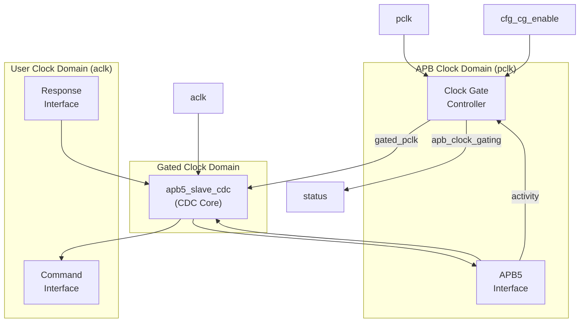
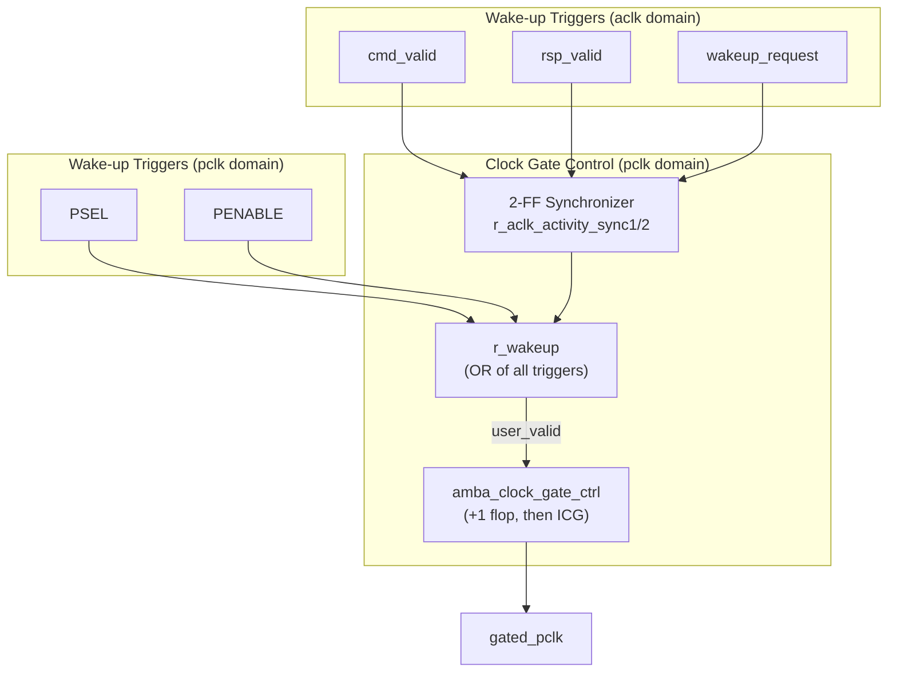
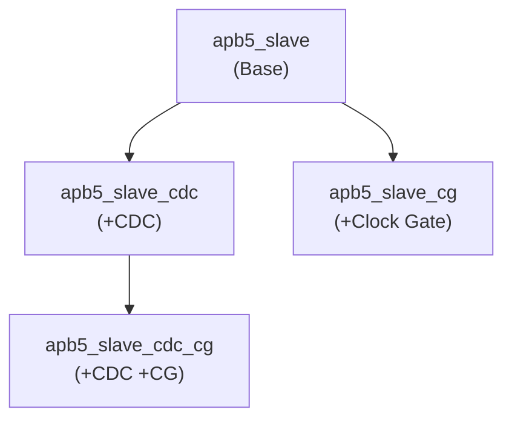

<!-- RTL Design Sherpa Documentation Header -->
<table>
<tr>
<td width="80">
  <a href="https://github.com/sean-galloway/RTLDesignSherpa">
    
  </a>
</td>
<td>
  <strong>RTL Design Sherpa</strong> · <em>Learning Hardware Design Through Practice</em><br>
  <sub>
    <a href="https://github.com/sean-galloway/RTLDesignSherpa">GitHub</a> ·
    <a href="https://github.com/sean-galloway/RTLDesignSherpa/blob/main/docs/DOCUMENTATION_INDEX.md">Documentation Index</a> ·
    <a href="https://github.com/sean-galloway/RTLDesignSherpa/blob/main/LICENSE">MIT License</a>
  </sub>
</td>
</tr>
</table>

---

<!-- End Header -->

# APB5 Slave (CDC + Clock-Gated)

**Module:** `apb5_slave_cdc_cg.sv`
**Location:** `rtl/amba/apb5/`
**Status:** Production Ready

---

## Overview

The APB5 Slave CDC + Clock-Gated module combines clock domain crossing with clock gating for maximum power efficiency. It wraps `apb5_slave_cdc` with clock gating control to cut power during idle periods while keeping operation safe across asynchronous clock boundaries.

### Key Features

- Full APB5 protocol support with all extensions
- Asynchronous clock domain crossing (APB to backend)
- Clock gating for power reduction during idle
- All APB5 user signals (PAUSER, PWUSER, PRUSER, PBUSER)
- PWAKEUP signal handling across domains
- Optional parity support for data integrity
- Automatic wake-up on transaction activity

---

## Module Architecture



---

## Parameters

| Parameter | Type | Default | Description |
|-----------|------|---------|-------------|
| ADDR_WIDTH | int | 32 | APB address bus width |
| DATA_WIDTH | int | 32 | APB data bus width |
| PROT_WIDTH | int | 3 | Protection signal width |
| AUSER_WIDTH | int | 4 | Address user signal width |
| WUSER_WIDTH | int | 4 | Write user signal width |
| RUSER_WIDTH | int | 4 | Read user signal width |
| BUSER_WIDTH | int | 4 | Response user signal width |
| STRB_WIDTH | int | DATA_WIDTH/8 | Write strobe width (calculated) |
| DEPTH | int | 2 | Skid-buffer depth of the wrapped slave; CDC FIFOs use `max(DEPTH, 4)` |
| ENABLE_PARITY | bit | 0 | Enable parity generation and checking |
| CG_IDLE_COUNT_WIDTH | int | 4 | Width of idle counter (max idle = 2^N-1 cycles) |
| USE_2_PHASE_CDC | bit | 1 | Deprecated and ignored -- retained for source compatibility |

As with [apb5_slave_cdc](apb5_slave_cdc.md), there is no `SYNC_STAGES`
parameter: pointer synchronization is fixed at 2 flops inside the async FIFOs.

---

## Ports

### Clock and Reset

| Port | Width | Direction | Description |
|------|-------|-----------|-------------|
| pclk | 1 | Input | APB bus clock |
| presetn | 1 | Input | APB reset (active low) |
| aclk | 1 | Input | User/backend clock |
| aresetn | 1 | Input | User reset (active low) |

### Clock Gating Configuration

| Port | Width | Direction | Description |
|------|-------|-----------|-------------|
| cfg_cg_enable | 1 | Input | Enable clock gating |
| cfg_cg_idle_count | CG_IDLE_COUNT_WIDTH | Input | Idle cycles before gating |

### APB5 Slave Interface

Same as [apb5_slave](apb5_slave.md) - operates in `pclk` domain.

### Backend Interface

Same command/response interface as [apb5_slave_cdc](apb5_slave_cdc.md) - operates in `aclk` domain.

### Status Outputs

| Port | Width | Direction | Description |
|------|-------|-----------|-------------|
| apb_clock_gating | 1 | Output | Indicates clock is currently gated |
| parity_error_wdata | 1 | Output | Write data parity error detected |
| parity_error_ctrl | 1 | Output | Control signal parity error |

---

## Clock Gating and CDC Interaction

### Wake-up Logic



The `aclk`-domain activity terms are ORed together and passed through a two-flop
synchronizer before being combined with the `pclk`-domain terms. Without that
synchronizer, these signals would cross domains unsynchronized.

### Timing Considerations

<!-- TODO: Add wavedrom timing diagram for CDC+CG -->
> **Timing diagram pending.** The signals and sequence this scenario
> exercises:
>
> - pclk (ungated)
> - gated_pclk
> - aclk (different frequency)
> - s_apb_PSEL (wake trigger)
> - apb_clock_gating indicator
> - Transaction flow across CDC with gating
> - Wake-up latency from PSEL to clock active


---

## Usage Example

```systemverilog
apb5_slave_cdc_cg #(
    .ADDR_WIDTH         (32),
    .DATA_WIDTH         (32),
    .AUSER_WIDTH        (4),
    .WUSER_WIDTH        (4),
    .RUSER_WIDTH        (4),
    .BUSER_WIDTH        (4),
    .DEPTH              (2),
    .ENABLE_PARITY      (0),
    .CG_IDLE_COUNT_WIDTH(4)
) u_apb5_slave_cdc_cg (
    // APB clock domain
    .pclk               (apb_clk),
    .presetn            (apb_rst_n),

    // User clock domain
    .aclk               (user_clk),
    .aresetn            (user_rst_n),

    // Clock gating
    .cfg_cg_enable      (1'b1),
    .cfg_cg_idle_count  (4'd8),
    .apb_clock_gating   (slave_clk_gated),

    // APB5 slave interface (pclk domain)
    .s_apb_PSEL         (s_apb_psel),
    .s_apb_PENABLE      (s_apb_penable),
    .s_apb_PREADY       (s_apb_pready),
    // ... other APB signals

    // Backend interface (aclk domain)
    .cmd_valid          (backend_cmd_valid),
    .cmd_ready          (backend_cmd_ready),
    // ... other command signals

    .rsp_valid          (backend_rsp_valid),
    .rsp_ready          (backend_rsp_ready),
    // ... other response signals

    // Wake-up control (aclk domain)
    .wakeup_request     (backend_wakeup)
);
```

---

## Design Notes

### Power and Latency Trade-offs

Wake-up is **registered, not combinational**. Activity is registered once (AXI4,
AXI5, AXI4-Lite, AXI4-Stream) or twice (APB, APB5, AXI5-Stream) before reaching
the ICG enable, which is combinational. A pclk-domain trigger (PSEL or PENABLE)
passes through this wrapper's `r_wakeup` and then through the flop inside
`amba_clock_gate_ctrl`, so APB5 is a two-stage family and the first usable gated
`pclk` rising edge arrives **3 ungated `pclk` cycles** after the trigger. An
aclk-domain trigger (`cmd_valid`, `rsp_valid`, `wakeup_request`) first crosses a
2-flop synchronizer into `pclk`, adding about two more `pclk` cycles.

| Configuration | Power Savings | Wake-up Latency from PSEL |
|---------------|---------------|---------------------------|
| CG disabled | None | 0 cycles (clock always running) |
| CG idle=4 | Moderate | 2 register stages; first usable edge 3 ungated pclk cycles |
| CG idle=16 [^cgw] | Good | 2 register stages; first usable edge 3 ungated pclk cycles |

The wake-up latency does not depend on `cfg_cg_idle_count`; the idle count only
controls how long the block waits before gating. Latency is absorbed as APB wait
states, since the slave holds PREADY low until it is running again.

Deliberately keeping the wake-up path registered avoids driving a clock-gate
enable from a combinational function of a bus input. The gating element itself
is an ICG cell instantiated by `clock_gate_ctrl`, which is glitch-free by
construction. ICG cells are an ASIC library primitive; FPGA targets should use a
clock-enable approach instead.

### Combined Feature Hierarchy



### Reset Considerations

- APB domain reset (`presetn`) controls the APB interface, the wake-up
  synchronizer and the clock gate
- User domain reset (`aresetn`) controls the backend side of the CDC FIFOs
- Each reset must already be synchronized (or asynchronously asserted and
  synchronously deasserted) in its own domain by the integrator; this module
  does not synchronize either reset into the other domain
- A one-sided reset is NOT safe: the crossed pointer copy is a live
  synchronizer, so the reset side returns with its own pointer at zero against a
  remote pointer that kept advancing. Quiesce the bus first -- see [apb5_slave_cdc](apb5_slave_cdc.md) for the mechanism and for the
  in-flight transaction caveat

---

## Related Documentation

- **[APB5 Slave](apb5_slave.md)** - Base slave module
- **[APB5 Slave CDC](apb5_slave_cdc.md)** - CDC variant without clock gating
- **[APB5 Slave CG](apb5_slave_cg.md)** - Clock gating without CDC

---

## Navigation

- **[← Back to APB5 Index](README.md)**
- **[← Back to rtl-amba Index](../index.md)**
- **[← Back to Main Documentation Index](../../index.md)**

[^cgw]: `idle=16` requires `CG_IDLE_COUNT_WIDTH >= 5`. At the default of 4 the
    counter holds 0-15, so writing 16 truncates to 0 and gates after the first
    idle cycle -- the opposite of the intent. Raise the parameter for this row.
