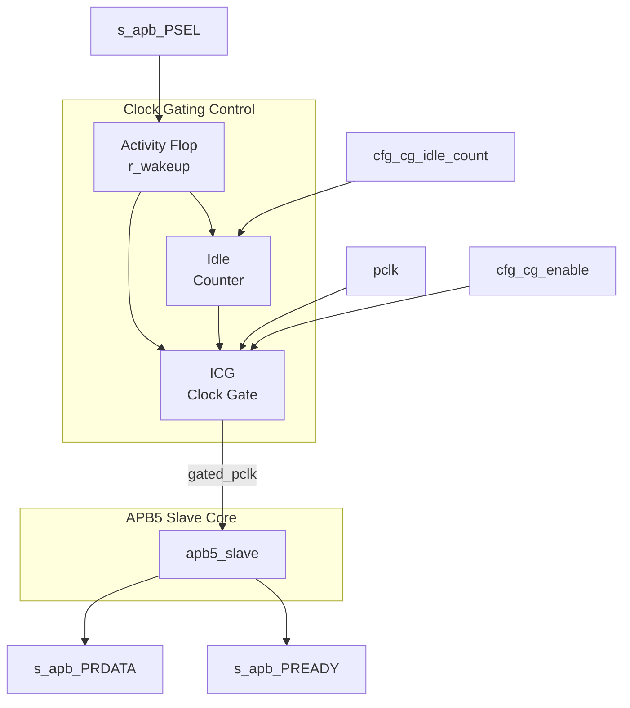

<!-- RTL Design Sherpa Documentation Header -->
<table>
<tr>
<td width="80">
  <a href="https://github.com/sean-galloway/RTLDesignSherpa">
    
  </a>
</td>
<td>
  <strong>RTL Design Sherpa</strong> · <em>Learning Hardware Design Through Practice</em><br>
  <sub>
    <a href="https://github.com/sean-galloway/RTLDesignSherpa">GitHub</a> ·
    <a href="https://github.com/sean-galloway/RTLDesignSherpa/blob/main/docs/DOCUMENTATION_INDEX.md">Documentation Index</a> ·
    <a href="https://github.com/sean-galloway/RTLDesignSherpa/blob/main/LICENSE">MIT License</a>
  </sub>
</td>
</tr>
</table>

---

<!-- End Header -->

# APB5 Slave (Clock-Gated)

**Module:** `apb5_slave_cg.sv`
**Location:** `rtl/amba/apb5/`
**Status:** Production Ready

---

## Overview

Clock-gated variant of the APB5 Slave module. Wraps the base `apb5_slave` with clock gating control logic to reduce dynamic power consumption when no transactions are active.

### Key Features

- All APB5 Slave features (see [apb5_slave](apb5_slave.md))
- Automatic clock gating during idle periods
- Registered wake-up on PSEL assertion, through a glitch-free ICG cell
- Configurable idle threshold
- Gating status output

---

## Parameters

| Parameter | Default | Description |
|---|---|---|
| `ADDR_WIDTH` | `32` |  |
| `DATA_WIDTH` | `32` |  |
| `STRB_WIDTH` | `DATA_WIDTH / 8` |  |
| `PROT_WIDTH` | `3` |  |
| `AUSER_WIDTH` | `4` |  |
| `WUSER_WIDTH` | `4` |  |
| `RUSER_WIDTH` | `4` |  |
| `BUSER_WIDTH` | `4` |  |
| `DEPTH` | `2` |  |
| `ENABLE_PARITY` | `0` |  |
| `CG_IDLE_COUNT_WIDTH` | `4` |  |
| `DW` | `DATA_WIDTH` |  |
| `AW` | `ADDR_WIDTH` |  |
| `SW` | `STRB_WIDTH` |  |
| `PW` | `PROT_WIDTH` |  |
| `AUW` | `AUSER_WIDTH` |  |
| `WUW` | `WUSER_WIDTH` |  |
| `RUW` | `RUSER_WIDTH` |  |
| `BUW` | `BUSER_WIDTH` |  |
| `ICW` | `CG_IDLE_COUNT_WIDTH` |  |
| `CPW` | `AW + DW + SW + PW + AUW + WUW + 1` |  |
| `RPW` | `DW + RUW + BUW + 1` |  |

---

## Ports

| Port | Dir | Width | Description |
|---|---|---|---|
| `pclk` | In | 1 |  |
| `presetn` | In | 1 |  |
| `cfg_cg_enable` | In | 1 |  |
| `cfg_cg_idle_count` | In | `[ICW-1:0]` |  |
| `s_apb_PSEL` | In | 1 |  |
| `s_apb_PENABLE` | In | 1 |  |
| `s_apb_PREADY` | Out | 1 |  |
| `s_apb_PADDR` | In | `[AW-1:0]` |  |
| `s_apb_PWRITE` | In | 1 |  |
| `s_apb_PWDATA` | In | `[DW-1:0]` |  |
| `s_apb_PSTRB` | In | `[SW-1:0]` |  |
| `s_apb_PPROT` | In | `[PW-1:0]` |  |
| `s_apb_PAUSER` | In | `[AUW-1:0]` |  |
| `s_apb_PWUSER` | In | `[WUW-1:0]` |  |
| `s_apb_PRDATA` | Out | `[DW-1:0]` |  |
| `s_apb_PSLVERR` | Out | 1 |  |
| `s_apb_PWAKEUP` | Out | 1 |  |
| `s_apb_PRUSER` | Out | `[RUW-1:0]` |  |
| `s_apb_PBUSER` | Out | `[BUW-1:0]` |  |
| `s_apb_PWDATAPARITY` | In | `[SW-1:0]` |  |
| `s_apb_PADDRPARITY` | In | 1 |  |
| `s_apb_PCTRLPARITY` | In | 1 |  |
| `s_apb_PRDATAPARITY` | Out | `[SW-1:0]` |  |
| `s_apb_PREADYPARITY` | Out | 1 |  |
| `s_apb_PSLVERRPARITY` | Out | 1 |  |
| `cmd_valid` | Out | 1 |  |
| `cmd_ready` | In | 1 |  |
| `cmd_pwrite` | Out | 1 |  |
| `cmd_paddr` | Out | `[AW-1:0]` |  |
| `cmd_pwdata` | Out | `[DW-1:0]` |  |
| `cmd_pstrb` | Out | `[SW-1:0]` |  |
| `cmd_pprot` | Out | `[PW-1:0]` |  |
| `cmd_pauser` | Out | `[AUW-1:0]` |  |
| `cmd_pwuser` | Out | `[WUW-1:0]` |  |
| `rsp_valid` | In | 1 |  |
| `rsp_ready` | Out | 1 |  |
| `rsp_prdata` | In | `[DW-1:0]` |  |
| `rsp_pslverr` | In | 1 |  |
| `rsp_pruser` | In | `[RUW-1:0]` |  |
| `rsp_pbuser` | In | `[BUW-1:0]` |  |
| `wakeup_request` | In | 1 |  |
| `parity_error_wdata` | Out | 1 |  |
| `parity_error_ctrl` | Out | 1 |  |
| `cg_gating` | Out | 1 |  |
| `cg_idle` | Out | 1 | Activity terms quiet (registered `~wakeup`). |

---

## Functional Description


---

### Additional Parameters

| Parameter | Type | Default | Description |
|-----------|------|---------|-------------|
| CG_IDLE_COUNT_WIDTH | int | 4 | Width of idle counter |
| `DEPTH` | int | `2` | FIFO depth. |
| `ENABLE_PARITY` | bit | `0` | Enable APB5 parity generation and checking. |

All other parameters inherited from [apb5_slave](apb5_slave.md).

---

### Derived Parameters (do not override)

These are declared as `parameter` so the elaborator can compute them, not so callers can set them. Each defaults to an expression over the parameters above; overriding one desynchronises it from its source and the design fails to elaborate or silently mis-sizes a bus. Set the parameters they are derived FROM and leave these alone.

| Derived parameter | Default expression |
|---|---|
| `STRB_WIDTH` | `DATA_WIDTH / 8` |
| `DW` | `DATA_WIDTH` |
| `AW` | `ADDR_WIDTH` |
| `SW` | `STRB_WIDTH` |
| `PW` | `PROT_WIDTH` |
| `AUW` | `AUSER_WIDTH` |
| `WUW` | `WUSER_WIDTH` |
| `RUW` | `RUSER_WIDTH` |
| `BUW` | `BUSER_WIDTH` |
| `ICW` | `CG_IDLE_COUNT_WIDTH` |
| `CPW` | `AW + DW + SW + PW + AUW + WUW + 1` |
| `RPW` | `DW + RUW + BUW + 1` |

### Additional Ports

### Clock Gating Configuration

| Port | Width | Direction | Description |
|------|-------|-----------|-------------|
| cfg_cg_enable | 1 | Input | Enable clock gating |
| cfg_cg_idle_count | CG_IDLE_COUNT_WIDTH | Input | Idle cycles before gating |

### Clock Gating Status

| Port | Width | Direction | Description |
|------|-------|-----------|-------------|
| cg_gating | 1 | Output | High while the internal clock is gated off |

There is no cumulative gated-cycle counter port on this module. If a gated-cycle
total is needed, count `cg_gating` in the integrating logic on the
ungated `pclk`.

All ports of [apb5_slave](apb5_slave.md) -- including the parity signals,
`wakeup_request`, `parity_error_wdata` and `parity_error_ctrl` -- are present
unchanged and pass straight through to the wrapped core.

### Clock Gating Behavior

### Wake-up Trigger

The wrapper keeps the clock running whenever any of the following is high:

```
s_apb_PSEL || s_apb_PENABLE || cmd_valid || rsp_valid || wakeup_request
```

That term is registered into `r_wakeup` on the ungated `pclk`, and
`amba_clock_gate_ctrl` registers it once more before it reaches the gating
condition. Activity is registered once (AXI4, AXI5, AXI4-Lite, AXI4-Stream) or
twice (APB, APB5, AXI5-Stream) before reaching the ICG enable, which is
combinational. APB5 is a **two-stage** family, so the first gated-clock rising
edge available to the wrapped `apb5_slave` arrives **3 ungated `pclk` cycles**
after activity asserts. Because the slave signals not-ready by holding PREADY
low, those cycles simply appear to the master as APB wait states.

The gating element is an ICG (integrated clock gating) cell instantiated by
`clock_gate_ctrl`, so enable transitions are glitch-free. ICG cells are an ASIC
library primitive; on FPGA targets use a clock-enable approach instead.

Gating engages `cfg_cg_idle_count + 1` ungated `pclk` cycles after the internal
wakeup deasserts, which is `cfg_cg_idle_count + 3` cycles after the last bus
activity, because APB5 adds two register stages ahead of the ICG enable.

> **Timing diagram pending.** The signals and sequence this scenario
> exercises:
>
> - pclk
> - gated_pclk
> - s_apb_PSEL
> - cg_gating
> - Wake-up latency (two register stages; first usable gated edge 3 ungated pclk cycles after activity)
## Timing Characteristics

This module is **sequential**: it contains clocked logic (via `always_ff` or
the repository's `ALWAYS_FF_RST` macro) and therefore holds state. Outputs
driven from those blocks are registered and appear one clock after the inputs
that produced them.

Per-path cycle counts are not enumerated here; read the block that drives the
signal you care about. No synthesis frequency or area figures are quoted --
none have been measured against a target device.

Timing closure is therefore a question of the surrounding logic's slack, not of
this module's cycle count. No synthesis figures are quoted; none have been
measured.

---

## Usage Examples
```systemverilog
apb5_slave_cg #(
    .ADDR_WIDTH         (32),
    .DATA_WIDTH         (32),
    .CG_IDLE_COUNT_WIDTH(4)
) u_apb5_slave_cg (
    .pclk               (apb_clk),
    .presetn            (apb_rst_n),

    // Clock gating
    .cfg_cg_enable      (1'b1),
    .cfg_cg_idle_count  (4'd4),
    .cg_gating   (slave_clk_gated),

    // APB5 interface (same as apb5_slave)
    // ...
);
```

---

## Design Notes

**A peer's READY must never enter the activity term.** A consumer that parks
its response-ready high while idle is behaving correctly; folding that signal
into `user_valid` pins this block permanently awake and defeats gating
entirely -- silently, because function is unaffected. Ten wrappers in this
repository shipped that way and nothing failed until someone measured.
`val/amba/test_cg_peer_ready.py` parks the peer READY high, holds every VALID
low, and requires `cg_gating`. Canonical rule:
`vault/handbook/design/clock-gating-activity-terms.md`.

**`cfg_cg_enable` is not a kill switch.** It arms gating and reaches
`amba_clock_gate_ctrl` only; the datapath and any monitor enables are forwarded
untouched. With it low the clock free-runs and this module behaves exactly like
its base.

**Gating latency.** The clock stops `cfg_cg_idle_count` + 2 cycles after the
last bus activity -- the idle counter, plus one for the `r_wakeup` flop. Size
the idle count against your traffic's inter-burst gap: too small and the block
wakes constantly, too large and it never gates.

**Cost.** Five flops: `r_wakeup` plus `r_idle_counter` at `IDLE_CNTR_WIDTH`,
scaling as 1 + `CG_IDLE_COUNT_WIDTH`. The ICG itself is a latch or BUFGCE, not
fabric flops.

---

## Related Modules
- **[APB5 Slave](apb5_slave.md)** - Base module documentation
- **[APB5 Master CG](apb5_master_cg.md)** - Clock-gated master

---

## Testing

`val/amba/test_apb5_slave_cg.py` exercises this module. It collects 3 parameter cases at the default `REG_LEVEL`.

```bash
source env_python
pytest val/amba/test_apb5_slave_cg.py -v
```

---

## Navigation

- **[← Back to APB5 Index](README.md)**
- **[← Back to rtl-amba Index](../index.md)**
- **[← Back to Main Documentation Index](../../index.md)**
