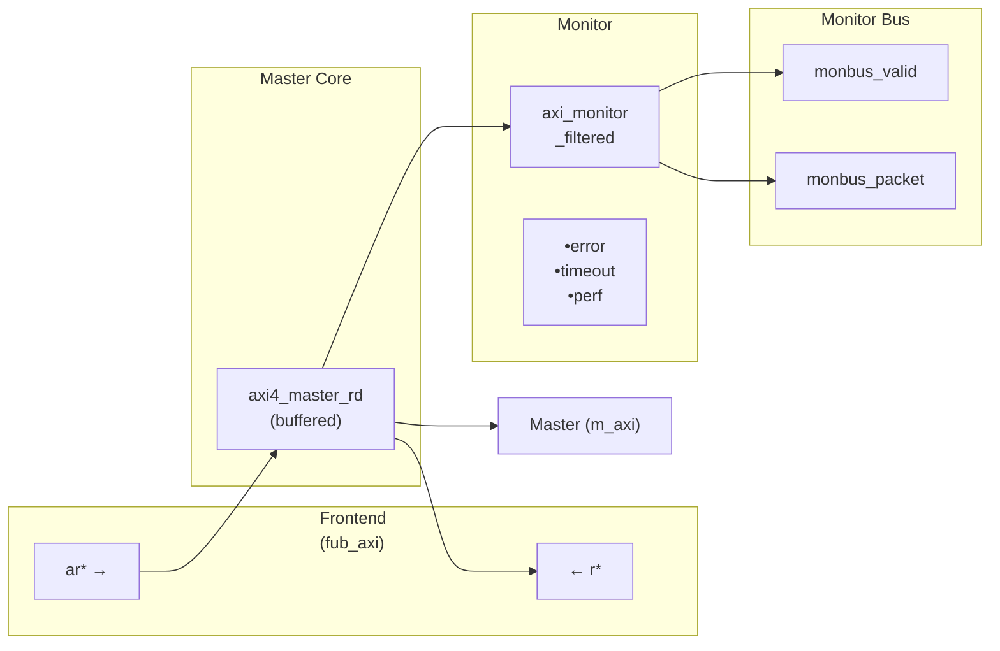
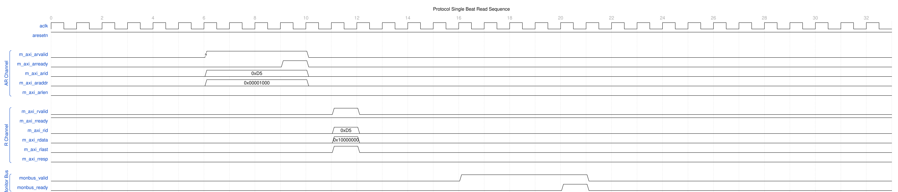
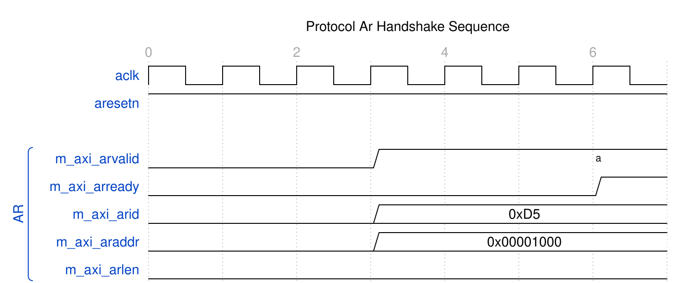
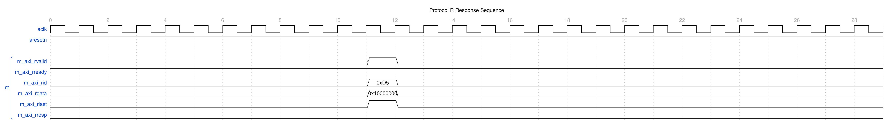
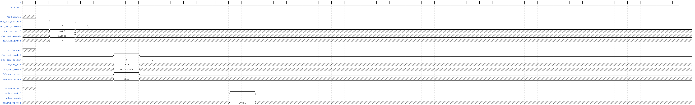
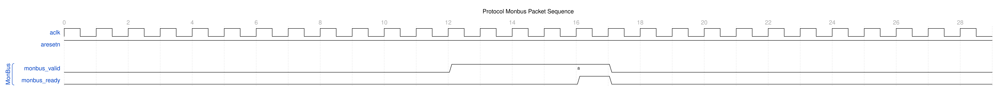
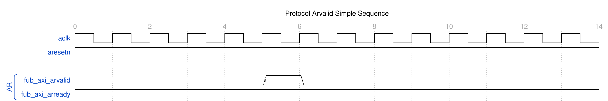
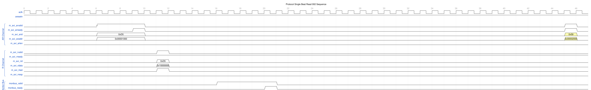

<!-- RTL Design Sherpa Documentation Header -->
<table>
<tr>
<td width="80">
  <a href="https://github.com/sean-galloway/RTLDesignSherpa">
    
  </a>
</td>
<td>
  <strong>RTL Design Sherpa</strong> · <em>Learning Hardware Design Through Practice</em><br>
  <sub>
    <a href="https://github.com/sean-galloway/RTLDesignSherpa">GitHub</a> ·
    <a href="https://github.com/sean-galloway/RTLDesignSherpa/blob/main/docs/DOCUMENTATION_INDEX.md">Documentation Index</a> ·
    <a href="https://github.com/sean-galloway/RTLDesignSherpa/blob/main/LICENSE">MIT License</a>
  </sub>
</td>
</tr>
</table>

---

<!-- End Header -->

# axi4_master_rd_mon

**Module:** `axi4_master_rd_mon.sv`
**Location:** `rtl/amba/axi4/` (protocol monitors live with their protocol; only the monitor CORE pieces are in `rtl/amba/monitor/`)
**Status:** Production Ready

---

## Overview

The AXI4 Master Read Monitor combines a functional AXI4 master read interface with comprehensive transaction monitoring and filtering. This is the module you drop into a verification environment when you want real-time protocol checking, error detection, performance metrics, and configurable packet filtering without giving up the datapath — the traffic flows through it, and it watches on the way by.

### Key Features

- **Integrated Monitoring:** Combines `axi4_master_rd` with `axi_monitor_filtered`
- **2-Level Filtering: packet-type drop masks + per-event masks (err_select is reserved -- no routing)**
- **Error Detection:** SLVERR, DECERR, orphaned read data, timeouts
  (protocol-violation events are write-monitor only -- see Error Detection Events)
- **Timeout Monitoring:** Configurable timeout detection for stuck transactions
- **Performance Metrics:** Latency tracking, transaction counting, throughput analysis
- **Monitor Bus Output:** 128-bit packets paired with 64-bit side-band timestamps
- **Configuration Validation:** Detects conflicting configuration settings
- **Clock Gating Support:** Busy signal for power management

---

## Parameters

### AXI4 Master Parameters

| Parameter | Type | Default | Description |
|-----------|------|---------|-------------|
| `SKID_DEPTH_AR` | int | 2 | AR channel skid buffer depth |
| `SKID_DEPTH_R` | int | 4 | R channel skid buffer depth |
| `AXI_ID_WIDTH` | int | 8 | Transaction ID width |
| `AXI_ADDR_WIDTH` | int | 32 | Address bus width |
| `AXI_DATA_WIDTH` | int | 32 | Data bus width |
| `AXI_USER_WIDTH` | int | 1 | User signal width |

### Monitor Parameters

| Parameter | Type | Default | Description |
|-----------|------|---------|-------------|
| `UNIT_ID` | logic [7:0] | 8'h01 | 8-bit unit identifier in monitor packets |
| `AGENT_ID` | logic [15:0] | 16'h000A | 16-bit agent identifier in monitor packets |
| `MAX_TRANSACTIONS` | int | 16 | Maximum concurrent outstanding transactions |
| `ACLK_MHZ` | int | 100 | Clock frequency in MHz -- keeps the 1 us tick exact off-100MHz |
| `CFI_MIN_FREQ_MHZ` / `CFI_MAX_FREQ_MHZ` | int | = ACLK_MHZ | Bounds for the freq-invariant counter LUT (`cfg_freq_sel` indexes within them) |
| `USE_WDATA_ORDER_Q` | bit | 0 | Write-data ordering queue |
| `NUM_BANKS` | int | 1 | Banked transaction tables. **>1 on a WRITE monitor requires `USE_WDATA_ORDER_Q=1`** -- `axi_monitor_trans_mgr` fails elaboration otherwise |
| `ID_FILTER_ENABLE` | bit | 0 | Synthesises the per-instance ID-slice filter |
| `ID_MATCH_BASE` | int | 0 | First ID this instance owns |
| `ID_MATCH_COUNT` | int | 0 | How many; `0` means ALL, so a zeroed register block does not silently filter everything away |
| `ACTIVE_TRANS_THRESHOLD` | int | MAX_TRANSACTIONS/2 | Active-transaction count that trips a threshold packet when `cfg_threshold_enable=1`. Replaces the former hardwired 8/4; threshold packets now scale with the table sizing |
| `ENABLE_FILTERING` | bit | 1 | Enable packet filtering: two active drop levels (packet type, then event code). Level 2 is reserved and routes nothing |
| `ADD_PIPELINE_STAGE` | bit | 0 | Add register stage for timing closure |
| `USE_MONITOR` | bit | 1 | Synthesis-time monitor enable. 0 = omit monitor and tie outputs to safe non-blocking defaults; 1 = full monitor functionality. |
| `N_ADDR_RANGES` | int | 0 | Number of address-range comparators. 0 = checker omitted (zero area). >0 = N independent [low, high] ranges; feeds the shared allowlist checker: a debug-range hit -> AddrMatch, an error-allowlist miss -> Error/ADDR_RANGE (see axi_monitor_addr_check.md). |
| `ADDR_RANGE_IS_ERROR` | logic [N_ADDR_RANGES-1:0] | `'0` | Per-range flavor: bit i = 0 -> DEBUG range (hit -> AddrMatch), 1 -> ERROR range (allowlist miss -> Error/ADDR_RANGE). Default all-0 (feature inert). |

### Synthesis-Cone Parameters

Each detection cone can be compiled out to save area. The classic cones default on; the debug cone defaults off. Setting a bit to 0 drops the corresponding cone at synthesis via a `generate`-if inside `axi_monitor_reporter` — the area saving is real.

| Parameter | Type | Default | Effect when 0 |
|-----------|------|:-------:|---------------|
| `ENABLE_ERROR_LOGIC`     | bit | 1 | Drop the error-detection cone |
| `ENABLE_TIMEOUT_LOGIC`   | bit | 1 | Drop the timeout cone **and** the `axi_monitor_timeout` instance |
| `ENABLE_COMPL_LOGIC`     | bit | 1 | Drop the completion cone |
| `ENABLE_THRESHOLD_LOGIC` | bit | 1 | Drop the threshold cone |
| `ENABLE_PERF_LOGIC`      | bit | 1 | Gates only the reporter's legacy perf-packet cone and the two lifetime counters -- the window FSM and meters are unconditional |
| `ENABLE_DEBUG_LOGIC`     | bit | 0 | Drop the debug (trace) cone — the 6th reporter sub-block (off by default) |

Internally the wrapper hardwires two master switches on its `axi_monitor_filtered` instance: `ENABLE_PERF_PACKETS = 1` (the reporter's legacy perf cone is built; `ENABLE_PERF_LOGIC` gates THAT cone only, never the measurement window) and `ENABLE_DEBUG_MODULE = 0` (debug tracking module omitted). These are not top-level parameters of the wrapper.

The transaction CAM is always pipelined.

---

### Derived Parameters (do not override)

These are declared as `parameter` so the elaborator can compute them, not so callers can set them. Each defaults to an expression over the parameters above; overriding one desynchronises it from its source and the design fails to elaborate or silently mis-sizes a bus. Set the parameters they are derived FROM and leave these alone.

| Derived parameter | Default expression |
|---|---|
| `AXI_WSTRB_WIDTH` | `AXI_DATA_WIDTH / 8` |
| `AW` | `AXI_ADDR_WIDTH` |
| `DW` | `AXI_DATA_WIDTH` |
| `IW` | `AXI_ID_WIDTH` |
| `SW` | `AXI_WSTRB_WIDTH` |
| `UW` | `AXI_USER_WIDTH` |

## Ports

### AXI4 Interfaces

**Frontend Interface (fub_axi_*):**
- AR channel inputs: `arid, araddr, arlen, arsize, arburst, arlock, arcache, arprot, arqos, arregion, aruser, arvalid`
- AR channel output: `arready`
- R channel outputs: `rid, rdata, rresp, rlast, ruser, rvalid`
- R channel input: `rready`

**Master Interface (m_axi_*):**
- AR channel outputs: `arid, araddr, arlen, arsize, arburst, arlock, arcache, arprot, arqos, arregion, aruser, arvalid`
- AR channel input: `arready`
- R channel inputs: `rid, rdata, rresp, rlast, ruser, rvalid`
- R channel output: `rready`

### Monitor Configuration

**Basic Configuration:**

| Port | Direction | Width | Description |
|------|-----------|-------|-------------|
| `cfg_monitor_enable` | Input | 1 | Master runtime gate. 0 = monitor inert: no allocation, transaction CAM held clear, and the upstream ready is never stalled (a disabled monitor cannot block the datapath). 1 = normal operation |
| `cam_clear` | Input | 1 | Synchronous clear of the monitor transaction CAM (driven from the harness clear control bit, e.g. CTRL[4]) |
| `cfg_error_enable` | Input | 1 | Enable error packet generation |
| `cfg_timeout_enable` | Input | 1 | Enable timeout detection |
| `cfg_perf_enable` | Input | 1 | Enable performance metrics |
| `cfg_compl_enable` | Input | 1 | Enable transaction-completion packets |
| `cfg_threshold_enable` | Input | 1 | Enable threshold-crossed packets |
| `cfg_debug_enable` | Input | 1 | Enable debug/trace packets (gates the debug cone — the 6th reporter sub-block) |
| `cfg_timeout_cycles` | Input | 16 | Unified coarse timeout control, a MICROSECOND count passed through at FULL 16-bit width: 1..65535 us per phase; 0 = 16'hFFFF (~65 ms, effectively never). One value drives all three phase counts (addr/data/resp). The old 4-bit squash that saturated >= 16 at 15 us is retired |
| `cfg_latency_threshold` | Input | 32 | Latency threshold for alerts |
| `cfg_freq_sel` | Input | 4 | `counter_freq_invariant` LUT index scaling the 1 us timer tick -- the microsecond timeouts above are measured in these ticks |

> The inner monitor's `cfg_debug_level` (tied to 0) and `cfg_debug_mask` (0) are fixed inside the wrapper; `cfg_active_trans_threshold` is driven from the `ACTIVE_TRANS_THRESHOLD` parameter (default `MAX_TRANSACTIONS/2`). `cfg_debug_enable` is the only debug-cone control exposed here.

**Filtering Configuration (levels 1 and 3 drop packets; level 2 is reserved):**

**Level 1 - Packet Type Masks:**

| Port | Direction | Width | Description |
|------|-----------|-------|-------------|
| `cfg_axi_pkt_mask` | Input | 16 | Drop mask for entire packet types |
| `cfg_axi_err_select` | Input | 16 | Error routing select (future use) |

**Level 2 & 3 - Individual Event Masks:**

| Port | Direction | Width | Description |
|------|-----------|-------|-------------|
| `cfg_axi_error_mask` | Input | 16 | Mask specific error events |
| `cfg_axi_timeout_mask` | Input | 16 | Mask specific timeout events |
| `cfg_axi_compl_mask` | Input | 16 | Mask specific completion events |
| `cfg_axi_thresh_mask` | Input | 16 | Mask specific threshold events |
| `cfg_axi_perf_mask` | Input | 16 | Mask specific performance events |
| `cfg_axi_addr_mask` | Input | 16 | Mask specific address match events |
| `cfg_axi_debug_mask` | Input | 16 | Mask specific debug events |

### Monitor Bus Output

| Port | Direction | Width | Description |
|------|-----------|-------|-------------|
| `monbus_valid` | Output | 1 | Monitor packet valid |
| `monbus_ready` | Input | 1 | Downstream ready to accept packet |
| `monbus_packet` | Output | 128 | `monitor_packet_t` (see format below) |
| `monbus_timestamp` | Output | 64 | `monbus_timestamp_t` paired atomically with `monbus_packet` |
| debug_block_ready | Output | 1 | Observability tap for the block_ready gating net (drives nothing internally; leave unconnected if unused) |
| `i_mon_time` | Input | 64 | Free-running counter from `monbus_group_core`, sampled at packet emission |

### Status Outputs

| Port | Direction | Width | Description |
|------|-----------|-------|-------------|
| `busy` | Output | 1 | Indicates active transactions (for clock gating) |
| `active_transactions` | Output | 8 | Current number of outstanding transactions |
| `error_count` | Output | 16 | Lifetime count of error+timeout packets actually emitted (reporter perf counter; reads 0 when `ENABLE_PERF_LOGIC=0` or `USE_MONITOR=0`) |
| `transaction_count` | Output | 32 | Lifetime count of completion packets actually emitted (zero-extended 16-bit reporter perf counter; reads 0 when `ENABLE_PERF_LOGIC=0` or `USE_MONITOR=0`) |
| `cfg_conflict_error` | Output | 1 | Configuration conflict detected |

---

### Packet filters

Two independent runtime filters cut monbus traffic without touching the
datapath. Both are inert until driven, which is the failure to watch for: the
build-time parameter only decides whether the logic is SYNTHESISED, and a
design that sets the parameter but leaves the `cfg_*` ports tied low filters
nothing and looks like the feature is broken.

**Address-range filter** — `ADDR_FILTER_ENABLE` (bit, default 0) builds it.

| Port | Width | Description |
|---|---|---|
| `cfg_addr_filter_enable` | 1 | High: suppress packets for transactions outside the window. Low: inert, whatever the parameter says |
| `cfg_addr_filter_low` | `ADDR_WIDTH` | Window base, inclusive |
| `cfg_addr_filter_high` | `ADDR_WIDTH` | Window limit, inclusive |

The verdict is latched per table entry at ALLOCATION, from the command
address, and held for that entry's life. Widening the window mid-flight does
not un-filter entries already admitted — which is exactly what makes it safe
to reprogram live, since an entry's fate is decided when it is admitted and
the retire accounting cannot be corrupted afterwards. Contrast the
address-range CHECKER (`N_ADDR_RANGES`), which re-evaluates per command.

**Runtime ID filter** — overrides the `ID_MATCH_BASE`/`ID_MATCH_COUNT`
elaboration constants so an instance can be retargeted at a different master
without a rebuild.

| Port | Width | Description |
|---|---|---|
| `cfg_id_filter_enable` | 1 | High: use the window below. Low: use the parameters, bit-identical to a build without this feature |
| `cfg_id_match_base` | `ID_WIDTH` | First ID owned |
| `cfg_id_match_count` | `ID_WIDTH+1` | How many; `0` means ALL, matching the parameter rule so a zeroed register block does not silently filter everything away |

The window is half-open: `[base, base + count)`.

## Functional Description

### Module Architecture



The module instantiates two sub-modules:
1. **axi4_master_rd** - Core AXI4 functionality with buffering
2. **axi_monitor_filtered** - Transaction monitoring with 2-Level Filtering: packet-type drop masks + per-event masks (err_select is reserved -- no routing)

### Monitor Backpressure (block_ready)

`block_ready` is exported as the `debug_block_ready` output port -- the wrapper deliberately makes the gating contract observable (the plain `_mon_cg` wrapper ties it off rather than forwarding it). It goes low when the monitor's transaction-table occupancy reaches its blocking threshold (a function of `MAX_TRANSACTIONS`; the reporter FIFO depth `INTR_FIFO_DEPTH` has no path to it). The wrapper ANDs it into the upstream-facing `fub_axi_arready` so a saturated monitor throttles new transactions at the handshake instead of dropping events.

- **Where the stall lands**: the upstream `fub_axi_arready` is forced low until the monitor drains.
- **When `USE_MONITOR=0`**: `block_ready` is internally tied high, so the wrapper imposes no stall and runs at full bandwidth.
- **When `cfg_monitor_enable=0`**: the wrapper gate forces the upstream ready open, so a runtime-disabled monitor can never stall the datapath (in-RTL formal property `ap_disabled_never_stalls`).

Recovery is guaranteed by the **saturation-recovery contract**: command-originated table entries are capped at `MAX_TRANSACTIONS - cmd_entry_reserve(MAX_TRANSACTIONS)` (reserve = 4 for tables of 16 or more, 0 below; the function lives in `monitor_common_pkg`), and `block_ready` re-asserts at occupancy `< MAX_TRANSACTIONS - (reserve - 1)` -- a threshold strictly ABOVE the command cap -- so a saturated table always drains back below the reopen point. Blocking throttles; it never deadlocks. Tables smaller than 16 keep full legacy allocation (small tables cannot spare slots) and trade the recovery guarantee for tracking capacity. The contract is verified by in-RTL formal properties (mutation-checked) and a 100-seed deliberately-undersized-table stream sweep; see [axi_monitor_base](../monitor/axi_monitor_base.md#flow-control-and-the-saturation-recovery-contract) for the canonical description.

Sizing note: a monitor on a bus shared by several channels/requesters must size `MAX_TRANSACTIONS` to cover `NUM_CHANNELS x per-channel outstanding` plus margin -- the per-channel limit alone makes the monitor throttle the shared master. Tables deeper than 64 also need Verilator's `--unroll-count` raised (default 64) in sim builds.

### Address-Range Checker

With `N_ADDR_RANGES > 0` the wrapper instantiates the shared allowlist checker
([`axi_monitor_addr_check`](../monitor/axi_monitor_addr_check.md)). Each range carries a
DEBUG/ERROR flavor:

- **DEBUG range** — a hit emits a `PktTypeAddrMatch` (`4'h8`) packet with event
  code `AXI_ADDR_RANGE_MATCH` (`8'h01`), gated by `cfg_debug_enable`.
- **ERROR range** — the enabled ERROR ranges form an allowlist; an address in
  NONE of them emits a `PktTypeError` (`4'h0`) packet with event code
  `AXI_ERR_ADDR_RANGE` (`8'h0D`), gated by `cfg_error_enable`.

This wrapper exposes **`ADDR_RANGE_IS_ERROR`** (per-range) as a parameter, so ranges can be assigned to either flavor.

**Config inputs (active only when `N_ADDR_RANGES > 0`):**
- `cfg_addr_check_enable` — master on/off for the checker.
- `cfg_addr_range_enable[N-1:0]` — per-range enable bit.
- `cfg_addr_range_low/high[N-1:0][AXI_ADDR_WIDTH-1:0]` — inclusive bounds.

**Event encoding:** `event_data[63:60]` = `range_index` (matching DEBUG range, or
`4'hF` sentinel on an ERROR miss); `event_data[59:0]` = full address. **Filtering:**
AddrMatch is dropped by `cfg_axi_addr_mask[1]`, the ADDR_RANGE error by
`cfg_axi_error_mask[13]`. See the checker page for coalescing + formal properties.

### Performance Monitoring

The wrapper hardwires `ENABLE_PERF_PACKETS = 1` on its inner `axi_monitor_filtered`. The **measurement-window state machine** and its counters are unconditional `always_ff` blocks in `axi_monitor_base` -- outside every generate -- so they are present and running in EVERY build, including `ENABLE_PERF_LOGIC = 0`. That parameter reaches one consumer: the `g_perf` generate in `axi_monitor_reporter` holding the legacy perf-packet cone and the two 16-bit lifetime counters behind `perf_completed_count` / `perf_error_count`. Setting it to 0 saves that cone and nothing else. `USE_MONITOR = 0` is what ties the perfmon outputs off. The wrapper instantiates plus a bank of R-data-channel utilization counters. All counters accumulate **only while a window is open** (`window_active = 1`) and hold their values between windows, so the host can read a completed window's totals.

#### The Measurement Window

A window is opened by a **start event** and closed by an **end event**. The event sources are selected by `cfg_start_event_sel` / `cfg_end_event_sel` (3-bit; e.g. `3'b010` selects the `cfg_perf_enable` edge) and can also be fired directly by the `cfg_start_trigger` / `cfg_end_trigger` pulses (from an engine or CSR). `cfg_window_force_close` is a software override that closes the window immediately. While the window is open:

- `window_active` is high.
- `window_cycles[31:0]` free-runs, counting every clock elapsed inside the window.

Sample the counters on the cycle `window_active` falls to 0 (drive `cfg_end_trigger`, or wait for the configured end event).

#### Utilization Counters (R Data Channel)

Every cycle inside the window is classified by the R channel's `rvalid` / `rready` into exactly one of four buckets:

| Output | Width | Condition | Meaning |
|--------|:-----:|-----------|---------|
| `perf_prod_cycles`  | 32 | rvalid && rready   | productive beat transferred |
| `perf_bp_cycles`    | 32 | rvalid && !rready  | back-pressure (data offered, sink not ready) |
| `perf_starv_cycles` | 32 | !rvalid && rready  | starvation (sink ready, no data) |
| `perf_idle_cycles`  | 32 | !rvalid && !rready | idle |

The four buckets sum to `window_cycles - 1` (the start cycle seeds window_cycles to 1 while the buckets reset to 0); the one-count skew is negligible for long windows.

#### Throughput Counters

| Output | Width | Meaning |
|--------|:-----:|---------|
| `perf_beat_count`  | 32 | R data beats transferred (= `perf_prod_cycles`, 1 beat/cycle) |
| `perf_byte_count`  | 64 | bytes transferred = beats × (1 << ARSIZE), using the ARSIZE captured at the most recent AR address phase (upper bound: counts full-width beats; an unaligned start address means the first beat carries fewer useful bytes) |
| `perf_burst_count` | 32 | AR address-phase handshakes |

The integrator computes average burst length as `perf_beat_count / perf_burst_count`.

#### Performance Monitoring Ports

| Port | Direction | Width | Description |
|------|-----------|:-----:|-------------|
| `cfg_perf_enable`        | Input  | 1  | Enable performance-metric packet generation |
| `cfg_start_event_sel`    | Input  | 3  | Window **start** event source select |
| `cfg_end_event_sel`      | Input  | 3  | Window **end** event source select |
| `cfg_start_trigger`      | Input  | 1  | Pulse: open the measurement window |
| `cfg_end_trigger`        | Input  | 1  | Pulse: close the measurement window |
| `cfg_window_force_close` | Input  | 1  | Software override: force the window closed |
| `window_active`          | Output | 1  | High while a measurement window is open |
| `window_cycles`          | Output | 32 | Cycles elapsed in the current window |
| `perf_prod_cycles`       | Output | 32 | rvalid && rready cycles |
| `perf_bp_cycles`         | Output | 32 | rvalid && !rready cycles (back-pressure) |
| `perf_starv_cycles`      | Output | 32 | !rvalid && rready cycles (starvation) |
| `perf_idle_cycles`       | Output | 32 | !rvalid && !rready cycles |
| `perf_beat_count`        | Output | 32 | R data beats transferred |
| `perf_byte_count`        | Output | 64 | bytes transferred |
| `perf_burst_count`       | Output | 32 | AR address-phase handshakes |

When `USE_MONITOR = 0`, every perfmon output is tied to 0 and the window never opens.

### Monitor Packet Format

The 128-bit `monbus_packet` (paired with the 64-bit `monbus_timestamp` side-band signal) follows the standardized AMBA monitor bus format:

```
Bits [127:124] - Packet Type:
  0x0 = ERROR      Error events (SLVERR, DECERR, protocol violations)
  0x1 = COMPL      Completion events (transaction finished)
  0x2 = THRESH     Threshold events
  0x3 = TIMEOUT    Timeout events
  0x4 = PERF       Performance metrics
  0x8 = ADDR_MATCH Address match events
  0x9 = APB        APB-specific events
  0xF = DEBUG      Debug events
Bits [123:109] - Reserved (15 bits, forward-compat slack)
Bits [108:105] - Protocol (4 bits): 0x0=AXI, 0x1=AXIS, 0x2=APB, 0x3=ARB, 0x4=CORE
Bits [104:97]  - Event Code (8 bits, protocol-specific)
Bits [96:88]   - Channel ID (9 bits — AXI ID or channel index)
Bits [87:72]   - Agent ID (16 bits, from AGENT_ID parameter)
Bits [71:64]   - Unit ID (8 bits, from UNIT_ID parameter)
Bits [63:0]    - Event Data (64 bits — full address, latency, etc.)
```

---

## Timing Characteristics

| Skid parameter | Default depth |
|---|---|
| `SKID_DEPTH_AR` | 2 entries |
| `SKID_DEPTH_R` | 4 entries |

Each channel traverses one `gaxi_skid_buffer`, which registers both `rd_valid`
and its storage. The **1-cycle input-to-output latency therefore applies on
every transfer, including the unstalled case** -- there is no combinational
bypass. Depth buys backpressure absorption, not throughput; full rate is
sustained once the pipeline is primed. Legal range is 2..8 inclusive, odd
values included.

Clocking: `aclk`, reset `aresetn` (active-low asynchronous).

No synthesis numbers are quoted here. Frequency and area depend on the target
device and the parameters you elaborate with; run your own build.

---

## Waveforms

The following waveforms show AXI4 master read monitor behavior across various scenarios:

### Scenario 1: Single-Beat Read Transaction

Complete AXI4 read transaction with AR handshake and R response:



**WaveJSON:** [single_beat_read_001.json](../../assets/WAVES/axi4_master_rd_mon/single_beat_read_001.json)

**Key Observations:**
- AR channel handshake (ARVALID/ARREADY)
- R channel response (RVALID/RREADY/RLAST)
- Monitor bus packet generation
- Transaction tracking and completion

### Scenario 2: AR Channel Handshake Detail

Detailed view of address read channel handshake:



**WaveJSON:** [ar_handshake_001.json](../../assets/WAVES/axi4_master_rd_mon/ar_handshake_001.json)

**Key Observations:**
- ARVALID assertion timing
- ARREADY response from slave
- Address and control signal stability
- Handshake protocol compliance

### Scenario 3: R Response Channel Detail

Read data response channel behavior:



**WaveJSON:** [r_response_001.json](../../assets/WAVES/axi4_master_rd_mon/r_response_001.json)

**Key Observations:**
- RVALID/RREADY handshake
- RLAST assertion for transaction completion
- RRESP status (OKAY/SLVERR/DECERR)
- Read data capture

### Scenario 4: Complete AXI4 Read Transaction

End-to-end AXI4 read transaction flow:



**WaveJSON:** [axi4_read_transaction_001.json](../../assets/WAVES/axi4_master_rd_mon/axi4_read_transaction_001.json)

**Key Observations:**
- Complete AR → R channel flow
- Transaction ID tracking
- Burst length and size handling
- Monitor packet correlation

### Scenario 5: Monitor Bus Packet Generation

Monitor bus output packet format and timing:



**WaveJSON:** [monbus_packet_001.json](../../assets/WAVES/axi4_master_rd_mon/monbus_packet_001.json)

**Key Observations:**
- Monitor bus valid/ready handshake
- 128-bit packet format (plus 64-bit side-band timestamp)
- Packet type encoding
- Event data payload

### Scenario 6: Simple ARVALID Transaction

Simplified view of ARVALID-based transaction:



**WaveJSON:** [arvalid_simple_001.json](../../assets/WAVES/axi4_master_rd_mon/arvalid_simple_001.json)

**Key Observations:**
- Minimal handshake sequence
- Single-beat read operation
- Fast transaction completion

### Scenario 7: Alternative Single-Beat Read

Variant single-beat read with different timing:



**WaveJSON:** [single_beat_read_002_001.json](../../assets/WAVES/axi4_master_rd_mon/single_beat_read_002_001.json)

**Key Observations:**
- Different backpressure pattern
- Ready signal de-assertion effects
- Transaction latency variation

---

## Usage Examples


Every parameter and port below is read from the module declaration.

```systemverilog
axi4_master_rd_mon #(
    .SKID_DEPTH_AR         (2),
    .SKID_DEPTH_R          (4),
    .AXI_ID_WIDTH          (8),
    .AXI_ADDR_WIDTH        (32),
    .AXI_DATA_WIDTH        (32),
    .AXI_USER_WIDTH        (1),
    .ACLK_MHZ              (100),
    .USE_MONITOR           (1'b1),
    .N_ADDR_RANGES         (0),
    .ADDR_RANGE_IS_ERROR   ('0)
) u_axi4_master_rd_mon (
    .aclk                  (aclk),
    .aresetn               (aresetn),
    .cam_clear             (cam_clear),
    .fub_axi_arid          (fub_axi_arid),
    .fub_axi_araddr        (fub_axi_araddr),
    .fub_axi_arlen         (fub_axi_arlen),
    .fub_axi_arsize        (fub_axi_arsize),
    .fub_axi_arburst       (fub_axi_arburst),
    .fub_axi_arlock        (fub_axi_arlock),
    .fub_axi_arcache       (fub_axi_arcache),
    .fub_axi_arprot        (fub_axi_arprot),
    .fub_axi_arqos         (fub_axi_arqos),
    .fub_axi_arregion      (fub_axi_arregion),
    .fub_axi_aruser        (fub_axi_aruser),
    .fub_axi_arvalid       (fub_axi_arvalid),
    .fub_axi_arready       (fub_axi_arready),
    .fub_axi_rid           (fub_axi_rid),
    .fub_axi_rdata         (fub_axi_rdata),
    .fub_axi_rresp         (fub_axi_rresp),
    .fub_axi_rlast         (fub_axi_rlast),
    .fub_axi_ruser         (fub_axi_ruser),
    .fub_axi_rvalid        (fub_axi_rvalid),
    .fub_axi_rready        (fub_axi_rready),
    .m_axi_arid            (m_axi_arid),
    .m_axi_araddr          (m_axi_araddr),
    .m_axi_arlen           (m_axi_arlen),
    .m_axi_arsize          (m_axi_arsize),
    .m_axi_arburst         (m_axi_arburst),
    .m_axi_arlock          (m_axi_arlock),
    .m_axi_arcache         (m_axi_arcache),
    .m_axi_arprot          (m_axi_arprot),
    .m_axi_arqos           (m_axi_arqos),
    .m_axi_arregion        (m_axi_arregion),
    .m_axi_aruser          (m_axi_aruser),
    .m_axi_arvalid         (m_axi_arvalid),
    .m_axi_arready         (m_axi_arready),
    .m_axi_rid             (m_axi_rid),
    .m_axi_rdata           (m_axi_rdata),
    .m_axi_rresp           (m_axi_rresp),
    .m_axi_rlast           (m_axi_rlast),
    .m_axi_ruser           (m_axi_ruser),
    .m_axi_rvalid          (m_axi_rvalid),
    .m_axi_rready          (m_axi_rready),
    .cfg_monitor_enable    (cfg_monitor_enable),
    .cfg_error_enable      (cfg_error_enable),
    .cfg_timeout_enable    (cfg_timeout_enable),
    .cfg_perf_enable       (cfg_perf_enable),
    .cfg_compl_enable      (cfg_compl_enable),
    .cfg_threshold_enable  (cfg_threshold_enable),
    .cfg_debug_enable      (cfg_debug_enable),
    .cfg_timeout_cycles    (cfg_timeout_cycles),
    .cfg_freq_sel          (cfg_freq_sel),
    .cfg_latency_threshold (cfg_latency_threshold),
    .cfg_axi_pkt_mask      (cfg_axi_pkt_mask),
    .cfg_axi_err_select    (cfg_axi_err_select),
    .cfg_axi_error_mask    (cfg_axi_error_mask),
    .cfg_axi_timeout_mask  (cfg_axi_timeout_mask),
    .cfg_axi_compl_mask    (cfg_axi_compl_mask),
    .cfg_axi_thresh_mask   (cfg_axi_thresh_mask),
    .cfg_axi_perf_mask     (cfg_axi_perf_mask),
    .cfg_axi_addr_mask     (cfg_axi_addr_mask),
    .cfg_axi_debug_mask    (cfg_axi_debug_mask),
    .cfg_addr_check_enable (cfg_addr_check_enable),
    .cfg_addr_range_enable (cfg_addr_range_enable),
    .cfg_addr_range_low    (cfg_addr_range_low),
    .cfg_addr_range_high   (cfg_addr_range_high),
    .cfg_id_filter_enable  (cfg_id_filter_enable),
    .cfg_id_match_base     (cfg_id_match_base),
    .cfg_id_match_count    (cfg_id_match_count),
    .cfg_addr_filter_enable(cfg_addr_filter_enable),
    .cfg_addr_filter_low   (cfg_addr_filter_low),
    .cfg_addr_filter_high  (cfg_addr_filter_high),
    .cfg_start_event_sel   (cfg_start_event_sel),
    .cfg_end_event_sel     (cfg_end_event_sel),
    .cfg_start_trigger     (cfg_start_trigger),
    .cfg_end_trigger       (cfg_end_trigger),
    .cfg_window_force_close(cfg_window_force_close),
    .i_mon_time            (i_mon_time),
    .monbus_valid          (monbus_valid),
    .monbus_ready          (monbus_ready),
    .monbus_packet         (monbus_packet),
    .monbus_timestamp      (monbus_timestamp),
    .busy                  (busy),
    .active_transactions   (active_transactions),
    .error_count           (error_count),
    .transaction_count     (transaction_count),
    .debug_block_ready     (debug_block_ready),
    .window_active         (window_active),
    .window_cycles         (window_cycles),
    .perf_prod_cycles      (perf_prod_cycles),
    .perf_bp_cycles        (perf_bp_cycles),
    .perf_starv_cycles     (perf_starv_cycles),
    .perf_idle_cycles      (perf_idle_cycles),
    .perf_beat_count       (perf_beat_count),
    .perf_byte_count       (perf_byte_count),
    .perf_burst_count      (perf_burst_count),
    .cfg_conflict_error    (cfg_conflict_error)
);
```

## Design Notes

### Filtering Hierarchy

The 2-Level Filtering: packet-type drop masks + per-event masks (err_select is reserved -- no routing)

1. **Level 1 (cfg_axi_pkt_mask):** Coarse filtering by packet type
   - Bit per packet type (ERROR, TIMEOUT, COMPL, etc.)
   - 1 = drop, 0 = pass to next level

2. **Level 2 (cfg_axi_err_select):** Future error routing
   - Reserved for directing errors to alternate paths

3. **Level 3 (cfg_axi_*_mask):** Fine-grained event filtering
   - Individual event masks within each packet type
   - Allows selecting specific events while dropping others

### Configuration Conflicts

`cfg_conflict_error` asserts when a packet type dropped by
`cfg_axi_pkt_mask` is simultaneously selected for error routing by
`cfg_axi_err_select`:

```systemverilog
assign cfg_conflict_error = |(cfg_axi_pkt_mask & cfg_axi_err_select);
```

### Performance Considerations

**Monitor Bus Bandwidth:**
- The reporter sustains at most 1 packet per 2 cycles
- Completion packets: 1 per transaction
- Performance packets: periodic count rollups (completed-count and
  error-count), not per-transaction
- Error packets: Variable (0-N per transaction)

**Recommended Packet Budget:**
- Functional mode: 1-2 packets per transaction (COMPL + occasional ERROR/TIMEOUT)
- Performance mode: ERROR packets plus periodic PERF rollups
- Debug mode: several packets per transaction (all types)

### Transaction Table

Monitors up to `MAX_TRANSACTIONS` concurrent transactions:
- Tracks ARID, address, latency, status
- Generates packets on completion, timeout, or error
- Proper cleanup via event_reported feedback (fixed in v1.1)

---

## Related Modules

### Companion Monitors
- **axi4_master_wr_mon** - AXI4 master write with monitoring
- **axi4_slave_rd_mon** - AXI4 slave read with monitoring
- **axi4_slave_wr_mon** - AXI4 slave write with monitoring

### Base Modules
- **[axi4_master_rd](../axi4/axi4_master_rd.md)** - Functional AXI4 master read (without monitoring)
- **axi_monitor_filtered** - Monitoring engine with filtering (monitor/)

### Used Components
- **[gaxi_skid_buffer](../gaxi/gaxi_skid_buffer.md)** - Elastic buffering
- **axi_monitor_base** - Core monitoring logic (monitor/)
- **axi_monitor_trans_mgr** - Transaction tracking (monitor/)

---

## Testing

`val/amba/test_axi4_master_rd_mon.py` exercises this module. It collects 4 parameter cases at the default `REG_LEVEL`.

```bash
source env_python
pytest val/amba/test_axi4_master_rd_mon.py -v
```

---

## References

### Specifications
- ARM IHI 0022E: AMBA AXI Protocol Specification (AXI4)
- Monitor Bus Packet Format: [monitor_package_spec.md](../includes/monitor_package_spec.md)

### Source Code
- RTL: `rtl/amba/axi4/axi4_master_rd_mon.sv`
- Tests: `val/amba/test_axi4_master_rd_mon.py`
- Framework: `bin/TBClasses/components/axi4/`

### Documentation
- Configuration Guide: [AXI Monitor Base](../monitor/axi_monitor_base.md)
- Architecture: [rtl-amba Overview](../overview.md)
- AXI4 Index: [axi4/README.md](../_book_monitor_index.md)

---

**Last Updated:** 2026-07-18

---

## Navigation

- **[← Back to AXI4 Index](../_book_monitor_index.md)**
- **[← Back to rtl-amba Index](../index.md)**
- **[← Back to Main Documentation Index](../../index.md)**
