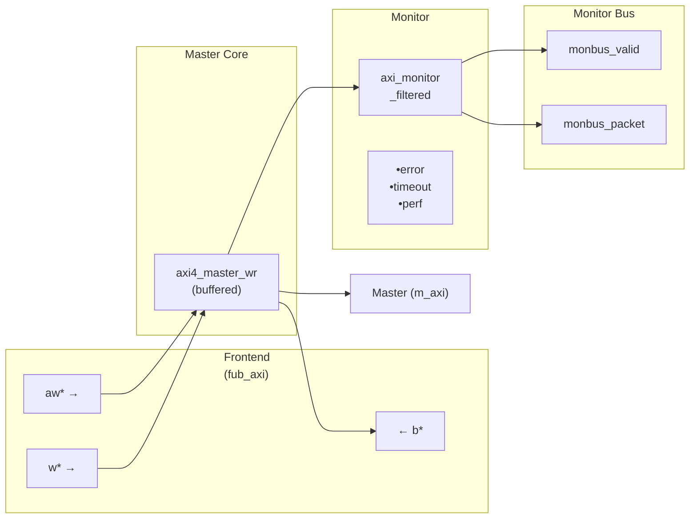
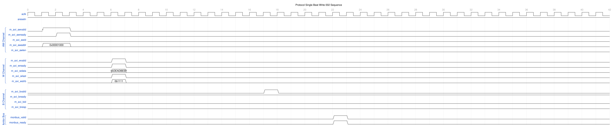

<!-- RTL Design Sherpa Documentation Header -->
<table>
<tr>
<td width="80">
  <a href="https://github.com/sean-galloway/RTLDesignSherpa">
    
  </a>
</td>
<td>
  <strong>RTL Design Sherpa</strong> · <em>Learning Hardware Design Through Practice</em><br>
  <sub>
    <a href="https://github.com/sean-galloway/RTLDesignSherpa">GitHub</a> ·
    <a href="https://github.com/sean-galloway/RTLDesignSherpa/blob/main/docs/DOCUMENTATION_INDEX.md">Documentation Index</a> ·
    <a href="https://github.com/sean-galloway/RTLDesignSherpa/blob/main/LICENSE">MIT License</a>
  </sub>
</td>
</tr>
</table>

---

<!-- End Header -->

# AXI4 Master Write Monitor

**Module:** `axi4_master_wr_mon.sv`
**Location:** `rtl/amba/axi4/` (protocol monitors live with their protocol; only the monitor CORE pieces are in `rtl/amba/monitor/`)
**Status:** ✅ Production Ready

---

## Overview

The AXI4 Master Write Monitor module combines a functional AXI4 master write interface with comprehensive transaction monitoring and filtering capabilities. This module is essential for verification environments, providing real-time protocol checking, error detection, performance metrics, and configurable packet filtering for write transactions.

### Key Features

- ✅ **Integrated Monitoring:** Combines `axi4_master_wr` with `axi_monitor_filtered`
- ✅ **2-Level Filtering: packet-type drop masks + per-event masks (err_select is reserved -- no routing)
- ✅ **Error Detection:** Protocol violations, SLVERR, DECERR, orphan transactions
- ✅ **Timeout Monitoring:** Configurable timeout detection for stuck transactions
- ✅ **Performance Metrics:** Latency tracking, transaction counting, throughput analysis
- ✅ **Monitor Bus Output:** 128-bit packets paired with 64-bit side-band timestamps
- ✅ **Configuration Validation:** Detects conflicting configuration settings
- ✅ **Clock Gating Support:** Busy signal for power management

---

## Module Architecture



The module instantiates two sub-modules:
1. **axi4_master_wr** - Core AXI4 write functionality with buffering
2. **axi_monitor_filtered** - Transaction monitoring with 2-Level Filtering: packet-type drop masks + per-event masks (err_select is reserved -- no routing)

---

## Parameters

### AXI4 Master Parameters

| Parameter | Type | Default | Description |
|-----------|------|---------|-------------|
| `SKID_DEPTH_AW` | int | 2 | AW channel skid buffer depth |
| `SKID_DEPTH_W` | int | 4 | W channel skid buffer depth |
| `SKID_DEPTH_B` | int | 2 | B channel skid buffer depth |
| `AXI_ID_WIDTH` | int | 8 | Transaction ID width |
| `AXI_ADDR_WIDTH` | int | 32 | Address bus width |
| `AXI_DATA_WIDTH` | int | 32 | Data bus width |
| `AXI_USER_WIDTH` | int | 1 | User signal width |

### Monitor Parameters

| Parameter | Type | Default | Description |
|-----------|------|---------|-------------|
| `UNIT_ID` | logic [7:0] | 8'h01 | 8-bit unit identifier in monitor packets |
| `AGENT_ID` | logic [15:0] | 16'h000B | 16-bit agent identifier in monitor packets |
| `MAX_TRANSACTIONS` | int | 16 | Maximum concurrent outstanding transactions |
| ACLK_MHZ | int | 100 | Clock MHz -- keeps the 1 us tick exact |
| CFI_MIN_FREQ_MHZ / CFI_MAX_FREQ_MHZ | int | = ACLK_MHZ | Freq-invariant LUT bounds |
| USE_WDATA_ORDER_Q / NUM_BANKS | int | -- | Ordering queue / banked tables |
| ID_FILTER_ENABLE / ID_MATCH_BASE / ID_MATCH_COUNT | int | 0/-- | Per-instance ID-slice filtering |
| `ACLK_MHZ` | int | 100 | Clock frequency in MHz -- keeps the 1 us tick exact off-100MHz |
| `CFI_MIN_FREQ_MHZ` / `CFI_MAX_FREQ_MHZ` | int | = ACLK_MHZ | Freq-invariant counter LUT bounds (`cfg_freq_sel` indexes within them) |
| `ACTIVE_TRANS_THRESHOLD` | int | MAX_TRANSACTIONS/2 | Active-transaction count that trips a threshold packet when `cfg_threshold_enable=1`. Replaces the former hardwired 8/4; threshold packets now scale with the table sizing |
| `ENABLE_FILTERING` | bit | 1 | Enable packet filtering (0=pass all packets) |
| `ADD_PIPELINE_STAGE` | bit | 0 | Add register stage for timing closure |
| `USE_MONITOR` | bit | 1 | Synthesis-time monitor enable. 0 = omit monitor and tie outputs to safe non-blocking defaults; 1 = full monitor functionality. |
| `N_ADDR_RANGES` | int | 0 | Number of address-range comparators. 0 = checker omitted (zero area). >0 = N independent [low, high] ranges; feeds the shared allowlist checker: a debug-range hit -> AddrMatch, an error-allowlist miss -> Error/ADDR_RANGE (see axi_monitor_addr_check.md). |
| `ADDR_RANGE_IS_ERROR` | logic [N_ADDR_RANGES-1:0] | `'0` | Per-range flavor: bit i = 0 -> DEBUG range (hit -> AddrMatch), 1 -> ERROR range (allowlist miss -> Error/ADDR_RANGE). Default all-0 (feature inert). |

### Synthesis-Cone Parameters

Each detection cone can be compiled out to save area. The classic cones default on; the debug cone defaults off. Setting a bit to 0 drops the corresponding cone at synthesis via a `generate`-if inside `axi_monitor_reporter` — the area saving is real.

| Parameter | Type | Default | Effect when 0 |
|-----------|------|:-------:|---------------|
| `ENABLE_ERROR_LOGIC`     | bit | 1 | Drop the error-detection cone |
| `ENABLE_TIMEOUT_LOGIC`   | bit | 1 | Drop the timeout cone **and** the `axi_monitor_timeout` instance |
| `ENABLE_COMPL_LOGIC`     | bit | 1 | Drop the completion cone |
| `ENABLE_THRESHOLD_LOGIC` | bit | 1 | Drop the threshold cone |
| `ENABLE_PERF_LOGIC`      | bit | 1 | Drop the perfmon window + counters |
| `ENABLE_DEBUG_LOGIC`     | bit | 0 | Drop the debug (trace) cone — the 6th reporter sub-block (off by default) |

Internally the wrapper hardwires two master switches on its `axi_monitor_filtered` instance: `ENABLE_PERF_PACKETS = 1` (perf datapath present, so `ENABLE_PERF_LOGIC` alone gates the window/counters) and `ENABLE_DEBUG_MODULE = 0` (debug tracking module omitted). These are not top-level parameters of the wrapper.

The transaction CAM is always pipelined.

---

## Monitor Backpressure (block_ready)

`block_ready` is exported as the `debug_block_ready` output port -- the wrapper deliberately makes the gating contract observable (the `_mon_cg` wrapper ties it off rather than forwarding it). It goes low when the monitor's transaction-table occupancy reaches its blocking threshold (a function of `MAX_TRANSACTIONS`; the reporter FIFO depth `INTR_FIFO_DEPTH` has no path to it). The wrapper ANDs it into the upstream-facing `fub_axi_awready` so a saturated monitor throttles new transactions at the handshake instead of dropping events.

- **Where the stall lands**: the upstream `fub_axi_awready` is forced low until the monitor drains.
- **When `USE_MONITOR=0`**: `block_ready` is internally tied high, so the wrapper imposes no stall and runs at full bandwidth.
- **When `cfg_monitor_enable=0`**: the wrapper gate forces the upstream ready open, so a runtime-disabled monitor can never stall the datapath (in-RTL formal property `ap_disabled_never_stalls`).

Recovery is guaranteed by the **saturation-recovery contract**: command-originated table entries are capped at `MAX_TRANSACTIONS - cmd_entry_reserve(MAX_TRANSACTIONS)` (reserve = 2 for tables of 16 or more, 0 below; the function lives in `monitor_common_pkg`), and `block_ready` re-asserts at occupancy `< MAX_TRANSACTIONS - (reserve - 1)` -- a threshold strictly ABOVE the command cap -- so a saturated table always drains back below the reopen point. Blocking throttles; it never deadlocks. Tables smaller than 16 keep full legacy allocation (small tables cannot spare slots) and trade the recovery guarantee for tracking capacity. The contract is verified by in-RTL formal properties (mutation-checked) and a 100-seed deliberately-undersized-table stream sweep; see [axi_monitor_base](../monitor/axi_monitor_base.md#flow-control-and-the-saturation-recovery-contract) for the canonical description.

Sizing note: a monitor on a bus shared by several channels/requesters must size `MAX_TRANSACTIONS` to cover `NUM_CHANNELS x per-channel outstanding` plus margin -- the per-channel limit alone makes the monitor throttle the shared master. Tables deeper than 64 also need Verilator's `--unroll-count` raised (default 64) in sim builds.

---

## Address-Range Checker

With `N_ADDR_RANGES > 0` the wrapper instantiates the shared allowlist checker
([`axi_monitor_addr_check`](../monitor/axi_monitor_addr_check.md)). Each range carries a
DEBUG/ERROR flavor:

- **DEBUG range** — a hit emits a `PktTypeAddrMatch` (`4'h8`) packet with event
  code `AXI_ADDR_RANGE_MATCH` (`8'h01`), gated by `cfg_debug_enable`.
- **ERROR range** — the enabled ERROR ranges form an allowlist; an address in
  NONE of them emits a `PktTypeError` (`4'h0`) packet with event code
  `AXI_ERR_ADDR_RANGE` (`8'h0D`), gated by `cfg_error_enable`.

This wrapper exposes **`ADDR_RANGE_IS_ERROR`** (per-range) as a parameter, so ranges can be assigned to either flavor.

**Config inputs (active only when `N_ADDR_RANGES > 0`):**
- `cfg_addr_check_enable` — master on/off for the checker.
- `cfg_addr_range_enable[N-1:0]` — per-range enable bit.
- `cfg_addr_range_low/high[N-1:0][AXI_ADDR_WIDTH-1:0]` — inclusive bounds.

**Event encoding:** `event_data[63:60]` = `range_index` (matching DEBUG range, or
`4'hF` sentinel on an ERROR miss); `event_data[59:0]` = full address. **Filtering:**
AddrMatch is dropped by `cfg_axi_addr_mask[1]`, the ADDR_RANGE error by
`cfg_axi_error_mask[13]`. See the checker page for coalescing + formal properties.

---

## Performance Monitoring

The wrapper hardwires `ENABLE_PERF_PACKETS = 1` on its inner `axi_monitor_filtered`, so the perfmon datapath is present whenever `ENABLE_PERF_LOGIC = 1` (the default). It instantiates a **measurement-window state machine** plus a bank of W-data-channel utilization counters. All counters accumulate **only while a window is open** (`window_active = 1`) and hold their values between windows, so the host can read a completed window's totals.

### The Measurement Window

A window is opened by a **start event** and closed by an **end event**. The event sources are selected by `cfg_start_event_sel` / `cfg_end_event_sel` (3-bit; e.g. `3'b010` selects the `cfg_perf_enable` edge) and can also be fired directly by the `cfg_start_trigger` / `cfg_end_trigger` pulses (from an engine or CSR). `cfg_window_force_close` is a software override that closes the window immediately. While the window is open:

- `window_active` is high.
- `window_cycles[31:0]` free-runs, counting every clock elapsed inside the window.

Sample the counters on the cycle `window_active` falls to 0 (drive `cfg_end_trigger`, or wait for the configured end event).

### Utilization Counters (W Data Channel)

Every cycle inside the window is classified by the W channel's `wvalid` / `wready` into exactly one of four buckets:

| Output | Width | Condition | Meaning |
|--------|:-----:|-----------|---------|
| `perf_prod_cycles`  | 32 | wvalid && wready   | productive beat transferred |
| `perf_bp_cycles`    | 32 | wvalid && !wready  | back-pressure (data offered, sink not ready) |
| `perf_starv_cycles` | 32 | !wvalid && wready  | starvation (sink ready, no data) |
| `perf_idle_cycles`  | 32 | !wvalid && !wready | idle |

The four buckets sum to `window_cycles - 1` (the start cycle seeds window_cycles to 1 while the buckets reset to 0); the one-count skew is negligible for long windows.

### Throughput Counters

| Output | Width | Meaning |
|--------|:-----:|---------|
| `perf_beat_count`  | 32 | W data beats transferred (= `perf_prod_cycles`, 1 beat/cycle) |
| `perf_byte_count`  | 64 | bytes transferred = beats × (1 << AWSIZE), using the AWSIZE captured at the most recent AW address phase (upper bound: counts full-width beats and does not subtract bytes masked off by `WSTRB` on unaligned or partial beats) |
| `perf_burst_count` | 32 | AW address-phase handshakes |

The integrator computes average burst length as `perf_beat_count / perf_burst_count`.

### Performance Monitoring Ports

| Port | Direction | Width | Description |
|------|-----------|:-----:|-------------|
| `cfg_perf_enable`        | Input  | 1  | Enable performance-metric packet generation |
| `cfg_start_event_sel`    | Input  | 3  | Window **start** event source select |
| `cfg_end_event_sel`      | Input  | 3  | Window **end** event source select |
| `cfg_start_trigger`      | Input  | 1  | Pulse: open the measurement window |
| `cfg_end_trigger`        | Input  | 1  | Pulse: close the measurement window |
| `cfg_window_force_close` | Input  | 1  | Software override: force the window closed |
| `window_active`          | Output | 1  | High while a measurement window is open |
| `window_cycles`          | Output | 32 | Cycles elapsed in the current window |
| `perf_prod_cycles`       | Output | 32 | wvalid && wready cycles |
| `perf_bp_cycles`         | Output | 32 | wvalid && !wready cycles (back-pressure) |
| `perf_starv_cycles`      | Output | 32 | !wvalid && wready cycles (starvation) |
| `perf_idle_cycles`       | Output | 32 | !wvalid && !wready cycles |
| `perf_beat_count`        | Output | 32 | W data beats transferred |
| `perf_byte_count`        | Output | 64 | bytes transferred |
| `perf_burst_count`       | Output | 32 | AW address-phase handshakes |

When `USE_MONITOR = 0`, every perfmon output is tied to 0 and the window never opens.

---

## Port Groups

### AXI4 Write Channels

**Frontend Interface (fub_axi_*):**
- AW channel: `awid, awaddr, awlen, awsize, awburst, awlock, awcache, awprot, awqos, awregion, awuser, awvalid, awready`
- W channel: `wdata, wstrb, wlast, wuser, wvalid, wready`
- B channel: `bid, bresp, buser, bvalid, bready`

**Master Interface (m_axi_*):**
- Same signals as frontend, mirrored direction

### Monitor Configuration

Configuration ports are identical to [axi4_master_rd_mon](axi4_master_rd_mon.md):
- Basic enables: `cfg_monitor_enable` (master runtime gate: 0 = monitor inert, CAM held clear, never stalls the datapath), `cfg_error_enable`, `cfg_timeout_enable`, `cfg_perf_enable`, `cfg_compl_enable` (completion packets), `cfg_threshold_enable` (threshold-crossed packets), `cfg_debug_enable` (debug/trace cone — the 6th reporter sub-block)
- Clear: `cam_clear` (Input, 1) - synchronous clear of the monitor transaction CAM (driven from the harness clear control bit, e.g. CTRL[4])
- Thresholds: `cfg_timeout_cycles` (unified coarse timeout, a MICROSECOND count at full 16-bit width: 1..65535 us per phase, 0 = 16'hFFFF ~ effectively never; drives all three phase counts), `cfg_latency_threshold`
- Filtering: 8 mask signals (`cfg_axi_*_mask`: pkt, error, timeout, compl, thresh, perf, addr, debug) plus `cfg_axi_err_select`
- Performance window control: `cfg_start_event_sel`, `cfg_end_event_sel`, `cfg_start_trigger`, `cfg_end_trigger`, `cfg_window_force_close` (see [Performance Monitoring](#performance-monitoring))

> The inner monitor's `cfg_debug_level` (tied to 0), `cfg_debug_mask` (0) are fixed inside the wrapper; `cfg_active_trans_threshold` is driven by the `ACTIVE_TRANS_THRESHOLD` parameter (default MAX_TRANSACTIONS/2), not hardwired to 8, and all three and are **not** top-level ports on this module.

### Monitor Bus Output

| Port | Direction | Width | Description |
|------|-----------|-------|-------------|
| `monbus_valid` | Output | 1 | Monitor packet valid |
| `monbus_ready` | Input | 1 | Downstream ready to accept packet |
| `monbus_packet` | Output | 128 | `monitor_packet_t` (see format below) |
| `monbus_timestamp` | Output | 64 | `monbus_timestamp_t` paired atomically with `monbus_packet` |
| debug_block_ready | 1 | Output | Observability tap for the block_ready gating net (drives nothing internally; leave unconnected if unused) |
| `i_mon_time` | Input | 64 | Free-running counter from `monbus_axil_group`, sampled at packet emission |

### Status Outputs

| Port | Direction | Width | Description |
|------|-----------|-------|-------------|
| `busy` | Output | 1 | Indicates active transactions (for clock gating) |
| `active_transactions` | Output | 8 | Current number of outstanding transactions |
| `error_count` | Output | 16 | Lifetime count of error+timeout packets actually emitted (reporter perf counter; reads 0 when `ENABLE_PERF_LOGIC=0` or `USE_MONITOR=0`) |
| `transaction_count` | Output | 32 | Lifetime count of completion packets actually emitted (zero-extended 16-bit reporter perf counter; reads 0 when `ENABLE_PERF_LOGIC=0` or `USE_MONITOR=0`) |
| `cfg_conflict_error` | Output | 1 | Configuration conflict detected |

---

## Monitor Packet Format

The 128-bit `monbus_packet` (paired with the 64-bit `monbus_timestamp` side-band signal) follows the standardized AMBA monitor bus format. Identical format as [axi4_master_rd_mon](axi4_master_rd_mon.md):

```
Bits [127:124] - Packet Type:
  0x0 = ERROR      Error events (SLVERR, DECERR, protocol violations)
  0x1 = COMPL      Completion events (transaction finished)
  0x2 = THRESH     Threshold events
  0x3 = TIMEOUT    Timeout events
  0x4 = PERF       Performance metrics
  0x8 = ADDR_MATCH Address match events
  0x9 = APB        APB-specific events
  0xF = DEBUG      Debug events
Bits [123:109] - Reserved (15 bits, forward-compat slack)
Bits [108:105] - Protocol (4 bits): 0x0=AXI, 0x1=AXIS, 0x2=APB, 0x3=ARB, 0x4=CORE
Bits [104:97]  - Event Code (8 bits, protocol-specific)
Bits [96:88]   - Channel ID (9 bits — AXI ID or channel index)
Bits [87:72]   - Agent ID (16 bits, from AGENT_ID parameter)
Bits [71:64]   - Unit ID (8 bits, from UNIT_ID parameter)
Bits [63:0]    - Event Data (64 bits — full address, latency, etc.)
```

---

## Timing Diagrams

The following waveforms show AXI4 master write monitor behavior:

### Scenario 1: Single-Beat Write Transaction

Complete AXI4 write transaction showing AW, W, and B channels:


**WaveJSON:** [single_beat_write_001.json](../../assets/WAVES/axi4_master_wr_mon/single_beat_write_001.json)

**Key Observations:**
- AW channel handshake (AWVALID/AWREADY)
- W channel data (WVALID/WREADY/WLAST/WSTRB)
- B channel response (BVALID/BREADY/BRESP)
- Monitor bus packet generation
- Three-channel write protocol coordination

### Scenario 2: Alternative Single-Beat Write

Variant single-beat write with different backpressure pattern:



**WaveJSON:** [single_beat_write_002_001.json](../../assets/WAVES/axi4_master_wr_mon/single_beat_write_002_001.json)

**Key Observations:**
- Different ready signal timing
- Channel interleaving effects
- Write strobe (WSTRB) handling
- Response latency variation
- Monitor packet correlation with transaction ID

---

## Configuration Strategies

### Strategy 1: Functional Verification (Recommended)

**Goal:** Catch write errors and track completion

```systemverilog
// Enable configuration
.cfg_monitor_enable     (1'b1),
.cfg_error_enable       (1'b1),      // Catch SLVERR/DECERR
.cfg_timeout_enable     (1'b1),      // Detect stuck writes
.cfg_perf_enable        (1'b0),      // Disable (reduces traffic)

// Filtering - pass error and timeout only
.cfg_axi_pkt_mask       (16'hFFF6),  // Drop all but ERROR, TIMEOUT
.cfg_axi_error_mask     (16'h0000),  // Pass all errors
.cfg_axi_timeout_mask   (16'h0000),  // Pass all timeouts
.cfg_axi_compl_mask     (16'hFFFF),  // Drop completions
.cfg_axi_perf_mask      (16'hFFFF),  // Drop performance

// Timeouts
.cfg_timeout_cycles     (16'd10),    // 10 microseconds per phase (full 16-bit range)
.cfg_latency_threshold  (32'd500)
```

### Strategy 2: Performance Analysis

**Goal:** Collect write performance metrics

```systemverilog
// Enable configuration
.cfg_monitor_enable     (1'b1),
.cfg_error_enable       (1'b1),      // Still catch errors
.cfg_timeout_enable     (1'b0),      // Disable timeouts
.cfg_perf_enable        (1'b1),      // Enable performance

// Filtering - pass error and performance only
.cfg_axi_pkt_mask       (16'hFFEE),  // Drop all but ERROR, PERF (set bit = drop)
.cfg_axi_error_mask     (16'h0000),  // Pass all errors
.cfg_axi_perf_mask      (16'h0000),  // Pass all performance
.cfg_axi_compl_mask     (16'hFFFF),  // Drop completions
.cfg_axi_timeout_mask   (16'hFFFF)   // Drop timeouts
```

### Strategy 3: Debug Mode

**Goal:** Maximum visibility for write transactions

```systemverilog
// Enable everything
.cfg_monitor_enable     (1'b1),
.cfg_error_enable       (1'b1),
.cfg_timeout_enable     (1'b1),
.cfg_perf_enable        (1'b1),

// Filtering - pass all packets
.cfg_axi_pkt_mask       (16'h0000),  // Pass all
// All individual masks set to 16'h0000
```

**WARNING:** Avoid enabling all packet types in high-throughput write scenarios — the monitor bus sustains at most one packet per two cycles and will congest. (Congestion or runtime-disabled classes can drop packets but, since `95c9490a`, can no longer leak table slots or wedge the bus.)

---

## Usage Example

### Basic Integration

```systemverilog
axi4_master_wr_mon #(
    .SKID_DEPTH_AW      (2),
    .SKID_DEPTH_W       (4),
    .SKID_DEPTH_B       (2),
    .AXI_ID_WIDTH       (4),
    .AXI_ADDR_WIDTH     (32),
    .AXI_DATA_WIDTH     (64),
    .AXI_USER_WIDTH     (1),
    .UNIT_ID            (1),
    .AGENT_ID           (11),
    .MAX_TRANSACTIONS   (16),
    .ENABLE_FILTERING   (1)
) u_master_wr_mon (
    .aclk               (axi_aclk),
    .aresetn            (axi_aresetn),

    // Frontend interface (from write initiator)
    .fub_axi_awid       (write_awid),
    .fub_axi_awaddr     (write_awaddr),
    // ... rest of AW/W/B signals

    // Master interface (to interconnect)
    .m_axi_awid         (m_axi_awid),
    .m_axi_awaddr       (m_axi_awaddr),
    // ... rest of AW/W/B signals

    // Monitor configuration (Strategy 1 - Functional)
    .cfg_monitor_enable     (1'b1),
    .cfg_error_enable       (1'b1),
    .cfg_timeout_enable     (1'b1),
    .cfg_perf_enable        (1'b0),
    .cfg_timeout_cycles     (16'd10),    // 10 microseconds per phase (full 16-bit range)
    .cfg_latency_threshold  (32'd500),

    .cfg_axi_pkt_mask       (16'hFFF6),  // Drop all but ERROR, TIMEOUT
    .cfg_axi_error_mask     (16'h0000),
    .cfg_axi_timeout_mask   (16'h0000),
    .cfg_axi_compl_mask     (16'hFFFF),
    // ... rest of mask signals

    // Monitor bus output
    .monbus_valid           (mon_valid),
    .monbus_ready           (mon_ready),
    .monbus_packet          (mon_packet),

    // Status
    .busy                   (wr_busy),
    .active_transactions    (wr_active),
    .error_count            (wr_errors),
    .transaction_count      (wr_count),
    .cfg_conflict_error     (cfg_conflict)
);
```

---

## Design Notes

### Write-Specific Monitoring

**Write Response Tracking:**
- Monitors AW channel for write address capture
- Tracks W channel beats (WLAST detection)
- Correlates B channel responses with AWID
- Completes write data on WLAST or the expected beat count -- there is NO mismatch event; a short-terminated or over-long burst is not flagged

**Common Write Errors Detected:**
- **SLVERR:** Slave error response (decode failure, access violation)
- **DECERR:** Decode error (address not mapped)
- **Orphan responses:** a B response (BID) arriving with NO matching tracked command -- the detection direction is response-side; an AW that never gets its B surfaces as a TIMEOUT, not an orphan
- **Timeout:** Write address or response stuck beyond threshold
- **Protocol violations:** response-before-data ordering only (WSTRB never reaches the monitor -- no strobe check exists; WLAST is used for completion, not validated)

### Performance Considerations

**Write Transaction Bandwidth:**
- AW channel: 1 transaction/cycle (when buffer not full)
- W channel: 1 beat/cycle sustained (burst pipelining)
- B channel: 1 response/cycle (sparse compared to W beats)

**Monitor Packet Budget (Write):**
- Typical: 2-3 packets per write transaction
- Burst writes: More efficient packet/beat ratio
- Single writes: Higher packet overhead

### Buffer Depth Guidelines

Same as [axi4_master_wr](../axi4/axi4_master_wr.md):
- **SKID_DEPTH_AW:** 2 (default) - sufficient for most systems
- **SKID_DEPTH_W:** 4 (default) - accommodates moderate bursts
- **SKID_DEPTH_B:** 2 (default) - responses are single-beat

Increase depths for high-latency or high-throughput scenarios.

---

## Related Modules

### Companion Monitors
- **[axi4_master_rd_mon](axi4_master_rd_mon.md)** - AXI4 master read with monitoring
- **axi4_slave_rd_mon** - AXI4 slave read with monitoring
- **axi4_slave_wr_mon** - AXI4 slave write with monitoring

### Base Modules
- **[axi4_master_wr](../axi4/axi4_master_wr.md)** - Functional AXI4 master write (without monitoring)
- **axi_monitor_filtered** - Monitoring engine with filtering (monitor/)

### Used Components
- **[gaxi_skid_buffer](../gaxi/gaxi_skid_buffer.md)** - Elastic buffering
- **axi_monitor_base** - Core monitoring logic (monitor/)
- **axi_monitor_trans_mgr** - Transaction tracking (monitor/)

---

## References

### Specifications
- ARM IHI 0022E: AMBA AXI Protocol Specification (AXI4)
- Monitor Bus Packet Format: [monitor_package_spec.md](../includes/monitor_package_spec.md)

### Source Code
- RTL: `rtl/amba/axi4/axi4_master_wr_mon.sv`
- Tests: `val/amba/test_axi4_master_wr_mon.py`
- Framework: `bin/TBClasses/components/axi4/`

### Documentation
- Configuration Guide: [AXI Monitor Base](../monitor/axi_monitor_base.md)
- Architecture: [rtl-amba Overview](../overview.md)
- AXI4 Index: [README.md](../_book_monitor_index.md)

---

**Last Updated:** 2026-07-18

---

## Navigation

- **[← Back to AXI4 Index](../_book_monitor_index.md)**
- **[← Back to rtl-amba Index](../index.md)**
- **[← Back to Main Documentation Index](../../index.md)**
