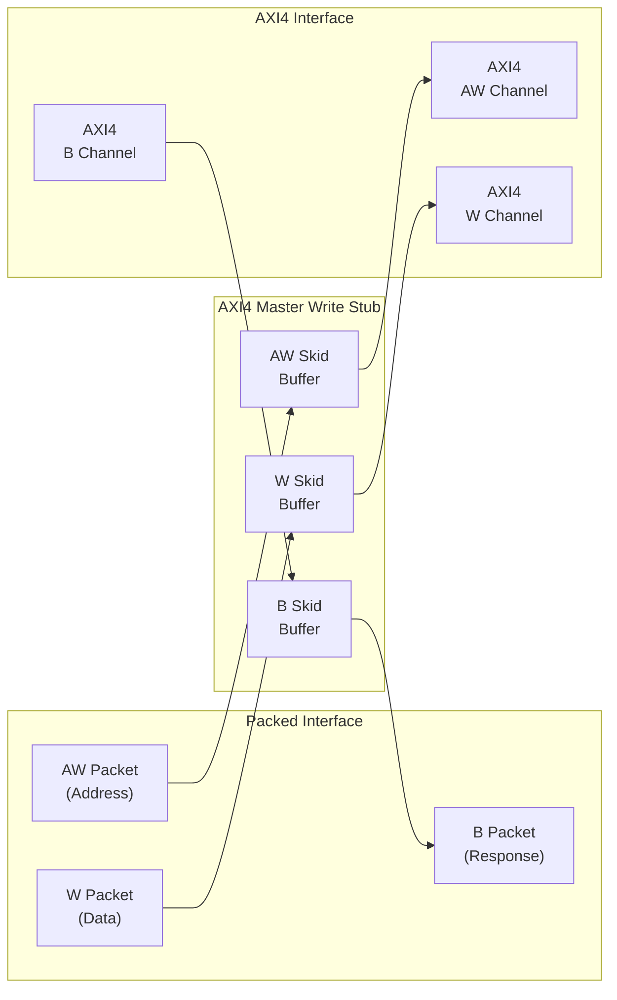
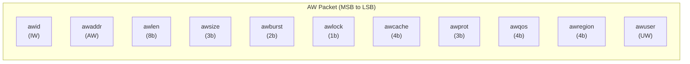
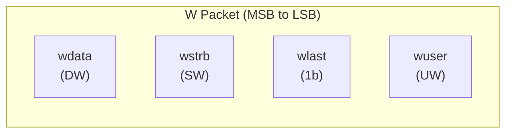
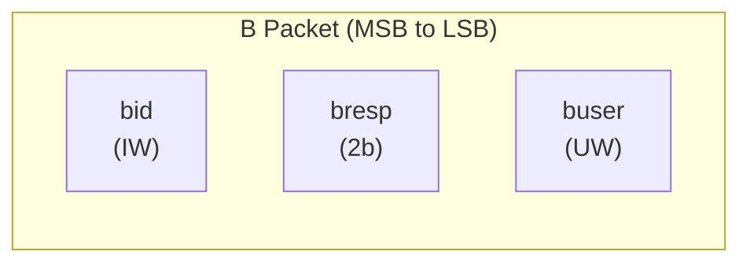
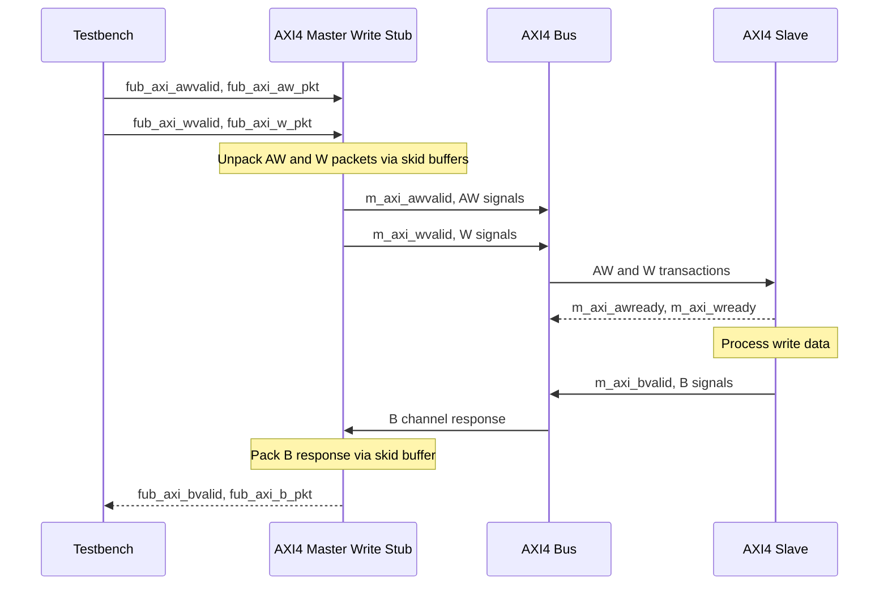

<!-- RTL Design Sherpa Documentation Header -->
<table>
<tr>
<td width="80">
  <a href="https://github.com/sean-galloway/RTLDesignSherpa">
    
  </a>
</td>
<td>
  <strong>RTL Design Sherpa</strong> · <em>Learning Hardware Design Through Practice</em><br>
  <sub>
    <a href="https://github.com/sean-galloway/RTLDesignSherpa">GitHub</a> ·
    <a href="https://github.com/sean-galloway/RTLDesignSherpa/blob/main/docs/DOCUMENTATION_INDEX.md">Documentation Index</a> ·
    <a href="https://github.com/sean-galloway/RTLDesignSherpa/blob/main/LICENSE">MIT License</a>
  </sub>
</td>
</tr>
</table>

---

<!-- End Header -->

# AXI4 Master Write Stub

**Module:** `axi4_master_wr_stub.sv`
**Location:** `rtl/amba/axi4/stubs/`
**Status:** Production Ready

---

## Overview

The write-side counterpart to the read stub. The AXI4 Master Write Stub packs the AW (write address), W (write data), and B (write response) channels into simple packet interfaces through skid buffers, so your testbench drives one wide payload per channel instead of handshaking a dozen AXI signals. Ideal for testbenches and integration scenarios where a simplified interface is the whole point.

### Key Features

- Packed packet interface for AW, W, and B channels
- Configurable skid buffer depth on each channel
- Full AXI4 write transaction support
- Burst, ID, strobe, and user signal support
- Parameterized data widths

---

## Parameters

| Parameter | Type | Default | Description |
|-----------|------|---------|-------------|
| SKID_DEPTH_AW | int | 2 | AW channel skid buffer depth in entries (2..8 inclusive, any integer) |
| SKID_DEPTH_W | int | 4 | W channel skid buffer depth in entries (2..8 inclusive, any integer) |
| SKID_DEPTH_B | int | 2 | B channel skid buffer depth in entries (2..8 inclusive, any integer) |
| AXI_ID_WIDTH | int | 8 | AXI transaction ID width |
| AXI_ADDR_WIDTH | int | 32 | AXI address bus width |
| AXI_DATA_WIDTH | int | 32 | AXI data bus width |
| AXI_USER_WIDTH | int | 1 | AXI user signal width |
| AXI_WSTRB_WIDTH | int | AXI_DATA_WIDTH/8 | Write strobe width |
| AW | int | AXI_ADDR_WIDTH | Short alias for address width |
| DW | int | AXI_DATA_WIDTH | Short alias for data width |
| IW | int | AXI_ID_WIDTH | Short alias for ID width |
| SW | int | AXI_WSTRB_WIDTH | Short alias for strobe width |
| UW | int | AXI_USER_WIDTH | Short alias for user width |
| AWSize | int | IW+AW+8+3+2+1+4+3+4+4+UW | AW packet size (calculated) |
| WSize | int | DW+SW+1+UW | W packet size (calculated) |
| BSize | int | IW+2+UW | B packet size (calculated) |

---

## Ports

### Clock and Reset

| Port | Direction | Width | Description |
|------|-----------|-------|-------------|
| aclk | Input | 1 | AXI clock |
| aresetn | Input | 1 | AXI reset (active low) |

### AXI4 Write Address Channel (AW)

| Port | Direction | Width | Description |
|------|-----------|-------|-------------|
| m_axi_awid | Output | IW | Write address ID |
| m_axi_awaddr | Output | AW | Write address |
| m_axi_awlen | Output | 8 | Burst length |
| m_axi_awsize | Output | 3 | Burst size |
| m_axi_awburst | Output | 2 | Burst type |
| m_axi_awlock | Output | 1 | Lock type |
| m_axi_awcache | Output | 4 | Cache type |
| m_axi_awprot | Output | 3 | Protection type |
| m_axi_awqos | Output | 4 | Quality of service |
| m_axi_awregion | Output | 4 | Region identifier |
| m_axi_awuser | Output | UW | User signal |
| m_axi_awvalid | Output | 1 | Write address valid |
| m_axi_awready | Input | 1 | Write address ready |

### AXI4 Write Data Channel (W)

| Port | Direction | Width | Description |
|------|-----------|-------|-------------|
| m_axi_wdata | Output | DW | Write data |
| m_axi_wstrb | Output | SW | Write strobes |
| m_axi_wlast | Output | 1 | Write last |
| m_axi_wuser | Output | UW | User signal |
| m_axi_wvalid | Output | 1 | Write data valid |
| m_axi_wready | Input | 1 | Write data ready |

### AXI4 Write Response Channel (B)

| Port | Direction | Width | Description |
|------|-----------|-------|-------------|
| m_axi_bid | Input | IW | Response ID |
| m_axi_bresp | Input | 2 | Write response |
| m_axi_buser | Input | UW | User signal |
| m_axi_bvalid | Input | 1 | Write response valid |
| m_axi_bready | Output | 1 | Write response ready |

### AW Packet Interface

| Port | Direction | Width | Description |
|------|-----------|-------|-------------|
| fub_axi_awvalid | Input | 1 | AW packet valid |
| fub_axi_awready | Output | 1 | Ready to accept AW packet |
| fub_axi_aw_count | Output | 4 | AW buffer occupancy |
| fub_axi_aw_pkt | Input | AWSize | Packed AW packet data |

### W Packet Interface

| Port | Direction | Width | Description |
|------|-----------|-------|-------------|
| fub_axi_wvalid | Input | 1 | W packet valid |
| fub_axi_wready | Output | 1 | Ready to accept W packet |
| fub_axi_w_pkt | Input | WSize | Packed W packet data |

### B Packet Interface

| Port | Direction | Width | Description |
|------|-----------|-------|-------------|
| fub_axi_bvalid | Output | 1 | B packet valid |
| fub_axi_bready | Input | 1 | Ready to accept B packet |
| fub_axi_b_pkt | Output | BSize | Packed B packet data |

---

## Functional Description

### Architecture



### Packet Formats

Packets are packed MSB-to-LSB in AXI signal order — one concatenation per channel, no bit shuffling required on the testbench side.

#### AW Packet Structure (Write Address)



**Bit Positions:**
```
fub_axi_aw_pkt = {awid, awaddr, awlen, awsize, awburst, awlock, awcache, awprot, awqos, awregion, awuser}

Width = IW + AW + 8 + 3 + 2 + 1 + 4 + 3 + 4 + 4 + UW
```

#### W Packet Structure (Write Data)



**Bit Positions:**
```
fub_axi_w_pkt = {wdata, wstrb, wlast, wuser}

Width = DW + SW + 1 + UW
```

#### B Packet Structure (Write Response)



**Bit Positions:**
```
fub_axi_b_pkt = {bid, bresp, buser}

Width = IW + 2 + UW
```

### Transaction Flow



---

## Timing Characteristics
<!-- TODO: Add wavedrom timing diagram for stub transactions -->
> **Timing diagram pending.** The signals and sequence this scenario
> exercises:
>
> - aclk
> - fub_axi_awvalid, fub_axi_awready, fub_axi_aw_pkt
> - fub_axi_wvalid, fub_axi_wready, fub_axi_w_pkt
> - AXI AW signals (m_axi_awvalid, m_axi_awaddr, m_axi_awlen, etc.)
> - AXI W signals (m_axi_wvalid, m_axi_wdata, m_axi_wstrb, m_axi_wlast, etc.)
> - AXI B signals (m_axi_bvalid, m_axi_bid, m_axi_bresp, etc.)
> - fub_axi_bvalid, fub_axi_bready, fub_axi_b_pkt
> - Packet-to-AXI timing relationship with skid buffer operation

---

## Usage Examples
```systemverilog
axi4_master_wr_stub #(
    .SKID_DEPTH_AW   (2),
    .SKID_DEPTH_W    (4),
    .SKID_DEPTH_B    (2),
    .AXI_ID_WIDTH    (8),
    .AXI_ADDR_WIDTH  (32),
    .AXI_DATA_WIDTH  (64),
    .AXI_USER_WIDTH  (4)
) u_axi4_master_wr_stub (
    .aclk            (axi_clk),
    .aresetn         (axi_rst_n),

    // AXI4 master write interface
    .m_axi_awid      (m_axi_awid),
    .m_axi_awaddr    (m_axi_awaddr),
    .m_axi_awlen     (m_axi_awlen),
    .m_axi_awsize    (m_axi_awsize),
    .m_axi_awburst   (m_axi_awburst),
    .m_axi_awlock    (m_axi_awlock),
    .m_axi_awcache   (m_axi_awcache),
    .m_axi_awprot    (m_axi_awprot),
    .m_axi_awqos     (m_axi_awqos),
    .m_axi_awregion  (m_axi_awregion),
    .m_axi_awuser    (m_axi_awuser),
    .m_axi_awvalid   (m_axi_awvalid),
    .m_axi_awready   (m_axi_awready),

    .m_axi_wdata     (m_axi_wdata),
    .m_axi_wstrb     (m_axi_wstrb),
    .m_axi_wlast     (m_axi_wlast),
    .m_axi_wuser     (m_axi_wuser),
    .m_axi_wvalid    (m_axi_wvalid),
    .m_axi_wready    (m_axi_wready),

    .m_axi_bid       (m_axi_bid),
    .m_axi_bresp     (m_axi_bresp),
    .m_axi_buser     (m_axi_buser),
    .m_axi_bvalid    (m_axi_bvalid),
    .m_axi_bready    (m_axi_bready),

    // Packed AW interface
    .fub_axi_awvalid (tb_aw_valid),
    .fub_axi_awready (tb_aw_ready),
    .fub_axi_aw_count(tb_aw_count),
    .fub_axi_aw_pkt  (tb_aw_pkt),

    // Packed W interface
    .fub_axi_wvalid  (tb_w_valid),
    .fub_axi_wready  (tb_w_ready),
    .fub_axi_w_pkt   (tb_w_pkt),

    // Packed B interface
    .fub_axi_bvalid  (tb_b_valid),
    .fub_axi_bready  (tb_b_ready),
    .fub_axi_b_pkt   (tb_b_pkt)
);

// Build AW packet (single beat write at address 0x1000)
localparam AWSize = 8 + 32 + 8 + 3 + 2 + 1 + 4 + 3 + 4 + 4 + 4;  // Calculate size
assign tb_aw_pkt = {
    8'd0,           // awid
    32'h0000_1000,  // awaddr
    8'd0,           // awlen (1 beat)
    3'b011,         // awsize (8 bytes)
    2'b01,          // awburst (INCR)
    1'b0,           // awlock
    4'b0011,        // awcache
    3'b000,         // awprot
    4'b0000,        // awqos
    4'b0000,        // awregion
    4'h0            // awuser
};

// Build W packet
localparam WSize = 64 + 8 + 1 + 4;  // Calculate size
assign tb_w_pkt = {
    64'hDEAD_BEEF_CAFE_BABE,  // wdata
    8'hFF,                     // wstrb (all bytes)
    1'b1,                      // wlast
    4'h0                       // wuser
};

// Parse B packet
localparam int BSize = 8 + 2 + 4;   // IW + resp + UW
wire [7:0] b_id   = tb_b_pkt[BSize-1:BSize-8];
wire [1:0] b_resp = tb_b_pkt[5:4];
wire [3:0] b_user = tb_b_pkt[3:0];
```

---

## Design Notes

### Skid Buffer Operation

The stub is three `gaxi_skid_buffer` instances and nothing fancier. They:

- Decouple timing between testbench and AXI bus
- Provide configurable buffering depth per channel
- Handle backpressure gracefully
- Support burst transactions without stalling

**Recommended Depths:**
- **AW Channel:** 2-4 (address transactions)
- **W Channel:** 4-8 (data beats for bursts)
- **B Channel:** 2-4 (responses)

### Channel Independence

The AW, W, and B channels are independent:
- AW and W can be driven in any order
- Stub handles proper AXI timing
- B responses arrive asynchronously

### Packet Packing Order

AW, W, and B packets are packed MSB-to-LSB following AXI signal order:
- Simplifies testbench packet creation
- Matches common concatenation order
- Efficient for burst transaction handling

### Internal Architecture

The stub instantiates three `gaxi_skid_buffer` modules:
- **AW Skid Buffer:** Unpacks AW packets to AXI AW channel
- **W Skid Buffer:** Unpacks W packets to AXI W channel
- **B Skid Buffer:** Packs AXI B channel to B packets

All AXI protocol handling is done by the skid buffers and downstream modules.

---

## Related Modules

- **[AXI4 Master Write](axi4_master_wr.md)** - Full AXI4 master write module (if wrapping one)
- **[AXI4 Master Read Stub](axi4_master_rd_stub.md)** - Corresponding read stub
- **[AXI4 Master Stub](axi4_master_stub.md)** - Combined read/write stub
- **[AXI4 Slave Write Stub](axi4_slave_wr_stub.md)** - Slave-side write stub

---

## Navigation

- **[← Back to AXI4 Index](README.md)**
- **[← Back to rtl-amba Index](../index.md)**
- **[← Back to Main Documentation Index](../../index.md)**
