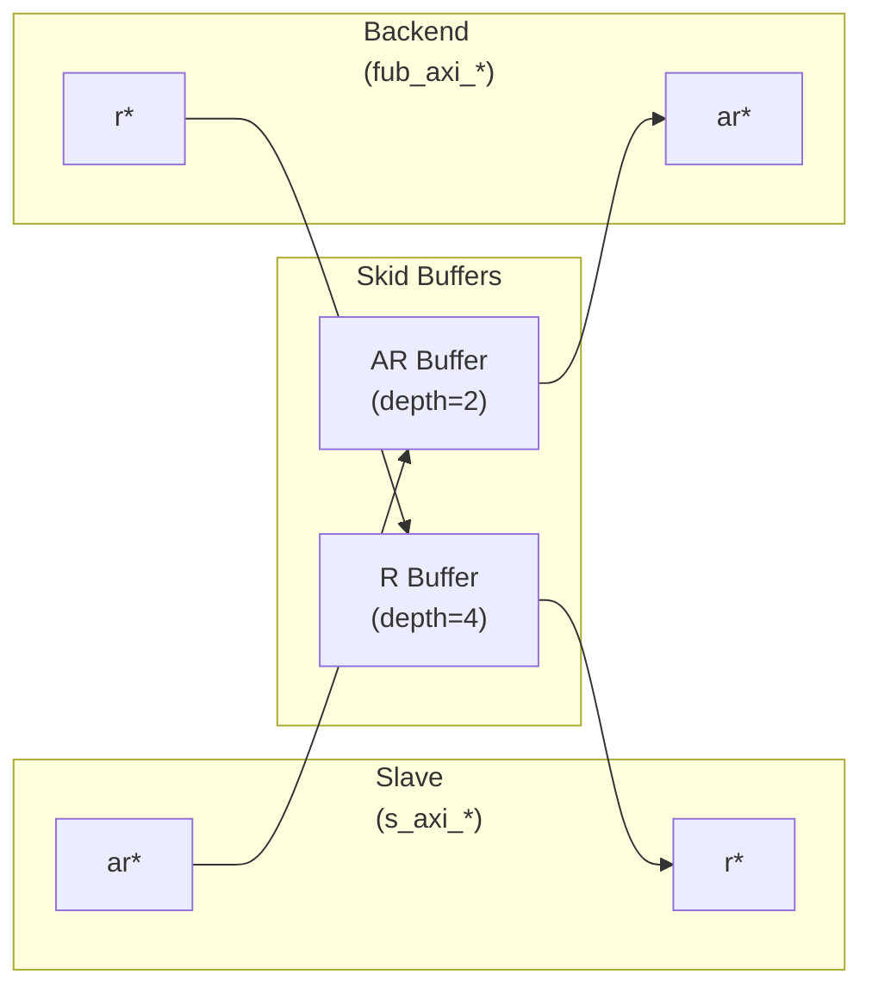

<!-- RTL Design Sherpa Documentation Header -->
<table>
<tr>
<td width="80">
  <a href="https://github.com/sean-galloway/RTLDesignSherpa">
    
  </a>
</td>
<td>
  <strong>RTL Design Sherpa</strong> · <em>Learning Hardware Design Through Practice</em><br>
  <sub>
    <a href="https://github.com/sean-galloway/RTLDesignSherpa">GitHub</a> ·
    <a href="https://github.com/sean-galloway/RTLDesignSherpa/blob/main/docs/DOCUMENTATION_INDEX.md">Documentation Index</a> ·
    <a href="https://github.com/sean-galloway/RTLDesignSherpa/blob/main/LICENSE">MIT License</a>
  </sub>
</td>
</tr>
</table>

---

<!-- End Header -->

# AXI4 Slave Read

**Module:** `axi4_slave_rd.sv`
**Location:** `rtl/amba/axi4/`
**Status:** Production Ready

---

## Overview

The mirror image of the master-side buffers. The AXI4 Slave Read sits between an AXI4 interconnect and your memory or backend processing element, with configurable-depth skid buffers on the AR and R channels. The interconnect can present addresses whenever it likes, the backend can return data whenever it's ready, and neither one stalls the other — that's the entire job, and it's worth doing well.

### Key Features

- **Full AXI4 Read Support:** Complete AR and R channel implementation
- **Independent Channel Buffering:** Separate configurable depth buffers for each channel
- **Elastic Buffering:** Decouples interconnect and backend timing domains
- **Burst Support:** Full burst transaction handling with RLAST tracking
- **User Signal Support:** Carries ARUSER and RUSER signals
- **Clock Gating Support:** Busy signal for dynamic power management

---

## Parameters

| Parameter | Type | Default | Description |
|-----------|------|---------|-------------|
| `SKID_DEPTH_AR` | int | 2 | Depth of read address (AR) channel skid buffer |
| `SKID_DEPTH_R` | int | 4 | Depth of read data (R) channel skid buffer |
| `AXI_ID_WIDTH` | int | 8 | Width of transaction ID signals (ARID, RID) |
| `AXI_ADDR_WIDTH` | int | 32 | Width of address bus (ARADDR) |
| `AXI_DATA_WIDTH` | int | 32 | Width of data bus (RDATA), must be 8, 16, 32, 64, 128, 256, 512, or 1024 |
| `AXI_USER_WIDTH` | int | 1 | Width of user-defined signals (ARUSER, RUSER) |

---

### Derived Parameters (do not override)

These are declared as `parameter` so the elaborator can compute them, not so callers can set them. Each defaults to an expression over the parameters above; overriding one desynchronises it from its source and the design fails to elaborate or silently mis-sizes a bus. Set the parameters they are derived FROM and leave these alone.

| Derived parameter | Default expression |
|---|---|
| `AXI_WSTRB_WIDTH` | `AXI_DATA_WIDTH / 8` |
| `AW` | `AXI_ADDR_WIDTH` |
| `DW` | `AXI_DATA_WIDTH` |
| `IW` | `AXI_ID_WIDTH` |
| `SW` | `AXI_WSTRB_WIDTH` |
| `UW` | `AXI_USER_WIDTH` |
| `ARSize` | `IW+AW+8+3+2+1+4+3+4+4+UW` |
| `RSize` | `IW+DW+2+1+UW` |

## Ports

The full port list, straight from the RTL:

```systemverilog
module axi4_slave_rd #(
    parameter int SKID_DEPTH_AR     = 2,
    parameter int SKID_DEPTH_R      = 4,
    parameter int AXI_ID_WIDTH      = 8,
    parameter int AXI_ADDR_WIDTH    = 32,
    parameter int AXI_DATA_WIDTH    = 32,
    parameter int AXI_USER_WIDTH    = 1
) (
    // Clock and Reset
    input  logic                       aclk,
    input  logic                       aresetn,

    // Slave AXI Interface (s_axi_*)
    // Read address channel (AR)
    input  logic [AXI_ID_WIDTH-1:0]   s_axi_arid,
    input  logic [AXI_ADDR_WIDTH-1:0] s_axi_araddr,
    input  logic [7:0]                 s_axi_arlen,
    input  logic [2:0]                 s_axi_arsize,
    input  logic [1:0]                 s_axi_arburst,
    input  logic                       s_axi_arlock,
    input  logic [3:0]                 s_axi_arcache,
    input  logic [2:0]                 s_axi_arprot,
    input  logic [3:0]                 s_axi_arqos,
    input  logic [3:0]                 s_axi_arregion,
    input  logic [AXI_USER_WIDTH-1:0] s_axi_aruser,
    input  logic                       s_axi_arvalid,
    output logic                       s_axi_arready,

    // Read data channel (R)
    output logic [AXI_ID_WIDTH-1:0]   s_axi_rid,
    output logic [AXI_DATA_WIDTH-1:0] s_axi_rdata,
    output logic [1:0]                 s_axi_rresp,
    output logic                       s_axi_rlast,
    output logic [AXI_USER_WIDTH-1:0] s_axi_ruser,
    output logic                       s_axi_rvalid,
    input  logic                       s_axi_rready,

    // Backend Interface (fub_axi_* - to memory/backend)
    // Read address channel (AR)
    output logic [AXI_ID_WIDTH-1:0]   fub_axi_arid,
    output logic [AXI_ADDR_WIDTH-1:0] fub_axi_araddr,
    output logic [7:0]                 fub_axi_arlen,
    output logic [2:0]                 fub_axi_arsize,
    output logic [1:0]                 fub_axi_arburst,
    output logic                       fub_axi_arlock,
    output logic [3:0]                 fub_axi_arcache,
    output logic [2:0]                 fub_axi_arprot,
    output logic [3:0]                 fub_axi_arqos,
    output logic [3:0]                 fub_axi_arregion,
    output logic [AXI_USER_WIDTH-1:0] fub_axi_aruser,
    output logic                       fub_axi_arvalid,
    input  logic                       fub_axi_arready,

    // Read data channel (R)
    input  logic [AXI_ID_WIDTH-1:0]   fub_axi_rid,
    input  logic [AXI_DATA_WIDTH-1:0] fub_axi_rdata,
    input  logic [1:0]                 fub_axi_rresp,
    input  logic                       fub_axi_rlast,
    input  logic [AXI_USER_WIDTH-1:0] fub_axi_ruser,
    input  logic                       fub_axi_rvalid,
    output logic                       fub_axi_rready,

    // Status
    output logic                       busy
);
```

### Clock and Reset

| Port | Direction | Width | Description |
|------|-----------|-------|-------------|
| `aclk` | Input | 1 | AXI clock - all signals sampled on rising edge |
| `aresetn` | Input | 1 | Active-low asynchronous reset |

### Slave AXI Interface (s_axi_*)

**Read Address Channel (AR)**

| Port | Direction | Width | Description |
|------|-----------|-------|-------------|
| `s_axi_arid` | Input | `AXI_ID_WIDTH` | Read transaction ID |
| `s_axi_araddr` | Input | `AXI_ADDR_WIDTH` | Read address |
| `s_axi_arlen` | Input | 8 | Burst length, AXI-encoded: beats - 1 (`0x00` = 1 beat, `0xFF` = 256) |
| `s_axi_arsize` | Input | 3 | Burst size (bytes per beat) |
| `s_axi_arburst` | Input | 2 | Burst type (FIXED, INCR, WRAP) |
| `s_axi_arlock` | Input | 1 | Lock type (atomic access support) |
| `s_axi_arcache` | Input | 4 | Cache attributes |
| `s_axi_arprot` | Input | 3 | Protection attributes |
| `s_axi_arqos` | Input | 4 | Quality of Service identifier |
| `s_axi_arregion` | Input | 4 | Region identifier |
| `s_axi_aruser` | Input | `AXI_USER_WIDTH` | User-defined signal |
| `s_axi_arvalid` | Input | 1 | Read address valid |
| `s_axi_arready` | Output | 1 | Read address ready |

**Read Data Channel (R)**

| Port | Direction | Width | Description |
|------|-----------|-------|-------------|
| `s_axi_rid` | Output | `AXI_ID_WIDTH` | Read transaction ID |
| `s_axi_rdata` | Output | `AXI_DATA_WIDTH` | Read data |
| `s_axi_rresp` | Output | 2 | Read response (OKAY, EXOKAY, SLVERR, DECERR) |
| `s_axi_rlast` | Output | 1 | Last beat of burst indicator |
| `s_axi_ruser` | Output | `AXI_USER_WIDTH` | User-defined signal |
| `s_axi_rvalid` | Output | 1 | Read data valid |
| `s_axi_rready` | Input | 1 | Read data ready |

### Backend Interface (fub_axi_*)

Mirrors the slave interface but in the opposite direction (output on AR, input on R).

### Status Outputs

| Port | Direction | Width | Description |
|------|-----------|-------|-------------|
| `busy` | Output | 1 | Indicates active transactions in buffers (for clock gating) |

---

## Functional Description

### Architecture

Two independent `gaxi_skid_buffer` instances provide the elastic buffering, one per read channel:



### Channel Operations

#### Read Address (AR) Channel
1. Master presents read address and attributes via interconnect
2. AR skid buffer accepts when space available (`s_axi_arready` high)
3. Buffered address presented to backend when ready
4. Configurable depth (`SKID_DEPTH_AR`) smooths timing variations

#### Read Data (R) Channel
1. Backend returns read data with transaction ID
2. R skid buffer provides deeper buffering (default depth=4)
3. RLAST signal preserved to indicate burst boundaries
4. Data forwarded to master when ready to accept

### Busy Signal

The `busy` output indicates active transactions:
```systemverilog
assign busy = (int_ar_count > 0) || (int_r_count > 0) ||
                s_axi_arvalid || fub_axi_rvalid;
```

Use cases:
- **Clock gating:** Disable clock when `busy` is low
- **Power management:** Enter low-power mode when idle
- **Synchronization:** Wait for idle before configuration changes

---

## Timing Characteristics

| Skid parameter | Default depth |
|---|---|
| `SKID_DEPTH_AR` | 2 entries |
| `SKID_DEPTH_R` | 4 entries |

Each channel traverses one `gaxi_skid_buffer`, which registers both `rd_valid`
and its storage. The **1-cycle input-to-output latency therefore applies on
every transfer, including the unstalled case** -- there is no combinational
bypass. Depth buys backpressure absorption, not throughput; full rate is
sustained once the pipeline is primed. Legal range is 2..8 inclusive, odd
values included.

Clocking: `aclk`, reset `aresetn` (active-low asynchronous).

No synthesis numbers are quoted here. Frequency and area depend on the target
device and the parameters you elaborate with; run your own build.

---

## Usage Examples


Every parameter and port below is read from the module declaration.

```systemverilog
axi4_slave_rd #(
    .SKID_DEPTH_AR         (2),
    .SKID_DEPTH_R          (4),
    .AXI_ID_WIDTH          (8),
    .AXI_ADDR_WIDTH        (32),
    .AXI_DATA_WIDTH        (32),
    .AXI_USER_WIDTH        (1)
) u_axi4_slave_rd (
    .aclk                  (aclk),
    .aresetn               (aresetn),
    .s_axi_arid            (s_axi_arid),
    .s_axi_araddr          (s_axi_araddr),
    .s_axi_arlen           (s_axi_arlen),
    .s_axi_arsize          (s_axi_arsize),
    .s_axi_arburst         (s_axi_arburst),
    .s_axi_arlock          (s_axi_arlock),
    .s_axi_arcache         (s_axi_arcache),
    .s_axi_arprot          (s_axi_arprot),
    .s_axi_arqos           (s_axi_arqos),
    .s_axi_arregion        (s_axi_arregion),
    .s_axi_aruser          (s_axi_aruser),
    .s_axi_arvalid         (s_axi_arvalid),
    .s_axi_arready         (s_axi_arready),
    .s_axi_rid             (s_axi_rid),
    .s_axi_rdata           (s_axi_rdata),
    .s_axi_rresp           (s_axi_rresp),
    .s_axi_rlast           (s_axi_rlast),
    .s_axi_ruser           (s_axi_ruser),
    .s_axi_rvalid          (s_axi_rvalid),
    .s_axi_rready          (s_axi_rready),
    .fub_axi_arid          (fub_axi_arid),
    .fub_axi_araddr        (fub_axi_araddr),
    .fub_axi_arlen         (fub_axi_arlen),
    .fub_axi_arsize        (fub_axi_arsize),
    .fub_axi_arburst       (fub_axi_arburst),
    .fub_axi_arlock        (fub_axi_arlock),
    .fub_axi_arcache       (fub_axi_arcache),
    .fub_axi_arprot        (fub_axi_arprot),
    .fub_axi_arqos         (fub_axi_arqos),
    .fub_axi_arregion      (fub_axi_arregion),
    .fub_axi_aruser        (fub_axi_aruser),
    .fub_axi_arvalid       (fub_axi_arvalid),
    .fub_axi_arready       (fub_axi_arready),
    .fub_axi_rid           (fub_axi_rid),
    .fub_axi_rdata         (fub_axi_rdata),
    .fub_axi_rresp         (fub_axi_rresp),
    .fub_axi_rlast         (fub_axi_rlast),
    .fub_axi_ruser         (fub_axi_ruser),
    .fub_axi_rvalid        (fub_axi_rvalid),
    .fub_axi_rready        (fub_axi_rready),
    .busy                  (busy)
);
```

## Design Notes

### Buffer Depth Selection

`SKID_DEPTH_*` is an entry count, not a log2 exponent. The underlying
`gaxi_skid_buffer` allocates one register slot per entry and tracks occupancy
with a 4-bit counter, so legal values are 2..8 inclusive (any integer). Values greater than 8
overflow the occupancy counter and are not supported.

**Read Address (SKID_DEPTH_AR):**
- Default: 2 (sufficient for most cases)
- Increase if:
  - High-latency backend address processing
  - Frequent address channel backpressure
  - Multiple outstanding bursts needed

**Read Data (SKID_DEPTH_R):**
- Default: 4 (deeper than AR for burst data)
- Increase if:
  - Large burst sizes (ARLEN > 4)
  - High-bandwidth streaming reads
  - Variable backend read latency

### Recommended Configurations

**Low-Latency Memory (single outstanding read):**
```systemverilog
axi4_slave_rd #(
    .SKID_DEPTH_AR(2),
    .SKID_DEPTH_R(2)
) u_slave_rd ( ... );
```

**High-Throughput Streaming (burst reads):**
```systemverilog
axi4_slave_rd #(
    .SKID_DEPTH_AR(4),
    .SKID_DEPTH_R(8)     // Deep for burst data
) u_slave_rd ( ... );
```

**Variable Latency Backend:**
```systemverilog
axi4_slave_rd #(
    .SKID_DEPTH_AR(8),
    .SKID_DEPTH_R(8)
) u_slave_rd ( ... );
```

### Buffer Independence

The two skid buffers operate independently:
- AR channel can accept new addresses while R channel returns data
- Burst reads can pipeline - next burst starts before previous completes
- Backend can have variable read latency without stalling interconnect

### Packet Preservation

All signal groups packed and unpacked atomically:
- AR channel: `{arid, araddr, arlen, arsize, arburst, arlock, arcache, arprot, arqos, arregion, aruser}`
- R channel: `{rid, rdata, rresp, rlast, ruser}`

### Backpressure Handling

Ready signals propagate backpressure:
- Interconnect sees `arready` low when AR buffer full
- Backend sees `rready` low when R buffer full
- Prevents data loss while decoupling timing

### ID and Burst Handling

This module is a pass-through buffer:
- Does NOT track transaction IDs
- Does NOT enforce burst ordering
- Relies on backend to:
  - Match RID to ARID
  - Return correct number of beats (ARLEN+1)
  - Assert RLAST on final beat

### Reset Behavior

On `aresetn` assertion (active-low):
- All skid buffers flush
- Valid signals deasserted
- Busy signal goes low
- No data retained across reset

---

## Related Modules

### Companion Modules
- **axi4_slave_wr** - AXI4 slave write with buffering
- **axi4_slave_rd_cg** - Clock-gated variant with additional CG logic
- **axi4_slave_rd_mon** - Read transaction monitor for verification

### Used Components
- **[gaxi_skid_buffer](../gaxi/gaxi_skid_buffer.md)** - Elastic buffer with valid/ready handshake
- **[clock_gate_ctrl](../../rtl-common/clock_gate_ctrl.md)** - Clock gating control (example)

### Related Infrastructure
- **[axi4_master_rd](axi4_master_rd.md)** - Corresponding AXI4 read master module
- **axi4_interconnect** - Multi-master/multi-slave crossbar

---

## Testing

`val/amba/test_axi4_slave_rd.py` exercises this module. It collects 8 parameter cases at the default `REG_LEVEL`.

```bash
source env_python
pytest val/amba/test_axi4_slave_rd.py -v
```

---

## References

### Specifications
- ARM IHI 0022E: AMBA AXI Protocol Specification (AXI4)

### Source Code
- RTL: `rtl/amba/axi4/axi4_slave_rd.sv`
- Tests: `val/amba/test_axi4_slave_rd.py`
- Framework: `bin/TBClasses/components/axi4/`

### Documentation
- Architecture: [rtl-amba Overview](../overview.md)
- AXI4 Index: [axi4/README.md](README.md)
- GAXI Buffers: [gaxi/README.md](../gaxi/README.md)

---

**Last Updated:** 2025-10-20

---

## Navigation

- **[← Back to AXI4 Index](README.md)**
- **[← Back to rtl-amba Index](../index.md)**
- **[← Back to Main Documentation Index](../../index.md)**
