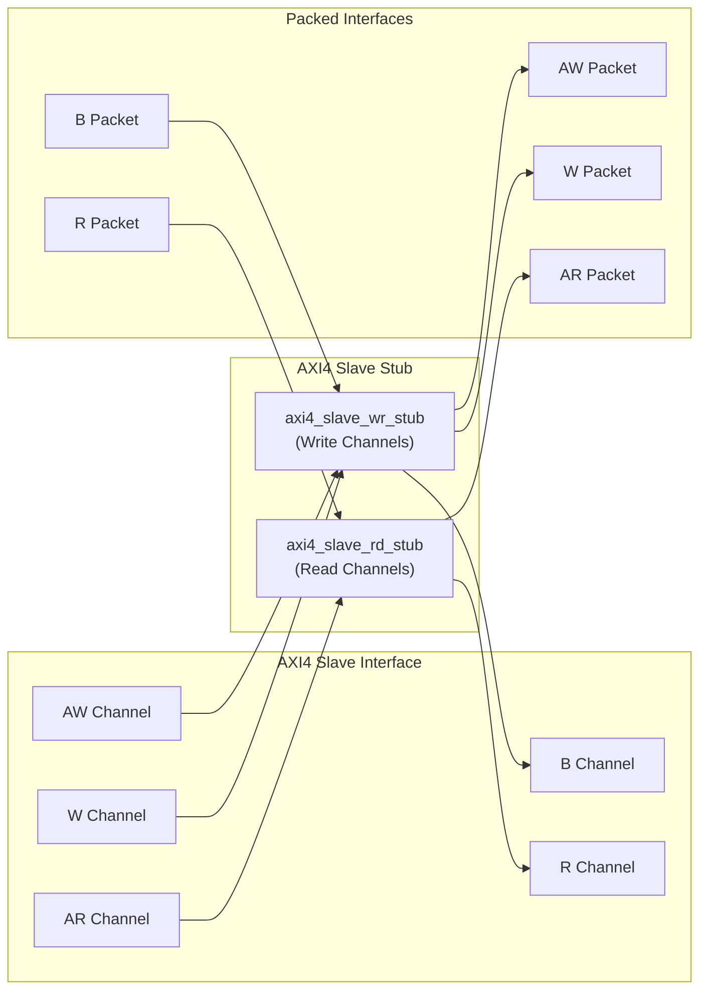
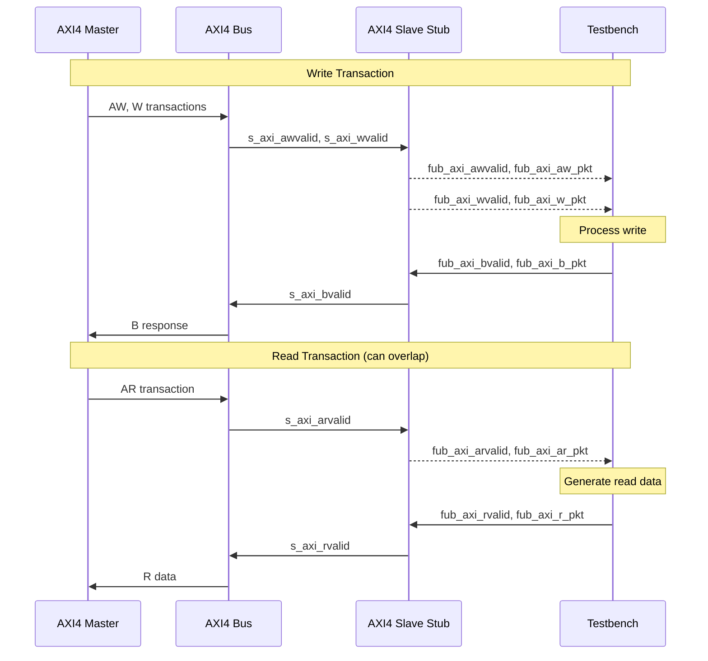

<!-- RTL Design Sherpa Documentation Header -->
<table>
<tr>
<td width="80">
  <a href="https://github.com/sean-galloway/RTLDesignSherpa">
    
  </a>
</td>
<td>
  <strong>RTL Design Sherpa</strong> · <em>Learning Hardware Design Through Practice</em><br>
  <sub>
    <a href="https://github.com/sean-galloway/RTLDesignSherpa">GitHub</a> ·
    <a href="https://github.com/sean-galloway/RTLDesignSherpa/blob/main/docs/DOCUMENTATION_INDEX.md">Documentation Index</a> ·
    <a href="https://github.com/sean-galloway/RTLDesignSherpa/blob/main/LICENSE">MIT License</a>
  </sub>
</td>
</tr>
</table>

---

<!-- End Header -->

# AXI4 Slave Stub

**Module:** `axi4_slave_stub.sv`
**Location:** `rtl/amba/axi4/stubs/`
**Status:** Production Ready

---

## Overview

The AXI4 Slave Stub gives you a simplified packed-data interface for receiving both AXI4 read and write transactions from a master. It rolls the read and write slave stubs into one module -- internally it just instantiates `axi4_slave_rd_stub` and `axi4_slave_wr_stub` -- so you get a complete AXI4 slave interface with packet-based control and none of the protocol boilerplate. For testbenches and integration scenarios, this is the one I'd reach for first.

### Key Features

- Combined read and write channel support
- Packed packet interfaces for all channels (AW, W, B, AR, R)
- Configurable skid buffer depths per channel
- Full AXI4 protocol support (bursts, IDs, user signals)
- Simplified testbench integration
- Parameterized data widths

---

## Parameters

| Parameter | Type | Default | Description |
|-----------|------|---------|-------------|
| `SKID_DEPTH_AW` | int | 2 | AW channel skid buffer depth in entries (2..8 inclusive, any integer) |
| `SKID_DEPTH_W` | int | 4 | W channel skid buffer depth in entries (2..8 inclusive, any integer) |
| `SKID_DEPTH_B` | int | 2 | B channel skid buffer depth in entries (2..8 inclusive, any integer) |
| `SKID_DEPTH_AR` | int | 2 | AR channel skid buffer depth in entries (2..8 inclusive, any integer) |
| `SKID_DEPTH_R` | int | 4 | R channel skid buffer depth in entries (2..8 inclusive, any integer) |
| `AXI_ID_WIDTH` | int | 8 | AXI transaction ID width |
| `AXI_ADDR_WIDTH` | int | 32 | AXI address bus width |
| `AXI_DATA_WIDTH` | int | 32 | AXI data bus width |
| `AXI_USER_WIDTH` | int | 1 | AXI user signal width |
| `AXI_WSTRB_WIDTH` | int | AXI_DATA_WIDTH/8 | Write strobe width |
| `AW` | int | AXI_ADDR_WIDTH | Short alias for address width |
| `DW` | int | AXI_DATA_WIDTH | Short alias for data width |
| `IW` | int | AXI_ID_WIDTH | Short alias for ID width |
| `SW` | int | AXI_WSTRB_WIDTH | Short alias for strobe width |
| `UW` | int | AXI_USER_WIDTH | Short alias for user width |
| `AWSize` | int | IW+AW+8+3+2+1+4+3+4+4+UW | AW packet size (calculated) |
| `WSize` | int | DW+SW+1+UW | W packet size (calculated) |
| `BSize` | int | IW+2+UW | B packet size (calculated) |
| `ARSize` | int | IW+AW+8+3+2+1+4+3+4+4+UW | AR packet size (calculated) |
| `RSize` | int | IW+DW+2+1+UW | R packet size (calculated) |

---

## Ports

### Clock and Reset

| Port | Direction | Width | Description |
|------|-----------|-------|-------------|
| `aclk` | Input | 1 | AXI clock |
| `aresetn` | Input | 1 | AXI reset (active low) |

### AXI4 Write Channels

| Port | Direction | Width | Description |
|------|-----------|-------|-------------|
| `s_axi_awid` | Input | AXI_ID_WIDTH | Write address ID |
| `s_axi_awaddr` | Input | AXI_ADDR_WIDTH | Write address |
| `s_axi_awlen` | Input | 8 | Burst length |
| `s_axi_awsize` | Input | 3 | Burst size |
| `s_axi_awburst` | Input | 2 | Burst type |
| `s_axi_awlock` | Input | 1 | Lock type |
| `s_axi_awcache` | Input | 4 | Cache type |
| `s_axi_awprot` | Input | 3 | Protection type |
| `s_axi_awqos` | Input | 4 | Quality of service |
| `s_axi_awregion` | Input | 4 | Region identifier |
| `s_axi_awuser` | Input | AXI_USER_WIDTH | User signal |
| `s_axi_awvalid` | Input | 1 | Write address valid |
| `s_axi_awready` | Output | 1 | Write address ready |
| `s_axi_wdata` | Input | AXI_DATA_WIDTH | Write data |
| `s_axi_wstrb` | Input | AXI_WSTRB_WIDTH | Write strobes |
| `s_axi_wlast` | Input | 1 | Write last |
| `s_axi_wuser` | Input | AXI_USER_WIDTH | User signal |
| `s_axi_wvalid` | Input | 1 | Write data valid |
| `s_axi_wready` | Output | 1 | Write data ready |
| `s_axi_bid` | Output | AXI_ID_WIDTH | Response ID |
| `s_axi_bresp` | Output | 2 | Write response |
| `s_axi_buser` | Output | AXI_USER_WIDTH | User signal |
| `s_axi_bvalid` | Output | 1 | Write response valid |
| `s_axi_bready` | Input | 1 | Write response ready |

### AXI4 Read Channels

| Port | Direction | Width | Description |
|------|-----------|-------|-------------|
| `s_axi_arid` | Input | AXI_ID_WIDTH | Read address ID |
| `s_axi_araddr` | Input | AXI_ADDR_WIDTH | Read address |
| `s_axi_arlen` | Input | 8 | Burst length |
| `s_axi_arsize` | Input | 3 | Burst size |
| `s_axi_arburst` | Input | 2 | Burst type |
| `s_axi_arlock` | Input | 1 | Lock type |
| `s_axi_arcache` | Input | 4 | Cache type |
| `s_axi_arprot` | Input | 3 | Protection type |
| `s_axi_arqos` | Input | 4 | Quality of service |
| `s_axi_arregion` | Input | 4 | Region identifier |
| `s_axi_aruser` | Input | AXI_USER_WIDTH | User signal |
| `s_axi_arvalid` | Input | 1 | Read address valid |
| `s_axi_arready` | Output | 1 | Read address ready |
| `s_axi_rid` | Output | AXI_ID_WIDTH | Read data ID |
| `s_axi_rdata` | Output | AXI_DATA_WIDTH | Read data |
| `s_axi_rresp` | Output | 2 | Read response |
| `s_axi_rlast` | Output | 1 | Read last |
| `s_axi_ruser` | Output | AXI_USER_WIDTH | User signal |
| `s_axi_rvalid` | Output | 1 | Read data valid |
| `s_axi_rready` | Input | 1 | Read data ready |

### Write Packet Interfaces

| Port | Direction | Width | Description |
|------|-----------|-------|-------------|
| `fub_axi_awvalid` | Output | 1 | AW packet valid |
| `fub_axi_awready` | Input | 1 | Ready to accept AW packet |
| `fub_axi_aw_count` | Output | 4 | AW buffer occupancy |
| `fub_axi_aw_pkt` | Output | AWSize | Packed AW packet data |
| `fub_axi_wvalid` | Output | 1 | W packet valid |
| `fub_axi_wready` | Input | 1 | Ready to accept W packet |
| `fub_axi_w_pkt` | Output | WSize | Packed W packet data |
| `fub_axi_bvalid` | Input | 1 | B packet valid |
| `fub_axi_bready` | Output | 1 | Ready to accept B packet |
| `fub_axi_b_pkt` | Input | BSize | Packed B packet data |

### Read Packet Interfaces

| Port | Direction | Width | Description |
|------|-----------|-------|-------------|
| `fub_axi_arvalid` | Output | 1 | AR packet valid |
| `fub_axi_arready` | Input | 1 | Ready to accept AR packet |
| `fub_axi_ar_count` | Output | 4 | AR buffer occupancy |
| `fub_axi_ar_pkt` | Output | ARSize | Packed AR packet data |
| `fub_axi_rvalid` | Input | 1 | R packet valid |
| `fub_axi_rready` | Output | 1 | Ready to accept R packet |
| `fub_axi_r_pkt` | Input | RSize | Packed R packet data |

---

## Functional Description

### Architecture

The combined stub is a thin wrapper -- the channel-specific stubs do the real work, and the packed packet interfaces are what your testbench talks to:



### Packet Formats

**AW Packet (Write Address):**
```
fub_axi_aw_pkt = {awid, awaddr, awlen, awsize, awburst, awlock, awcache, awprot, awqos, awregion, awuser}
Width = IW + AW + 8 + 3 + 2 + 1 + 4 + 3 + 4 + 4 + UW
```

**W Packet (Write Data):**
```
fub_axi_w_pkt = {wdata, wstrb, wlast, wuser}
Width = DW + SW + 1 + UW
```

**B Packet (Write Response):**
```
fub_axi_b_pkt = {bid, bresp, buser}
Width = IW + 2 + UW
```

**AR Packet (Read Address):**
```
fub_axi_ar_pkt = {arid, araddr, arlen, arsize, arburst, arlock, arcache, arprot, arqos, arregion, aruser}
Width = IW + AW + 8 + 3 + 2 + 1 + 4 + 3 + 4 + 4 + UW
```

**R Packet (Read Data):**
```
fub_axi_r_pkt = {rid, rdata, rresp, rlast, ruser}
Width = IW + DW + 2 + 1 + UW
```

**Complete packet format details:** See [AXI4 Slave Write Stub](axi4_slave_wr_stub.md) and [AXI4 Slave Read Stub](axi4_slave_rd_stub.md)

### Transaction Flow

Reads and writes move through the stub at the same time without getting in each other's way -- here's what that looks like:



---

## Timing Characteristics
<!-- TODO: Add wavedrom timing diagram for combined stub -->
> **Timing diagram pending.** The signals and sequence this scenario
> exercises:
>
> - aclk
> - AXI write channels (s_axi_aw*, s_axi_w*, s_axi_b*)
> - Write packet interfaces (fub_axi_aw*, fub_axi_w*, fub_axi_b*)
> - AXI read channels (s_axi_ar*, s_axi_r*)
> - Read packet interfaces (fub_axi_ar*, fub_axi_r*)
> - Overlapping read/write operations

---

## Usage Examples
Wire it up, then parse and build packets in the testbench. The bit-slice localparams have to match your instance widths -- get those wrong and you'll spend an afternoon chasing misaligned IDs. Don't ask how I know.

```systemverilog
axi4_slave_stub #(
    .SKID_DEPTH_AW   (2),
    .SKID_DEPTH_W    (4),
    .SKID_DEPTH_B    (2),
    .SKID_DEPTH_AR   (2),
    .SKID_DEPTH_R    (4),
    .AXI_ID_WIDTH    (8),
    .AXI_ADDR_WIDTH  (32),
    .AXI_DATA_WIDTH  (64),
    .AXI_USER_WIDTH  (4)
) u_axi4_slave_stub (
    .aclk            (axi_clk),
    .aresetn         (axi_rst_n),

    // AXI4 slave interface (all channels)
    .s_axi_awid      (s_axi_awid),
    .s_axi_awaddr    (s_axi_awaddr),
    .s_axi_awlen     (s_axi_awlen),
    .s_axi_awsize    (s_axi_awsize),
    .s_axi_awburst   (s_axi_awburst),
    .s_axi_awlock    (s_axi_awlock),
    .s_axi_awcache   (s_axi_awcache),
    .s_axi_awprot    (s_axi_awprot),
    .s_axi_awqos     (s_axi_awqos),
    .s_axi_awregion  (s_axi_awregion),
    .s_axi_awuser    (s_axi_awuser),
    .s_axi_awvalid   (s_axi_awvalid),
    .s_axi_awready   (s_axi_awready),

    .s_axi_wdata     (s_axi_wdata),
    .s_axi_wstrb     (s_axi_wstrb),
    .s_axi_wlast     (s_axi_wlast),
    .s_axi_wuser     (s_axi_wuser),
    .s_axi_wvalid    (s_axi_wvalid),
    .s_axi_wready    (s_axi_wready),

    .s_axi_bid       (s_axi_bid),
    .s_axi_bresp     (s_axi_bresp),
    .s_axi_buser     (s_axi_buser),
    .s_axi_bvalid    (s_axi_bvalid),
    .s_axi_bready    (s_axi_bready),

    .s_axi_arid      (s_axi_arid),
    .s_axi_araddr    (s_axi_araddr),
    .s_axi_arlen     (s_axi_arlen),
    .s_axi_arsize    (s_axi_arsize),
    .s_axi_arburst   (s_axi_arburst),
    .s_axi_arlock    (s_axi_arlock),
    .s_axi_arcache   (s_axi_arcache),
    .s_axi_arprot    (s_axi_arprot),
    .s_axi_arqos     (s_axi_arqos),
    .s_axi_arregion  (s_axi_arregion),
    .s_axi_aruser    (s_axi_aruser),
    .s_axi_arvalid   (s_axi_arvalid),
    .s_axi_arready   (s_axi_arready),

    .s_axi_rid       (s_axi_rid),
    .s_axi_rdata     (s_axi_rdata),
    .s_axi_rresp     (s_axi_rresp),
    .s_axi_rlast     (s_axi_rlast),
    .s_axi_ruser     (s_axi_ruser),
    .s_axi_rvalid    (s_axi_rvalid),
    .s_axi_rready    (s_axi_rready),

    // Write packet interfaces
    .fub_axi_awvalid (tb_aw_valid),
    .fub_axi_awready (tb_aw_ready),
    .fub_axi_aw_count(tb_aw_count),
    .fub_axi_aw_pkt  (tb_aw_pkt),

    .fub_axi_wvalid  (tb_w_valid),
    .fub_axi_wready  (tb_w_ready),
    .fub_axi_w_pkt   (tb_w_pkt),

    .fub_axi_bvalid  (tb_b_valid),
    .fub_axi_bready  (tb_b_ready),
    .fub_axi_b_pkt   (tb_b_pkt),

    // Read packet interfaces
    .fub_axi_arvalid (tb_ar_valid),
    .fub_axi_arready (tb_ar_ready),
    .fub_axi_ar_count(tb_ar_count),
    .fub_axi_ar_pkt  (tb_ar_pkt),

    .fub_axi_rvalid  (tb_r_valid),
    .fub_axi_rready  (tb_r_ready),
    .fub_axi_r_pkt   (tb_r_pkt)
);

// Parse incoming write address
localparam int AWSize = 8+32+8+3+2+1+4+3+4+4+4;  // match your instance widths
wire [7:0]  aw_id     = tb_aw_pkt[AWSize-1:AWSize-8];
wire [31:0] aw_addr   = tb_aw_pkt[AWSize-9:AWSize-40];
wire [7:0]  aw_len    = tb_aw_pkt[AWSize-41:AWSize-48];
// ... additional fields

// Parse incoming write data
localparam int WSize = 64+8+1+4;  // match your instance widths
wire [63:0] w_data = tb_w_pkt[WSize-1:WSize-64];
wire [7:0]  w_strb = tb_w_pkt[WSize-65:WSize-72];
wire        w_last = tb_w_pkt[WSize-73];

// Generate write response (OKAY)
assign tb_b_pkt = {
    aw_id,    // bid (match request ID)
    2'b00,    // bresp (OKAY)
    4'h0      // buser
};

// Parse incoming read address
localparam int ARSize = 8+32+8+3+2+1+4+3+4+4+4;  // match your instance widths
wire [7:0]  ar_id   = tb_ar_pkt[ARSize-1:ARSize-8];
wire [31:0] ar_addr = tb_ar_pkt[ARSize-9:ARSize-40];
wire [7:0]  ar_len  = tb_ar_pkt[ARSize-41:ARSize-48];
// ... additional fields

// Generate read data response
reg [63:0] read_data;  // From memory model
assign tb_r_pkt = {
    ar_id,      // rid (match request ID)
    read_data,  // rdata
    2'b00,      // rresp (OKAY)
    1'b1,       // rlast (single beat example)
    4'h0        // ruser
};
```

---

## Design Notes

### Internal Architecture

The stub instantiates two sub-modules:
- **`axi4_slave_wr_stub`** - Handles AW, W, and B channels
- **`axi4_slave_rd_stub`** - Handles AR and R channels

That hierarchy buys you a few things: it reuses the proven read/write stub modules, keeps the channel separation clean, simplifies verification and testing, and lets reads and writes operate independently.

### Read/Write Independence

Read and write channels are completely independent:
- Can overlap in time (simultaneous read and write)
- Each has independent skid buffers
- No ordering constraints between reads and writes
- Testbench can respond at different rates

### Skid Buffer Depths

**Recommended configurations:**

**Low latency (fast response):**
```systemverilog
.SKID_DEPTH_AW(2), .SKID_DEPTH_W(2), .SKID_DEPTH_B(2),
.SKID_DEPTH_AR(2), .SKID_DEPTH_R(2)
```

**Typical system:**
```systemverilog
.SKID_DEPTH_AW(2), .SKID_DEPTH_W(4), .SKID_DEPTH_B(2),
.SKID_DEPTH_AR(2), .SKID_DEPTH_R(4)
```

**High throughput bursts:**
```systemverilog
.SKID_DEPTH_AW(4), .SKID_DEPTH_W(8), .SKID_DEPTH_B(4),
.SKID_DEPTH_AR(4), .SKID_DEPTH_R(8)
```

### Memory Model Integration

The slave stub pairs naturally with a memory model -- capture addresses and data on the write side, serve reads out of the array on the other:

```systemverilog
// Simple memory model
reg [63:0] memory [0:1023];

// Handle write requests
always @(posedge aclk) begin
    if (tb_aw_valid && tb_aw_ready) begin
        // Capture write address
    end
    if (tb_w_valid && tb_w_ready) begin
        // Write data to memory
        memory[write_addr] <= w_data;
    end
end

// Handle read requests
always @(posedge aclk) begin
    if (tb_ar_valid && tb_ar_ready) begin
        // Generate read data from memory
        read_data <= memory[ar_addr];
    end
end
```

---

## Related Modules

- **[AXI4 Slave Read Stub](axi4_slave_rd_stub.md)** - Read-only stub (instantiated internally)
- **[AXI4 Slave Write Stub](axi4_slave_wr_stub.md)** - Write-only stub (instantiated internally)
- **[AXI4 Master Stub](axi4_master_stub.md)** - Corresponding combined master stub
- **[AXI4 Slave Read](axi4_slave_rd.md)** - Full AXI4 slave read module
- **[AXI4 Slave Write](axi4_slave_wr.md)** - Full AXI4 slave write module

---

## Testing

**No dedicated testbench, and none is expected.** This is a stub: a tie-off
shell that presents the interface and drives inert values, so there is no
behaviour to verify beyond elaboration. `make verilator` lints it as its own
top on every run, which is the coverage that applies.

Treat any behaviour described on this page as unverified by simulation.

---

## Navigation

- **[<- Back to AXI4 Index](README.md)**
- **[<- Back to rtl-amba Index](../index.md)**
- **[<- Back to Main Documentation Index](../../index.md)**
