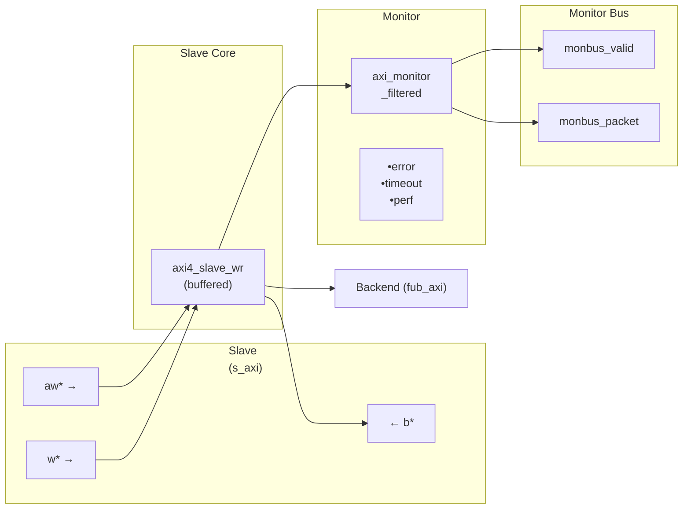

<!-- RTL Design Sherpa Documentation Header -->
<table>
<tr>
<td width="80">
  <a href="https://github.com/sean-galloway/RTLDesignSherpa">
    
  </a>
</td>
<td>
  <strong>RTL Design Sherpa</strong> · <em>Learning Hardware Design Through Practice</em><br>
  <sub>
    <a href="https://github.com/sean-galloway/RTLDesignSherpa">GitHub</a> ·
    <a href="https://github.com/sean-galloway/RTLDesignSherpa/blob/main/docs/DOCUMENTATION_INDEX.md">Documentation Index</a> ·
    <a href="https://github.com/sean-galloway/RTLDesignSherpa/blob/main/LICENSE">MIT License</a>
  </sub>
</td>
</tr>
</table>

---

<!-- End Header -->

# AXI4 Slave Write Monitor

**Module:** `axi4_slave_wr_mon.sv`
**Location:** `rtl/amba/axi4/` (protocol monitors live with their protocol; only the monitor CORE pieces are in `rtl/amba/monitor/`)
**Status:** Production Ready

---

## Overview

The AXI4 Slave Write Monitor bolts a full transaction monitor onto a working AXI4 slave write interface. You get the buffered slave from `axi4_slave_wr` plus real-time protocol checking, error detection, performance metrics, and configurable packet filtering on slave-side write transactions -- everything a verification environment needs to know what the bus actually did, not just what it was supposed to do.

### Key Features

- **Integrated Monitoring:** Combines `axi4_slave_wr` with `axi_monitor_filtered`
- **2-Level Filtering:** Packet-type drop masks, individual event masking
- **Error Detection:** Protocol violations, SLVERR, DECERR, orphan transactions
- **Timeout Monitoring:** Configurable timeout detection for stuck transactions
- **Performance Metrics:** Latency tracking, transaction counting, throughput analysis
- **Monitor Bus Output:** 128-bit packets paired with 64-bit side-band timestamps
- **Configuration Validation:** Detects conflicting configuration settings
- **Clock Gating Support:** Busy signal for power management

---

## Parameters

### AXI4 Slave Parameters

| Parameter | Type | Default | Description |
|-----------|------|---------|-------------|
| `SKID_DEPTH_AW` | int | 2 | AW channel skid buffer depth |
| `SKID_DEPTH_W` | int | 4 | W channel skid buffer depth |
| `SKID_DEPTH_B` | int | 2 | B channel skid buffer depth |
| `AXI_ID_WIDTH` | int | 8 | Transaction ID width |
| `AXI_ADDR_WIDTH` | int | 32 | Address bus width |
| `AXI_DATA_WIDTH` | int | 32 | Data bus width |
| `AXI_WSTRB_WIDTH` | int | AXI_DATA_WIDTH/8 | Write strobe width (transport only -- the monitor does not inspect strobes) |
| `AXI_USER_WIDTH` | int | 1 | User signal width |

### Monitor Parameters

| Parameter | Type | Default | Description |
|-----------|------|---------|-------------|
| `UNIT_ID` | logic [7:0] | 8'h02 | 8-bit unit identifier in monitor packets |
| `AGENT_ID` | logic [15:0] | 16'h0015 | 16-bit agent identifier in monitor packets |
| `MAX_TRANSACTIONS` | int | 16 | Maximum concurrent outstanding transactions |
| `ACLK_MHZ` | int | 100 | Clock frequency in MHz -- keeps the 1 us tick exact off-100MHz |
| `USE_WDATA_ORDER_Q` | bit | 0 | Write-data ordering queue |
| `NUM_BANKS` | int | 1 | Banked transaction tables. **>1 on a WRITE monitor requires `USE_WDATA_ORDER_Q=1`** -- `axi_monitor_trans_mgr` fails elaboration otherwise |
| ID_FILTER_ENABLE | bit | 0 | Synthesises the per-instance ID-slice filter |
| ID_MATCH_BASE | int | 0 | First ID this instance owns |
| ID_MATCH_COUNT | int | 0 | How many; `0` means ALL, so a zeroed register block does not silently filter everything away |
| `CFI_MIN_FREQ_MHZ` / `CFI_MAX_FREQ_MHZ` | int | = ACLK_MHZ | Freq-invariant counter LUT bounds (`cfg_freq_sel` indexes within them) |
| `ACTIVE_TRANS_THRESHOLD` | int | MAX_TRANSACTIONS/2 | Active-transaction count that trips a threshold packet when `cfg_threshold_enable=1`. Replaces the former hardwired 8/4; threshold packets now scale with the table sizing |
| `ENABLE_FILTERING` | bit | 1 | Enable packet filtering: two active drop levels (packet type, then event code). Level 2 is reserved and routes nothing |
| `ADD_PIPELINE_STAGE` | bit | 0 | Add register stage for timing closure |
| `USE_MONITOR` | bit | 1 | Synthesis-time monitor enable. 0 = omit monitor and tie outputs to safe non-blocking defaults; 1 = full monitor functionality. |
| `N_ADDR_RANGES` | int | 0 | Number of address-range comparators. 0 = checker omitted (zero area). >0 = N independent [low, high] ranges; feeds the shared allowlist checker: a debug-range hit -> AddrMatch, an error-allowlist miss -> Error/ADDR_RANGE (see axi_monitor_addr_check.md). |
| `ADDR_RANGE_IS_ERROR` | logic [N_ADDR_RANGES-1:0] | `'0` | Per-range flavor: bit i = 0 -> DEBUG range (hit -> AddrMatch), 1 -> ERROR range (allowlist miss -> Error/ADDR_RANGE). Default all-0 (feature inert). |

### Synthesis-Cone Parameters

Each detection cone can be compiled out to save area. The classic cones default on; the debug cone defaults off. Setting a bit to 0 drops the corresponding cone at synthesis via a `generate`-if inside `axi_monitor_reporter` -- the area saving is real.

| Parameter | Type | Default | Effect when 0 |
|-----------|------|:-------:|---------------|
| `ENABLE_ERROR_LOGIC`     | bit | 1 | Drop the error-detection cone |
| `ENABLE_TIMEOUT_LOGIC`   | bit | 1 | Drop the timeout cone **and** the `axi_monitor_timeout` instance |
| `ENABLE_COMPL_LOGIC`     | bit | 1 | Drop the completion cone |
| `ENABLE_THRESHOLD_LOGIC` | bit | 1 | Drop the threshold cone |
| `ENABLE_PERF_LOGIC`      | bit | 1 | Gates only the reporter's legacy perf-packet cone and the two lifetime counters -- the window FSM and meters are unconditional |
| `ENABLE_DEBUG_LOGIC`     | bit | 0 | Drop the debug (trace) cone -- the 6th reporter sub-block (off by default) |

Internally the wrapper hardwires two master switches on its `axi_monitor_filtered` instance: `ENABLE_PERF_PACKETS = 1` (the reporter's legacy perf cone is built; `ENABLE_PERF_LOGIC` gates THAT cone only, never the measurement window) and `ENABLE_DEBUG_MODULE = 0` (debug tracking module omitted). These are not top-level parameters of the wrapper.

The transaction CAM is always pipelined.

---

## Ports

### AXI4 Write Channels

**Slave Interface (s_axi_*):**
- AW channel: `awid, awaddr, awlen, awsize, awburst, awlock, awcache, awprot, awqos, awregion, awuser, awvalid, awready`
- W channel: `wdata, wstrb, wlast, wuser, wvalid, wready`
- B channel: `bid, bresp, buser, bvalid, bready`

**Backend Interface (fub_axi_*):**
- Same signals as slave, mirrored direction (to memory/backend)

### Monitor Configuration

Configuration ports are identical to other AXI4 monitors:
- Basic enables: `cfg_monitor_enable` (master runtime gate: 0 = monitor inert, CAM held clear, never stalls the datapath), `cfg_error_enable`, `cfg_timeout_enable`, `cfg_perf_enable`, `cfg_compl_enable` (completion packets), `cfg_threshold_enable` (threshold-crossed packets), `cfg_debug_enable` (debug/trace cone -- the 6th reporter sub-block)
- Clear: `cam_clear` (Input, 1) - synchronous clear of the monitor transaction CAM (driven from the harness clear control bit, e.g. CTRL[4])
- Thresholds: `cfg_timeout_cycles` (unified coarse timeout, a MICROSECOND count at full 16-bit width: 1..65535 us per phase, 0 = 16'hFFFF ~ effectively never; drives all three phase counts), `cfg_latency_threshold`
- Filtering: 8 mask signals (`cfg_axi_*_mask`: pkt, error, timeout, compl, thresh, perf, addr, debug) plus `cfg_axi_err_select`
- Performance window control: `cfg_start_event_sel`, `cfg_end_event_sel`, `cfg_start_trigger`, `cfg_end_trigger`, `cfg_window_force_close` (see [Performance Monitoring](#performance-monitoring))

> The inner monitor's `cfg_debug_level` (tied to 0), `cfg_debug_mask` (0) are fixed inside the wrapper; `cfg_active_trans_threshold` is driven by the `ACTIVE_TRANS_THRESHOLD` parameter (default MAX_TRANSACTIONS/2), not hardwired to 8, and all three are **not** top-level ports on this module.

### Monitor Bus Output

| Port | Direction | Width | Description |
|------|-----------|-------|-------------|
| `monbus_valid` | Output | 1 | Monitor packet valid |
| `monbus_ready` | Input | 1 | Downstream ready to accept packet |
| `monbus_packet` | Output | 128 | `monitor_packet_t` (see format below) |
| `monbus_timestamp` | Output | 64 | `monbus_timestamp_t` paired atomically with `monbus_packet` |
| `debug_block_ready` | Output | 1 | Observability tap for the block_ready gating net (drives nothing internally; leave unconnected if unused) |
| `i_mon_time` | Input | 64 | Free-running counter from `monbus_group_core`, sampled at packet emission |

### Status Outputs

| Port | Direction | Width | Description |
|------|-----------|-------|-------------|
| `busy` | Output | 1 | Indicates active transactions (for clock gating) |
| `active_transactions` | Output | 8 | Current number of outstanding transactions |
| `error_count` | Output | 16 | Lifetime count of error+timeout packets actually emitted (reporter perf counter; reads 0 when `ENABLE_PERF_LOGIC=0` or `USE_MONITOR=0`) |
| `transaction_count` | Output | 32 | Lifetime count of completion packets actually emitted (zero-extended 16-bit reporter perf counter; reads 0 when `ENABLE_PERF_LOGIC=0` or `USE_MONITOR=0`) |
| `cfg_conflict_error` | Output | 1 | Configuration conflict detected |

---

### Packet filters

Two independent runtime filters cut monbus traffic without touching the
datapath. Both are inert until driven, which is the failure to watch for: the
build-time parameter only decides whether the logic is SYNTHESISED, and a
design that sets the parameter but leaves the `cfg_*` ports tied low filters
nothing and looks like the feature is broken.

**Address-range filter** — `ADDR_FILTER_ENABLE` (bit, default 0) builds it.

| Port | Width | Description |
|---|---|---|
| `cfg_addr_filter_enable` | 1 | High: suppress packets for transactions outside the window. Low: inert, whatever the parameter says |
| `cfg_addr_filter_low` | `ADDR_WIDTH` | Window base, inclusive |
| `cfg_addr_filter_high` | `ADDR_WIDTH` | Window limit, inclusive |

The verdict is latched per table entry at ALLOCATION, from the command
address, and held for that entry's life. Widening the window mid-flight does
not un-filter entries already admitted — which is exactly what makes it safe
to reprogram live, since an entry's fate is decided when it is admitted and
the retire accounting cannot be corrupted afterwards. Contrast the
address-range CHECKER (`N_ADDR_RANGES`), which re-evaluates per command.

**Runtime ID filter** — overrides the `ID_MATCH_BASE`/`ID_MATCH_COUNT`
elaboration constants so an instance can be retargeted at a different master
without a rebuild.

| Port | Width | Description |
|---|---|---|
| `cfg_id_filter_enable` | 1 | High: use the window below. Low: use the parameters, bit-identical to a build without this feature |
| `cfg_id_match_base` | `ID_WIDTH` | First ID owned |
| `cfg_id_match_count` | `ID_WIDTH+1` | How many; `0` means ALL, matching the parameter rule so a zeroed register block does not silently filter everything away |

The window is half-open: `[base, base + count)`.

## Functional Description

### Architecture



The module instantiates two sub-modules:
1. **axi4_slave_wr** - Core AXI4 slave write functionality with buffering
2. **axi_monitor_filtered** - Transaction monitoring with 2-Level Filtering: packet-type drop masks + per-event masks (err_select is reserved -- no routing)

### Monitor Backpressure (block_ready)

`block_ready` is exported as the `debug_block_ready` output port -- the wrapper deliberately makes the gating contract observable (the `_mon_cg` wrapper ties it off rather than forwarding it). It goes low when the monitor's transaction-table occupancy reaches its blocking threshold (a function of `MAX_TRANSACTIONS`; the reporter FIFO depth `INTR_FIFO_DEPTH` has no path to it). The wrapper ANDs it into the upstream-facing `s_axi_awready` so a saturated monitor throttles new transactions at the handshake instead of dropping events.

- **Where the stall lands**: the upstream `s_axi_awready` is forced low until the monitor drains.
- **When `USE_MONITOR=0`**: `block_ready` is internally tied high, so the wrapper imposes no stall and runs at full bandwidth.
- **When `cfg_monitor_enable=0`**: the wrapper gate forces the upstream ready open, so a runtime-disabled monitor can never stall the datapath (in-RTL formal property `ap_disabled_never_stalls`).

Recovery is guaranteed by the **saturation-recovery contract**: command-originated table entries are capped at `MAX_TRANSACTIONS - cmd_entry_reserve(MAX_TRANSACTIONS)` (reserve = 4 for tables of 16 or more, 0 below; the function lives in `monitor_common_pkg`), and `block_ready` re-asserts at occupancy `< MAX_TRANSACTIONS - (reserve - 1)` -- a threshold strictly ABOVE the command cap -- so a saturated table always drains back below the reopen point. Blocking throttles; it never deadlocks. Tables smaller than 16 keep full legacy allocation (small tables cannot spare slots) and trade the recovery guarantee for tracking capacity. The contract is verified by in-RTL formal properties (mutation-checked) and a 100-seed deliberately-undersized-table stream sweep; see [axi_monitor_base](../monitor/axi_monitor_base.md#flow-control-and-the-saturation-recovery-contract) for the canonical description.

Sizing note: a monitor on a bus shared by several channels/requesters must size `MAX_TRANSACTIONS` to cover `NUM_CHANNELS x per-channel outstanding` plus margin -- the per-channel limit alone makes the monitor throttle the shared master. Tables deeper than 64 also need Verilator's `--unroll-count` raised (default 64) in sim builds.

### Address-Range Checker

With `N_ADDR_RANGES > 0` the wrapper instantiates the shared allowlist checker
([`axi_monitor_addr_check`](../monitor/axi_monitor_addr_check.md)). Each range carries a
DEBUG/ERROR flavor:

- **DEBUG range** -- a hit emits a `PktTypeAddrMatch` (`4'h8`) packet with event
  code `AXI_ADDR_RANGE_MATCH` (`8'h01`), gated by `cfg_debug_enable`.
- **ERROR range** -- the enabled ERROR ranges form an allowlist; an address in
  NONE of them emits a `PktTypeError` (`4'h0`) packet with event code
  `AXI_ERR_ADDR_RANGE` (`8'h0D`), gated by `cfg_error_enable`.

This wrapper exposes **`ADDR_RANGE_IS_ERROR`** (per-range) as a parameter, so ranges can be assigned to either flavor.

**Config inputs (active only when `N_ADDR_RANGES > 0`):**
- `cfg_addr_check_enable` -- master on/off for the checker.
- `cfg_addr_range_enable[N-1:0]` -- per-range enable bit.
- `cfg_addr_range_low/high[N-1:0][AXI_ADDR_WIDTH-1:0]` -- inclusive bounds.

**Event encoding:** `event_data[63:60]` = `range_index` (matching DEBUG range, or
`4'hF` sentinel on an ERROR miss); `event_data[59:0]` = full address. **Filtering:**
AddrMatch is dropped by `cfg_axi_addr_mask[1]`, the ADDR_RANGE error by
`cfg_axi_error_mask[13]`. See the checker page for coalescing + formal properties.

### Performance Monitoring

The wrapper hardwires `ENABLE_PERF_PACKETS = 1` on its inner `axi_monitor_filtered`. The **measurement-window state machine** and its counters are unconditional `always_ff` blocks in `axi_monitor_base` -- outside every generate -- so they are present and running in EVERY build, including `ENABLE_PERF_LOGIC = 0`. That parameter reaches one consumer: the `g_perf` generate in `axi_monitor_reporter` holding the legacy perf-packet cone and the two 16-bit lifetime counters behind `perf_completed_count` / `perf_error_count`. Setting it to 0 saves that cone and nothing else. `USE_MONITOR = 0` is what ties the perfmon outputs off. The wrapper instantiates plus a bank of W-data-channel utilization counters. All counters accumulate **only while a window is open** (`window_active = 1`) and hold their values between windows, so the host can read a completed window's totals.

#### The Measurement Window

A window is opened by a **start event** and closed by an **end event**. The event sources are selected by `cfg_start_event_sel` / `cfg_end_event_sel` (3-bit; e.g. `3'b010` selects the `cfg_perf_enable` edge) and can also be fired directly by the `cfg_start_trigger` / `cfg_end_trigger` pulses (from an engine or CSR). `cfg_window_force_close` is a software override that closes the window immediately. While the window is open:

- `window_active` is high.
- `window_cycles[31:0]` free-runs, counting every clock elapsed inside the window.

Sample the counters on the cycle `window_active` falls to 0 (drive `cfg_end_trigger`, or wait for the configured end event).

#### Utilization Counters (W Data Channel)

Every cycle inside the window is classified by the W channel's `wvalid` / `wready` into exactly one of four buckets:

| Output | Width | Condition | Meaning |
|--------|:-----:|-----------|---------|
| `perf_prod_cycles`  | 32 | wvalid && wready   | productive beat transferred |
| `perf_bp_cycles`    | 32 | wvalid && !wready  | back-pressure (data offered, sink not ready) |
| `perf_starv_cycles` | 32 | !wvalid && wready  | starvation (sink ready, no data) |
| `perf_idle_cycles`  | 32 | !wvalid && !wready | idle |

The four buckets sum to `window_cycles - 1` (the start cycle seeds window_cycles to 1 while the buckets reset to 0); the one-count skew is negligible for long windows.

#### Throughput Counters

| Output | Width | Meaning |
|--------|:-----:|---------|
| `perf_beat_count`  | 32 | W data beats transferred (= `perf_prod_cycles`, 1 beat/cycle) |
| `perf_byte_count`  | 64 | bytes transferred = beats x (1 << AWSIZE), using the AWSIZE captured at the most recent AW address phase (upper bound: counts full-width beats and does not subtract bytes masked off by `WSTRB` on unaligned or partial beats) |
| `perf_burst_count` | 32 | AW address-phase handshakes |

The integrator computes average burst length as `perf_beat_count / perf_burst_count`.

#### Performance Monitoring Ports

| Port | Direction | Width | Description |
|------|-----------|:-----:|-------------|
| `cfg_perf_enable`        | Input  | 1  | Enable performance-metric packet generation |
| `cfg_start_event_sel`    | Input  | 3  | Window **start** event source select |
| `cfg_end_event_sel`      | Input  | 3  | Window **end** event source select |
| `cfg_start_trigger`      | Input  | 1  | Pulse: open the measurement window |
| `cfg_end_trigger`        | Input  | 1  | Pulse: close the measurement window |
| `cfg_window_force_close` | Input  | 1  | Software override: force the window closed |
| `window_active`          | Output | 1  | High while a measurement window is open |
| `window_cycles`          | Output | 32 | Cycles elapsed in the current window |
| `perf_prod_cycles`       | Output | 32 | wvalid && wready cycles |
| `perf_bp_cycles`         | Output | 32 | wvalid && !wready cycles (back-pressure) |
| `perf_starv_cycles`      | Output | 32 | !wvalid && wready cycles (starvation) |
| `perf_idle_cycles`       | Output | 32 | !wvalid && !wready cycles |
| `perf_beat_count`        | Output | 32 | W data beats transferred |
| `perf_byte_count`        | Output | 64 | bytes transferred |
| `perf_burst_count`       | Output | 32 | AW address-phase handshakes |

When `USE_MONITOR = 0`, every perfmon output is tied to 0 and the window never opens.

### Monitor Packet Format

Identical 128-bit format (with 64-bit side-band timestamp) as other AXI4 monitors. See [axi4_master_rd_mon](axi4_master_rd_mon.md) for complete specification.

---

## Waveforms

The following waveforms show AXI4 slave write monitor behavior from the slave perspective:

### Scenario 1: Single-Beat Write (Slave View)

AXI4 write transaction from slave interface perspective:


**WaveJSON:** [single_beat_write_001.json](../../assets/WAVES/axi4_slave_wr_mon/single_beat_write_001.json)

**Key Observations:**
- Slave-side AW channel (s_axi_aw*)
- Slave-side W channel data (s_axi_w*)
- Slave-side B channel response (s_axi_b*)
- Monitor packet generation from slave perspective
- Slave BRESP status monitoring
- Transaction tracking in slave context

### Scenario 2: Alternative Single-Beat Write (Slave View)

Variant write transaction with different timing from slave:


**WaveJSON:** [single_beat_write_002_001.json](../../assets/WAVES/axi4_slave_wr_mon/single_beat_write_002_001.json)

**Key Observations:**
- Slave ready signal behavior
- AWREADY backpressure effects
- WREADY flow control
- BVALID generation timing
- Slave latency monitoring
- Error detection from slave side

---

## Usage Example

### Basic Integration with Memory

```systemverilog
axi4_slave_wr_mon #(
    .SKID_DEPTH_AW      (2),
    .SKID_DEPTH_W       (4),
    .SKID_DEPTH_B       (2),
    .AXI_ID_WIDTH       (4),
    .AXI_ADDR_WIDTH     (32),
    .AXI_DATA_WIDTH     (64),
    .AXI_USER_WIDTH     (1),
    .UNIT_ID            (2),
    .AGENT_ID           (21),
    .MAX_TRANSACTIONS   (16),
    .ENABLE_FILTERING   (1)
) u_slave_wr_mon (
    .aclk               (axi_aclk),
    .aresetn            (axi_aresetn),

    // Slave interface (from interconnect)
    .s_axi_awid         (s_axi_awid),
    .s_axi_awaddr       (s_axi_awaddr),
    // ... rest of AW/W/B signals

    // Backend interface (to memory controller)
    .fub_axi_awid       (mem_awid),
    .fub_axi_awaddr     (mem_awaddr),
    // ... rest of AW/W/B signals

    // Monitor configuration
    .cfg_monitor_enable     (1'b1),
    .cfg_error_enable       (1'b1),
    .cfg_timeout_enable     (1'b1),
    .cfg_perf_enable        (1'b0),
    .cfg_timeout_cycles     (16'd15),    // 15 microseconds per phase (full 16-bit range)
    .cfg_latency_threshold  (32'd1000),

    .cfg_axi_pkt_mask       (16'hFFF6),  // Drop all but ERROR, TIMEOUT
    .cfg_axi_error_mask     (16'h0000),
    .cfg_axi_timeout_mask   (16'h0000),
    .cfg_axi_compl_mask     (16'hFFFF),
    // ... rest of mask signals

    // Monitor bus output
    .monbus_valid           (mon_valid),
    .monbus_ready           (mon_ready),
    .monbus_packet          (mon_packet),

    // Status
    .busy                   (wr_slave_busy),
    .active_transactions    (wr_active),
    .error_count            (wr_errors),
    .transaction_count      (wr_count),
    .cfg_conflict_error     (cfg_conflict)
);

// Memory controller backend
memory_controller u_mem (
    .axi_aclk       (axi_aclk),
    .axi_aresetn    (axi_aresetn),
    // Connect to fub_axi_* signals
    .axi_awid       (mem_awid),
    .axi_awaddr     (mem_awaddr),
    // ...
);
```

---

## Design Notes

### Configuration Strategies

#### Strategy 1: Functional Verification (Recommended)

**Goal:** Catch slave-side write errors

```systemverilog
// Enable configuration
.cfg_monitor_enable     (1'b1),
.cfg_error_enable       (1'b1),      // Detect SLVERR/DECERR from backend
.cfg_timeout_enable     (1'b1),      // Detect backend timeouts
.cfg_perf_enable        (1'b0),      // Disable (reduces traffic)

// Filtering - pass error and timeout only
.cfg_axi_pkt_mask       (16'hFFF6),  // Drop all but ERROR, TIMEOUT
.cfg_axi_error_mask     (16'h0000),  // Pass all errors
.cfg_axi_timeout_mask   (16'h0000),  // Pass all timeouts
.cfg_axi_compl_mask     (16'hFFFF),  // Drop completions
.cfg_axi_perf_mask      (16'hFFFF),  // Drop performance

// Timeouts
.cfg_timeout_cycles     (16'd15),    // 15 microseconds per phase: allow backend write latency
.cfg_latency_threshold  (32'd1000)
```

#### Strategy 2: Performance Analysis

**Goal:** Analyze slave write performance

```systemverilog
// Enable configuration
.cfg_monitor_enable     (1'b1),
.cfg_error_enable       (1'b1),
.cfg_timeout_enable     (1'b0),
.cfg_perf_enable        (1'b1),      // Enable performance metrics

// Filtering - pass error and performance only
.cfg_axi_pkt_mask       (16'hFFEE),  // Drop all but ERROR, PERF (set bit = drop)
.cfg_axi_error_mask     (16'h0000),  // Pass all errors
.cfg_axi_perf_mask      (16'h0000),  // Pass all performance
.cfg_axi_compl_mask     (16'hFFFF),  // Drop completions
```

### Slave-Side Monitoring

**Key Differences from Master Monitors:**
- Monitors from slave perspective (interconnect to backend)
- Tracks backend write response latency
- Detects backend timeout scenarios
- Default UNIT_ID=2, AGENT_ID=21 (distinguishes from master)

**Slave Write Sequence:**
1. AW channel: Master write address arrives at slave
2. Monitor captures: Address, ID, burst parameters
3. AW forwarded to backend (memory/logic)
4. W channel: Master sends data beats
5. Monitor tracks: Write beat count, WLAST
6. B channel: Backend returns write response
7. Monitor tracks: Response latency, BRESP
8. B forwarded back to master via interconnect

**Common Slave Errors Detected:**
- **Backend timeout:** AW accepted but B never returned
- **Write data timeout:** AW accepted but W never completed
- **SLVERR:** Slave error (access violation, parity error, write protection)
- **DECERR:** Decode error (shouldn't occur at slave, but detected)
- (Burst-length mismatch is NOT detected -- completion logic only)
- **ID corruption:** BID doesn't match tracked AWID
- (WSTRB violations are NOT detected -- no strobe reaches the monitor)

### Performance Considerations

**Backend Latency Monitoring:**
- Tracks AW-to-B response latency
- Includes W channel completion time
- Configurable timeout threshold
- Separate from master-side latency

**Typical Timeout Values:**
- SRAM backend: 100-500 cycles
- DDR controller: 1000-5000 cycles
- Flash/EEPROM: 10000+ cycles (write operations)
- PCIe/external: 10000+ cycles

**Write-Specific Timing:**
- AW-W ordering flexible in AXI4
- Backend may wait for WLAST before responding
- B response latency includes W channel completion

### Buffer Depth Guidelines

Same as [axi4_slave_wr](../axi4/axi4_slave_wr.md):
- **SKID_DEPTH_AW:** 2 (default) - handles interconnect backpressure
- **SKID_DEPTH_W:** 4 (default) - buffers burst write data
- **SKID_DEPTH_B:** 2 (default) - write responses are single-beat
- Increase for high-latency backends or large bursts

### Write Transaction Characteristics

**Burst Write Monitoring:**
- Monitors AW channel for address capture
- Tracks W channel beats until WLAST
- Correlates B channel response with AWID
- Completes write data on WLAST or the expected count -- no burst-length mismatch event exists
- (WSTRB is NOT checked -- no strobe signal reaches the monitor)

**Performance Impact:**
- Write bursts more efficient than single writes
- Backend may buffer/pipeline write data
- A B response before W completion is flagged as a protocol error (EVT_PROTOCOL) -- the monitor does not model response reordering
- Monitor packets generated per transaction, not per beat

---

## Related Modules

### Companion Monitors
- **[axi4_master_rd_mon](axi4_master_rd_mon.md)** - AXI4 master read with monitoring
- **[axi4_master_wr_mon](axi4_master_wr_mon.md)** - AXI4 master write with monitoring
- **[axi4_slave_rd_mon](axi4_slave_rd_mon.md)** - AXI4 slave read with monitoring

### Base Modules
- **[axi4_slave_wr](../axi4/axi4_slave_wr.md)** - Functional AXI4 slave write (without monitoring)
- **axi_monitor_filtered** - Monitoring engine with filtering (monitor/)

### Used Components
- **[gaxi_skid_buffer](../gaxi/gaxi_skid_buffer.md)** - Elastic buffering
- **axi_monitor_base** - Core monitoring logic (monitor/)
- **axi_monitor_trans_mgr** - Transaction tracking (monitor/)

---

## Testing

The unit testbench lives at `val/amba/test_axi4_slave_wr_mon.py`, built on the shared AXI4 test framework in `bin/TBClasses/components/axi4/`.

---

## References

### Specifications
- ARM IHI 0022E: AMBA AXI Protocol Specification (AXI4)
- Monitor Bus Packet Format: [monitor_package_spec.md](../includes/monitor_package_spec.md)

### Source Code
- RTL: `rtl/amba/axi4/axi4_slave_wr_mon.sv`

### Documentation
- Configuration Guide: [AXI Monitor Base](../monitor/axi_monitor_base.md)
- Architecture: [rtl-amba Overview](../overview.md)
- AXI4 Index: [README.md](../_book_monitor_index.md)

---

**Last Updated:** 2026-07-18

---

## Navigation

- **[<- Back to AXI4 Index](../_book_monitor_index.md)**
- **[<- Back to rtl-amba Index](../index.md)**
- **[<- Back to Main Documentation Index](../../index.md)**
