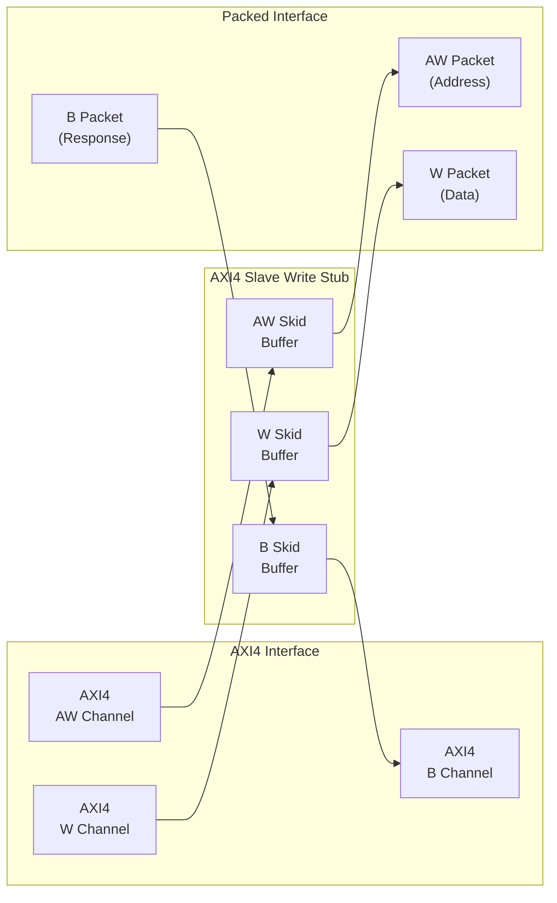
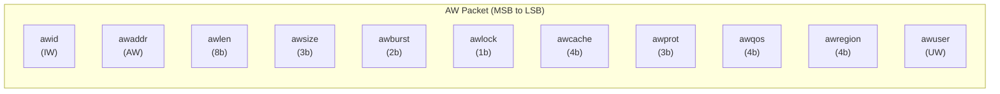
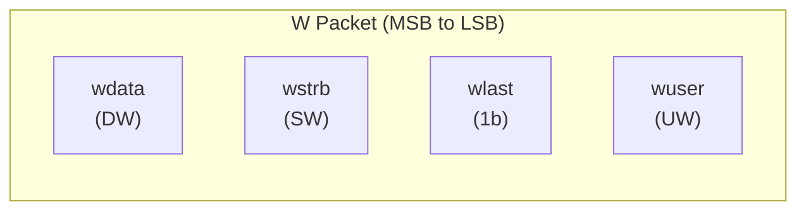
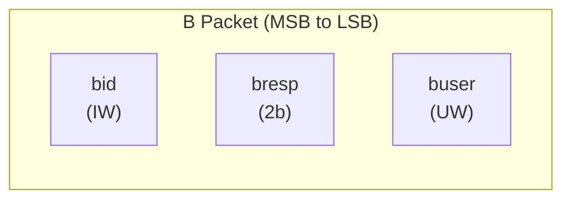
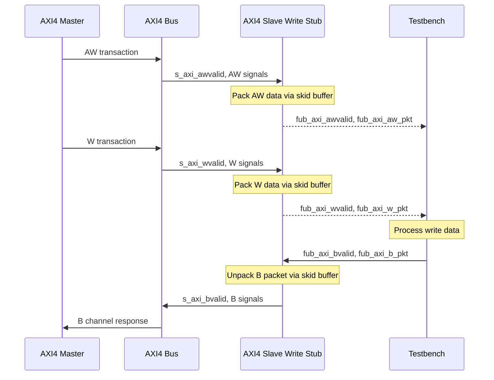

<!-- RTL Design Sherpa Documentation Header -->
<table>
<tr>
<td width="80">
  <a href="https://github.com/sean-galloway/RTLDesignSherpa">
    
  </a>
</td>
<td>
  <strong>RTL Design Sherpa</strong> · <em>Learning Hardware Design Through Practice</em><br>
  <sub>
    <a href="https://github.com/sean-galloway/RTLDesignSherpa">GitHub</a> ·
    <a href="https://github.com/sean-galloway/RTLDesignSherpa/blob/main/docs/DOCUMENTATION_INDEX.md">Documentation Index</a> ·
    <a href="https://github.com/sean-galloway/RTLDesignSherpa/blob/main/LICENSE">MIT License</a>
  </sub>
</td>
</tr>
</table>

---

<!-- End Header -->

# AXI4 Slave Write Stub

**Module:** `axi4_slave_wr_stub.sv`
**Location:** `rtl/amba/axi4/stubs/`
**Status:** Production Ready

---

## Overview

The AXI4 Slave Write Stub gives you a simplified packed-data interface on the receiving end of AXI4 write transactions. Skid buffers pack and unpack the AW (write address), W (write data), and B (write response) channels into simple packet interfaces, which makes it a natural fit for testbenches and integration scenarios where you want a slave without the protocol ceremony.

### Key Features

- Packed packet interface for AW, W, and B channels
- Configurable skid buffer depths for each channel
- Full AXI4 write transaction support
- Burst, ID, strobe, user signal support
- Parameterized data widths

---

## Parameters

| Parameter | Type | Default | Description |
|-----------|------|---------|-------------|
| `SKID_DEPTH_AW` | int | 2 | AW channel skid buffer depth in entries (2..8 inclusive, any integer) |
| `SKID_DEPTH_W` | int | 4 | W channel skid buffer depth in entries (2..8 inclusive, any integer) |
| `SKID_DEPTH_B` | int | 2 | B channel skid buffer depth in entries (2..8 inclusive, any integer) |
| `AXI_ID_WIDTH` | int | 8 | AXI transaction ID width |
| `AXI_ADDR_WIDTH` | int | 32 | AXI address bus width |
| `AXI_DATA_WIDTH` | int | 32 | AXI data bus width |
| `AXI_USER_WIDTH` | int | 1 | AXI user signal width |
| `AXI_WSTRB_WIDTH` | int | AXI_DATA_WIDTH/8 | Write strobe width |
| `AW` | int | AXI_ADDR_WIDTH | Short alias for address width |
| `DW` | int | AXI_DATA_WIDTH | Short alias for data width |
| `IW` | int | AXI_ID_WIDTH | Short alias for ID width |
| `SW` | int | AXI_WSTRB_WIDTH | Short alias for strobe width |
| `UW` | int | AXI_USER_WIDTH | Short alias for user width |
| `AWSize` | int | IW+AW+8+3+2+1+4+3+4+4+UW | AW packet size (calculated) |
| `WSize` | int | DW+SW+1+UW | W packet size (calculated) |
| `BSize` | int | IW+2+UW | B packet size (calculated) |

---

## Ports

### Clock and Reset

| Port | Direction | Width | Description |
|------|-----------|-------|-------------|
| `aclk` | Input | 1 | AXI clock |
| `aresetn` | Input | 1 | AXI reset (active low) |

### AXI4 Write Address Channel (AW)

| Port | Direction | Width | Description |
|------|-----------|-------|-------------|
| `s_axi_awid` | Input | IW | Write address ID |
| `s_axi_awaddr` | Input | AW | Write address |
| `s_axi_awlen` | Input | 8 | Burst length |
| `s_axi_awsize` | Input | 3 | Burst size |
| `s_axi_awburst` | Input | 2 | Burst type |
| `s_axi_awlock` | Input | 1 | Lock type |
| `s_axi_awcache` | Input | 4 | Cache type |
| `s_axi_awprot` | Input | 3 | Protection type |
| `s_axi_awqos` | Input | 4 | Quality of service |
| `s_axi_awregion` | Input | 4 | Region identifier |
| `s_axi_awuser` | Input | UW | User signal |
| `s_axi_awvalid` | Input | 1 | Write address valid |
| `s_axi_awready` | Output | 1 | Write address ready |

### AXI4 Write Data Channel (W)

| Port | Direction | Width | Description |
|------|-----------|-------|-------------|
| `s_axi_wdata` | Input | DW | Write data |
| `s_axi_wstrb` | Input | SW | Write strobes |
| `s_axi_wlast` | Input | 1 | Write last |
| `s_axi_wuser` | Input | UW | User signal |
| `s_axi_wvalid` | Input | 1 | Write data valid |
| `s_axi_wready` | Output | 1 | Write data ready |

### AXI4 Write Response Channel (B)

| Port | Direction | Width | Description |
|------|-----------|-------|-------------|
| `s_axi_bid` | Output | IW | Response ID |
| `s_axi_bresp` | Output | 2 | Write response |
| `s_axi_buser` | Output | UW | User signal |
| `s_axi_bvalid` | Output | 1 | Write response valid |
| `s_axi_bready` | Input | 1 | Write response ready |

### AW Packet Interface

| Port | Direction | Width | Description |
|------|-----------|-------|-------------|
| `fub_axi_awvalid` | Output | 1 | AW packet valid |
| `fub_axi_awready` | Input | 1 | Ready to accept AW packet |
| `fub_axi_aw_count` | Output | 4 | AW buffer occupancy |
| `fub_axi_aw_pkt` | Output | AWSize | Packed AW packet data |

### W Packet Interface

| Port | Direction | Width | Description |
|------|-----------|-------|-------------|
| `fub_axi_wvalid` | Output | 1 | W packet valid |
| `fub_axi_wready` | Input | 1 | Ready to accept W packet |
| `fub_axi_w_pkt` | Output | WSize | Packed W packet data |

### B Packet Interface

| Port | Direction | Width | Description |
|------|-----------|-------|-------------|
| `fub_axi_bvalid` | Input | 1 | B packet valid |
| `fub_axi_bready` | Output | 1 | Ready to accept B packet |
| `fub_axi_b_pkt` | Input | BSize | Packed B packet data |

---

## Functional Description

### Architecture

One skid buffer per channel, packets in and out the other side -- that's the whole trick:



### Packet Formats

#### AW Packet Structure (Write Address)



**Bit Positions:**
```
fub_axi_aw_pkt = {awid, awaddr, awlen, awsize, awburst, awlock, awcache, awprot, awqos, awregion, awuser}

Width = IW + AW + 8 + 3 + 2 + 1 + 4 + 3 + 4 + 4 + UW
```

#### W Packet Structure (Write Data)



**Bit Positions:**
```
fub_axi_w_pkt = {wdata, wstrb, wlast, wuser}

Width = DW + SW + 1 + UW
```

#### B Packet Structure (Write Response)



**Bit Positions:**
```
fub_axi_b_pkt = {bid, bresp, buser}

Width = IW + 2 + UW
```

### Transaction Flow



---

## Timing

<!-- TODO: Add wavedrom timing diagram for stub transactions -->
> **Timing diagram pending.** The signals and sequence this scenario
> exercises:
>
> - aclk
> - AXI AW signals (s_axi_awvalid, s_axi_awaddr, s_axi_awlen, etc.)
> - fub_axi_awvalid, fub_axi_awready, fub_axi_aw_pkt
> - AXI W signals (s_axi_wvalid, s_axi_wdata, s_axi_wstrb, s_axi_wlast, etc.)
> - fub_axi_wvalid, fub_axi_wready, fub_axi_w_pkt
> - fub_axi_bvalid, fub_axi_bready, fub_axi_b_pkt
> - AXI B signals (s_axi_bvalid, s_axi_bid, s_axi_bresp, etc.)
> - Packet-to-AXI timing relationship with skid buffer operation


---

## Usage Example

Same pattern as the combined stub: instantiate, parse packets MSB-first, and drive responses back as packed words. The localparams have to match your instance widths.

```systemverilog
axi4_slave_wr_stub #(
    .SKID_DEPTH_AW   (2),
    .SKID_DEPTH_W    (4),
    .SKID_DEPTH_B    (2),
    .AXI_ID_WIDTH    (8),
    .AXI_ADDR_WIDTH  (32),
    .AXI_DATA_WIDTH  (64),
    .AXI_USER_WIDTH  (4)
) u_axi4_slave_wr_stub (
    .aclk            (axi_clk),
    .aresetn         (axi_rst_n),

    // AXI4 slave write interface
    .s_axi_awid      (s_axi_awid),
    .s_axi_awaddr    (s_axi_awaddr),
    .s_axi_awlen     (s_axi_awlen),
    .s_axi_awsize    (s_axi_awsize),
    .s_axi_awburst   (s_axi_awburst),
    .s_axi_awlock    (s_axi_awlock),
    .s_axi_awcache   (s_axi_awcache),
    .s_axi_awprot    (s_axi_awprot),
    .s_axi_awqos     (s_axi_awqos),
    .s_axi_awregion  (s_axi_awregion),
    .s_axi_awuser    (s_axi_awuser),
    .s_axi_awvalid   (s_axi_awvalid),
    .s_axi_awready   (s_axi_awready),

    .s_axi_wdata     (s_axi_wdata),
    .s_axi_wstrb     (s_axi_wstrb),
    .s_axi_wlast     (s_axi_wlast),
    .s_axi_wuser     (s_axi_wuser),
    .s_axi_wvalid    (s_axi_wvalid),
    .s_axi_wready    (s_axi_wready),

    .s_axi_bid       (s_axi_bid),
    .s_axi_bresp     (s_axi_bresp),
    .s_axi_buser     (s_axi_buser),
    .s_axi_bvalid    (s_axi_bvalid),
    .s_axi_bready    (s_axi_bready),

    // Packed AW interface
    .fub_axi_awvalid (tb_aw_valid),
    .fub_axi_awready (tb_aw_ready),
    .fub_axi_aw_count(tb_aw_count),
    .fub_axi_aw_pkt  (tb_aw_pkt),

    // Packed W interface
    .fub_axi_wvalid  (tb_w_valid),
    .fub_axi_wready  (tb_w_ready),
    .fub_axi_w_pkt   (tb_w_pkt),

    // Packed B interface
    .fub_axi_bvalid  (tb_b_valid),
    .fub_axi_bready  (tb_b_ready),
    .fub_axi_b_pkt   (tb_b_pkt)
);

// Parse AW packet
localparam int AWSize = 8+32+8+3+2+1+4+3+4+4+4;  // match your instance widths
wire [7:0]  aw_id     = tb_aw_pkt[AWSize-1:AWSize-8];
wire [31:0] aw_addr   = tb_aw_pkt[AWSize-9:AWSize-40];
wire [7:0]  aw_len    = tb_aw_pkt[AWSize-41:AWSize-48];
wire [2:0]  aw_size   = tb_aw_pkt[AWSize-49:AWSize-51];
wire [1:0]  aw_burst  = tb_aw_pkt[AWSize-52:AWSize-53];
// ... additional fields as needed

// Parse W packet
localparam int WSize = 64+8+1+4;  // match your instance widths
wire [63:0] w_data = tb_w_pkt[WSize-1:WSize-64];
wire [7:0]  w_strb = tb_w_pkt[WSize-65:WSize-72];
wire        w_last = tb_w_pkt[WSize-73];
wire [3:0]  w_user = tb_w_pkt[3:0];

// Build B packet (OKAY response)
localparam BSize = 8 + 2 + 4;  // Calculate size
assign tb_b_pkt = {
    aw_id,    // bid (match request ID)
    2'b00,    // bresp (OKAY)
    4'h0      // buser
};
```

---

## Design Notes

### Skid Buffer Operation

The stub uses `gaxi_skid_buffer` modules to:
- Decouple timing between AXI bus and testbench
- Provide configurable buffering depth per channel
- Handle backpressure gracefully
- Support burst transactions without stalling

**Recommended Depths:**
- **AW Channel:** 2-4 (address transactions)
- **W Channel:** 4-8 (data beats for bursts)
- **B Channel:** 2-4 (responses)

### Channel Independence

The AW, W, and B channels are independent:
- AW and W arrive in any order from master
- Stub handles proper AXI timing
- B responses generated asynchronously by testbench

### Packet Packing Order

AW, W, and B packets are packed MSB-to-LSB following AXI signal order:
- Simplifies testbench packet parsing
- Matches common concatenation order
- Efficient for burst transaction handling

### Internal Architecture

The stub instantiates three `gaxi_skid_buffer` modules:
- **AW Skid Buffer:** Packs AXI AW channel to AW packets
- **W Skid Buffer:** Packs AXI W channel to W packets
- **B Skid Buffer:** Unpacks B packets to AXI B channel

All AXI protocol handling is done by the skid buffers and upstream modules.

---

## Related Modules

- **[AXI4 Slave Write](axi4_slave_wr.md)** - Full AXI4 slave write module (if wrapping one)
- **[AXI4 Slave Read Stub](axi4_slave_rd_stub.md)** - Corresponding read stub
- **[AXI4 Slave Stub](axi4_slave_stub.md)** - Combined read/write stub
- **[AXI4 Master Write Stub](axi4_master_wr_stub.md)** - Master-side write stub

---

## Navigation

- **[<- Back to AXI4 Index](README.md)**
- **[<- Back to rtl-amba Index](../index.md)**
- **[<- Back to Main Documentation Index](../../index.md)**
