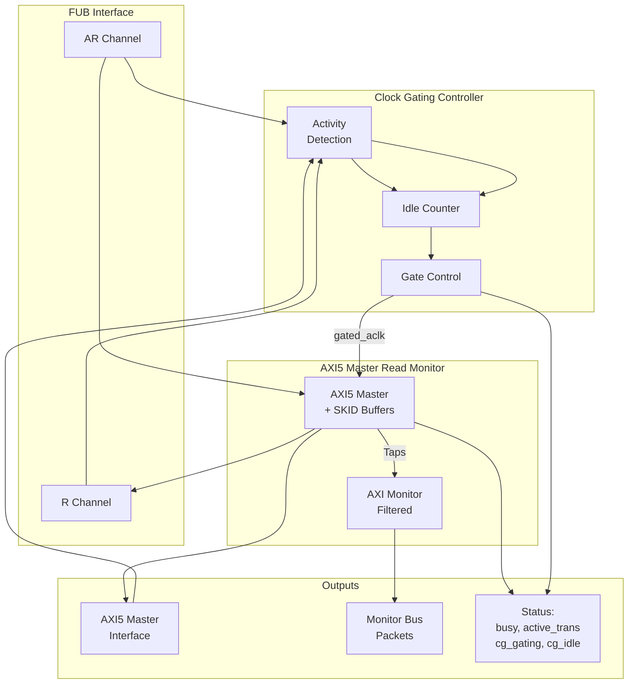

<!-- RTL Design Sherpa Documentation Header -->
<table>
<tr>
<td width="80">
  <a href="https://github.com/sean-galloway/RTLDesignSherpa">
    
  </a>
</td>
<td>
  <strong>RTL Design Sherpa</strong> · <em>Learning Hardware Design Through Practice</em><br>
  <sub>
    <a href="https://github.com/sean-galloway/RTLDesignSherpa">GitHub</a> ·
    <a href="https://github.com/sean-galloway/RTLDesignSherpa/blob/main/docs/DOCUMENTATION_INDEX.md">Documentation Index</a> ·
    <a href="https://github.com/sean-galloway/RTLDesignSherpa/blob/main/LICENSE">MIT License</a>
  </sub>
</td>
</tr>
</table>

---

<!-- End Header -->

# AXI5 Master Read with Monitor and Clock Gating

**Module:** `axi5_master_rd_mon_cg.sv`
**Location:** `rtl/amba/axi5/` (protocol monitors live with their protocol; only the monitor CORE pieces are in `rtl/amba/monitor/`)
**Status:** Production Ready

---

## Overview

The AXI5 Master Read with Monitor and Clock Gating module combines `axi5_master_rd_mon` (AXI5 master with integrated monitoring) with intelligent clock gating for power optimization. This is the everything variant: comprehensive transaction monitoring, error detection, and automatic power management in one instantiation.

**Scope:** this module transports AXI5 signals; it does not implement AXI5 transaction semantics. It performs no MTE tag checking or `RTAGMATCH` generation, no chunk reassembly, no poison generation, and no atomic read-modify-write -- `AWATOP` is transported, not executed. The monitor observes handshakes, responses and timing; it performs no protocol checking of handshake stability, ID width, burst length or address alignment. See [Scope of This Implementation](README.md) in the AXI5 index for the full coverage statement.

### Key Features

- Carries the full AXI5 signal set unmodified -- transport, not semantics; see Scope above
- **All AXI5 extensions:** NSAID, TRACE, MPAM, MECID, UNIQUE, CHUNKING, MTE, POISON
- **Integrated AXI monitor** with 2-Level Filtering: packet-type drop masks + per-event masks (err_select is reserved -- no routing)
- **Error detection:** SLVERR, DECERR, orphaned read data
  (protocol-violation events are write-monitor only)
- **Timeout monitoring:** Stuck transactions, stalled channels
- **Performance metrics:** Latency, throughput, outstanding transactions
- **MonBus output:** Standardized 128-bit monitor packet format paired with 64-bit side-band timestamp
- **Automatic clock gating** based on activity detection
- **Configurable idle threshold** before clock gating activates
- **Power savings** during idle periods
- **Transparent operation** - no protocol changes
- **Dual status outputs:** Monitor status + clock gating status
- **Power Savings:** traffic-dependent; unmeasured in this repo -- treat any percentage as a placeholder until characterized

---

## Parameters

| Parameter | Type | Default | Description |
|-----------|------|---------|-------------|
| SKID_DEPTH_AR | int | 2 | AR channel SKID buffer depth |
| SKID_DEPTH_R | int | 4 | R channel SKID buffer depth |
| AXI_ID_WIDTH | int | 8 | Transaction ID width |
| AXI_ADDR_WIDTH | int | 32 | Address bus width |
| AXI_DATA_WIDTH | int | 32 | Data bus width |
| AXI_USER_WIDTH | int | 1 | User signal width |
| AXI_NSAID_WIDTH | int | 4 | Non-secure access ID width |
| AXI_MPAM_WIDTH | int | 11 | MPAM width (PartID + PMG) |
| AXI_MECID_WIDTH | int | 16 | Memory encryption context ID width |
| AXI_TAG_WIDTH | int | 4 | Memory tag width per 16 bytes |
| AXI_TAGOP_WIDTH | int | 2 | Tag operation width |
| AXI_CHUNKNUM_WIDTH | int | 4 | Chunk number width |
| ENABLE_NSAID | bit | 1 | Enable non-secure access ID |
| ENABLE_TRACE | bit | 1 | Enable trace signals |
| ENABLE_MPAM | bit | 1 | Enable memory partitioning |
| ENABLE_MECID | bit | 1 | Enable memory encryption context |
| ENABLE_UNIQUE | bit | 1 | Enable unique ID indicator |
| ENABLE_CHUNKING | bit | 1 | Enable data chunking |
| ENABLE_MTE | bit | 1 | Enable Memory Tagging Extension |
| ENABLE_POISON | bit | 1 | Enable poison indicator |
| UNIT_ID | int | 1 | Monitor unit identifier |
| AGENT_ID | int | 10 | Monitor agent identifier |
| MAX_TRANSACTIONS | int | 16 | Transaction table size |
| `ENABLE_FILTERING` | bit | 1 | Enable packet filtering: two active drop levels (packet type, then event code). Level 2 is reserved and routes nothing |
| ADD_PIPELINE_STAGE | bit | 0 | Add pipeline stage in monitor |
| USE_MONITOR | bit | 1 | Synthesis-time monitor enable (forwarded to inner monitor). |
| N_ADDR_RANGES | int | 0 | Number of address-range comparators (forwarded to base module). |
| ENABLE_ERROR_LOGIC | bit | 1 | Synthesis-cone enable for error detection (forwarded to base module) |
| ENABLE_TIMEOUT_LOGIC | bit | 1 | Synthesis-cone enable for timeout detection (forwarded to base module) |
| ENABLE_COMPL_LOGIC | bit | 1 | Synthesis-cone enable for completion tracking (forwarded to base module) |
| ENABLE_THRESHOLD_LOGIC | bit | 1 | Synthesis-cone enable for threshold detection (forwarded to base module) |
| ENABLE_PERF_LOGIC | bit | 1 | Synthesis-cone enable for the REPORTER's legacy perf-packet cone and the two lifetime counters only -- the window FSM and bucket/beat/byte/burst counters are unconditional (always compiled, always live) |
| ENABLE_DEBUG_LOGIC | bit | 0 | Synthesis-cone enable for the debug/trace cone (forwarded to base module) |
| ACLK_MHZ | int | 100 | Clock frequency in MHz. Builds the microsecond tick LUT in `counter_freq_invariant`. **Leave this at 100 on a 90 MHz part and every us-denominated timeout is wrong, silently** -- it was unreachable through this wrapper until 2026-09-01. |
| CFI_MIN_FREQ_MHZ | int | ACLK_MHZ | Lowest frequency the tick LUT must cover (dynamic-frequency builds). |
| CFI_MAX_FREQ_MHZ | int | ACLK_MHZ | Highest frequency the tick LUT must cover. |
| USE_WDATA_ORDER_Q | bit | 0 | Write-data ordering queue. Required (=1) whenever NUM_BANKS > 1. |
| NUM_BANKS | int | 1 | Transaction-table banking. The `USE_WDATA_ORDER_Q` pairing rule applies to WRITE monitors only -- `axi_monitor_trans_mgr` guards on `(NUM_BANKS > 1) && !IS_READ && !USE_WDATA_ORDER_Q`, so a read monitor may bank freely. |
| ADDR_FILTER_ENABLE | bit | 0 | Synthesises the address-range report filter. **The parameter only decides whether the logic EXISTS** -- a build that sets it and leaves `cfg_addr_filter_enable` low filters nothing and looks broken. |
| ID_FILTER_ENABLE | bit | 0 | Synthesises the ID report filter (see `cfg_id_*` for the runtime override). |
| ID_MATCH_BASE | int | 0 | First ID this instance owns. |
| ID_MATCH_COUNT | int | 0 | How many IDs; `0` means ALL, so a zeroed register block does not silently filter everything away. |
| CG_IDLE_COUNT_WIDTH | int | 4 | Width of idle counter (max 2^N-1 cycles) |

### Filter configuration (forwarded)

These reach the inner monitor through this wrapper; before 2026-09-01 they did not.

| Port | Direction | Width | Description |
|------|-----------|-------|-------------|
| `cfg_addr_filter_enable` | Input | 1 | High: suppress packets for transactions outside the window. Low: inert, whatever `ADDR_FILTER_ENABLE` says |
| `cfg_addr_filter_low` | Input | ADDR_WIDTH | Window base, inclusive |
| `cfg_addr_filter_high` | Input | ADDR_WIDTH | Window limit, inclusive |
| `cfg_id_filter_enable` | Input | 1 | High: use the runtime window below instead of the ID_MATCH_* parameters |
| `cfg_id_match_base` | Input | ID_WIDTH | First ID to accept |
| `cfg_id_match_count` | Input | ID_WIDTH+1 | How many; `0` means ALL |

---

### Derived Parameters (do not override)

These are declared as `parameter` so the elaborator can compute them, not so callers can set them. Each defaults to an expression over the parameters above; overriding one desynchronises it from its source and the design fails to elaborate or silently mis-sizes a bus. Set the parameters they are derived FROM and leave these alone.

| Derived parameter | Default expression |
|---|---|
| `AXI_WSTRB_WIDTH` | `AXI_DATA_WIDTH / 8` |
| `AW` | `AXI_ADDR_WIDTH` |
| `DW` | `AXI_DATA_WIDTH` |
| `IW` | `AXI_ID_WIDTH` |
| `SW` | `AXI_WSTRB_WIDTH` |
| `UW` | `AXI_USER_WIDTH` |
| `NUM_TAGS` | `(AXI_DATA_WIDTH / 128) > 0 ? (AXI_DATA_WIDTH / 128) : 1` |
| `TW` | `AXI_TAG_WIDTH * NUM_TAGS` |
| `CHUNK_STRB_WIDTH` | `(AXI_DATA_WIDTH / 128) > 0 ? (AXI_DATA_WIDTH / 128) : 1` |

## Ports

### Clock and Reset

| Port | Width | Direction | Description |
|------|-------|-----------|-------------|
| aclk | 1 | Input | AXI clock (ungated) |
| aresetn | 1 | Input | AXI active-low reset |

### Clock Gating Configuration

| Port | Width | Direction | Description |
|------|-------|-----------|-------------|
| cfg_cg_enable | 1 | Input | Clock gating enable (1=enable, 0=always active) |
| cfg_cg_idle_count | CG_IDLE_COUNT_WIDTH | Input | Idle cycles before gating activates |

### FUB AXI5 Interface (Slave Side - Input)

Same as `axi5_master_rd_mon` - see [AXI5 Master Read Monitor](axi5_master_rd_mon.md).

### Master AXI5 Interface (Output Side)

Same as `axi5_master_rd_mon` - see [AXI5 Master Read Monitor](axi5_master_rd_mon.md).

### Monitor Configuration

Same as `axi5_master_rd_mon` - see [AXI5 Master Read Monitor](axi5_master_rd_mon.md).

### Monitor Bus Output

| Port | Width | Direction | Description |
|------|-------|-----------|-------------|
| monbus_valid | 1 | Output | Monitor packet valid |
| monbus_ready | 1 | Input | Monitor packet ready (backpressure) |
| monbus_packet | 128 | Output | `monitor_packet_t` (128-bit format) |
| monbus_timestamp | 64 | Output | `monbus_timestamp_t` paired atomically with `monbus_packet` |
| i_mon_time | 64 | Input | Free-running counter from `monbus_group_core`, sampled at packet emission |

### Status Outputs

| Port | Width | Direction | Description |
|------|-------|-----------|-------------|
| busy | 1 | Output | Core busy indicator |
| active_transactions | 8 | Output | Number of outstanding transactions |
| error_count | 16 | Output | Cumulative error count (live -- driven from the reporter's lifetime counter) |
| transaction_count | 32 | Output | Total transaction count (live -- reporter lifetime counter, zero-extended) |
| cfg_conflict_error | 1 | Output | Configuration conflict detected |
| cg_gating | 1 | Output | Clock gating active (1=gated, 0=running) |
| cg_idle | 1 | Output | Interface idle (1=no activity) |

---

## Functional Description

### Architecture



### Combined Monitoring and Power Management

This module provides the best of both worlds:

**Monitoring (from axi5_master_rd_mon):**
- Real-time transaction monitoring
- Error and timeout detection
- Performance metrics collection
- Configurable packet filtering
- MonBus output for system integration

**Power Management (from axi5_master_rd_cg):**
- Automatic clock gating during idle periods
- Configurable idle threshold
- Activity-based wake-up
- Status outputs for power monitoring

### Clock Gating with Monitor Active

The clock gating logic considers monitor activity:

```systemverilog
user_valid = fub_axi_arvalid || fub_axi_rvalid || int_busy ||
             w_monbus_valid || (|active_transactions);  // peer VALID, never peer READY
axi_valid = m_axi_arvalid || m_axi_rvalid;

// Clock remains active if:
// - User interface active (AR or R channels)
// - AXI interface active
// - CORE busy (transactions in flight in the datapath)
// - A monitor packet is pending on the monitor bus (w_monbus_valid)
// - The monitor CAM still holds entries (|active_transactions) -- covers
//   the reporter's retire -> FIFO -> output emission window
```

**Monitor-bus delivery is exactly-once across gating, at any idle count.**
A packet pending on the monitor bus is a wake term: the block stays awake
(or re-wakes within a cycle) until the consumer accepts it, and the
external `monbus_valid` is masked with `!cg_gating` so a consumer can
never sample a valid that the reporter's stopped clock could not retire.
The monitor CAM's occupancy (`active_transactions`) is a wake term too: a
tracked entry stays in the CAM until its packet is marked into the
reporter FIFO, and the registered count lags one cycle past that, meeting
`monbus_valid`'s assertion -- so the clock cannot stop inside the
reporter's few-cycle emission window and strand a trailing packet, even
at `cfg_cg_idle_count = 0`. `val/amba/test_mon_cg_gating.py` phase 6
asserts exactly-once delivery of exactly the packets generated.

### Ready Signal Control During Gating

When clock gating is active, ready signals are forced low to prevent new transactions:

```systemverilog
fub_axi_arready = cg_gating ? 1'b0 : int_arready;
m_axi_rready = cg_gating ? 1'b0 : int_rready;
```

This ensures protocol compliance during power management.

### Performance Monitoring

The clock-gated wrapper exposes the full perfmon interface of the base module and **forwards every port unchanged** to the inner `axi5_master_rd_mon`. The measurement-window state machine, the four R-channel utilization buckets (productive / back-pressure / starvation / idle), and the beat/byte/burst throughput counters behave exactly as documented in the base module — see [Performance Monitoring in axi5_master_rd_mon](axi5_master_rd_mon.md#performance-monitoring) for the full narrative and per-bit semantics.

Forwarded perfmon ports (identical width and direction to the base module):

- **Inputs:** `cfg_perf_enable`, `cfg_start_event_sel` (3), `cfg_end_event_sel` (3), `cfg_start_trigger`, `cfg_end_trigger`, `cfg_window_force_close`
- **Outputs:** `window_active`, `window_cycles` (32), `perf_prod_cycles` (32), `perf_bp_cycles` (32), `perf_starv_cycles` (32), `perf_idle_cycles` (32), `perf_beat_count` (32), `perf_byte_count` (64), `perf_burst_count` (32)

The `perf_burst_count` output tracks AR (read address) handshakes.
**WARNING:** an open measurement window is NOT a wake term -- the window
FSM and all counters run on the gated clock, so if the bus idles past
`cfg_cg_idle_count` mid-window, `window_cycles` and the four buckets
FREEZE while wall-clock time passes. For exact wall-clock windows hold
`cfg_cg_enable` low around the measurement, or use the base module.

Alongside perfmon, the wrapper forwards the `cfg_compl_enable`, `cfg_threshold_enable`, and `cfg_debug_enable` control inputs, plus the six `ENABLE_*_LOGIC` synthesis-cone parameters (see [Parameters](#parameters)), straight through to the base monitor.

---

## Timing Characteristics

### Clock Gating with Monitor Activity

> **Timing diagram pending.** The signals and sequence this scenario
> exercises:
>
> - ACLK (ungated)
> - GATED_ACLK (gated clock)
> - AXI transaction sequence
> - Monitor packet generation
> - Idle period detection
> - cg_gating activation
> - Monitor quiescent before clock stops

### Wake-up with Immediate Monitoring

> **Timing diagram pending.** The signals and sequence this scenario
> exercises:
>
> - ACLK (ungated)
> - GATED_ACLK resuming
> - ARVALID assertion (wake trigger)
> - cg_gating deactivation
> - AXI transaction proceeds
> - Monitor packets generated immediately

---

## Usage Examples


Every parameter and port below is read from the module declaration.

```systemverilog
axi5_master_rd_mon_cg #(
    .SKID_DEPTH_AR         (2),
    .SKID_DEPTH_R          (4),
    .AXI_ID_WIDTH          (8),
    .AXI_ADDR_WIDTH        (32),
    .AXI_DATA_WIDTH        (32),
    .AXI_USER_WIDTH        (1),
    .AXI_NSAID_WIDTH       (4),
    .AXI_MPAM_WIDTH        (11),
    .AXI_MECID_WIDTH       (16),
    .AXI_TAG_WIDTH         (4)
) u_axi5_master_rd_mon_cg (
    .aclk                  (aclk),
    .aresetn               (aresetn),
    .cam_clear             (cam_clear),
    .cfg_cg_enable         (cfg_cg_enable),
    .cfg_cg_idle_count     (cfg_cg_idle_count),
    .fub_axi_arid          (fub_axi_arid),
    .fub_axi_araddr        (fub_axi_araddr),
    .fub_axi_arlen         (fub_axi_arlen),
    .fub_axi_arsize        (fub_axi_arsize),
    .fub_axi_arburst       (fub_axi_arburst),
    .fub_axi_arlock        (fub_axi_arlock),
    .fub_axi_arcache       (fub_axi_arcache),
    .fub_axi_arprot        (fub_axi_arprot),
    .fub_axi_arqos         (fub_axi_arqos),
    .fub_axi_aruser        (fub_axi_aruser),
    .fub_axi_arvalid       (fub_axi_arvalid),
    .fub_axi_arready       (fub_axi_arready),
    .fub_axi_arnsaid       (fub_axi_arnsaid),
    .fub_axi_artrace       (fub_axi_artrace),
    .fub_axi_armpam        (fub_axi_armpam),
    .fub_axi_armecid       (fub_axi_armecid),
    .fub_axi_arunique      (fub_axi_arunique),
    .fub_axi_archunken     (fub_axi_archunken),
    .fub_axi_artagop       (fub_axi_artagop),
    .fub_axi_rid           (fub_axi_rid),
    .fub_axi_rdata         (fub_axi_rdata),
    .fub_axi_rresp         (fub_axi_rresp),
    .fub_axi_rlast         (fub_axi_rlast),
    .fub_axi_ruser         (fub_axi_ruser),
    .fub_axi_rvalid        (fub_axi_rvalid),
    .fub_axi_rready        (fub_axi_rready),
    .fub_axi_rtrace        (fub_axi_rtrace),
    .fub_axi_rpoison       (fub_axi_rpoison),
    .fub_axi_rchunkv       (fub_axi_rchunkv),
    .fub_axi_rchunknum     (fub_axi_rchunknum),
    .fub_axi_rchunkstrb    (fub_axi_rchunkstrb),
    .fub_axi_rtag          (fub_axi_rtag),
    .fub_axi_rtagmatch     (fub_axi_rtagmatch),
    .m_axi_arid            (m_axi_arid),
    .m_axi_araddr          (m_axi_araddr),
    .m_axi_arlen           (m_axi_arlen),
    .m_axi_arsize          (m_axi_arsize),
    .m_axi_arburst         (m_axi_arburst),
    .m_axi_arlock          (m_axi_arlock),
    .m_axi_arcache         (m_axi_arcache),
    .m_axi_arprot          (m_axi_arprot),
    .m_axi_arqos           (m_axi_arqos),
    .m_axi_aruser          (m_axi_aruser),
    .m_axi_arvalid         (m_axi_arvalid),
    .m_axi_arready         (m_axi_arready),
    .m_axi_arnsaid         (m_axi_arnsaid),
    .m_axi_artrace         (m_axi_artrace),
    .m_axi_armpam          (m_axi_armpam),
    .m_axi_armecid         (m_axi_armecid),
    .m_axi_arunique        (m_axi_arunique),
    .m_axi_archunken       (m_axi_archunken),
    .m_axi_artagop         (m_axi_artagop),
    .m_axi_rid             (m_axi_rid),
    .m_axi_rdata           (m_axi_rdata),
    .m_axi_rresp           (m_axi_rresp),
    .m_axi_rlast           (m_axi_rlast),
    .m_axi_ruser           (m_axi_ruser),
    .m_axi_rvalid          (m_axi_rvalid),
    .m_axi_rready          (m_axi_rready),
    .m_axi_rtrace          (m_axi_rtrace),
    .m_axi_rpoison         (m_axi_rpoison),
    .m_axi_rchunkv         (m_axi_rchunkv),
    .m_axi_rchunknum       (m_axi_rchunknum),
    .m_axi_rchunkstrb      (m_axi_rchunkstrb),
    .m_axi_rtag            (m_axi_rtag),
    .m_axi_rtagmatch       (m_axi_rtagmatch),
    .cfg_monitor_enable    (cfg_monitor_enable),
    .cfg_error_enable      (cfg_error_enable),
    .cfg_timeout_enable    (cfg_timeout_enable),
    .cfg_perf_enable       (cfg_perf_enable),
    .cfg_compl_enable      (cfg_compl_enable),
    .cfg_threshold_enable  (cfg_threshold_enable),
    .cfg_debug_enable      (cfg_debug_enable),
    .cfg_timeout_cycles    (cfg_timeout_cycles),
    .cfg_freq_sel          (cfg_freq_sel),
    .cfg_latency_threshold (cfg_latency_threshold),
    .cfg_axi_pkt_mask      (cfg_axi_pkt_mask),
    .cfg_axi_err_select    (cfg_axi_err_select),
    .cfg_axi_error_mask    (cfg_axi_error_mask),
    .cfg_axi_timeout_mask  (cfg_axi_timeout_mask),
    .cfg_axi_compl_mask    (cfg_axi_compl_mask),
    .cfg_axi_thresh_mask   (cfg_axi_thresh_mask),
    .cfg_axi_perf_mask     (cfg_axi_perf_mask),
    .cfg_axi_addr_mask     (cfg_axi_addr_mask),
    .cfg_axi_debug_mask    (cfg_axi_debug_mask),
    .cfg_addr_check_enable (cfg_addr_check_enable),
    .cfg_addr_range_enable (cfg_addr_range_enable),
    .cfg_addr_range_low    (cfg_addr_range_low),
    .cfg_addr_range_high   (cfg_addr_range_high),
    .cfg_addr_filter_enable(cfg_addr_filter_enable),
    .cfg_addr_filter_low   (cfg_addr_filter_low),
    .cfg_addr_filter_high  (cfg_addr_filter_high),
    .cfg_id_filter_enable  (cfg_id_filter_enable),
    .cfg_id_match_base     (cfg_id_match_base),
    .cfg_id_match_count    (cfg_id_match_count),
    .i_mon_time            (i_mon_time),
    .monbus_valid          (monbus_valid),
    .monbus_ready          (monbus_ready),
    .monbus_packet         (monbus_packet),
    .monbus_timestamp      (monbus_timestamp),
    .busy                  (busy),
    .active_transactions   (active_transactions),
    .error_count           (error_count),
    .transaction_count     (transaction_count),
    .cfg_conflict_error    (cfg_conflict_error),
    .cg_gating             (cg_gating),
    .cg_idle               (cg_idle),
    .cfg_start_event_sel   (cfg_start_event_sel),
    .cfg_end_event_sel     (cfg_end_event_sel),
    .cfg_start_trigger     (cfg_start_trigger),
    .cfg_end_trigger       (cfg_end_trigger),
    .cfg_window_force_close(cfg_window_force_close),
    .window_active         (window_active),
    .window_cycles         (window_cycles),
    .perf_prod_cycles      (perf_prod_cycles),
    .perf_bp_cycles        (perf_bp_cycles),
    .perf_starv_cycles     (perf_starv_cycles),
    .perf_idle_cycles      (perf_idle_cycles),
    .perf_beat_count       (perf_beat_count),
    .perf_byte_count       (perf_byte_count),
    .perf_burst_count      (perf_burst_count)
);
```

## Design Notes

### When to Use This Module

**Ideal for:**
- Battery-powered or power-sensitive systems
- Bursty traffic patterns with significant idle periods
- Systems requiring comprehensive debug visibility
- Production systems needing runtime monitoring + power optimization

**Consider alternatives if:**
- Continuous, high-throughput traffic (clock gating ineffective)
- Ultra-low latency requirements (avoid gating overhead)
- Area-constrained designs (monitor + CG adds ~10% area)

### Configuration Strategy Matrix

| Scenario | Monitor Config | Clock Gating Config | Expected Benefit |
|----------|---------------|---------------------|------------------|
| **Development/Debug** | ERROR + COMPL + TIMEOUT | Disabled | Full visibility, no wake latency |
| **Performance Tuning** | ERROR + PERF | Disabled | Metrics without power interference |
| **Power Testing** | ERROR only | Aggressive (count=0) | Maximum power savings |
| **Production** | ERROR + TIMEOUT | Balanced (count=3) | Error detection + power savings |

### Monitor + Clock Gating Interaction

**Key Considerations:**

1. **Monitor packets generated before gating:**
   - Monitor processes all events before idle state
   - MonBus packets FREEZE when the clock stops (see the WARNING above -- nothing flushes them)
   - No events lost during gating transition

2. **Wake latency includes monitor initialization:**
   - 1 wake-up register stage; first usable gated-clock edge 2 cycles after activity
   - Monitor ready immediately (no reset needed)
   - First transaction monitored correctly

3. **Power savings account for monitor overhead:**
   - Monitor adds ~10% dynamic power when active
   - Clock gating saves ~80-90% when idle (first-order estimate -- no power analysis has been run; same disclaimer as the sibling _cg page)
   - Net savings: 70-80% during idle periods

### Verification Recommendations

1. **Test monitor + CG independently first:**
   ```systemverilog
   // Phase 1: Monitor only (CG disabled)
   .cfg_cg_enable (1'b0)
   // Verify all monitor features

   // Phase 2: CG only (monitor minimal)
   .cfg_monitor_enable (1'b0)
   .cfg_error_enable   (1'b0)
   .cfg_cg_enable      (1'b1)
   // Verify clock gating behavior

   // Phase 3: Combined
   // Both enabled, verify interaction
   ```

2. **Check monitor packet integrity across gating:**
   - No packets lost during gating transitions
   - No duplicate packets
   - Timestamps/latencies accurate

3. **Measure actual power savings:**
   - Instrument with power counters
   - Compare vs. always-on baseline
   - Verify efficiency in target traffic patterns

---

## Related Modules

- **[AXI5 Master Read](../axi5/axi5_master_rd.md)** - Base module
- **[AXI5 Master Read CG](../axi5/axi5_master_rd_cg.md)** - Clock gating only
- **[AXI5 Master Read Monitor](axi5_master_rd_mon.md)** - Monitor only
- **[AXI5 Master Write Monitor CG](axi5_master_wr_mon_cg.md)** - Write variant
- **[AXI Monitor Configuration Guide](../../../user-guides/AXI_Monitor_Configuration_Guide.md)** - Monitor setup
- **[AMBA Clock Gate Controller](../shared/amba_clock_gate_ctrl.md)** - Clock gating details

---

## Testing

`val/amba/test_axi5_master_rd_mon_cg.py` exercises this module. It collects 3 parameter cases at the default `REG_LEVEL`.

```bash
source env_python
pytest val/amba/test_axi5_master_rd_mon_cg.py -v
```

---

## Navigation

- **[← Back to AXI5 Index](../_book_monitor_index.md)**
- **[← Back to rtl-amba Index](../index.md)**
- **[← Back to Main Documentation Index](../../index.md)**
