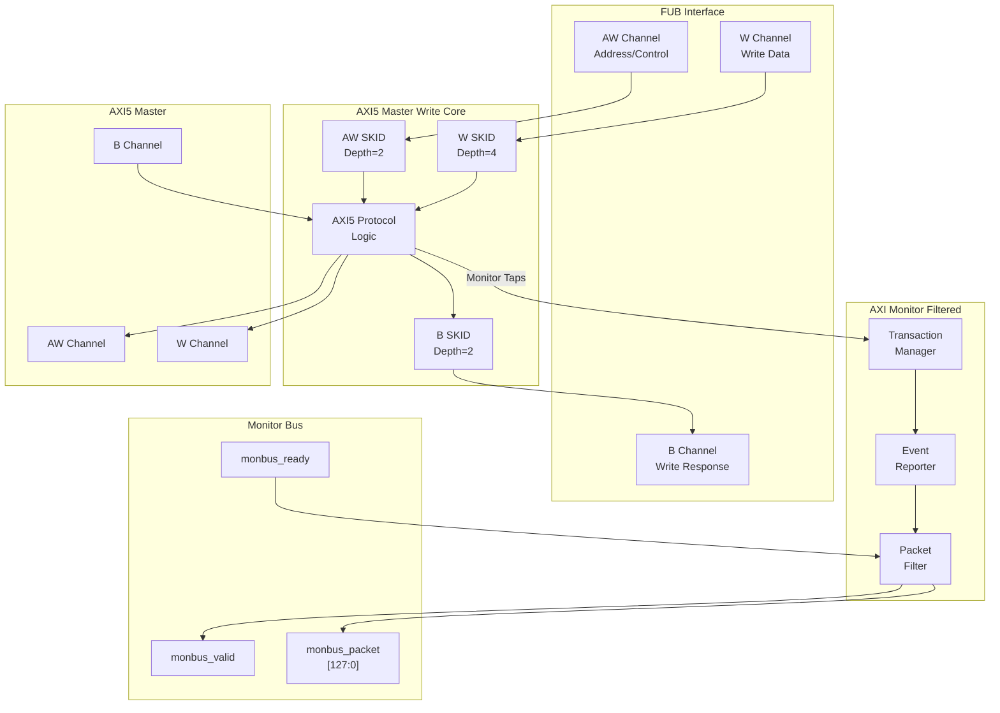

<!-- RTL Design Sherpa Documentation Header -->
<table>
<tr>
<td width="80">
  <a href="https://github.com/sean-galloway/RTLDesignSherpa">
    
  </a>
</td>
<td>
  <strong>RTL Design Sherpa</strong> · <em>Learning Hardware Design Through Practice</em><br>
  <sub>
    <a href="https://github.com/sean-galloway/RTLDesignSherpa">GitHub</a> ·
    <a href="https://github.com/sean-galloway/RTLDesignSherpa/blob/main/docs/DOCUMENTATION_INDEX.md">Documentation Index</a> ·
    <a href="https://github.com/sean-galloway/RTLDesignSherpa/blob/main/LICENSE">MIT License</a>
  </sub>
</td>
</tr>
</table>

---

<!-- End Header -->

# AXI5 Master Write with Monitor

**Module:** `axi5_master_wr_mon.sv`
**Location:** `rtl/amba/axi5/` (protocol monitors live with their protocol; only the monitor CORE pieces are in `rtl/amba/monitor/`)
**Status:** Production Ready

---

## Overview

The AXI5 Master Write with Monitor module wraps the standard `axi5_master_wr` core with an integrated `axi_monitor_filtered`, so every write transaction crossing the core is also visible to the monitor in real time. You get write transaction monitoring, error detection, and configurable packet filtering in one block — no external monitor to wire up.

**Scope:** this module transports AXI5 signals; it does not implement AXI5 transaction semantics. It performs no MTE tag checking or `RTAGMATCH` generation, no chunk reassembly, no poison generation, and no atomic read-modify-write -- `AWATOP` is transported, not executed. The monitor observes handshakes, responses and timing; it performs no protocol checking of handshake stability, ID width, burst length or address alignment. See [Scope of This Implementation](README.md) in the AXI5 index for the full coverage statement.

### Key Features

- Carries the full AXI5 signal set unmodified (wraps `axi5_master_wr`) -- transport, not semantics; see Scope above
- **AWATOP:** Atomic operation support (compare-and-swap, atomic operations)
- **AWNSAID:** Non-secure access identifier for security domains
- **AWTRACE:** Trace signal for debug and performance monitoring
- **AWMPAM:** Memory Partitioning and Monitoring (PartID + PMG)
- **AWMECID:** Memory Encryption Context ID for secure memory
- **AWUNIQUE:** Unique ID indicator for cache operations
- **AWTAGOP:** Memory tag operation (MTE - Memory Tagging Extension)
- **AWTAG:** Memory tags on address channel
- **WPOISON:** Write data poison indicator for corrupted data detection
- **WTAG/WTAGUPDATE:** Memory tags and tag update control (MTE)
- **BTRACE/BTAG/BTAGMATCH:** Response trace and tag signals
- **Integrated AXI monitor** with 2-Level Filtering: packet-type drop masks + per-event masks (err_select is reserved -- no routing)
- **Error detection:** Protocol violations, SLVERR, DECERR
- **Timeout monitoring:** Stuck transactions, stalled channels
- **Performance metrics:** Latency, throughput, outstanding transactions
- **MonBus output:** Standardized 128-bit monitor packet format paired with 64-bit side-band timestamp
- **Configuration validation:** Detects filter conflicts

### Module Architecture



---

## Parameters

Transport sizing first, then the monitor knobs. The defaults are sane; `MAX_TRANSACTIONS` is the one to think about (see the backpressure section).

| Parameter | Type | Default | Description |
|-----------|------|---------|-------------|
| SKID_DEPTH_AW | int | 2 | AW channel SKID buffer depth |
| SKID_DEPTH_W | int | 4 | W channel SKID buffer depth |
| SKID_DEPTH_B | int | 2 | B channel SKID buffer depth |
| AXI_ID_WIDTH | int | 8 | Transaction ID width |
| AXI_ADDR_WIDTH | int | 32 | Address bus width |
| AXI_DATA_WIDTH | int | 32 | Data bus width |
| AXI_USER_WIDTH | int | 1 | User signal width |
| AXI_WSTRB_WIDTH | int | DATA_WIDTH/8 | Write strobe width (calculated) |
| AXI_ATOP_WIDTH | int | 6 | Atomic operation width |
| AXI_NSAID_WIDTH | int | 4 | Non-secure access ID width |
| AXI_MPAM_WIDTH | int | 11 | MPAM width (PartID + PMG) |
| AXI_MECID_WIDTH | int | 16 | Memory encryption context ID width |
| AXI_TAG_WIDTH | int | 4 | Memory tag width per 16 bytes |
| AXI_TAGOP_WIDTH | int | 2 | Tag operation width |
| ENABLE_ATOMIC | bit | 1 | Enable atomic operations |
| ENABLE_NSAID | bit | 1 | Enable non-secure access ID |
| ENABLE_TRACE | bit | 1 | Enable trace signals |
| ENABLE_MPAM | bit | 1 | Enable memory partitioning |
| ENABLE_MECID | bit | 1 | Enable memory encryption context |
| ENABLE_UNIQUE | bit | 1 | Enable unique ID indicator |
| ENABLE_MTE | bit | 1 | Enable Memory Tagging Extension |
| ENABLE_POISON | bit | 1 | Enable poison indicator |
| **UNIT_ID** | int | 1 | Monitor unit identifier |
| **AGENT_ID** | int | 11 | Monitor agent identifier (default 11 for write) |
| **MAX_TRANSACTIONS** | int | 16 | Transaction table size |
| **ACTIVE_TRANS_THRESHOLD** | int | MAX_TRANSACTIONS/2 | Active-transaction count that trips a threshold packet when `cfg_threshold_enable=1`. Replaces the former hardwired 8/4; threshold packets now scale with the table sizing |
| USE_WDATA_ORDER_Q | bit | 0 | Write-data ordering queue |
| NUM_BANKS | int | 1 | Banked transaction tables. **>1 on a WRITE monitor requires `USE_WDATA_ORDER_Q=1`** -- `axi_monitor_trans_mgr` fails elaboration otherwise |
| ID_FILTER_ENABLE | bit | 0 | Synthesises the per-instance ID-slice filter |
| ID_MATCH_BASE | int | 0 | First ID this instance owns |
| ID_MATCH_COUNT | int | 0 | How many; `0` means ALL, so a zeroed register block does not silently filter everything away |
| ACLK_MHZ | int | 100 | Clock frequency in MHz -- keeps the 1 us tick exact off-100MHz |
| CFI_MIN_FREQ_MHZ / CFI_MAX_FREQ_MHZ | int | = ACLK_MHZ | Freq-invariant counter LUT bounds (`cfg_freq_sel` indexes within them) |
| **ENABLE_FILTERING** | bit | 1 | Enable packet filtering: two active drop levels (packet type, then event code). Level 2 is reserved and routes nothing |
| **ADD_PIPELINE_STAGE** | bit | 0 | Add pipeline stage in monitor |
| **USE_MONITOR** | bit | 1 | Synthesis-time monitor enable. 0 = omit monitor and tie outputs to safe non-blocking defaults; 1 = full monitor functionality. |
| **N_ADDR_RANGES** | int | 0 | Number of address-range comparators. 0 = checker omitted (zero area). >0 = N independent [low, high] ranges; feeds the shared allowlist checker: a debug-range hit -> AddrMatch, an error-allowlist miss -> Error/ADDR_RANGE (see axi_monitor_addr_check.md). |
| **ENABLE_ERROR_LOGIC** | bit | 1 | Compile-in the error-detection cone (0 drops it for area). |
| **ENABLE_TIMEOUT_LOGIC** | bit | 1 | Compile-in the timeout cone and the `axi_monitor_timeout` instance. |
| **ENABLE_COMPL_LOGIC** | bit | 1 | Compile-in the completion cone. |
| **ENABLE_THRESHOLD_LOGIC** | bit | 1 | Compile-in the threshold cone. |
| ENABLE_PERF_LOGIC | bit | 1 | Synthesis-cone enable for the REPORTER's legacy perf-packet cone and the two lifetime counters only -- the window FSM and bucket/beat/byte/burst counters are unconditional (always compiled, always live) |
| **ENABLE_DEBUG_LOGIC** | bit | 0 | Compile-in the debug cone (off by default). |

> **Synthesis-cone note:** the six `ENABLE_*_LOGIC` parameters gate each detection cone at synthesis via generate-if, so unused logic drops to zero area (classic cones default on, debug off). Inside the wrapper's `axi_monitor_filtered` instance the perf/debug master switches are fixed (`ENABLE_PERF_PACKETS = 1`, `ENABLE_DEBUG_MODULE = 0`). The former `CAM_PIPELINE` / `TRANS_CAM_PIPELINE` parameters were removed — the transaction CAM is now always pipelined.

---

### Derived Parameters (do not override)

These are declared as `parameter` so the elaborator can compute them, not so callers can set them. Each defaults to an expression over the parameters above; overriding one desynchronises it from its source and the design fails to elaborate or silently mis-sizes a bus. Set the parameters they are derived FROM and leave these alone.

| Derived parameter | Default expression |
|---|---|
| `DW` | `AXI_DATA_WIDTH` |
| `IW` | `AXI_ID_WIDTH` |
| `SW` | `AXI_WSTRB_WIDTH` |
| `UW` | `AXI_USER_WIDTH` |
| `NUM_TAGS` | `(AXI_DATA_WIDTH / 128) > 0 ? (AXI_DATA_WIDTH / 128) : 1` |
| `TW` | `AXI_TAG_WIDTH * NUM_TAGS` |

## Ports

### Clock and Reset

| Port | Width | Direction | Description |
|------|-------|-----------|-------------|
| aclk | 1 | Input | AXI clock |
| aresetn | 1 | Input | AXI active-low reset |

### FUB AXI5 Interface (Slave Side)

Same as `axi5_master_wr` - see [AXI5 Master Write](../axi5/axi5_master_wr.md) for complete port listing.

### Master AXI5 Interface (Output Side)

Same as `axi5_master_wr` - see [AXI5 Master Write](../axi5/axi5_master_wr.md) for complete port listing.

### Monitor Configuration

Same as `axi5_master_rd_mon` - see [AXI5 Master Read Monitor](axi5_master_rd_mon.md) for complete configuration port listing. This includes the `cam_clear` control input (1, Input) - synchronous clear of the monitor transaction CAM (driven from the harness clear control bit, e.g. CTRL[4]).

The configuration set also includes the detection-cone enables `cfg_compl_enable`, `cfg_threshold_enable`, and `cfg_debug_enable` (each 1, Input) which turn on the completion, threshold, and debug reporter sub-blocks. `cfg_debug_enable` gates the **debug cone** — the 6th reporter sub-block (`axi_monitor_reporter_debug`). In this wrapper the debug module's `cfg_debug_level` (4) and `cfg_debug_mask` (16) inputs are tied to `4'h0` / `16'h0`; `cfg_active_trans_threshold` is driven from the `ACTIVE_TRANS_THRESHOLD` parameter (default `MAX_TRANSACTIONS/2`). None are wrapper ports.

### Monitor Bus Output

| Port | Width | Direction | Description |
|------|-------|-----------|-------------|
| monbus_valid | 1 | Output | Monitor packet valid |
| monbus_ready | 1 | Input | Monitor packet ready (backpressure) |
| monbus_packet | 128 | Output | `monitor_packet_t` (see format below) |
| monbus_timestamp | 64 | Output | `monbus_timestamp_t` paired atomically with `monbus_packet` |
| debug_block_ready | 1 | Output | Observability tap for the block_ready gating net (drives nothing internally; leave unconnected if unused) |
| i_mon_time | 64 | Input | Free-running counter from `monbus_group_core`, sampled at packet emission |

### Status Outputs

| Port | Width | Direction | Description |
|------|-------|-----------|-------------|
| busy | 1 | Output | Core busy indicator |
| active_transactions | 8 | Output | Number of outstanding write transactions |
| error_count | 16 | Output | Lifetime count of error+timeout packets actually emitted (reporter perf counter; reads 0 when `ENABLE_PERF_LOGIC=0` or `USE_MONITOR=0`) |
| transaction_count | 32 | Output | Lifetime count of completion packets actually emitted (zero-extended 16-bit reporter perf counter; reads 0 when `ENABLE_PERF_LOGIC=0` or `USE_MONITOR=0`) |
| cfg_conflict_error | 1 | Output | Configuration conflict detected |

---

### Packet filters

Two independent runtime filters cut monbus traffic without touching the
datapath. Both are inert until driven, which is the failure to watch for: the
build-time parameter only decides whether the logic is SYNTHESISED, and a
design that sets the parameter but leaves the `cfg_*` ports tied low filters
nothing and looks like the feature is broken.

**Address-range filter** — `ADDR_FILTER_ENABLE` (bit, default 0) builds it.

| Port | Width | Description |
|---|---|---|
| `cfg_addr_filter_enable` | 1 | High: suppress packets for transactions outside the window. Low: inert, whatever the parameter says |
| `cfg_addr_filter_low` | `ADDR_WIDTH` | Window base, inclusive |
| `cfg_addr_filter_high` | `ADDR_WIDTH` | Window limit, inclusive |

The verdict is latched per table entry at ALLOCATION, from the command
address, and held for that entry's life. Widening the window mid-flight does
not un-filter entries already admitted — which is exactly what makes it safe
to reprogram live, since an entry's fate is decided when it is admitted and
the retire accounting cannot be corrupted afterwards. Contrast the
address-range CHECKER (`N_ADDR_RANGES`), which re-evaluates per command.

**Runtime ID filter** — overrides the `ID_MATCH_BASE`/`ID_MATCH_COUNT`
elaboration constants so an instance can be retargeted at a different master
without a rebuild.

| Port | Width | Description |
|---|---|---|
| `cfg_id_filter_enable` | 1 | High: use the window below. Low: use the parameters, bit-identical to a build without this feature |
| `cfg_id_match_base` | `ID_WIDTH` | First ID owned |
| `cfg_id_match_count` | `ID_WIDTH+1` | How many; `0` means ALL, matching the parameter rule so a zeroed register block does not silently filter everything away |

The window is half-open: `[base, base + count)`.

## Functional Description

### Monitor Bus Packet Format

Same 128-bit standardized format (with 64-bit side-band timestamp) as read monitor - see [AXI5 Master Read Monitor](axi5_master_rd_mon.md).

### Write-Specific Monitoring Events

**Write Transaction Tracking:**
The monitor correlates three channels:
1. **AW:** Address and control (AWID, AWADDR, AWLEN, etc.)
2. **W:** Write data beats (WDATA, WSTRB, WLAST)
3. **B:** Write response (BID, BRESP)

**Event Timeline:**
```
1. AW handshake → Transaction started
2. W beats → Data transfer monitored
3. WLAST → Write data complete
4. B response → Transaction complete
```

**Error Detection Events:**

**Protocol Errors (implemented set):**
- Response-before-data ordering (EVT_PROTOCOL)
- Orphaned responses (orphaned WRITE DATA cannot be detected on an AXI write monitor -- with IS_AXI=1 data never allocates a table entry, so an unmatched W burst is invisible)

(Handshake-stability, WLAST, ID-width, burst-length, alignment and strobe
checks are NOT implemented -- the monitor taps only cmd/data/resp
handshakes, IDs and response codes; none of those signals reach it.)

**Response Errors:**
- SLVERR (slave error response)
- DECERR (decode error response)
- Orphaned write response (no matching AW) -- a B beat whose ID matches no live entry

There is no BID-versus-AWID comparison. A slave returning the BID of a
*different* outstanding write is silently mis-attributed with no error; a BID
matching nothing is the orphan case above.

**Timeout Errors -- per phase, measured as DURATION not stall:**
- AW phase outstanding too long -- `EVT_CMD_TIMEOUT`
- W phase outstanding too long -- `EVT_DATA_TIMEOUT`
- B phase outstanding too long -- `EVT_RESP_TIMEOUT`

Each timer is zeroed only while its phase is **not pending**
(`if (!w_data_pending[idx]) r_data_timer[idx] <= '0;`) -- a beat handshake does
NOT reset it. These are phase-duration limits, not stall detectors: a long
multi-beat write burst making steady progress still trips `EVT_DATA_TIMEOUT`
once the W phase as a whole exceeds `cfg_timeout_cycles`.

`axi_monitor_timeout` runs three per-phase timers (addr, data, resp) and there
is no whole-transaction timer. A write can therefore take arbitrarily long
AW-to-B without any timeout firing, provided each individual phase completes
inside its own threshold -- the gaps BETWEEN phases are not timed by anything.

**Data Integrity:** NOT monitored -- WPOISON, MTE tags and ATOP status
never reach the monitor (the AXI5 extension signals pass through the
transport core untapped). The bullets this section once carried were a
wishlist, not the implementation.

**Threshold Violations:**
- Outstanding transaction count > threshold
- Transaction latency > cfg_latency_threshold

### Atomic Operation Monitoring

NOT implemented: `ENABLE_ATOMIC` shapes the TRANSPORT (AWATOP carried on
the AW channel); the monitor does not tap AWATOP or BTAGMATCH and emits
no atomic-specific events. BRESP errors on atomic transactions surface as
ordinary SLVERR/DECERR events.

### Filtering Hierarchy (two active levels, one reserved)

Same as read monitor - see [AXI5 Master Read Monitor](axi5_master_rd_mon.md).

### Monitor Backpressure (block_ready)

`block_ready` is exported as the `debug_block_ready` output port -- the wrapper deliberately makes the gating contract observable (the `_mon_cg` wrapper ties it off rather than forwarding it). It goes low when the monitor's transaction-table occupancy reaches its blocking threshold (a function of `MAX_TRANSACTIONS`; the reporter FIFO depth `INTR_FIFO_DEPTH` has no path to it). The wrapper ANDs it into the upstream-facing `fub_axi_awready` so a saturated monitor throttles new transactions at the handshake instead of dropping events.

- **Where the stall lands**: the upstream `fub_axi_awready` is forced low until the monitor drains.
- **When `USE_MONITOR=0`**: `block_ready` is internally tied high, so the wrapper imposes no stall and runs at full bandwidth.
- **When `cfg_monitor_enable=0`**: the wrapper gate forces the upstream ready open, so a runtime-disabled monitor can never stall the datapath (the AXI4 monitors assert this as an in-RTL formal property,
  `ap_disabled_never_stalls`; this module has no `ifdef FORMAL` block of its
  own, so here the guarantee rests on the gate expression above, not a proof).
- The monitor's command tap sits across the AW SKID from the block_ready gate (this master monitor mirrors the slave variant's structure), so there is a `SKID_DEPTH_AW` cycle lag between block_ready going low and new events ceasing. `MAX_TRANSACTIONS` should be sized to cover this margin.

Recovery is guaranteed by the **saturation-recovery contract**: command-originated table entries are capped at `MAX_TRANSACTIONS - cmd_entry_reserve(MAX_TRANSACTIONS)` (reserve = 4 for tables of 16 or more, 0 below; the function lives in `monitor_common_pkg`), and `block_ready` re-asserts at occupancy `< MAX_TRANSACTIONS - (reserve - 1)` -- a threshold strictly ABOVE the command cap -- so a saturated table always drains back below the reopen point. Blocking throttles; it never deadlocks. Tables smaller than 16 keep full legacy allocation (small tables cannot spare slots) and trade the recovery guarantee for tracking capacity. The contract is verified by in-RTL formal properties (mutation-checked) and a 100-seed deliberately-undersized-table stream sweep; see [axi_monitor_base](../monitor/axi_monitor_base.md#flow-control-and-the-saturation-recovery-contract) for the canonical description.

Sizing note: a monitor on a bus shared by several channels/requesters must size `MAX_TRANSACTIONS` to cover `NUM_CHANNELS x per-channel outstanding` plus margin -- the per-channel limit alone makes the monitor throttle the shared master. Tables deeper than 64 also need Verilator's `--unroll-count` raised (default 64) in sim builds.

### Address-Range Checker

With `N_ADDR_RANGES > 0` the wrapper instantiates the shared allowlist checker
([`axi_monitor_addr_check`](../monitor/axi_monitor_addr_check.md)). Each range carries a
DEBUG/ERROR flavor:

- **DEBUG range** — a hit emits a `PktTypeAddrMatch` (`4'h8`) packet with event
  code `AXI_ADDR_RANGE_MATCH` (`8'h01`), gated by `cfg_debug_enable`.
- **ERROR range** — the enabled ERROR ranges form an allowlist; an address in
  NONE of them emits a `PktTypeError` (`4'h0`) packet with event code
  `AXI_ERR_ADDR_RANGE` (`8'h0D`), gated by `cfg_error_enable`.

This wrapper does not expose `ADDR_RANGE_IS_ERROR`; all ranges default to the DEBUG (match) flavor.

**Config inputs (active only when `N_ADDR_RANGES > 0`):**
- `cfg_addr_check_enable` — master on/off for the checker.
- `cfg_addr_range_enable[N-1:0]` — per-range enable bit.
- `cfg_addr_range_low/high[N-1:0][AXI_ADDR_WIDTH-1:0]` — inclusive bounds.

**Event encoding:** `event_data[63:60]` = `range_index` (matching DEBUG range, or
`4'hF` sentinel on an ERROR miss); `event_data[59:0]` = full address. **Filtering:**
AddrMatch is dropped by `cfg_axi_addr_mask[1]`, the ADDR_RANGE error by
`cfg_axi_error_mask[13]`. See the checker page for coalescing + formal properties.

### Performance Monitoring

When performance tracking is compiled in (`ENABLE_PERF_LOGIC = 1`, the wrapper default, with `ENABLE_PERF_PACKETS` fixed to 1 inside the monitor instance) and `cfg_perf_enable` is asserted at runtime, the monitor runs a **measurement-window state machine** plus a bank of data-channel utilization counters. All counters accumulate **only while a window is open** (`window_active = 1`) and hold their values between windows so the host can read a completed window's totals.

#### The measurement window

A window is opened by a **start event** and closed by an **end event**. The event sources are selected by `cfg_start_event_sel` / `cfg_end_event_sel` (3-bit; e.g. `3'b010` selects the `cfg_perf_enable` edge) and can also be fired directly by the `cfg_start_trigger` / `cfg_end_trigger` pulses (from an engine or CSR write). `cfg_window_force_close` is a software override that closes the window immediately. While the window is open:

- `window_active` is high.
- `window_cycles` free-runs, counting every clock elapsed inside the window.

#### Utilization buckets (W data channel)

Every cycle inside the window is classified by the **W** data channel's valid/ready handshake into exactly one of four buckets:

| Output | Width | Condition | Meaning |
|--------|:-----:|-----------|---------|
| `perf_prod_cycles`  | 32 | `wvalid && wready`   | productive beat transferred |
| `perf_bp_cycles`    | 32 | `wvalid && !wready`  | back-pressure (data offered, sink not ready) |
| `perf_starv_cycles` | 32 | `!wvalid && wready`  | starvation (sink ready, no data) |
| `perf_idle_cycles`  | 32 | `!wvalid && !wready` | idle |

The four buckets sum to `window_cycles - 1` (the start cycle seeds window_cycles to 1 while the buckets reset to 0); utilization = `perf_prod_cycles / window_cycles` is off by one count -- negligible for long windows, use `window_cycles - 1` for exactness.

#### Throughput counters

| Output | Width | Meaning |
|--------|:-----:|---------|
| `perf_beat_count`  | 32 | W data beats transferred (= `perf_prod_cycles`, 1 beat/cycle) |
| `perf_byte_count`  | 64 | bytes transferred = beats x (1 << latched AWSIZE), using the AWSIZE captured at the most recent AW address phase |
| `perf_burst_count` | 32 | AW address-phase handshakes |

Average burst length is `perf_beat_count / perf_burst_count`. (Transaction completion is still tracked on the B channel; the throughput counters measure the W data phase.)

#### Performance Monitoring Ports

| Port | Width | Direction | Description |
|------|-------|-----------|-------------|
| cfg_perf_enable | 1 | Input | Enable performance-metric packet generation (also listed under Monitor Configuration) |
| cfg_start_event_sel | 3 | Input | Window **start** event source select |
| cfg_end_event_sel | 3 | Input | Window **end** event source select |
| cfg_start_trigger | 1 | Input | Pulse: open the measurement window |
| cfg_end_trigger | 1 | Input | Pulse: close the measurement window |
| cfg_window_force_close | 1 | Input | Software override: force the window closed |
| window_active | 1 | Output | High while a measurement window is open |
| window_cycles | 32 | Output | Cycles elapsed in the current window |
| perf_prod_cycles | 32 | Output | `wvalid && wready` cycles |
| perf_bp_cycles | 32 | Output | `wvalid && !wready` cycles (back-pressure) |
| perf_starv_cycles | 32 | Output | `!wvalid && wready` cycles (starvation) |
| perf_idle_cycles | 32 | Output | `!wvalid && !wready` cycles |
| perf_beat_count | 32 | Output | W data beats transferred |
| perf_byte_count | 64 | Output | bytes transferred |
| perf_burst_count | 32 | Output | AW address-phase handshakes |

When `USE_MONITOR = 0` all perfmon outputs are tied to 0. With `USE_MONITOR = 1` and `ENABLE_PERF_LOGIC = 0`, only error_count / transaction_count read 0 -- the window and bucket/throughput outputs remain LIVE.

---

## Timing

### Monitored Write Burst with Error

> **Timing diagram pending.** The signals and sequence this scenario
> exercises:
>
> - ACLK
> - AW channel: AWID, AWADDR, AWLEN, AWVALID, AWREADY
> - W channel: WDATA, WSTRB, WLAST, WVALID, WREADY
> - B channel: BID, BRESP (SLVERR), BVALID, BREADY
> - Monitor bus: monbus_valid, monbus_packet showing ERROR packet


### Atomic Operation Monitoring

> **Timing diagram pending.** The signals and sequence this scenario
> exercises:
>
> - AWATOP encoding (atomic type)
> - AW/W channels
> - B response with BTAG
> - Monitor packets for atomic sequence


### Write Timeout Detection

> **Timing diagram pending.** The signals and sequence this scenario
> exercises:
>
> - AW channel: AWVALID asserted, AWREADY stuck low
> - Timeout counter incrementing
> - cfg_timeout_cycles threshold
> - Monitor bus: TIMEOUT packet generated


---

## Usage Example

### Functional Verification Configuration

```systemverilog
axi5_master_wr_mon #(
    .AXI_ID_WIDTH       (8),
    .AXI_ADDR_WIDTH     (32),
    .AXI_DATA_WIDTH     (64),
    .AXI_USER_WIDTH     (4),
    .SKID_DEPTH_AW      (2),
    .SKID_DEPTH_W       (4),
    .SKID_DEPTH_B       (2),
    // Enable AXI5 features
    .ENABLE_ATOMIC      (1),
    .ENABLE_NSAID       (1),
    .ENABLE_TRACE       (1),
    .ENABLE_MPAM        (1),
    .ENABLE_MECID       (1),
    .ENABLE_UNIQUE      (1),
    .ENABLE_MTE         (1),
    .ENABLE_POISON      (1),
    // Monitor configuration
    .UNIT_ID            (1),
    .AGENT_ID           (11),  // Write agent
    .MAX_TRANSACTIONS   (16),
    .ENABLE_FILTERING   (1)
) u_axi5_master_wr_mon (
    .aclk               (axi_clk),
    .aresetn            (axi_rst_n),

    // FUB interface (slave side)
    .fub_axi_awid       (fub_awid),
    .fub_axi_awaddr     (fub_awaddr),
    .fub_axi_awlen      (fub_awlen),
    .fub_axi_awsize     (fub_awsize),
    .fub_axi_awburst    (fub_awburst),
    .fub_axi_awlock     (fub_awlock),
    .fub_axi_awcache    (fub_awcache),
    .fub_axi_awprot     (fub_awprot),
    .fub_axi_awqos      (fub_awqos),
    .fub_axi_awuser     (fub_awuser),
    .fub_axi_awvalid    (fub_awvalid),
    .fub_axi_awready    (fub_awready),

    // AXI5 AW extensions
    .fub_axi_awatop     (fub_awatop),
    .fub_axi_awnsaid    (fub_awnsaid),
    .fub_axi_awtrace    (fub_awtrace),
    .fub_axi_awmpam     (fub_awmpam),
    .fub_axi_awmecid    (fub_awmecid),
    .fub_axi_awunique   (fub_awunique),
    .fub_axi_awtagop    (fub_awtagop),
    .fub_axi_awtag      (fub_awtag),

    // W channel
    .fub_axi_wdata      (fub_wdata),
    .fub_axi_wstrb      (fub_wstrb),
    .fub_axi_wlast      (fub_wlast),
    .fub_axi_wuser      (fub_wuser),
    .fub_axi_wvalid     (fub_wvalid),
    .fub_axi_wready     (fub_wready),

    // AXI5 W extensions
    .fub_axi_wpoison    (fub_wpoison),
    .fub_axi_wtag       (fub_wtag),
    .fub_axi_wtagupdate (fub_wtagupdate),

    // B channel
    .fub_axi_bid        (fub_bid),
    .fub_axi_bresp      (fub_bresp),
    .fub_axi_buser      (fub_buser),
    .fub_axi_bvalid     (fub_bvalid),
    .fub_axi_bready     (fub_bready),

    // AXI5 B extensions
    .fub_axi_btrace     (fub_btrace),
    .fub_axi_btag       (fub_btag),
    .fub_axi_btagmatch  (fub_btagmatch),

    // Master interface (output side)
    // ... (connect all m_axi_* signals)

    // Monitor configuration - FUNCTIONAL DEBUG MODE
    .cfg_monitor_enable (1'b1),        // Master gate: monitor active
    .cfg_error_enable   (1'b1),        // Enable errors
    .cfg_timeout_enable (1'b1),        // Enable timeouts
    .cfg_perf_enable    (1'b0),        // DISABLE (high traffic)
    .cfg_timeout_cycles (16'd10),      // 10 microseconds per phase (full 16-bit range)
    .cfg_freq_sel     (4'd0),   // counter_freq_invariant LUT index; scales the 1 us tick
    .cam_clear        (1'b0),   // hold high one cycle while idle to clear the CAM -- do NOT leave unconnected
    .cfg_latency_threshold (32'd500),  // 500 cycle threshold

    // Level 1: Enable ERROR, COMPL, TIMEOUT packets
    .cfg_axi_pkt_mask   (16'hFFF4),    // Drop all but ERROR|COMPL|TIMEOUT (set bit = drop)

    // Level 2: reserved (cfg_axi_err_select performs NO routing; only the conflict check reads it)
    .cfg_axi_err_select (16'h0000),  // No error re-routing

    // Level 3: Enable all error events
    .cfg_axi_error_mask (16'h0000),    // set bit = drop
    .cfg_axi_timeout_mask (16'h0000),
    .cfg_axi_compl_mask (16'h0000),

    // Monitor bus output
    .monbus_valid       (mon_valid),
    .monbus_ready       (mon_ready),
    .monbus_packet      (mon_pkt),

    // Status
    .busy               (master_busy),
    .active_transactions (active_trans),
    .cfg_conflict_error (cfg_error)
);

// Downstream FIFO for monitor packets
gaxi_fifo_sync #(
    .DATA_WIDTH (128),
    .DEPTH      (256)
) u_mon_fifo (
    .axi_aclk      (axi_clk),
    .axi_aresetn    (axi_rst_n),
    .wr_valid    (mon_valid),
    .wr_data     (mon_pkt),
    .wr_ready    (mon_ready),
    .rd_valid    (fifo_valid),
    .rd_data     (fifo_pkt),
    .rd_ready    (consumer_ready)
);

// Monitor packet decoder for write events
always_ff @(posedge axi_clk) begin
    if (fifo_valid && consumer_ready) begin
        case (fifo_pkt[127:124])  // Packet type (128-bit monitor_packet_t)
            4'h0: begin  // ERROR
                $display("Write Error: Event=%h, Ch=%h, Data=%h",
                    fifo_pkt[104:97], fifo_pkt[96:88], fifo_pkt[63:0]);
            end
            4'h1: begin  // COMPL
                $display("Write Complete: Ch=%h, Data=%h",
                    fifo_pkt[96:88], fifo_pkt[63:0]);
            end
            4'h3: begin  // TIMEOUT
                $display("Write Timeout: Event=%h, Ch=%h",
                    fifo_pkt[104:97], fifo_pkt[96:88]);
            end
        endcase
    end
end
```

---

## Design Notes

### W-Channel Wiring into the Monitor Core

The wrapper feeds the shared `axi_monitor_base` data channel from the W
channel with `data_id = AWID` (the W channel itself carries no WID in
AXI4/AXI5) and `data_resp = 2'b00` (write data carries no response; the
response arrives on B). This matches the AXI4 write-monitor convention.
Before commit `95c9490a` the AXI5 write monitors wired `data_id = BID` and
`data_resp = BRESP` onto W beats (cross-channel), which mis-keyed write-data
attribution; that defect is fixed.

### Write vs. Read Monitoring Differences

| Aspect | Read Monitor | Write Monitor |
|--------|-------------|---------------|
| Channels monitored | 2 (AR, R) | 3 (AW, W, B) |
| Transaction ID | ARID → RID | AWID → BID |
| Data direction | Slave → Master | Master → Slave |
| Typical latency | Lower | Higher (write buffers) |
| Common errors | SLVERR on read data | SLVERR on write response |
| Atomic ops | Load atomics | Store/RMW atomics |

### Write Transaction Table Management

The transaction table tracks:
- **AW phase:** Allocate entry, store address/control
- **W phase:** Count beats; completion is WLAST OR the expected count -- WLAST is not VERIFIED against AWLEN (no mismatch event)
- **B phase:** Match BID to AWID, record response, deallocate entry

**Outstanding write tracking:**
```
Active transactions = (AW issued) - (B received)
```

### Write Latency Measurement

**Start:** AW handshake (AWVALID && AWREADY)
**End:** B handshake (BVALID && BREADY)
**Latency:** Clock cycles from start to end

Typical write latencies:
- Single-beat write: 5-20 cycles
- Burst write: 10-100 cycles
- Atomic operation: 20-200 cycles (includes read phase)

### Configuration Best Practices

Same as read monitor - see [AXI5 Master Read Monitor](axi5_master_rd_mon.md).

**Write-specific tip:** Writes often have higher latency variance than reads due to write buffering and posted writes. Set `cfg_latency_threshold` higher for write monitors.

---

## Related Modules

- **[AXI5 Master Write](../axi5/axi5_master_wr.md)** - Base module without monitoring
- **[AXI5 Master Write CG](../axi5/axi5_master_wr_cg.md)** - With clock gating only
- **[AXI5 Master Write Monitor CG](axi5_master_wr_mon_cg.md)** - Monitor + clock gating
- **[AXI5 Master Read Monitor](axi5_master_rd_mon.md)** - Read variant
- **[AXI Monitor Filtered](../monitor/axi_monitor_filtered.md)** - Monitor core specification
- **[Monitor Package Spec](../includes/monitor_package_spec.md)** - Packet format details
- **[AXI Monitor Configuration Guide](../../../user-guides/AXI_Monitor_Configuration_Guide.md)** - Complete configuration reference

---

## Navigation

- **[← Back to AXI5 Index](../_book_monitor_index.md)**
- **[← Back to rtl-amba Index](../index.md)**
- **[← Back to Main Documentation Index](../../index.md)**
